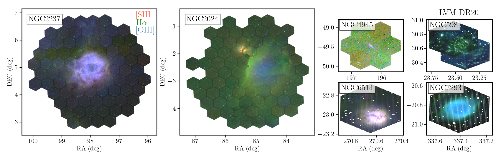
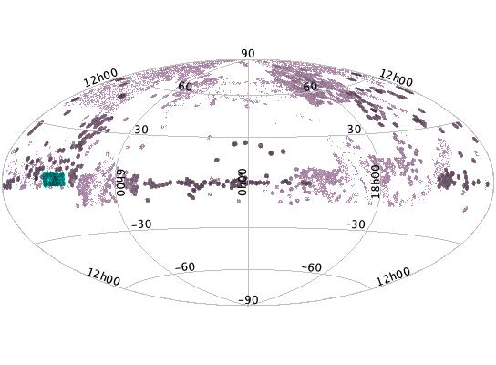
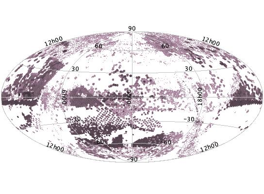
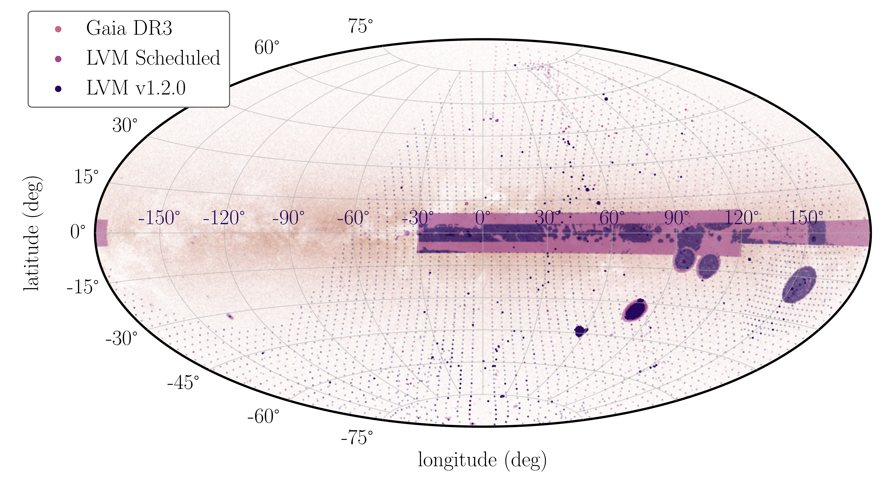

$\newcommand{\ensuremath}{}$
$\newcommand{\xspace}{}$
$\newcommand{\object}[1]{\texttt{#1}}$
$\newcommand{\farcs}{{.}''}$
$\newcommand{\farcm}{{.}'}$
$\newcommand{\arcsec}{''}$
$\newcommand{\arcmin}{'}$
$\newcommand{\ion}[2]{#1#2}$
$\newcommand{\textsc}[1]{\textrm{#1}}$
$\newcommand{\hl}[1]{\textrm{#1}}$
$\newcommand{\footnote}[1]{}$
$\newcommand{\vdag}{(v)^\dagger}$
$\newcommand\aastex{AAS\TeX}$
$\newcommand\latex{La\TeX}$
$\newcommand{\teff}{T_{\mathrm{eff}}}$
$\newcommand{\Teff}{T_{\mathrm{eff}}}$
$\newcommand{\logg}{log~g}$
$\newcommand{\feh}{[Fe/H]}$
$\newcommand{\oh}{[O/H]}$
$\newcommand{\mgh}{[Mg/H]}$
$\newcommand{\kms}{km~s^{-1}}$
$\newcommand{\vsini}{V\sin{i}}$
$\newcommand{\vmicro}{\xi}$
$\newcommand{\afe}{[\alpha/Fe]}$
$\newcommand{\jmk}{(J-K_{s})}$
$\newcommand{\Ks}{K_{s}}$
$\newcommand{\fout}{f_\mathrm{out}}$
$\newcommand{\Gmk}{(G-K_s)}$
$\newcommand{\MK}{\mathrm{M}_{\mathrm{K_s}}}$
$\newcommand{\Mgrad}{\Delta[Fe/H]/\DeltaR}$
$\newcommand{\mygrad}{-0.066}$
$\newcommand{\Vgrad}{\Delta[Fe/H]/\DeltaZ}$
$\newcommand{\fehex}{\Delta[Fe/H]_{\text{excess}}}$
$\newcommand{\acronym}[1]{{\small{#1}}}$
$\newcommand{\Msun}{M\textsubscript{\(\odot\)}}$
$\newcommand{\project}[1]{\textsl{#1}}$
$\newcommand{\gaia}{\project{Gaia}}$
$\newcommand{\WISE}{\project{WISE}}$
$\newcommand{\tmass}{\project{2MASS}}$
$\newcommand{\thecannon}{\project{The~Cannon}}$
$\newcommand{\thepayne}{\project{The~Payne}}$
$\newcommand{\rave}{\project{\acronym{RAVE}}}$
$\newcommand{\galah}{\project{\acronym{GALAH}}}$
$\newcommand{\ges}{\project{GES}}$
$\newcommand{\apogee}{\project{\acronym{APOGEE}}}$
$\newcommand{\aspcap}{\project{\acronym{ASPCAP}}}$
$\newcommand{\astronn}{\texttt{astroNN}}$
$\newcommand{\lamost}{\project{\acronym{LAMOST}}}$
$\newcommand{\hipparcos}{\project{Hipparcos}}$
$\newcommand{\epic}{\project{K2/EPIC}}$
$\newcommand{\sdss}{\project{\acronym{SDSS}}}$
$\newcommand{\tgas}{\project{\acronym{TGAS}}}$
$\newcommand{\hmodel}{hierarchical model}$
$\newcommand{◦ee}{^{\circ}}$
$\newcommand{\hii}{\hbox{{\rm H}\kern 0.1em{\sc ii}{\rm }}}$
$\newcommand{\todo}{\ifmmode \text{\color{red}\Huge{\(\bullet\)}} \else{\color{red}{\Huge\bullet}}\fi}$
$\newcommand{\tido}{\ifmmode{{\color{red}\bullet}} \else{\color{red}\bullet}\fi}$
$\newcommand{\REFS}{(\todo REFS)}$
$\newcommand{\toref}{(\todo REFS)}$
$\newcommand{\ejg}[1]{{\color{red}{\textbf{EJG: #1}}}}$
$\newcommand{\red}[1]{{\color{red}{\textbf{#1}}}}$
$\newcommand{\assign}[1]{{\color{blue}{\textbf{\textit{Assigned to: #1}}}}}$
$\newcommand{\vonex}{`\texttt{1.0.0}' cross-match}$
$\newcommand{\lvmvis}{\texttt{LVMvis}}$
$\newcommand\fergs{\ensuremath{\mathrm{erg} \mathrm{cm}^{-2} \mathrm{s}^{-1}}\xspace}$
$\newcommand\fcgs{\ensuremath{\mathrm{erg} \mathrm{cm}^{-2} \mathrm{s}^{-1} \mbox{Å}^{-1}}\xspace}$
$\newcommand\fxo{{f_{\rm X}}/f_{\rm opt}\xspace}$
$\newcommand\kmps{\ensuremath{\mathrm{km} \mathrm{s}^{-1}}\xspace}$
$\newcommand\lx{\ensuremath{\mathrm{erg} \mathrm{s}^{-1}}\xspace}$
$\newcommand\llx{\ensuremath{\log \L_{\rm X}}\xspace}$
$\newcommand\msun{\ensuremath{M_\odot}\xspace}$
$\newcommand\rsun{\ensuremath{R_\odot}\xspace}$
$\newcommand\pspin{\ensuremath{P_{\rm spin}}\xspace}$
$\newcommand\porb{\ensuremath{P_{\rm orb}}\xspace}$
$\newcommand\rat{\ensuremath{\mathrm{s}^{-1}}\xspace}$
$\newcommand\tpar{{Table~\ref{t:parms}}\xspace}$
$\newcommand\yrat{\ensuremath{yr}^{-1}\xspace}$
$\newcommand{\sasenvbase}{https://dr20.sdss.org/sas/dr20/env}$
$\newcommand{\sasenvfull}[2][]{$
$  \if\relax\detokenize{#1}\relax \expandafter\href\expandafter{\sasenvbase/#2/}{#2}$
$  \else\expandafter\href\expandafter{\sasenvbase/#2/#1/}{#2/#1}$
$  \fi$
$}$
$\newcommand{\sasenv}[2][]{$
$  \if\relax\detokenize{#1}\relax \expandafter\href\expandafter{\sasenvbase/#2/}{#2}$
$  \else\expandafter\href\expandafter{\sasenvbase/#2/#1/}{#2}$
$  \fi$
$}$
$\newcommand\code{#1}$
$\newcommand{\ari}{{Ariel V}\xspace}$
$\newcommand{\asca}{{ASCA}\xspace}$
$\newcommand{\cxo}{{Chandra}\xspace}$
$\newcommand{\ero}{{eROSITA}\xspace}$
$\newcommand{\ede}{{eROSITA\_DE}\xspace}$
$\newcommand{\eins}{{Einstein}\xspace}$
$\newcommand{\exos}{{EXOSAT}\xspace}$
$\newcommand{\gai}{{Gaia}\xspace}$
$\newcommand{\heao}{HEAO\xspace}$
$\newcommand{\heo}{He{\sc I}\xspace}$
$\newcommand{\het}{He{\sc II}\xspace}$
$\newcommand{\integ}{{INTEGRAL}\xspace}$
$\newcommand{\nic}{{NICER}\xspace}$
$\newcommand{\nus}{{NuSTAR}\xspace}$
$\newcommand{\ros}{{ROSAT}\xspace}$
$\newcommand{\rxte}{{RXTE}\xspace}$
$\newcommand{\srgero}{{SRG/eROSITA}\xspace}$
$\newcommand{\srg}{{SRG}\xspace}$
$\newcommand{\swi}{{Swift}/XRT\xspace}$
$\newcommand{\swb}{{Swift}/BAT\xspace}$
$\newcommand{\tes}{{TESS}\xspace}$
$\newcommand{\uhu}{{UHURU}\xspace}$
$\newcommand{\xmmn}{{XMM-Newton}\xspace}$
$\newcommand{\xspec}{\texttt{{XSPEC}}\xspace}$

# The Twentieth Data Release of the Sloan Digital Sky Survey: First All-Sky BOSS Spectra, eROSITA-SDSS-V Mapper Coordinated Observations, and a Preview of the Local Volume Mapper

<mark>Appeared on: 2026-07-30</mark> -  _81 pages, 13 figures, 8 tables_

S. Collaboration, et al. -- incl., <mark>N. Deacon</mark>, <mark>M. Demianenko</mark>, <mark>K. El-Badry</mark>

**Abstract:** This paper presents the twentieth data release (DR20) from the Sloan Digital Sky Survey, the third data release of its fifth generation (SDSS-V). SDSS-V is a panoptic spectroscopy survey that is mapping the stars, gas, and galaxies through three scientific programs: the Milky Way Mapper (MWM), the Local Volume Mapper (LVM), and the Black Hole Mapper (BHM). DR20 presents the first optical (BOSS) SDSS-V spectra from southern hemisphere for the MWM and BHM surveys; new optical MWM and BHM data from the northern hemisphere are also available, for a total over 3 million spectra of 1.5 million stars and half a million galaxies and quasars, with galactic and extragalactic x-ray targets coordinate with eROSITA DR2. DR20 includes integral field spectroscopy maps from LVM of six targets and 169 tiles, spanning Galactic HII regions, planetary nebulae, and nearby galaxies. Additionally, eighteen value added catalogs are also released with DR20, based on SDSS-V MWM and BHM data, and we present a new LVM visualization tool including an RGB HiPS map as a value added product.

**Figure 13. -** RGB emission-line maps of the six LVM targets included in DR20, constructed from the [OIII]$\lambda$5007 (blue), H$\alpha$(green), and
        [SIII]$\lambda$9069 (red) flux maps derived spaxel-by-spaxel by the LVM-DAP. The two large panels show the extended Galactic $\hii$ region mosaics: the Rosette Nebula (NGC 2237, left), and the Flame Nebula and Horsehead Nebula region (NGC 2024, center) and . The four smaller panels show the remaining targets: the starburst galaxy NGC 4945 (upper centre-right), the Triangulum Galaxy M 33/NGC 598 (upper right), the Trifid Nebula (NGC 6514/M 20, lower centre-right), and the Helix Nebula (NGC 7293, lower right). The diverse range of environments represented, from Galactic $\hii$ regions and a planetary nebula to nearby starburst and spiral galaxies, illustrates the        wide range science cases addressed by the LVM survey. Note that for the extragalactic targets (NGC 4945 and NGC 598) the maps include a contribution from foreground Milky Way emission, which has not been subtracted as described in the text. (*fig:lvm_DR20*)

**Figure 2. -** Expansion of BHM BOSS spectra and sky coverage from DR18/19 (upper panel) to DR20 (lower panel). Both panels show the distribution on the sky in (RA, Dec) of SDSS-V/BOSS optical science spectroscopic targets. For comparison, in the upper panel, the small and approximately rectangular equatorial region near RA=9h (blue-green) depicts the $\sim$24k spectra for $\sim$12k distinct science targets from the 140 sq. deg. eFEDS area, which comprised the initial main SDSS-V DR18 spectra release \citep{almeida2023}. This upper panel also highlights the dramatic expansion of BHM/BOSS data taken at APO included in DR19 (violet). The lower panel highlights the further expansion in BHM/BOSS science spectroscopy and sky coverage in DR20 (violet). In DR20, there are $\sim$1 million BHM/BOSS science released for $\sim$0.5 million distinct objects, taken from both APO and LCO, and with abundant spectra for BHM core science programs AQMES and RM (which are programs done mainly from APO), SPIDERS (done mainly from LCO), and as well as a variety of BHM-connected ancillary programs.
        (*fig:bhmdr20*)

**Figure 7. -** LVM: Comparison between the scheduled and observed tiles. Figure shows the distribution in the sky of the LVM full scheduled tiles (orange) and currently observed ones, up to November 2025 (blue), in comparison with the distribution of GAIA DR3 stars \citep{gaiadr3}, that clearly trace the location of the MW disk. (*fig:lvm_status*)

