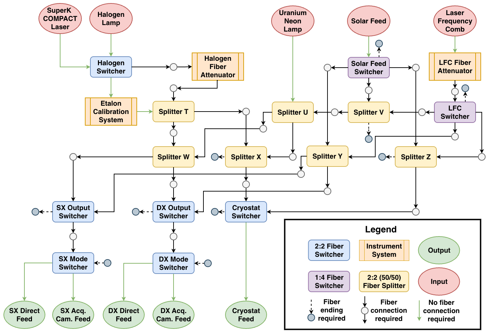
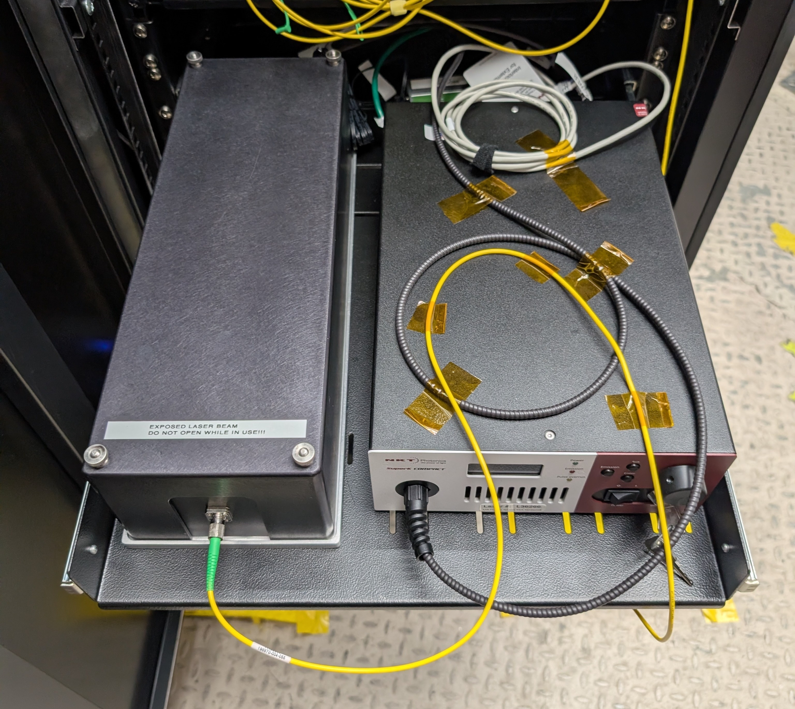
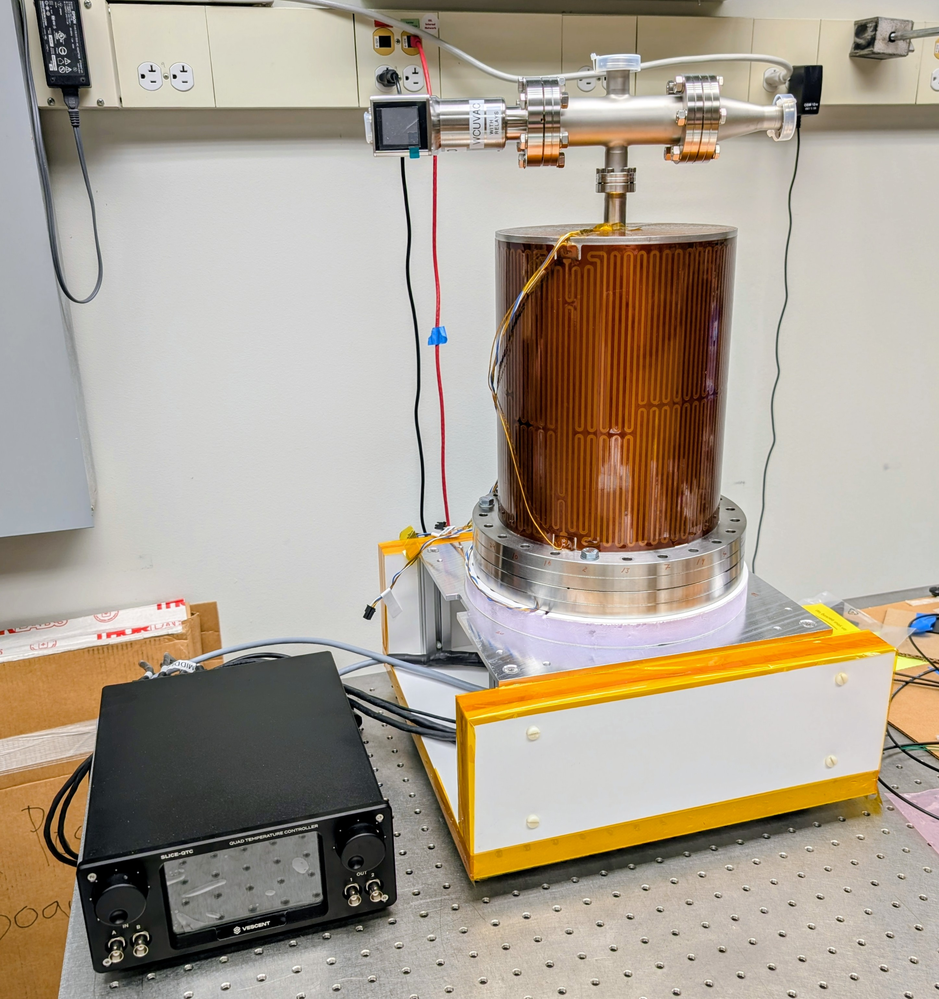
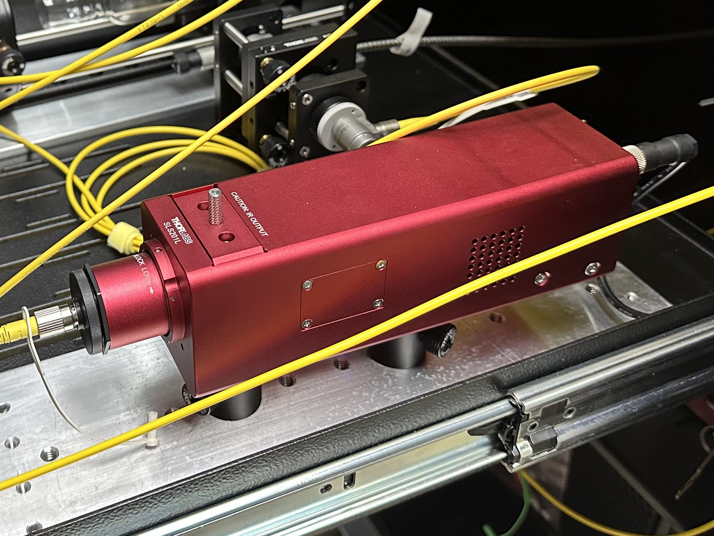
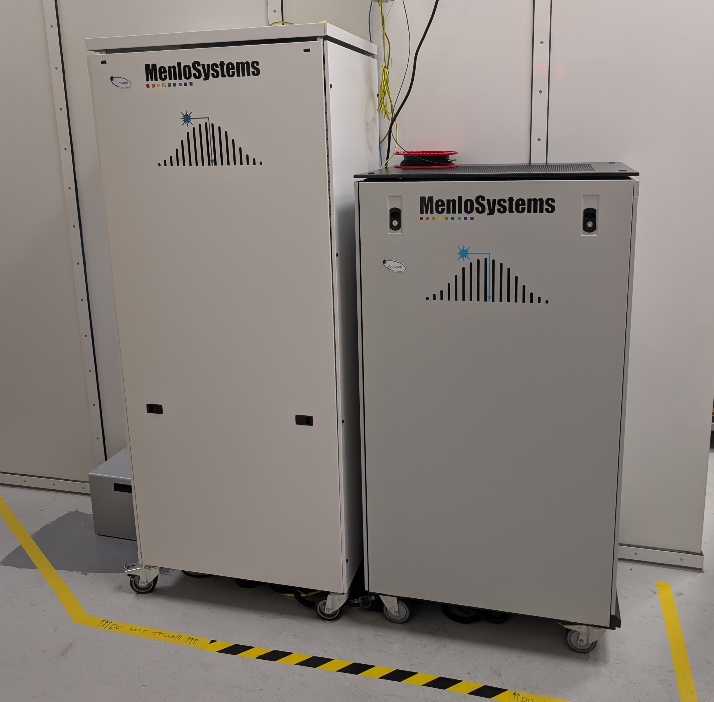
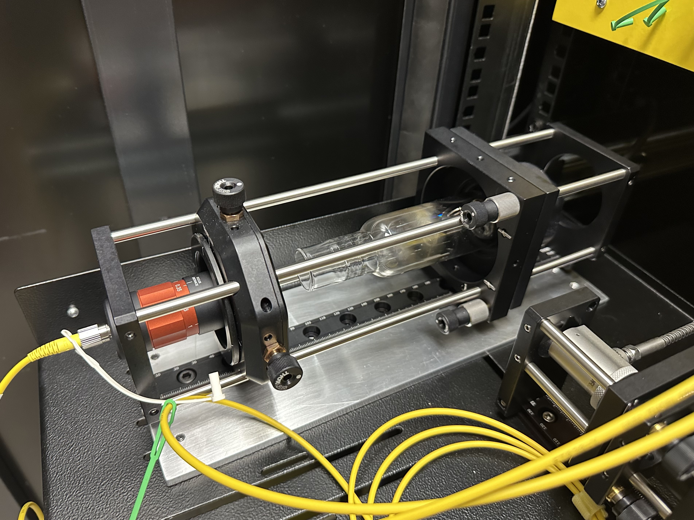
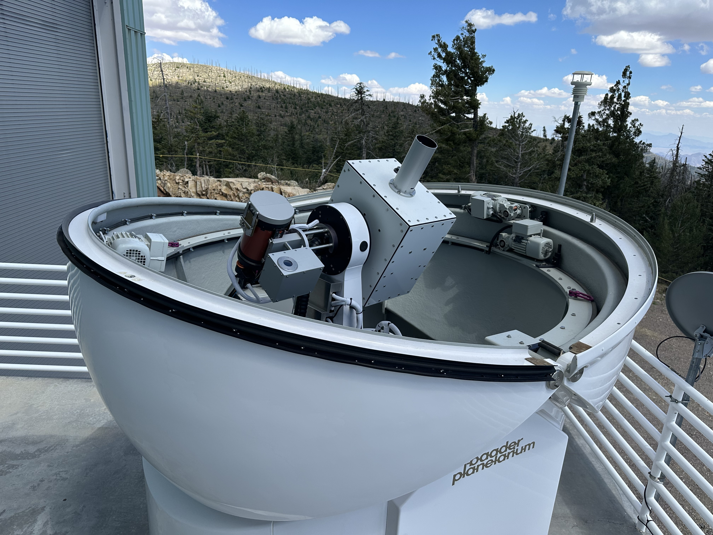
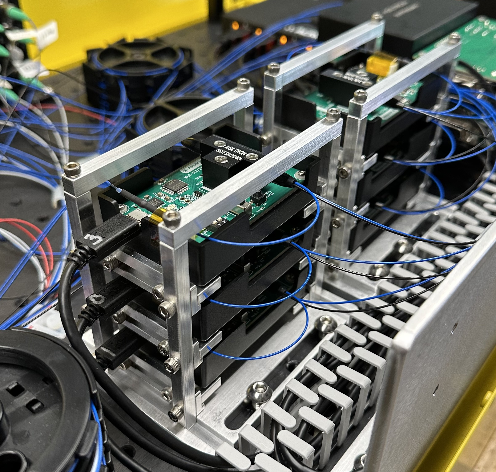
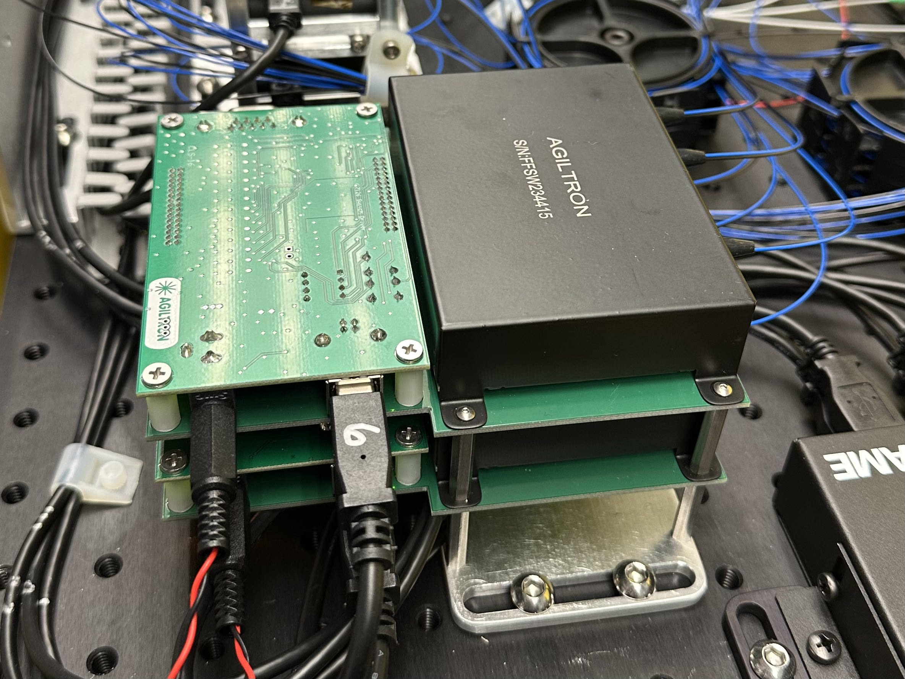

$\newcommand{\ensuremath}{}$
$\newcommand{\xspace}{}$
$\newcommand{\object}[1]{\texttt{#1}}$
$\newcommand{\farcs}{{.}''}$
$\newcommand{\farcm}{{.}'}$
$\newcommand{\arcsec}{''}$
$\newcommand{\arcmin}{'}$
$\newcommand{\ion}[2]{#1#2}$
$\newcommand{\textsc}[1]{\textrm{#1}}$
$\newcommand{\hl}[1]{\textrm{#1}}$
$\newcommand{\footnote}[1]{}$
$\newcommand{\aap}{Astronomy \& Astrophysics}$
$\newcommand{\nat}{Nature}$
$\newcommand{\aj}{Astronomical Journal}$
$\newcommand{\apj}{Astrophysical Journal}$
$\newcommand{\apjl}{Astrophysical Journal Letters}$
$\newcommand{\apjs}{Astrophysical Journal Supplement}$
$\newcommand{\mnras}{Monthly Notices of the Royal Astronomical Society}$
$\newcommand{\pasp}{Publications of the Astronomical Society of the Pacific}$
$\newcommand{\pasj}{Publications of the Astronomical Society of Japan}$
$\newcommand{\psj}{Planetary Science Journal}$
$\newcommand{\science}{Science}$
$\newcommand{\icarus}{Icarus}$
$\newcommand{\baas}{Bulletin of the American Astronomical Society}$
$\newcommand{\rnaas}{Research Notes of the American Astronomical Society}$
$\newcommand{\baselinestretch}{1.0}$

# The Calibration System of the iLocater Spectrograph

<mark>Appeared on: 2026-07-31</mark> -  _Submitted to SPIE Astronomical Telescopes + Instrumentation 2026, Paper 14149-462. 9 pages, 15 figures, 3 tables_

S. V. S. Nathan, et al. -- incl., <mark>J. Pember</mark>

**Abstract:** iLocater is a new near-infrared, extreme precision radial velocity (EPRV) instrument delivered to the Large Binocular Telescope in the summer of 2026. The instrument utilizes single-mode fibers (SMFs) for light transmission, including its calibration systems. We present an overview of the iLocater calibration system, detailing the specific sources and the hardware required to inject calibration light into the SMFs. Furthermore, we discuss the hardware that efficiently switches between these sources and distributes the light to all necessary instrument locations, entirely eliminating the need for free-space propagation.

**Figure 2. -** Schematic of the core components in the iLocater calibration system. Specialized switching and splitting hardware routes light from the illumination sources to the instrument's injection points. Each source can be independently directed to any output. (*fig:switching_system_schematic*)

**Figure 1. -** Left: The SuperK COMPACT white light laser and injection optics system (enclosed). Right: The Fabry-Pérot etalon system housed in its thermally stabilized vacuum enclosure.The iLocater tungsten halogen calibration source from Thorlabs.The LFC from Menlo Systems, which feeds the iLocater and PEPSI spectrographs at the LBT.The iLocater UNe injection system.The iLocater solar feed mounted as part of the PEPSI solar telescope infrastructure. (*fig:superk_compact_laser_and_etalon*)

**Figure 3. -** Two sets of three Agiltron 2$\times$2 Broadband Optical Switch Modules mounted in separate rack holders. Since these are electrical components and their internal moving micro-electro-mechanical systems (MEMS) parts have a finite lifespan, these units are designed to slide out of their racks to allow for easy replacement. They have built-in PCB drivers and a USB interface. The switches are configured for \qty{1060}{\nano\metre} wavelength with SM980 fiber, \qty{900}{\micro\metre} tubing, and FC/APC connectors. Part number: FFSM-22L109333.Two stacked Agiltron Fiber-Fiber\texttrademark  1$\times$4 Fiber Optical Switches. This stacked configuration minimizes the required footprint within the enclosure and facilitates cleaner cable management. They use MEMS components and have a built-in PCB driver with a USB interface. These switches are also configured for \qty{1060}{\nano\metre} wavelength with SM980 fiber, \qty{900}{\micro\metre} tubing, and FC/APC connectors. Part number: FFSW-14610933321. (*fig:2x2_switches*)

