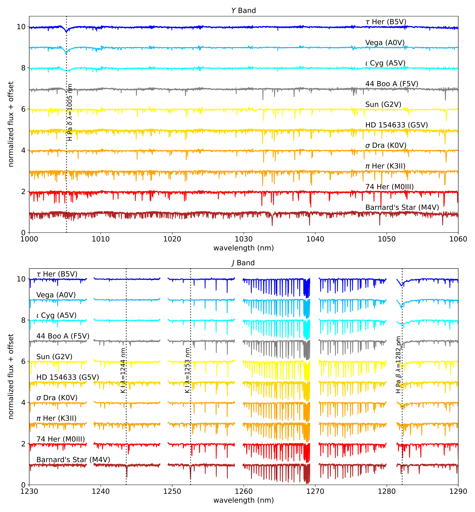
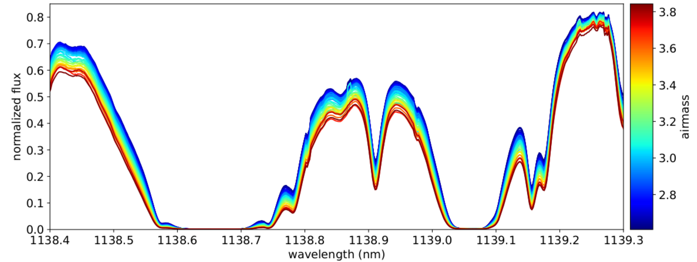
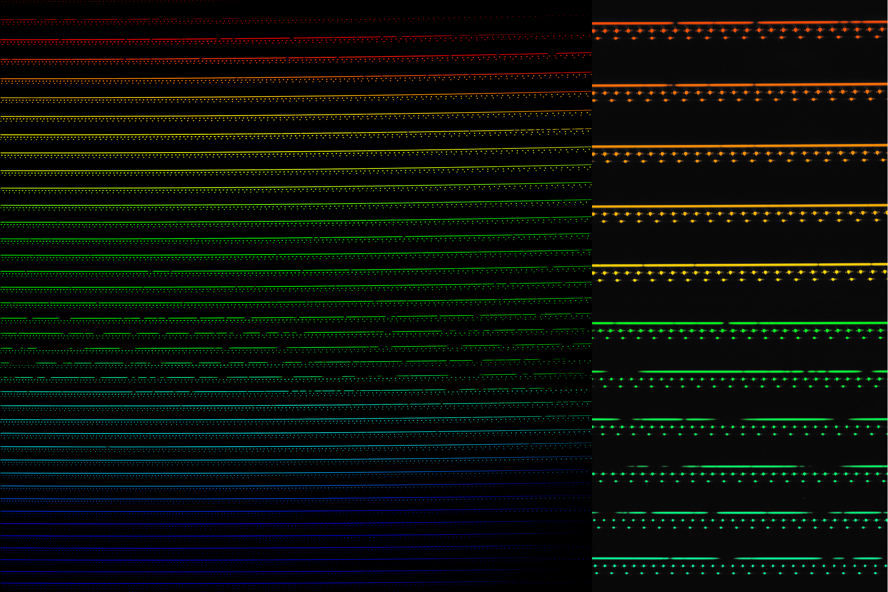

$\newcommand{\ensuremath}{}$
$\newcommand{\xspace}{}$
$\newcommand{\object}[1]{\texttt{#1}}$
$\newcommand{\farcs}{{.}''}$
$\newcommand{\farcm}{{.}'}$
$\newcommand{\arcsec}{''}$
$\newcommand{\arcmin}{'}$
$\newcommand{\ion}[2]{#1#2}$
$\newcommand{\textsc}[1]{\textrm{#1}}$
$\newcommand{\hl}[1]{\textrm{#1}}$
$\newcommand{\footnote}[1]{}$
$\newcommand{\aap}{Astronomy \& Astrophysics}$
$\newcommand{\nat}{Nature}$
$\newcommand{\aj}{Astronomical Journal}$
$\newcommand{\apj}{Astrophysical Journal}$
$\newcommand{\apjl}{Astrophysical Journal Letters}$
$\newcommand{\apjs}{Astrophysical Journal Supplement}$
$\newcommand{\mnras}{Monthly Notices of the Royal Astronomical Society}$
$\newcommand{\pasp}{Publications of the Astronomical Society of the Pacific}$
$\newcommand{\pasj}{Publications of the Astronomical Society of Japan}$
$\newcommand{\psj}{Planetary Science Journal}$
$\newcommand{\science}{Science}$
$\newcommand{\icarus}{Icarus}$
$\newcommand{\baas}{Bulletin of the American Astronomical Society}$
$\newcommand{\rnaas}{Research Notes of the American Astronomical Society}$
$\newcommand{\baselinestretch}{1.0}$

# Commissioning and on-sky performance verification of iLocater

<mark>Appeared on: 2026-07-31</mark> -  _Submitted to SPIE Astronomical Telescopes + Instrumentation 2026, Paper 14149-195. 12 figures, 4 pages_

M. C. Johnson, et al. -- incl., <mark>S. Letchev</mark>, <mark>J. Pember</mark>

**Abstract:** iLocater is a high-resolution near-infrared extreme precision radial velocity (EPRV) spectrograph that was deployed to the Large Binocular Telescope (LBT) in June 2026. iLocater operates over $\lambda=966$ -1312 nm with a median resolving power of $R=205,000$ as measured in the laboratory. We present the commissioning and initial on-sky verification program using solar and night-time observations at the LBT. First light was achieved on 27 June 2026, and nearly 150 on-sky spectra have now been recorded. Observations include single stars ranging in spectral type from B5 to M6. iLocater uses the LBT AO system, and we have demonstrated its ability to obtain spatially resolved spectra of close ( $\theta < 1"$ ) binary stars.

**Figure 3. -** example
A spectral sequence showing targets observed by iLocater during the first light run, with effective temperature $T_{\mathrm{eff}}$ increasing from bottom to top. Each spectrum is offset vertically for clarity and is labeled with the name of the star and the spectral type. The top and bottom panels show a portion of iLocater's spectral bandpass within the $Y$ and $J$ bands, respectively. The wavelength coverage is continuous in the $Y$ band but there are inter-order gaps in the $J$ band. Several astrophysical absorption lines lines of interest are labeled: the H I Paschen $\beta$ and $\delta$ lines, which are strongest in the hottest stars, and the K I doublet at $\lambda\lambda=1244$, 1253 nm, which are strongest in the coolest stars. The forests of sharp lines in the $J$ band which are common between all stars are telluric absorption due to molecules (mostly $H_2$O) in the Earth's atmosphere, while for the hotter stars iLocater's resolution allows the rotationally-broadened stellar lines to be distinguished from tellurics by eye. The continuum normalization and wavelength solution are works in progress. Spectra are shown in the observatory rest frame. (*fig:spectral_sequence*)

**Figure 1. -** example
A small portion of one iLocater order in solar data obtained through the lab window at OSU on 30 January 2026, in the region of strong tellurics between the $Y$ and $J$ bands. Successive spectra in these time-series observations are color-coded by airmass, which increased from approximately 2.5 to 4 over the one-hour course of the observations. The damping wings of these saturated lines can be seen broadening as the absorbing column increases. (*fig:solar_tellurics*)

**Figure 2. -** example
An example iLocater spectrum of our first light target, Vega. The left panel shows the full 4096$\times$4096 pixel detector, while the two right panels show cut-outs of two representative regions at full resolution. The top trace is illuminated with Vega, the middle trace with the LFC, and the bottom with the Fabry-Pérot etalon. The image has been artificially colored to highlight the bandpass; overall wavelengths increase from the blue end at the bottom of the detector to the red end of the bandpass at the top, while within each individual order the wavelengths increase from left to right. The $J$ band is at top and $Y$ is at bottom, separated by a region of strong telluric absorption. A 1D wavelength-calibrated version of this spectrum is shown in Fig. \ref{fig:spectral_sequence} along with other targets. (*fig:vega*)

