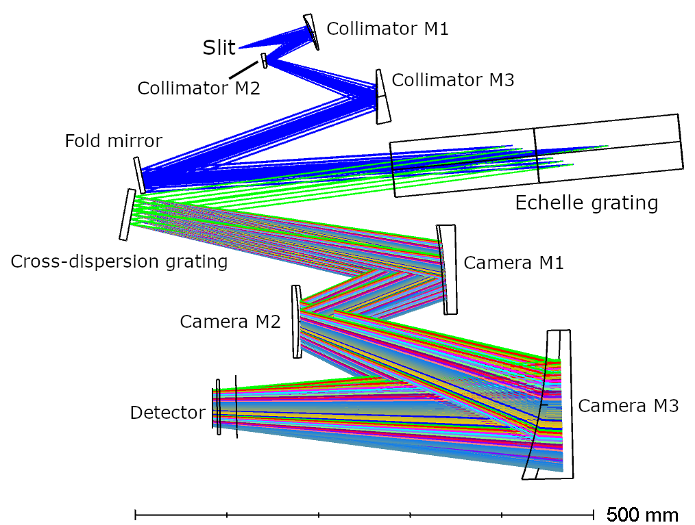
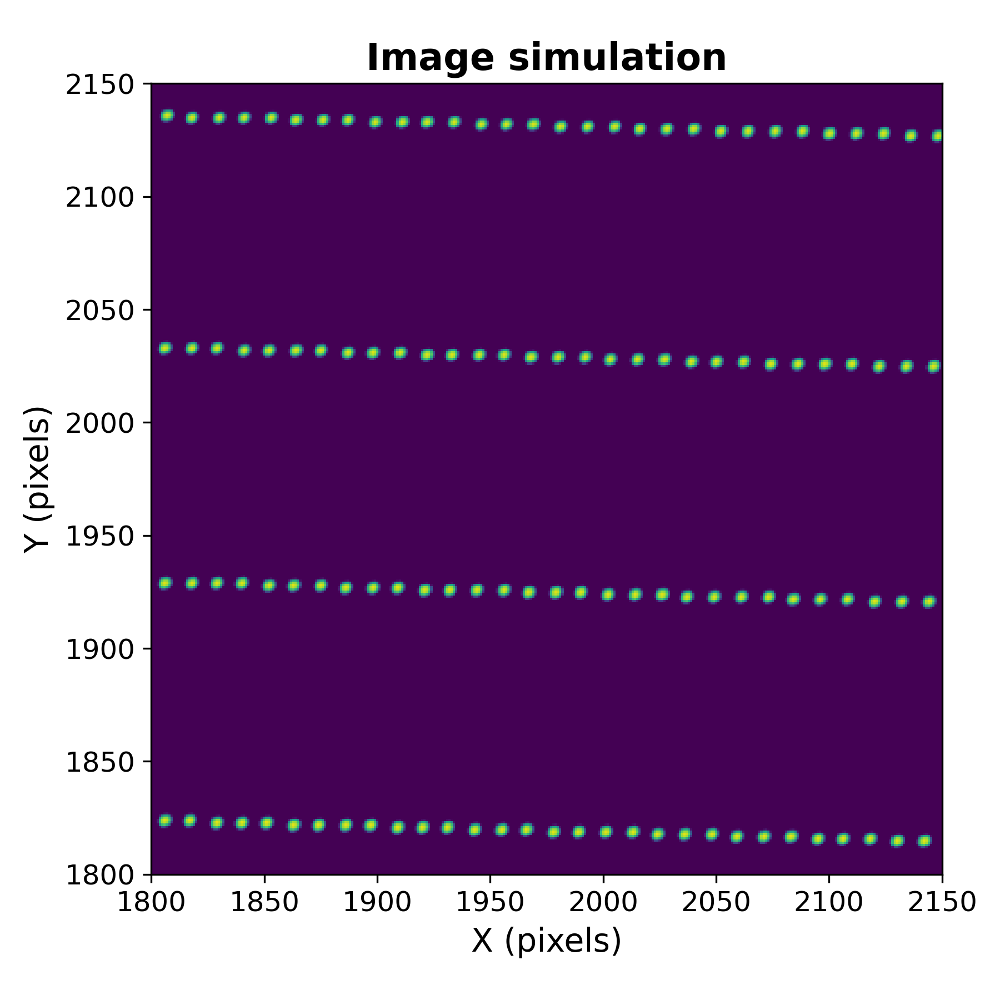
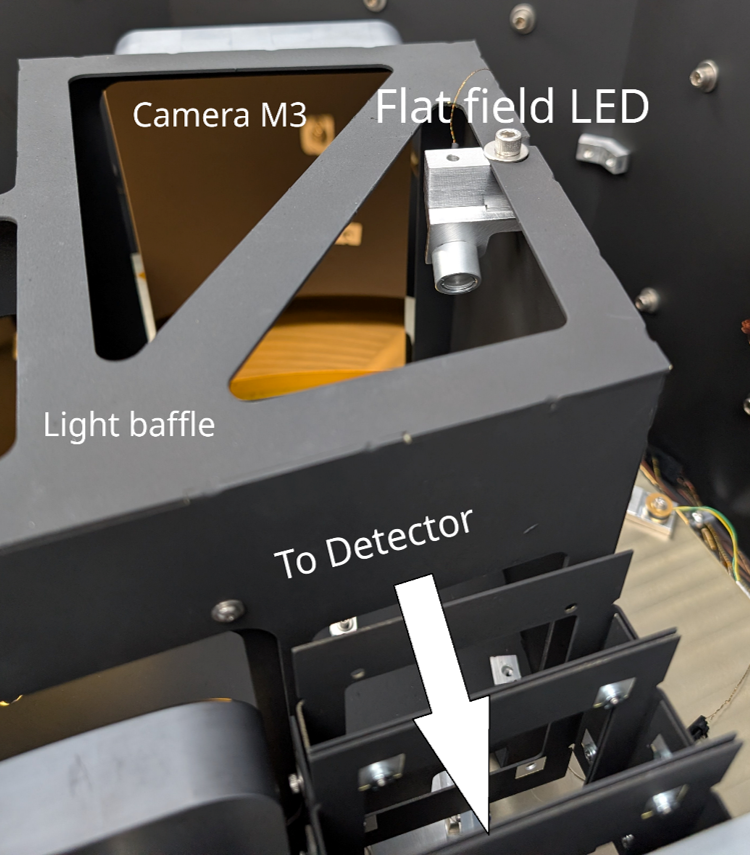
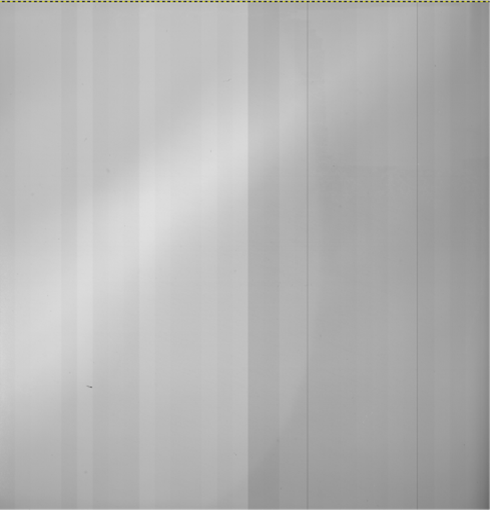
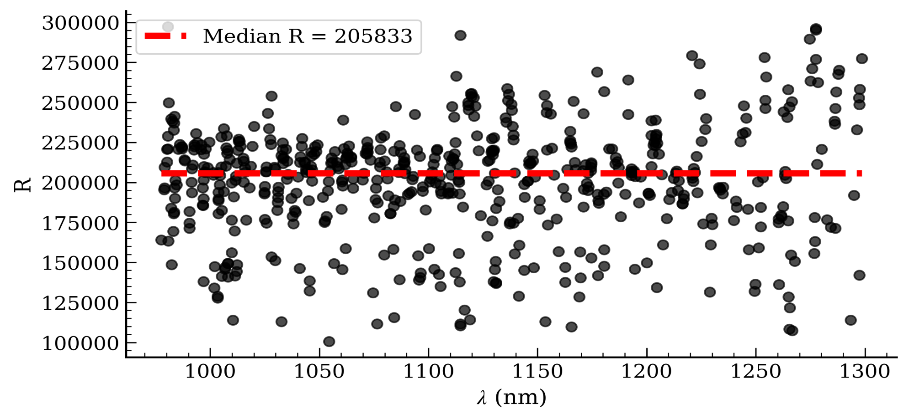

$\newcommand{\ensuremath}{}$
$\newcommand{\xspace}{}$
$\newcommand{\object}[1]{\texttt{#1}}$
$\newcommand{\farcs}{{.}''}$
$\newcommand{\farcm}{{.}'}$
$\newcommand{\arcsec}{''}$
$\newcommand{\arcmin}{'}$
$\newcommand{\ion}[2]{#1#2}$
$\newcommand{\textsc}[1]{\textrm{#1}}$
$\newcommand{\hl}[1]{\textrm{#1}}$
$\newcommand{\footnote}[1]{}$
$\newcommand{\baselinestretch}{1.0}$

# Laboratory characterization of iLocater

<mark>Appeared on: 2026-07-31</mark> -  _9 pages, 6 figures, SPIE Proceedings_

M. T. Pinto, et al. -- incl., <mark>S. Letchev</mark>, <mark>J. Pember</mark>

**Abstract:** iLocater is a diffraction-limited, fiber-fed spectrograph designed for the Large Binocular Telescope (LBT), which targets high-precision radial velocity measurements in the near-infrared. Prior to deployment, comprehensive laboratory characterization was essential to validate instrument performance and inform alignment strategies. This paper presents results from four key areas of lab characterization: (1) adjustment and optimization of detector orientation to optimize spectrum alignment with the detector pixel grid across the focal plane; (2) the design and installation of a LED illumination source to enable high-fidelity flat-fields; (3) a model-based focusing methodology using OpticStudio image simulations to optimize the optical alignment of the spectrograph; and (4) assessment of instrument mechanical and optical stability under laboratory conditions. Together, these efforts established baseline performance metrics and demonstrated instrument readiness for delivery and on-sky commissioning.

**Figure 3. -** _Left_: iLocater optical layout. Rays after the reflection on the echelle grating and the cross-disperser are color-coded by spectral order. _Right_: spectrum simulated using OpticStudio and \texttt{zospy}. We observe a series of wavelengths traced over four spectral orders located in the central section of the detector. (*fig:ilocater_optics*)

**Figure 2. -** _Left_: picture of the flat field LED mounted on the light baffle pointing towards the detector. _Right_: flat field image obtained with the iLocater detector. (*fig:led*)

**Figure 5. -** Measured spectral resolution as a function of wavelength. (*fig:R*)

