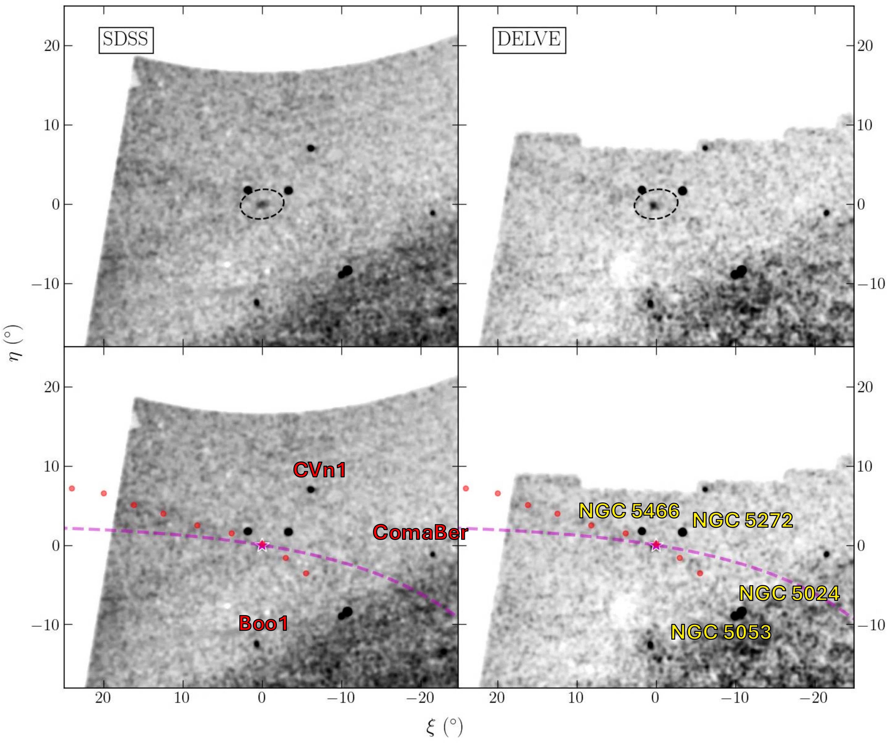
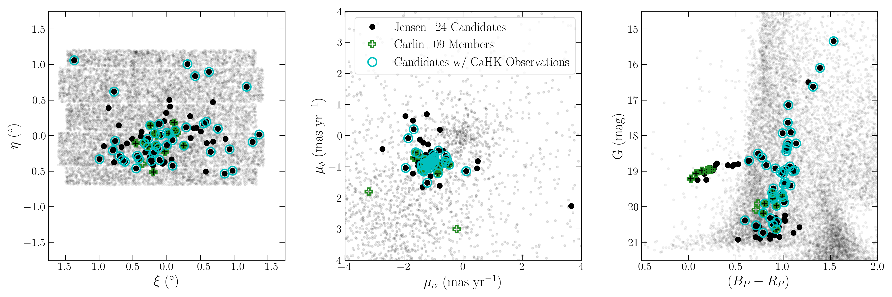
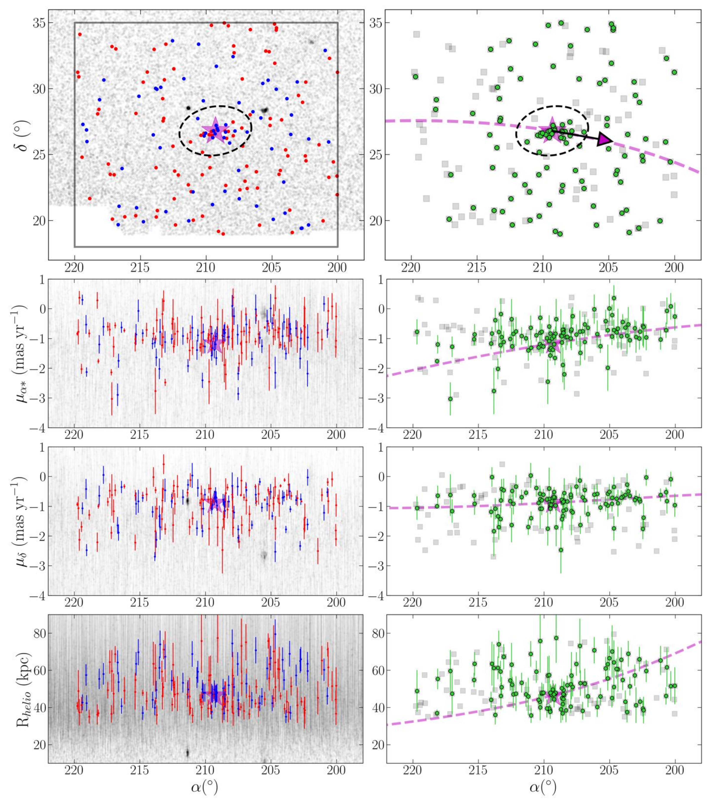

$\newcommand{\ensuremath}{}$
$\newcommand{\xspace}{}$
$\newcommand{\object}[1]{\texttt{#1}}$
$\newcommand{\farcs}{{.}''}$
$\newcommand{\farcm}{{.}'}$
$\newcommand{\arcsec}{''}$
$\newcommand{\arcmin}{'}$
$\newcommand{\ion}[2]{#1#2}$
$\newcommand{\textsc}[1]{\textrm{#1}}$
$\newcommand{\hl}[1]{\textrm{#1}}$
$\newcommand{\footnote}[1]{}$
$\newcommand{\vdag}{(v)^\dagger}$
$\newcommand\aastex{AAS\TeX}$
$\newcommand\latex{La\TeX}$
$\newcommand{\arraystretch}{1.1}$
$\newcommand{\arraystretch}{1.5}$

# Characterizing the disruption of Boötes III: a missing link in the Galactic halo?

<mark>Appeared on: 2026-07-31</mark> -  _27 pages, 16 figures; Submitted to ApJ_

J. Jensen, et al. -- incl., <mark>N. Martin</mark>, <mark>K. Malhan</mark>

**Abstract:** The Boötes III (Boo3) dwarf galaxy has long been suspected of being the progenitor of Styx, a $\sim$ 50 $^{\circ}$ -long stellar stream that was simultaneously discovered in the same region of sky. Boo3’s diffuse morphology, large velocity dispersion, small pericenter, and excess of candidate stars at large radii suggest it is undergoing active tidal disruption. A link to Styx is therefore logical; however, a clear connection between these structures has not yet been clearly demonstrated. Here, we re-examine the Boo3-Styx association by searching for Boo3’s tidal debris using a combination of _Gaia_ -selected members, new CaHK narrow-band imaging with CFHT/MegaCam, and stellar tracer catalogues of blue horizontal branch and red giant branch stars. We also conduct a broad search for a putative stream using matched filter techniques applied to SDSS DR17 and DELVE DR2. Despite our extensive search, we find no observational evidence directly linking Boo3 to Styx. Furthermore, our results suggest that either Boo3’s extended substructure is too diffuse to be detected with current data, or that its particular orbit may have erased a coherent tidal signature. Boo3 thus remains an enigmatic system, and exemplifies the need for spectroscopic follow-up to properly disentangle the nature between this faint Milky Way satellite and nearby stream.

**Figure 11. -** Tangent plane projections of the matched filter maps produced using SDSS (left panels) and DELVE (right panels). Note that the top and bottom panels are the same maps, just with added annotations. Boo3, located at (0, 0), is highlighted with the magenta star and black dashed ellipse (representing 5$r_h$). To indicate the differences between Boo3's trajectory and the approximate location of Styx, we plot both the expected orbit of Boo3 (magenta dashed line) and a range of nodes along the position of Styx (red points). Known satellites (dwarf galaxies and globular clusters) observed in these maps are also annotated. (*fig:MF_map_tangent*)

**Figure 8. -** Tangent position centered on Boötes III (left), proper motions (center), and CMD (right) of stars from our observing runs. Black points in this figure indicate the _Gaia_ candidate members (as in the color-coded points in the left panel of Figure \ref{fig:Boo3_Gaia}), but we only plot those within the same region of sky as the targeted fields. Cyan circles highlight the _Gaia_ candidate members with new CaHK observations. For comparison, we also plot the [Carlin, et. al (2009)](https://ui.adsabs.harvard.edu/abs/2009ApJ...702L...9C) spectroscopic members as green plus (**+**) icons. The remaining foreground data from _Gaia_ are shown in grey. (*fig:Pr_Gaia_Mems*)

**Figure 10. -** Equatorial positions, proper motions, and heliocentric distances of the BHB + RGB sample. The left panels show the subset of data used in the routine (BHBs in blue, RGBs in red) compared to the total catalogues in grey. The right panels showcase the sample surviving the routine (now as green points) against the original BHB + RGB subsample (now in grey squares). We also show the expected orbit of Boo3 in the magenta dashed tracks on the sky, in proper motions and distances, for direct comparison to the data. Boo3's systemic parameters are indicated as the magenta star, and we indicate 5$r_{h}$ as the black dashed ellipse. While the routine identifies the main body of Boo3 successfully, there is no clear evidence for any extended features such as a stellar stream. (*fig:UNIONS_sigmaclip*)

