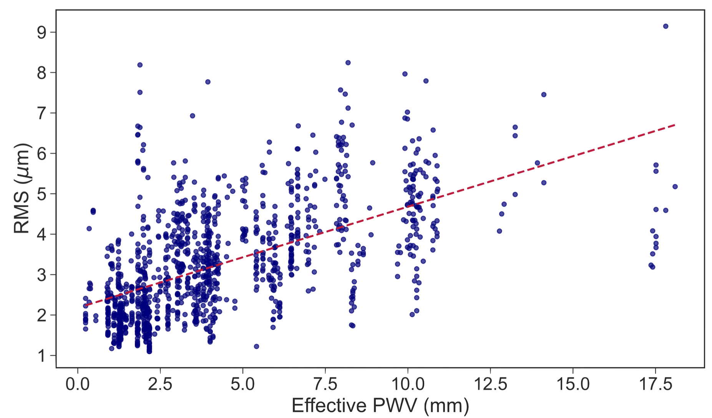
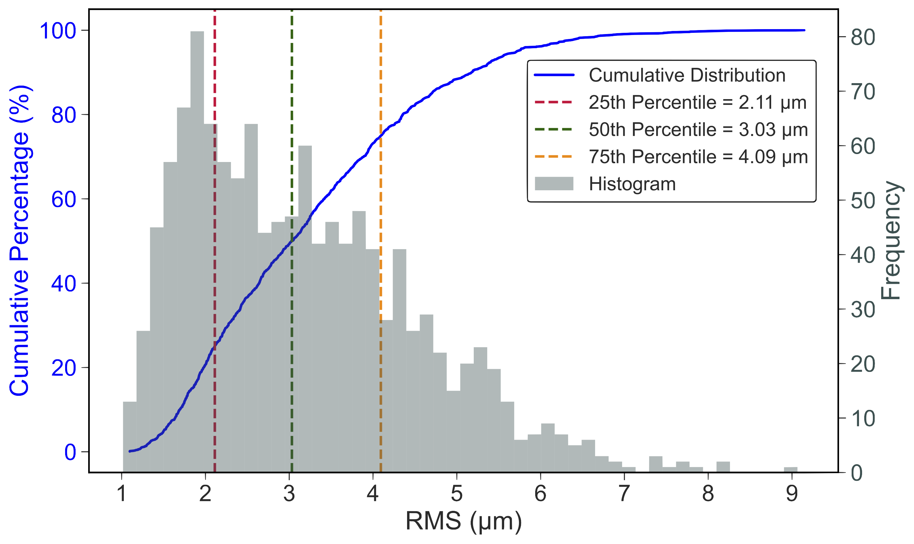
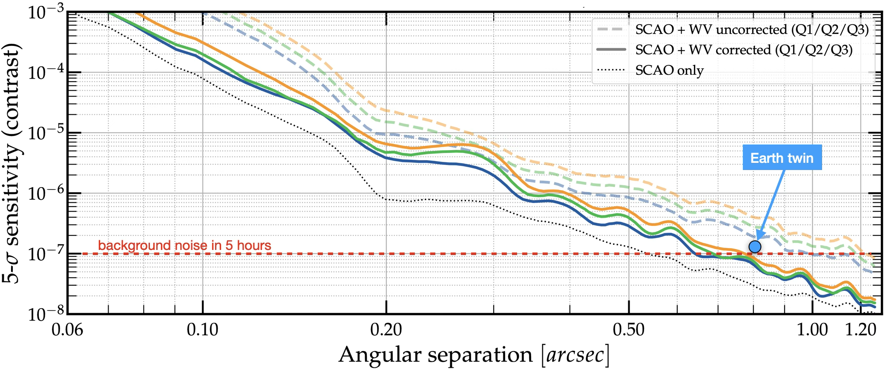
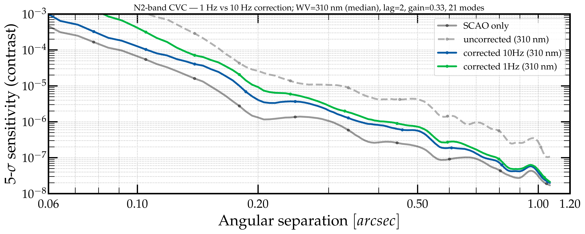

$\newcommand{\ensuremath}{}$
$\newcommand{\xspace}{}$
$\newcommand{\object}[1]{\texttt{#1}}$
$\newcommand{\farcs}{{.}''}$
$\newcommand{\farcm}{{.}'}$
$\newcommand{\arcsec}{''}$
$\newcommand{\arcmin}{'}$
$\newcommand{\ion}[2]{#1#2}$
$\newcommand{\textsc}[1]{\textrm{#1}}$
$\newcommand{\hl}[1]{\textrm{#1}}$
$\newcommand{\footnote}[1]{}$
$\newcommand{\baselinestretch}{1.0}$

# Maximising the mid-infrared high-contrast performance of ELT/METIS despite water vapour seeing

<mark>Appeared on: 2026-08-03</mark> -  _8 pages, paper presented at SPIE Astronomical Telescopes + Instrumentation 2026_

O. Absil, et al. -- incl., <mark>R. v. Boekel</mark>, <mark>T. Bertram</mark>, <mark>M. Feldt</mark>

**Abstract:** The Mid-infrared ELT Imager and Spectrograph (METIS) will be equipped with a SCAO system delivering Strehl ratios above 90 \% at L band (3.5 - 4.1 \textmu m) and close to 99 \% at N band (8 - 13 \textmu m) on bright stars. Yet, the actual wavefront quality seen by the METIS coronagraphic modules used for high-contrast imaging will be significantly affected by water vapour seeing, which add a strong chromatic component to dry air seeing in the mid-infrared. We analysed two years of VLTI/GRAVITY fringe tracker archives to assess the variability of differential water vapour column density at millisecond timescales on ELT scales. Our analysis suggests that water vapour seeing will add a median wavefront error of about 175 nm rms at N band, consisting mostly of low-order aberrations, with around 150 nm rms of tip-tilt errors. If not corrected, this effect would degrade the achievable sensitivity limits in terms of contrast by more than two magnitudes. To mitigate this effect, we plan to deploy a focal-plane wavefront sensing and control algorithm based on an asymmetric pupil using a deep learning approach. After briefly discussing the practical impacts of focal-plane wavefront control in METIS, we compare the expected high-contrast imaging performance with and without focal-plane wavefront control.

**Figure 1. -** example_Left._ Water vapour seeing (WVS) measurements on the short baselines of the VLTI auxiliary telescope array (baseline lengths similar to the ELT pupil size), as a function of the precipitable water vapour (PWV) content in the atmosphere. The red line shows the best-fit linear trend, although this should not be considered as a valid model to predict WVS from PWV. _Right._ Histogram and cumulative distribution of WVS ($\sigma_{\rm WV}$). The grey bars represent the frequency distribution of $\sigma_{\rm WV}$, while the blue curve shows the cumulative percentage. The dashed lines indicate the 25th (red), 50th (median, green), and 75th (orange) percentiles. Both plots are from Ref. \citenum{Raghu26}. (*fig:WVS*)

**Figure 3. -** example Influence of WV seeing on N-band sensitivity limits in terms of contrast, showing the cases of no WV seeing (dotted), uncorrected WV seeing (coloured dashed lines), and 10-Hz closed loop WV seeing correction on the first 20 Zernike modes (coloured solid lines) for various WV seeing quartiles. These simulations do not take into account any additional source of performance degradation beyond the wavefront errors from SCAO and WVS, such as chromatic beam wander and amplitude aberrations, which are beyond the scope of this study (see Refs. \citenum{Carlomagno20,Delacroix22,Orban26} for a more thorough discussion of HCI performance in METIS). (*fig:alphaCen*)

**Figure 2. -** example Post-ADI performance of the METIS classical vortex coronagraph (CVC) in the N2 filter in presence of WVS, either uncorrected (dashed grey) or with 20 Zernike modes corrected at 1 Hz (green) or 10 Hz (blue), in median WVS conditions (305 nm of OPD, i.e., 175 nm WFE). The SCAO-limited performance is shown in solid grey for reference. (*fig:ADI*)

