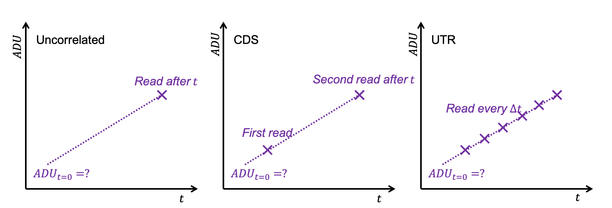
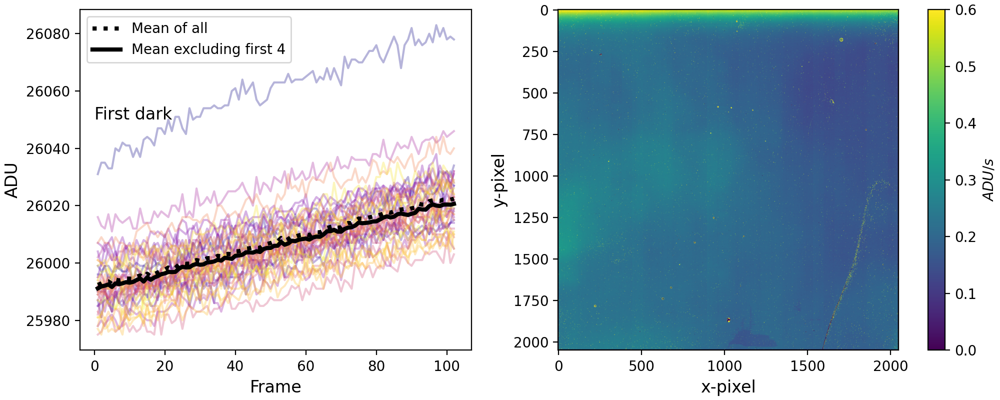
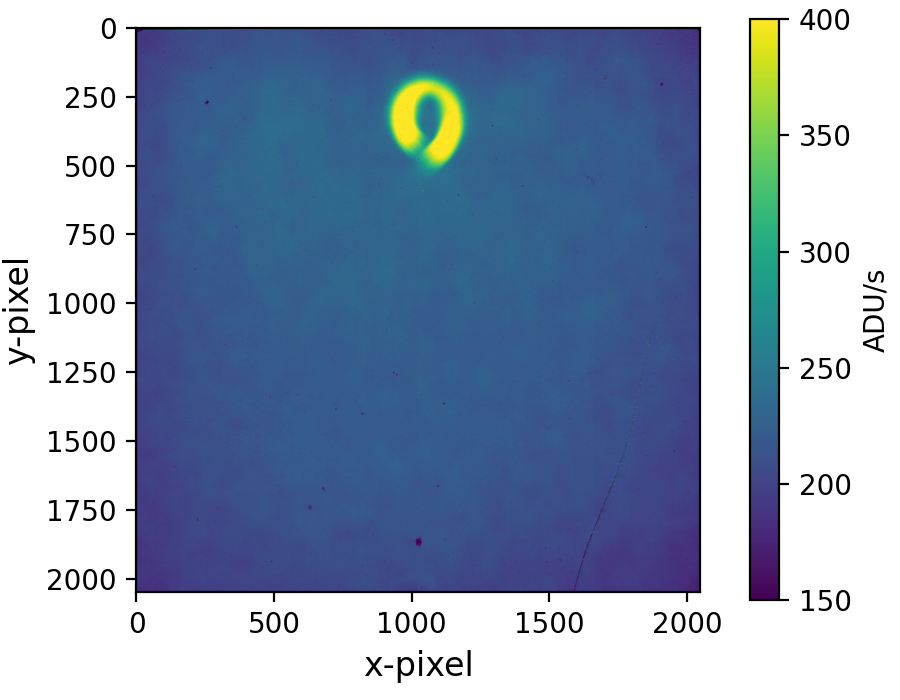

$\newcommand{\ensuremath}{}$
$\newcommand{\xspace}{}$
$\newcommand{\object}[1]{\texttt{#1}}$
$\newcommand{\farcs}{{.}''}$
$\newcommand{\farcm}{{.}'}$
$\newcommand{\arcsec}{''}$
$\newcommand{\arcmin}{'}$
$\newcommand{\ion}[2]{#1#2}$
$\newcommand{\textsc}[1]{\textrm{#1}}$
$\newcommand{\hl}[1]{\textrm{#1}}$
$\newcommand{\footnote}[1]{}$
$\newcommand{\baselinestretch}{1.0}$

# Charge migration characterization in the METIS H2RG detectors

<mark>Appeared on: 2026-08-03</mark> -  _11 pages, 9 figures, SPIE Astronomical Telescopes and Instrumentation proceeding submitted to "X-Ray, Optical, and Infrared Detectors for Astronomy XII". Paper number 14157-47_

<mark>D. Gasman</mark>, et al. -- incl., <mark>R. v. Boekel</mark>, <mark>V. Naranjo</mark>, <mark>P. Bizenberger</mark>

**Abstract:** The Mid-infrared ELT Imager and Spectrograph (METIS) is one of the first-light instruments of the Extremely Large Telescope (ELT). For the L and M band, the instrument makes use of Teledyne’s H2RG detectors, known to be affected by charge migration, also known as the brighter-fatter effect (BFE). In the H2RG detectors this manifests as photo-electrons moving from a central bright pixel to neighboring pixels as the depletion region of the central pixel shrinks with accumulated charge. Due to its effect of ‘blurring’ information, it especially affects direct imaging, transit, and high-resolution spectroscopy applications. We aim to characterize its effect in the METIS H2RG detectors, such that we can remove it without losing information.

**Figure 1. -** Schematic of the possible sampling schemes. Uncorrelated sampling is illustrated on the left, CDS in the centre, and UTR on the right. (*fig:sampling*)

**Figure 3. -** Selected pixel ramps from all 40 darks (left), and the resulting masterdark (right). The first exposure was significantly brighter than the others. The black dotted line is the mean when including all darks, whereas the solid line is the mean when ignoring the first four. The masterdark on the right is the result of the solid line. (*fig:dark_anomaly*)

**Figure 7. -** Example of a (corrected) flat taken in the lab. The ring near the top is due to the black body source. (*fig:flat*)

