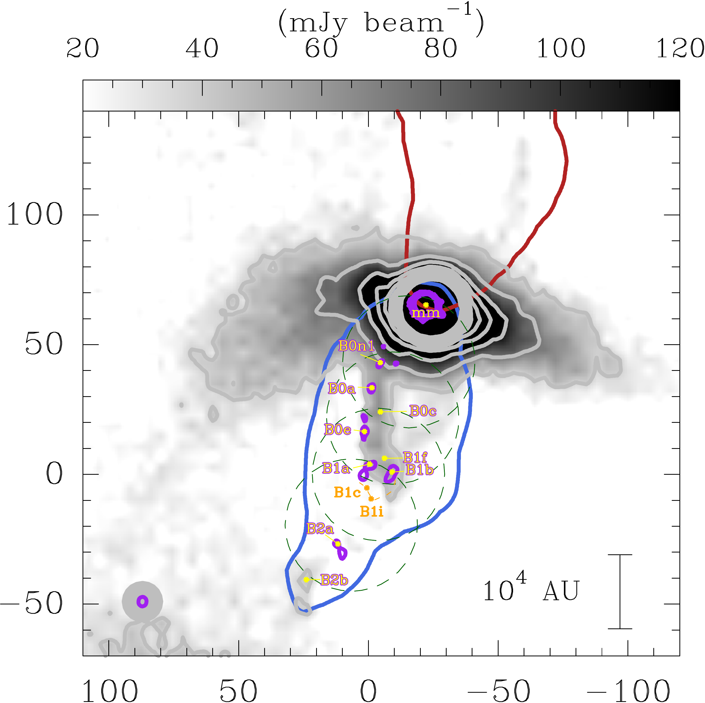
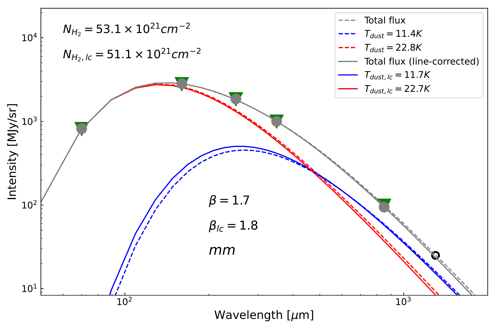
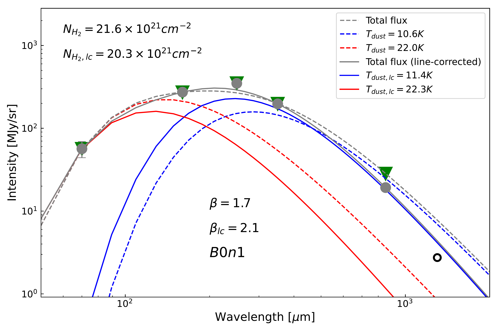
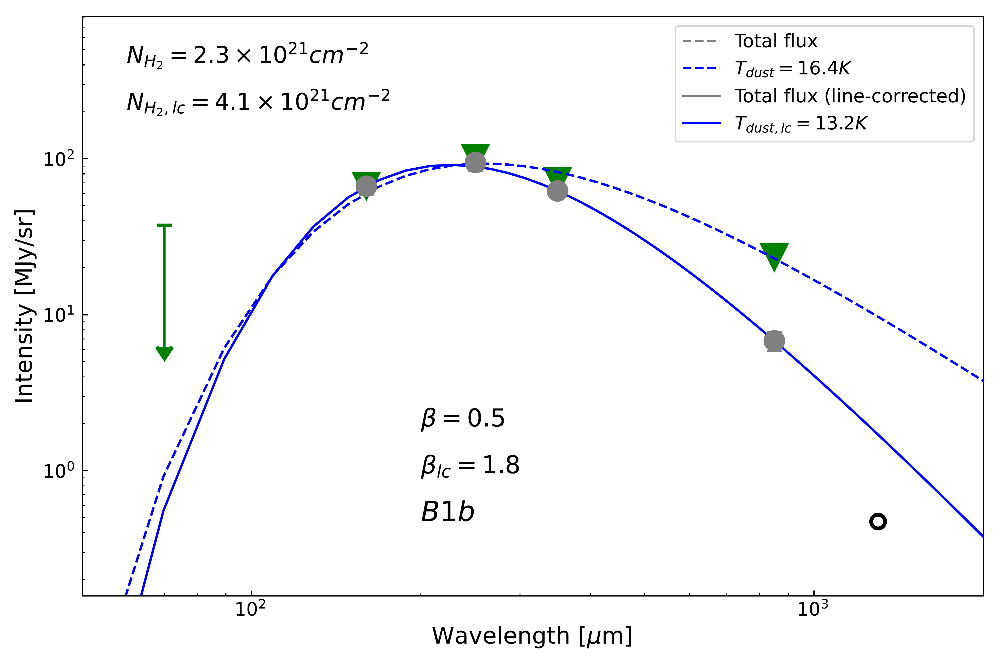
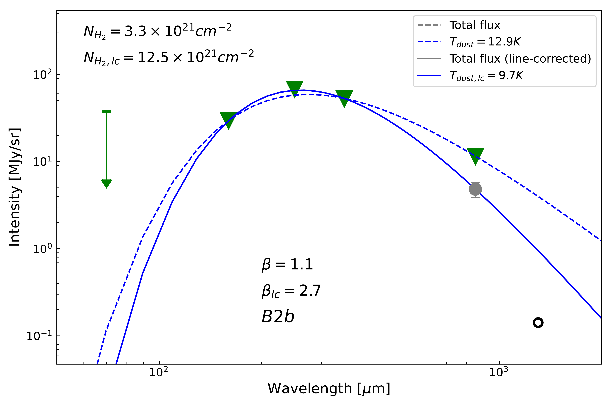
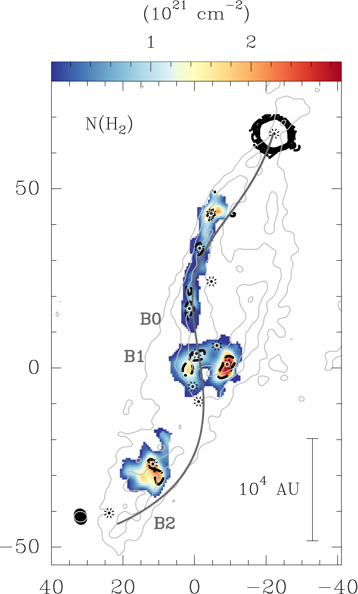
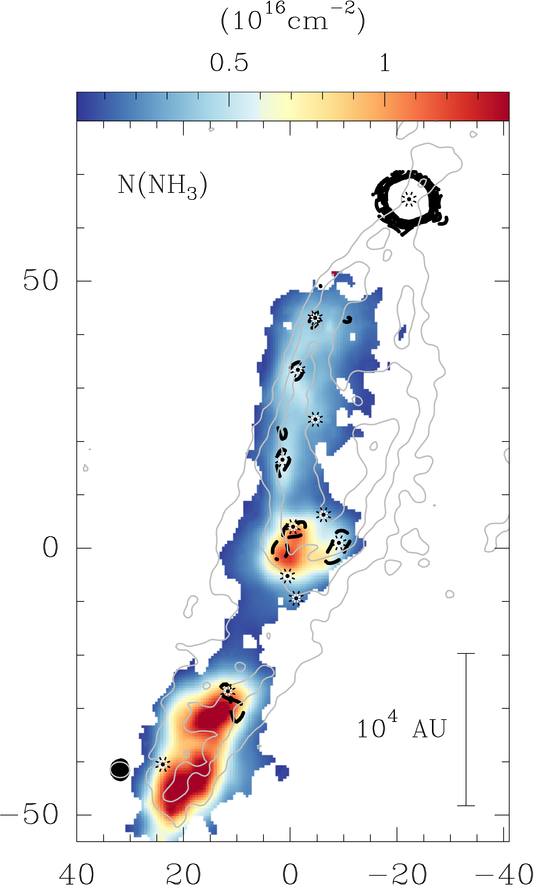
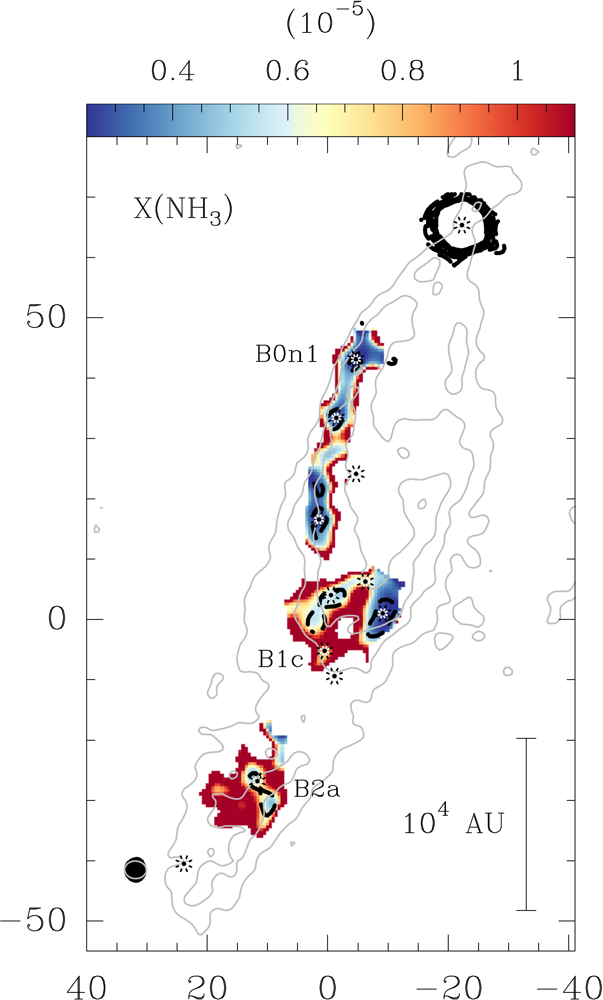

$\newcommand{\ensuremath}{}$
$\newcommand{\xspace}{}$
$\newcommand{\object}[1]{\texttt{#1}}$
$\newcommand{\farcs}{{.}''}$
$\newcommand{\farcm}{{.}'}$
$\newcommand{\arcsec}{''}$
$\newcommand{\arcmin}{'}$
$\newcommand{\ion}[2]{#1#2}$
$\newcommand{\textsc}[1]{\textrm{#1}}$
$\newcommand{\hl}[1]{\textrm{#1}}$
$\newcommand{\footnote}[1]{}$
$\newcommand{\thesubfigure}{\Roman{subfigure}}$
$\newcommand{\thetable}{A\arabic{section}}$
$\newcommand{\thetable}{A\arabic{table}}$
$\newcommand{\thefigure}{A\arabic{figure}}$

# Spatially resolved thermal dust emission in the L1157 outflow reveals grain-driven molecular enrichment

<mark>Appeared on: 2026-08-04</mark> -  _11 pages, 5 figures, accepted by Astronomy & Astrophysics_

S. Feng, et al. -- incl., <mark>S. Jiao</mark>

**Abstract:** Protostellar outflow shocks reshape local dust properties and molecular chemistry. The L1157 outflow is an archetypal chemically rich shocked region, but the thermal dust associated with its successive shocks has remained unresolved because  molecular-line contamination obscures the broadband continuum. We aim to resolve the  dust emission toward L1157 B0-B1-B2 ${and establish observational constraints on the relationship between the dust evolution and shock-driven chemistry. }$ We ${obtained}$ new James Clerk Maxwell Telescope (825 \text{--} 906 $\mu$ m) spectral-line observations and Submillimeter Array (1.1 \text{--} 1.4 mm)  continuum observations toward  L1157 B0-B1-B2,  probing ${spatial scales}$ from 0.4 pc to 1200 au. After ${removing molecular-line contamination on a pixel-by-pixel basis, we derived the dust temperature and density profile and managed to constrain the dust spectral index using continuum data from 70 $\mu$m to 1.3 mm. Combining  with previous $\rm NH_3$ observations,  these data were interpreted using a newly developed physicochemical shock model.}$ ${The line-corrected continuum maps reveal the dust distribution across successive shocks in the southern lobe of L1157.}$ At $\rm 10^4$ au resolution, we recovered the dust temperature from the outflow cavities to the  protobinary  envelope. The dust opacity index  ( $\beta\approx$ 1.8 \text{--} 2.3)  indicates that grains have not grown to millimeter sizes throughout the shocked regions.   At $\rm 10^3$ au  resolution, the dust emission resolves into compact clumps along the precessing jet, whereas gaseous $\rm NH_3$ ${peaks at}$ the shocked fronts, reaching abundances of $\sim10^{-5}$ with respect to $\rm H_2$ , even where the 0.85 and 1.3 mm  dust emission is detected at only 3 \text{--} 5 $\sigma$ .  Our modeling shows that $\rm NH_3$ forms predominantly on grain surfaces and is released through shock-induced sputtering, with the highest abundances occurring where ${post-shock re-adsorption remains inefficient.}$ Spatially resolved dust continuum imaging provides a direct observational probe of grain evolution, highlighting the fundamental role of dust evolution in shaping the chemistry of protostellar shocks.

**Figure 1. -** 
Line-contamination-corrected  continuum emission at 0.85 mm  shown in grayscale, obtained by combining the JCMT SCUBA-2 and _Planck_ data {after removing the contribution from molecular-line emission observed with JCMT-HARP.
To facilitate comparison with previous studies, the (0,0) offset position is set to the phase center adopted in the NOEMA and VLA single-pointing observations of  [Feng, et. al (2020)](https://doi.org/10.3847/1538-4357/ab8813), [Feng, et. al (2022)](https://doi.org/10.3847/2041-8213/ac75d7): $\rm RA = 20^h39^m10^s.200$, $\rm Dec = +68^{\circ}01$\arcmin$10.50$\arcsec$$ (J2000).}
Gray contours indicate  continuum emission levels from {$\rm 10\sigma$ to $\rm 100\sigma$ in steps of $\rm 10\sigma$ ($\rm \sigma =3.7 mJy beam^{-1}$).}
Red and blue contours denote  the {integrated CO (3\text{--}2) emission above the  $\rm 5\sigma$  level}  over the velocity range of 7.0\text{--}34.0 and -20.0\text{--}-0.6 $\rm km s^{-1}$, {respectively, relative to $\rm V_{lsr}\sim2.6 km s^{-1}$, tracing the red- and blue-shifted outflow lobes. }
Purple contours represent the SMA 1.3 mm dust continuum derived from line-free  channels, starting at $\rm 5\sigma$ and increasing in $\rm 5\sigma$ steps ($\rm \sigma = 0.4 mJy beam^{-1}$).
{The JCMT beam (FWHM = 14.5$\arcsec$) is shown as a gray filled circle in the lower left corner, while the synthesized SMA beam ($3.7$\arcsec$ \times 3.1$\arcsec$$, P.A. $\sim3^\circ$) is shown as a purple ellipse.}
Green dashed circles mark the four-point SMA mosaic, with diameters corresponding to the SMA primary beam FWHM at 1.3 mm. Artifacts near the central protobinary system mm in the northwestern mosaic field caused by noise and/or missing short-spacing  have been masked.
Ten positions with SMA dust continuum detections at the 5\text{--}7$\sigma$ level are {marked in yellow and labeled in  yellow, with purple outline}.
The B1 shock front is indicated by an orange dashed line, {with orange markers highlighting two representative positions along the front.} (*fig:source*)

**Figure 4. -** 
Two-component SED fits at selected positions.
The green triangles and gray dots at 70, 160, 250, 350, and 850 $\mu$m represent the original bolometric fluxes and the line-subtracted continuum fluxes, respectively.
The downward arrow at 70 $\mu$m indicates a $3\sigma$ upper limit, while the open black circle at 1.3 mm denotes data affected by missing flux, and both data points are excluded from the fitting.
  All data have been smoothed to a common angular resolution of 24.9$\arcsec$.
The red and blue curves show the warm and cold components of the two-component SED model, respectively, assuming a gas-to-dust mass ratio of 100,
 while the gray curve represents the total SED obtained by summing both components.
 Fits using the line-subtracted continuum fluxes are shown as solid curves, whereas fits using the original bolometric fluxes are shown as dashed curves for comparison.
 (*fig:sed-point*)

**Figure 6. -** $Left$: $\rm H_2$ column density map derived from the 1.3 mm dust continuum observed with the SMA, assuming a gas-to-dust mass ratio of 100, optically thin dust, and adopting the dust temperature from the gas kinetic temperature map traced by the $\rm NH_3$(1,1)\text{--}(6,6) transitions  ([Feng, et. al 2022](https://doi.org/10.3847/2041-8213/ac75d7)) . Continuum with emission $\rm <3\sigma$ is masked.
$Middle$: $\rm NH_3$ column density map {toward the shocked region} obtained from LVG modeling of the $\rm NH_3$(1,1)\text{--}(6,6) transitions, combining both ortho and para species, adopted from [Feng, et. al (2022)](https://doi.org/10.3847/2041-8213/ac75d7). {Both column densities toward the protobinary system are not reported because the line profiles exhibit multiple blended velocity components, strong optical-depth effects, and significant spatial overlap between the protobinary, disk, and envelope at the available angular resolution, preventing a reliable single-component analysis.}$Right$: Map of the relative abundance ratio of $\rm NH_3$ with respect to $\rm H_2$.
{Black dashed contours  and black  markers of the representative positions} in each panel is the same shown  in Figure \ref{fig:source}.
{The gray contours, starting from 5$\sigma$ ($\sigma = 0.46$ Jy beam$^{-1}$) and increasing with a step of 5$\sigma$, show the CO  (1\text{--}0) emission}, obtained from the NOEMA and IRAM-30 m combination  ([Gueth, Guilloteau and Bachiller 1996]()) .
The dark gray solid curve in the left panel traces the precessing jet path identified by [Podio, et. al (2016)](https://doi.org/10.1051/0004-6361/201628876).
The black filled ellipse and gray circle  in the lower left corner of each panel denote the SMA synthesized beam at 1.3 mm  and the beam of CO (1\text{--}0) emission, respectively.
 (*fig:nh2-sma*)

