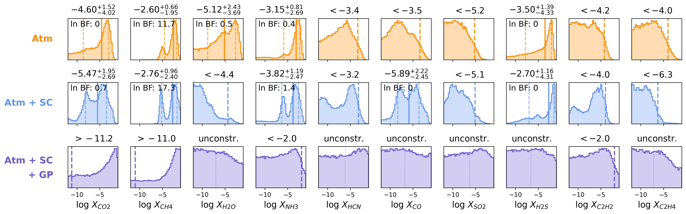
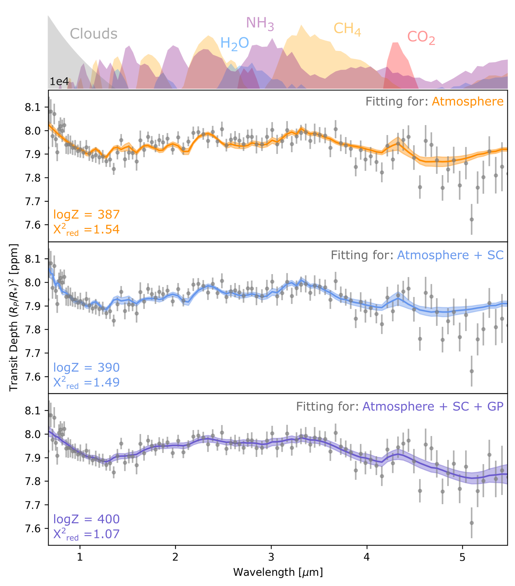
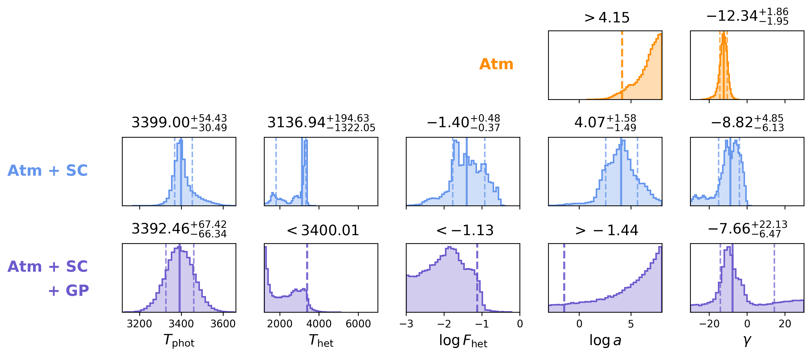

$\newcommand{\ensuremath}{}$
$\newcommand{\xspace}{}$
$\newcommand{\object}[1]{\texttt{#1}}$
$\newcommand{\farcs}{{.}''}$
$\newcommand{\farcm}{{.}'}$
$\newcommand{\arcsec}{''}$
$\newcommand{\arcmin}{'}$
$\newcommand{\ion}[2]{#1#2}$
$\newcommand{\textsc}[1]{\textrm{#1}}$
$\newcommand{\hl}[1]{\textrm{#1}}$
$\newcommand{\footnote}[1]{}$
$\newcommand{\vdag}{(v)^\dagger}$
$\newcommand\aastex{AAS\TeX}$
$\newcommand\latex{La\TeX}$

# JWST Transmission Spectroscopy of TOI-3235 b: Challenges in Constraining Giant Planet Atmospheres Around M Dwarfs Amid Stellar Contamination

<mark>Appeared on: 2026-08-06</mark> -  _29 pages, 20 figures, accepted for publication in AJ_

Z. Ko, et al. -- incl., <mark>T. Henning</mark>

**Abstract:** Giant planets orbiting low-mass M dwarfs challenge current planet formation theories, which predict that such planets are unlikely to form. Characterizing their atmospheres can provide key insight into their origins, but analysis is complicated by stellar contamination in transmission spectra. We present a JWST/NIRSpec PRISM transmission spectrum of TOI-3235 b, a 604 K, $0.665 M_{J}$ giant planet orbiting a $0.39 M_\odot$ M dwarf. We apply a hierarchical retrieval framework incorporating an atmospheric model, a parametric stellar contamination model, and a Gaussian process (GP) to capture residual structure not explained by these deterministic components. We find that the inferred atmospheric properties are model-dependent: retrievals that treat stellar contamination deterministically yield a constrained $CH_4$ abundance corresponding to a sub-solar metallicity that would challenge standard expectations from both core accretion and gravitational instability, and potentially elevated CO and $CO_2$ abundances that would require chemical disequilibrium. However, residual wavelength-correlated structure suggests the deterministic model is incomplete. Including a GP to marginalize over this structure broadens the atmospheric posterior distributions, preventing robust constraints on the atmospheric composition and highlighting the challenge of characterizing giant planet atmospheres around M dwarfs when physical models are incomplete. We demonstrate that an eclipse observation could clarify these model-dependent ambiguities: detected emission features would constrain the planet's metallicity and test formation scenarios, while a featureless spectrum would confirm stellar contamination dominates the transmission spectrum, providing an empirical M dwarf contamination spectrum.

**Figure 6. -** Retrieved trace abundances for all three retrievals. Each panel shows the posterior distribution of $\log X_i$ for one molecular species. Numerical labels above each panel summarize the abundance constraint: for molecules with two-sided bounded posteriors, we quote the median and 1$\sigma$ bounds; for molecules with only one bound, we quote either the 5th-percentile lower limit or the 95th-percentile upper limit; and for posteriors that reach both prior edges, we label the abundance as unconstrained. For molecules with two-sided bounds, we include the Bayes factor. (*fig:all_trace*)

**Figure 5. -** Retrieved spectra from each retrieval. The solid lines represent the median spectrum, and the shaded regions show the 1$\sigma$ bounds. The first panel shows the retrieval only fitting for the atmospheric model, the second shows the retrieval fitting for the atmospheric model and the stellar contamination model, and the third shows the retrieval fitting for the atmospheric model, the stellar contamination model, and a Gaussian process. The top region shows the spectral contribution plots corresponding to the first retrieval only fitting for the atmospheric model. (*fig:all_retrievals*)

**Figure 7. -** 
Posterior distributions for the stellar contamination and haze parameters across the three retrieval models. From left to right: photosphere temperature ($T_{\rm phot}$), heterogeneity (spot) temperature ($T_{\rm het}$), log heterogeneity (spot) covering fraction ($\log f_{\rm spot}$), log haze scattering amplitude ($\log a$), and haze scattering slope ($\gamma$). Numerical labels above each panel summarize the parameter constraint: for parameters with two-sided bounded posteriors, we quote the median and 1$\sigma$ bounds; for parameters with only one bound, we quote either the 5th-percentile lower limit or the 95th-percentile upper limit.
 (*fig:stellar_parameters*)

