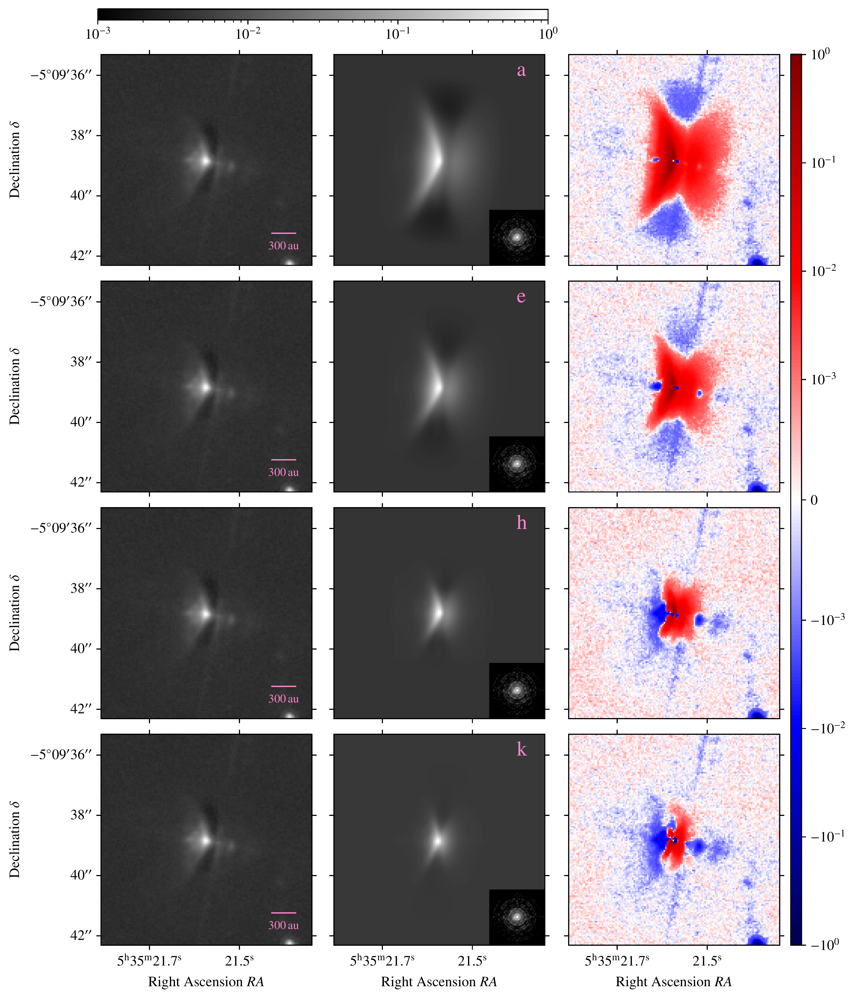
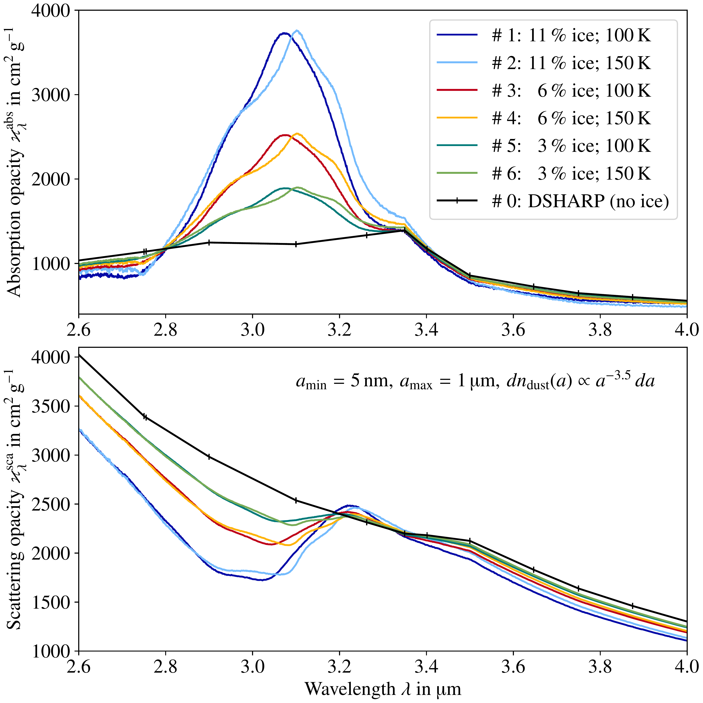
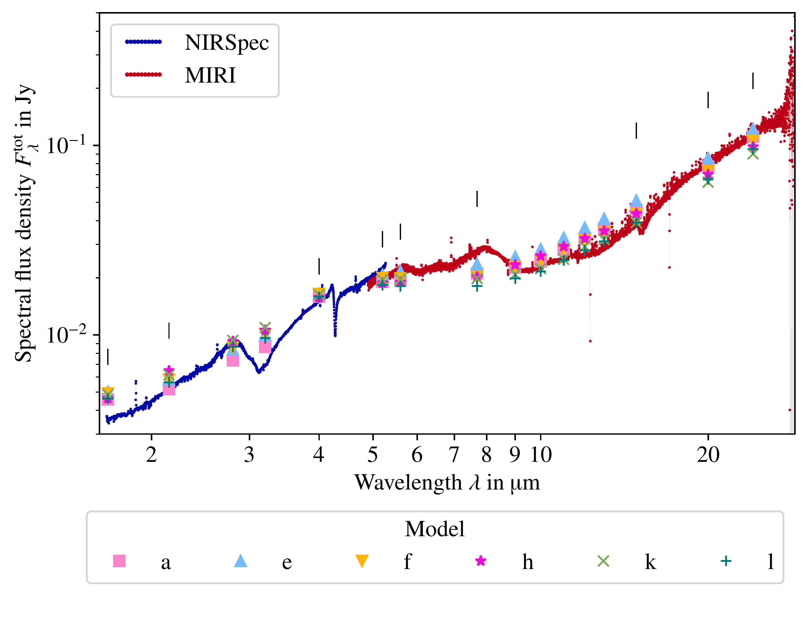

$\newcommand{\ensuremath}{}$
$\newcommand{\xspace}{}$
$\newcommand{\object}[1]{\texttt{#1}}$
$\newcommand{\farcs}{{.}''}$
$\newcommand{\farcm}{{.}'}$
$\newcommand{\arcsec}{''}$
$\newcommand{\arcmin}{'}$
$\newcommand{\ion}[2]{#1#2}$
$\newcommand{\textsc}[1]{\textrm{#1}}$
$\newcommand{\hl}[1]{\textrm{#1}}$
$\newcommand{\footnote}[1]{}$
$\newcommand{\PA}{\mathit{P\!A}}$
$\newcommand{\cmark}{\ding{51}}$
$\newcommand{\xmark}{\ding{55}}$

# Spatial distribution of water ice in the protoplanetary silhouette disk d216-0939

<mark>Appeared on: 2026-08-06</mark> -  _12 pages, 9 figures, accepted for publication in A&A_

J. S. Martin, et al. -- incl., <mark>H. Linz</mark>, <mark>T. Henning</mark>

**Abstract:** The composition of rocky planets depends on the dust in their natal protoplanetary disk (PPD), potentially containing water ice. Crystalline water ice was detected in the PPD d216-0939 in the Orion Nebular Cluster (ONC). We aim at constraining the spatial distribution and crystallization state of water ice in the d216-0939 disk using recent observations of the water ice absorption feature at a wavelength of $\sim$ $\SI{3}{\micro\meter}$ collected with JWST. We perform 3D Monte Carlo radiative transfer (MCRT) simulations to constrain the free parameters of an accretion disk model by fitting the calculated spectrum in the wavelength range from $\SIrange{1.6}{24}{\micro\meter}$ to the spectral energy distribution (SED) observed with the JWST instruments NIRSpec and MIRI. Additionally, archival, spatially resolved HST observations were used to constrain the global spatial structure of the disk, as the parameter space is degenerate with respect to the fit to the SED. Successively, we fit the water ice absorption feature using polychromatic MCRT simulations with spectral importance sampling to produce synthetic observations at high spectral resolutions. By probing the upper and outer disk layers, we found that a PPD model with dust containing $\SI{5.4}{\percent}$ crystallized water ice beyond the snowline fits the observations well, necessitating outward transport of material, since crystalline ice is unlikely to form in situ in the probed disk layers. In the spectral region of the water ice absorption feature, scattering and thermal dust emission both contribute significantly to the total flux.

**Figure 9. -** Comparison of HST observations at $\lambda_{\text{H}\alpha} = \SI{658}{\nano\meter}$ with synthetic images for selected disk models (see Table \ref{tab:best-fit_continuum_models}). After convolution, the images in the middle panel were downsampled to the resolution of the images in the left column with a flux conserving algorithm  ([ and DeForest 2004](https://ui.adsabs.harvard.edu/abs/2004SoPh..219....3D)) . All grayscale images are normalized with respect to their maximum. *Left column:* HST H$\alpha$-image by [Smith, et. al (2005)](https://ui.adsabs.harvard.edu/abs/2005AJ....129..382S) with a scalebar indicating the image dimension for a distance of $d_\star = \SI{362}{\parsec}$. *Middle column:* Synthetic images produced by convolution of simulation results with the appropriate F658N filter point spread function of HST \citep[created using \texttt{TinyTim};][]{Krist+2011}, which is depicted in the lower right corner of each image on a normalized logarithmic grayscale ranging from $\num[print-unity-mantissa=false]{1e-4}$ to $\num{1}$. *Right column:* Difference images obtained by subtraction of the simulation results from the observations. Red indicates a flux overestimation by our modeling and blue the opposite. (*fig:hst_compare*)

**Figure 1. -** Effective medium opacities for the (icy) dust mixtures used in this work. (*fig:ice_mix_opacities*)

**Figure 2. -** Comparison of the observed SED to the well-fitting disk models considered as best-fit candidates. The free parameter values of the models are listed in Table \ref{tab:best-fit_continuum_models}. The wavelengths $\lambda_\text{cont}$ are marked by vertical black lines above the data. (*fig:best-fit_candidates*)

