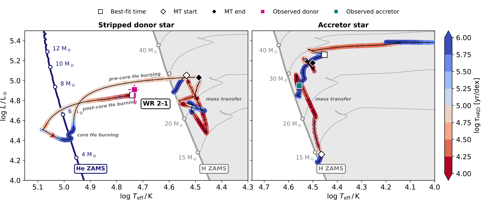
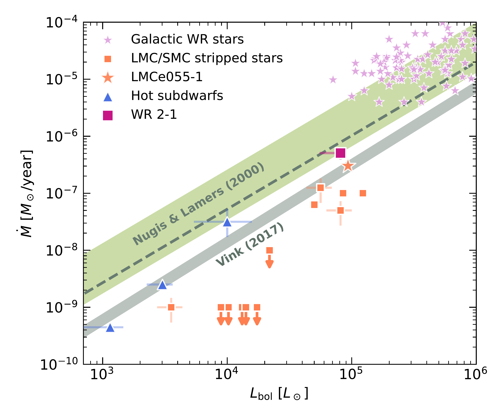
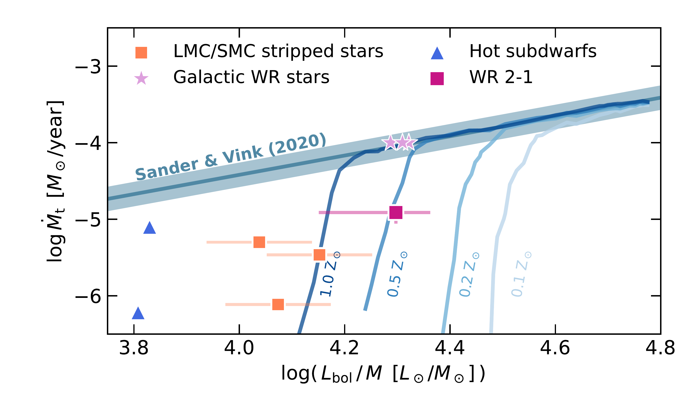
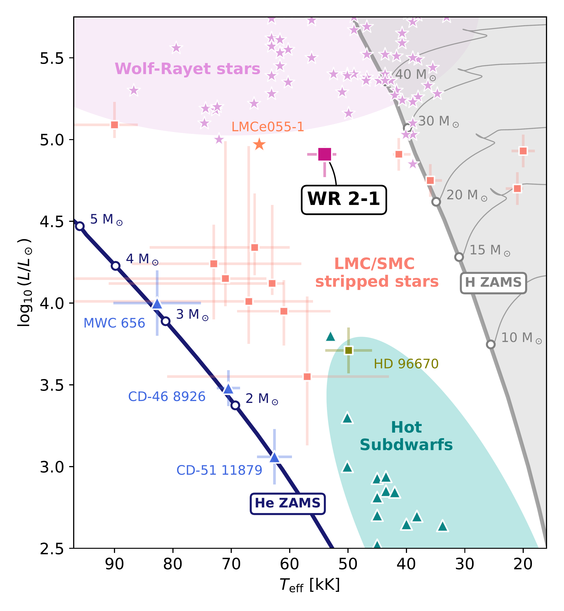

$\newcommand{\ensuremath}{}$
$\newcommand{\xspace}{}$
$\newcommand{\object}[1]{\texttt{#1}}$
$\newcommand{\farcs}{{.}''}$
$\newcommand{\farcm}{{.}'}$
$\newcommand{\arcsec}{''}$
$\newcommand{\arcmin}{'}$
$\newcommand{\ion}[2]{#1#2}$
$\newcommand{\textsc}[1]{\textrm{#1}}$
$\newcommand{\hl}[1]{\textrm{#1}}$
$\newcommand{\footnote}[1]{}$
$\newcommand{\edit}[2]{\colorbox{RedOrange}{\color{white}   \textsf{\textbf{EDIT@{#1}}}} \textcolor{RedOrange}{#2}}$
$\newcommand{\astext}[1]{{\textcolor{orange}{#1}}}$
$\newcommand{\arraystretch}{1.6}$
$\newcommand{\arraystretch}{1.6}$

# A Galactic intermediate-mass stripped star with a Wolf--Rayet-like wind

<mark>Appeared on: 2026-08-07</mark> -  _submitted to A&A, comments welcome, 19 pages, 14 figures_

<mark>J. Müller-Horn</mark>, et al. -- incl., <mark>K. El-Badry</mark>, <mark>H.-W. Rix</mark>, <mark>S. Shahaf</mark>

**Abstract:** Binary interaction in massive stars is expected to produce a large population of intermediate-mass ( $2$ – $8 \mathrm{M}_\odot$ ) envelope-stripped stars, yet such objects have remained elusive in the Milky Way. We report the identification of an unambiguous Galactic example in a short-period ( $P = 5.94$ d), double-lined spectroscopic binary, discovered in the SDSS-V Milky Way Mapper survey. The system consists of a rapidly rotating O-type star and a hotter, lower-mass companion, which shows $\ion{He}{ii}$ and $\ion{N}{iv}$ emission lines with large radial velocity variations, revealing its binary nature.    Combined orbital constraints and joint spectroscopic and photometric modelling show that the companion is a hot ( $T_\ast \approx 60 \mathrm{kK}$ ), helium-rich star with a mass of $3.2$ -- $5.8 \mathrm{M}_\odot$ , placing it squarely in the intermediate-mass regime and below values typically inferred for classical Wolf--Rayet (WR) stars.    Its spectral properties are inconsistent with accretion-powered emission and instead indicate a stripped star formed through binary mass transfer. The system’s short period, negligible eccentricity, and rapidly rotating O-star point to a post-interaction configuration following efficient mass transfer and spin-up of the accretor.    Comparison with binary evolution models suggests that the stripped star is observed in a brief inflated phase following mass transfer, which increases its optical flux contribution and facilitates its detection. The inferred mass-loss rate $\log \dot{M} / (\mathrm{M}_\odot \mathrm{yr}^{-1})= -6.3 \pm 0.1$ is in line with mass-loss rates observed for classical WR stars in the Milky Way and exceeds those measured for intermediate-mass stripped stars in the Magellanic Clouds, with the caveat that our target selection is biased towards systems with stronger emission features.    As an unambiguous and well-characterised intermediate-mass stripped star, this system provides a key benchmark for models of binary evolution at solar metallicity, stripped-envelope supernova progenitors, and the formation of compact-object binaries.

**Figure 12. -** Evolutionary tracks of binary models in the Hertzsprung-Russell diagram for comparison with WR 2-1. The observed properties of the stripped donor (left) and the mass gainer (right) are compared to a representative model from the grid of [Jin, et. al (2026)](https://ui.adsabs.harvard.edu/abs/2026A&A...707A..56J)(black). The tracks are coloured by their "HRD-timescale" ($\tau_\mathrm{HRD} = \Delta \nicefrac{t_\mathrm{age}}{\sqrt{[\Delta \log (T_\mathrm{eff} / \mathrm{K})]^2+[\Delta \log (L / \mathrm{L}_\odot)]^2}}$), to illustrate the relative time spent in different evolutionary phases (blue means longer-lived). The onset and end of mass transfer are marked by diamond symbols. The epoch that best matches the observed properties is indicated by white square markers. Hydrogen and helium ZAMS, as well as single-star evolutionary tracks are shown for reference.
    Comparison with the model tracks suggests that the stripped donor star presently is in a transitional stage after mass transfer with a cooler temperature, and higher luminosity compared to the contracted core-helium burning phase. (*fig:mesa_model_HRD*)

**Figure 6. -** Wind parameters WR 2-1 and comparison samples. _Top:_ Mass-loss rate as a function of luminosity; colour coding follows Fig. \ref{fig:lit_comparison_hrd}. The green and grey shaded regions indicate theoretical predictions from the empirical WR relation of [Nugis and Lamers (2000)](https://ui.adsabs.harvard.edu/abs/2000A&A...360..227N) and the stripped-star prescription of [ and Vink (2017)](https://ui.adsabs.harvard.edu/abs/2017A&A...607L...8V), respectively. The dashed line shows the relation for $Y=0.5$. WR 2-1 occupies the intermediate regime between hot subdwarfs and classical WR stars, consistent with \citeauthor{Nugis_Lamers2000}. _Bottom:_ Transformed mass loss rate vs. luminosity-to-mass ratio for stripped stars with dynamically consistent mass estimates. Here, we assumed $M_\mathrm{2,  dyn/evol}$ to compute the luminosity-to-mass ratio -- using $M_\mathrm{2,  dyn/spec}$ or $M_\mathrm{2,  spec}$ changes the value by $\sim\pm0.15$. WR 2-1 falls below the inferred relation for helium star winds by [Sander and Vink (2020)](https://ui.adsabs.harvard.edu/abs/2020MNRAS.499..873S). (*fig:lit_comparison_mdot*)

**Figure 5. -** Hertzsprung-Russell diagram showing the position of WR 2-1 (pink) compared to known envelope-stripped stars. The figure includes Galactic WR stars (light pink), hot subdwarfs (teal), with the subset of the hottest subdwarfs and merger candidates highlighted in blue, stripped stars in the Magellanic Clouds (orange), and the candidate intermediate-mass stripped star HD 96670 (olive); see main text for references. Its inferred temperature and luminosity place WR 2-1 in the intermediate regime between hot subdwarfs and classical WR stars. (*fig:lit_comparison_hrd*)

