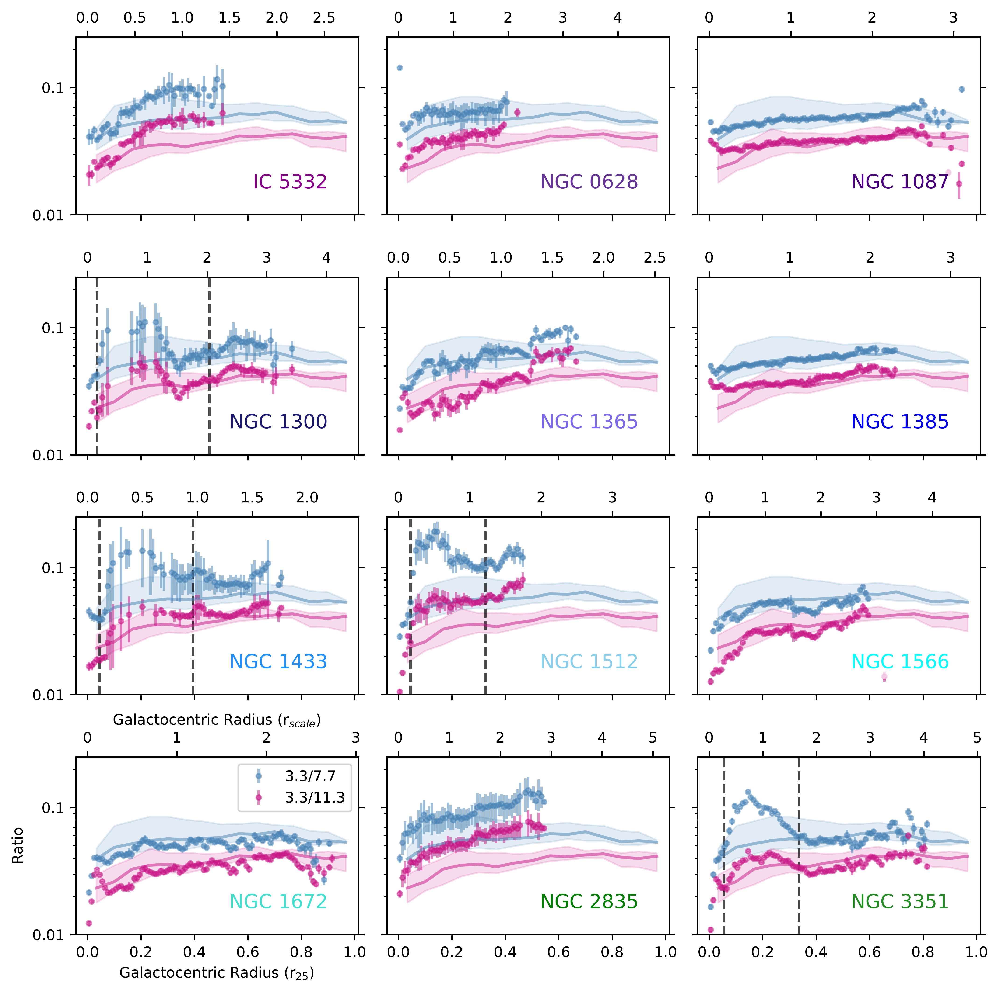
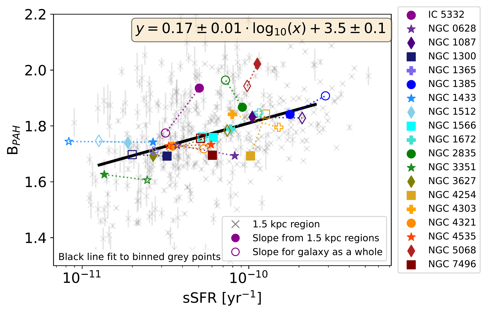
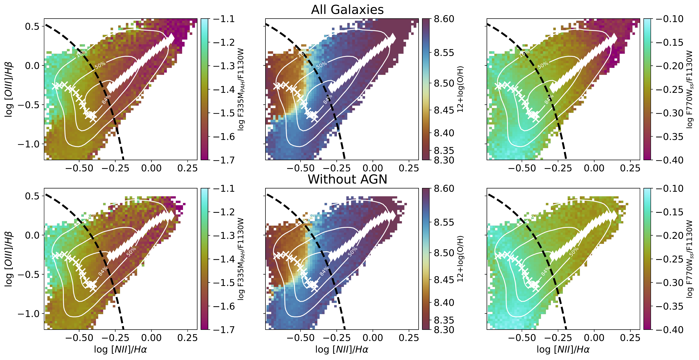

$\newcommand{\ensuremath}{}$
$\newcommand{\xspace}{}$
$\newcommand{\object}[1]{\texttt{#1}}$
$\newcommand{\farcs}{{.}''}$
$\newcommand{\farcm}{{.}'}$
$\newcommand{\arcsec}{''}$
$\newcommand{\arcmin}{'}$
$\newcommand{\ion}[2]{#1#2}$
$\newcommand{\textsc}[1]{\textrm{#1}}$
$\newcommand{\hl}[1]{\textrm{#1}}$
$\newcommand{\footnote}[1]{}$
$\newcommand{\vdag}{(v)^\dagger}$
$\newcommand\aastex{AAS\TeX}$
$\newcommand\latex{La\TeX}$
$\newcommand\refedit[1]{#1}$
$\newcommand\newrefedit[1]{#1}$
$\newcommand{\UCSD}{Department of Astronomy and Astrophysics, University of California, San Diego, CA 92093, USA}$
$\newcommand{\Carnegie}{The Observatories of the Carnegie Institution for Science, 813 Santa Barbara Street, Pasadena, CA 91101, USA}$
$\newcommand{\KIPAC}{Kavli Institute for Particle Astrophysics \& Cosmology (KIPAC), Stanford University, CA 94305, USA}$
$\newcommand{\OSU}{Department of Astronomy, The Ohio State University, Columbus, OH 43210, USA}$
$\newcommand{\Whitman}{Whitman College, 345 Boyer Avenue, Walla Walla, WA 99362, USA}$
$\newcommand{\UHeidelberg}{Astronomisches Rechen-Institut, Zentrum für Astronomie der Universität Heidelberg, Mönchhofstr. 12-14, D-69120 Heidelberg, Germany}$
$\newcommand{\UWyoming}{Department of Physics and Astronomy, University of Wyoming, Laramie, WY 82071, USA}$
$\newcommand{\Algoma}{Faculty of Computer Science \& Technology, Algoma University, Sault Ste. Marie, ON$
$P6A 2G4, Canada}$
$\newcommand{\UGent}{Sterrenkundig Observatorium, Universiteit Gent, Krijgslaan 281 S9, B-9000 Gent, Belgium}$
$\newcommand{\Columbus}{Center for Cosmology and Astroparticle Physics, 191 West Woodruff Avenue, Columbus, OH 43210, USA}$
$\newcommand{\uoa}{Department of Physics, University of Arkansas, 226 Physics Building, 825 West Dickson Street, Fayetteville, AR 72701, USA}$
$\newcommand{\UConn}{Department of Physics, University of Connecticut, 196A Auditorium Road, Storrs, CT 06269, USA}$
$\newcommand{\UAlberta}{Department of Physics, University of Alberta, Edmonton, AB T6G 2E1, Canada}$
$\newcommand{\ITA}{Universität Heidelberg, Zentrum für Astronomie, Institut für Theoretische Astrophysik, Albert-Ueberle-Str. 2, 69120 Heidelberg, Germany}$
$\newcommand{\IWR}{Universität Heidelberg, Interdisziplinäres Zentrum für Wissenschaftliches Rechnen, Im Neuenheimer Feld 225, 69120 Heidelberg, Germany}$
$\newcommand{\JHU}{\affiliation{Department of Physics and Astronomy, The Johns Hopkins University, Baltimore, MD 21218 USA}}$
$\newcommand{\Tamkang}{Department of Physics, Tamkang University, No.151, Yingzhuan Road, Tamsui District, New Taipei City 251301, Taiwan}$
$\newcommand{\Azur}{Université Côte d’Azur, Observatoire de la Côte d’Azur, CNRS, Laboratoire Lagrange, 06000, Nice, France}$
$\newcommand{\JBCA}{UK ALMA Regional Centre Node, Jodrell Bank Centre for Astrophysics, Department of Physics and Astronomy, The University of Manchester, Oxford Road, Manchester M13 9PL, UK}$
$\newcommand{\AIP}{Leibniz-Institut for Astrophysik Potsdam (AIP), An der Sternwarte 16, 14482 Potsdam, Germany}$
$\newcommand{\STScI}{Space Telescope Science Institute  (STScI),  Baltimore, MD, USA}$
$\newcommand{\ESOcl}{European Southern Observatory (ESO), Alonso de Córdova 3107, Casilla 19, Santiago 19001, Chile}$
$\newcommand{\NOIRLab}{International Gemini Observatory/NSF NOIRLab, 950 N Cherry Ave, Tucson, AZ 85719, USA}$
$\newcommand{\STScIESA}{\affiliation{AURA for the European Space Agency (ESA), Space Telescope Science Institute, 3700 San Martin Drive, Baltimore, MD 21218, USA}}$
$\newcommand{\umd}{Department of Astronomy University of Maryland College Park, MD 20742 USA}$
$\newcommand{\MPE}{Max-Planck-Institut für extraterrestrische Physik, Giessenbachstra{\ss}e 1, D-85748 Garching, Germany}$

# Variations in the 3.3 $\micron$ Polycyclic Aromatic Hydrocarbon Feature Across Nearby Galaxies Driven by Metallicity and Radiation Field Spectrum

<mark>Appeared on: 2026-08-07</mark> -  _39 pages, 24 figures, 3 tables; accepted for publication in ApJ_

H. B. Koziol, et al. -- incl., <mark>J. Neumann</mark>

**Abstract:** We use JWST NIRCam imaging to investigate the 3.3 $\micron$ polycyclic aromatic hydrocarbon (PAH) feature in nearby galaxies. NIRCam observations of the 3.3 $\micron$ feature are emerging as a powerful tool for studying the structure of the interstellar medium (ISM) and the conditions of the dust at $\sim$ 0 $\farcs$ 1 resolution. These maps require accurate subtraction of the underlying continuum emission. We present an empirical method to isolate the PAH-correlated emission in the F335M filter using the F300M and F360M filters for continuum subtraction. We find that the slope of the F335M/F300M versus F360M/F300M colors for PAH-correlated emission shows a dependence on local ISM properties, with the strongest dependence on specific star formation rate. Weaker emission features captured by these bands appear suppressed relative to the main 3.3 $\micron$ feature in regions of active star formation. We find trends in the 3.3/7.7 and 3.3/11.3 $\micron$ ratios that suggest changes in PAH size, charge, and heating by a varying radiation field spectrum. We find decreases in both band ratios with increasing metallicity, which we attribute to a shift to smaller PAH populations at low metallicity. Comparison to optical ionized gas line ratios and dust models show that variations in the interstellar radiation field spectrum influence the PAH feature ratios. This analysis supports inhibited growth formation scenarios for the observed PAH band ratio trends with metallicity and emphasizes the importance of considering the local radiation field characteristics and gas-phase metallicity when using these band ratios as PAH property diagnostics.

**Figure 7. -** The ratio of the 3.3 to 11.3 $\micron$(pink) and 7.7 $\micron$(blue) PAH feature fluxes in each galaxy as a function of deprojected galactocentric radius measured in $r_{25}$(bottom) and scale radius (top) units. Black vertical dashed lines represent the radial extent of "star formation deserts"\refedit{, regions of very low SFR associated with bars,} in each galaxy that has one from \citet{Pathak2026}. \refedit{We include points above the cuts described in Section \ref{sec:processing}.}
      Bins are 0.01 $r_{25}$ in size, and error bars were calculated using the difference in values using the different mapping methods described above added in quadrature to the standard deviation divided by the $\sqrt{\rm{N}}$ in each bin. The solid line shows the trend of the ratios with galacocentric radius across all 19 galaxies in the sample, with the shaded regions surrounding them showing the 25th-75th percentiles. (*fig:ratio_radius*)

**Figure 5. -** Slope values as a function of sSFR for all 1.5 kpc regions evenly sampled across all galaxies. The slope values were calculated individually in each region, following the same procedure from Section \ref{sec:method}. The best fitting line, $B_{\rm PAH} = 0.17 \pm 0.01 \times \log_{10}({\rm sSFR} / {\rm yr^{-1}})
      +3.5 \pm 0.1$,
      was calculated on binned medians and overplotted in black. Average slope and sSFR values from regions inside each galaxy are plotted as various shapes and solid colors. Galaxy property values and regions are from \citet{Sun2020}. Slope values measured from treating the entire galaxy as one aperture are shown in the same shapes and colors with open faces. These are plotted with the global average sSFR value in the JWST coverage for each galaxy. Galaxy-wide and region averaged slope measurements are the same in some galaxies, while the effects of weighting each region equally, regardless of number of points, can offset them in other galaxies. (*fig:megatable_regions*)

**Figure 12. -** BPT \citep{baldwin1981}, diagram created using the 150 pc data \refedit{color coded by} three quantities \refedit{with black contours showing where the 16th, 50th, and 84th percentiles of the data lie. Top panels include data from all galaxies and the bottom panels exclude galaxies that have been identified as AGN hosts, NGC 1365, NGC 1672, NGC 4303, and NGC 7496.} The color bar on the left panel shows the band ratio 3.3/11.3 $\micron$, the middle panel is colored by metallicity to highlight where the lowest metallicity regions fall in the diagram\refedit{, and t}he right panel shows the 11.3/7.7 $\micron$ ratio. The \refedit{left of the} black dashed line on all panels represents where star-forming \refedit{regions} fall on the diagram \citep{Kauffmann2003}. We show two distinct tracks in PAH band ratio trends in the star-forming, left, and LINER, right, divided by the  \citet{Kauffmann2003} line. In star-forming regions, we bin points by metallicity, plotted as `x' marks, and calculate the median values of both PAH band ratios and optical line ratios in each bin. In the LINER regime, we do a similar analysis, binned by log([NII]/H$\alpha$). We observe a strong PAH band ratio dependence on metallicity for bins in the star-forming regime while those in the LINER regime are more heavily influenced by radiation field hardness. (*fig:bpt*)

