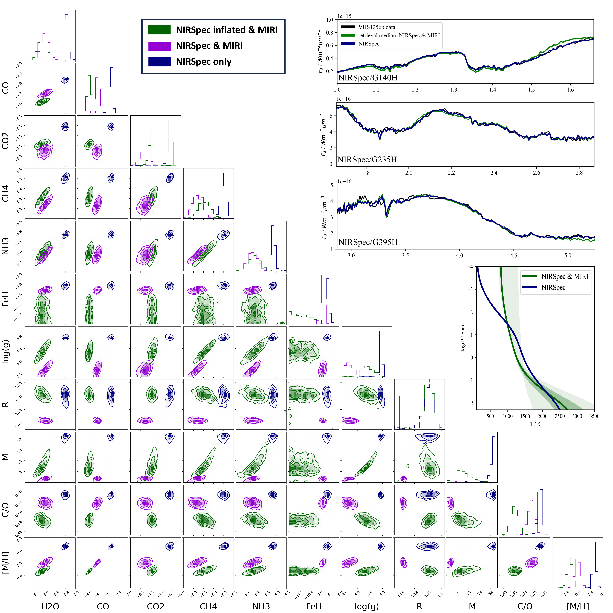
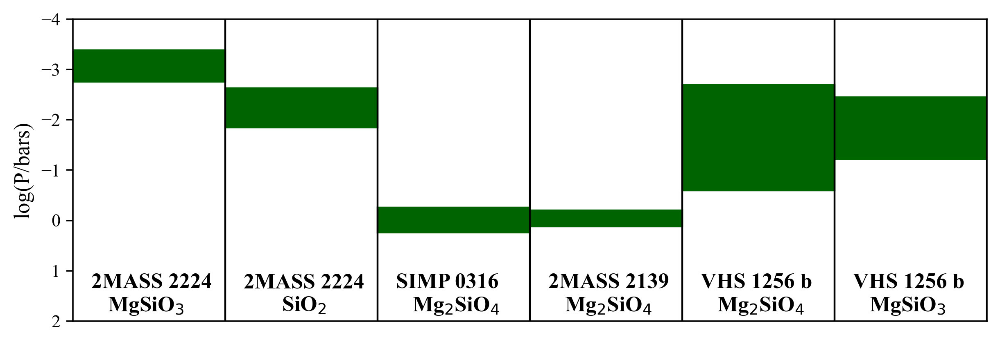
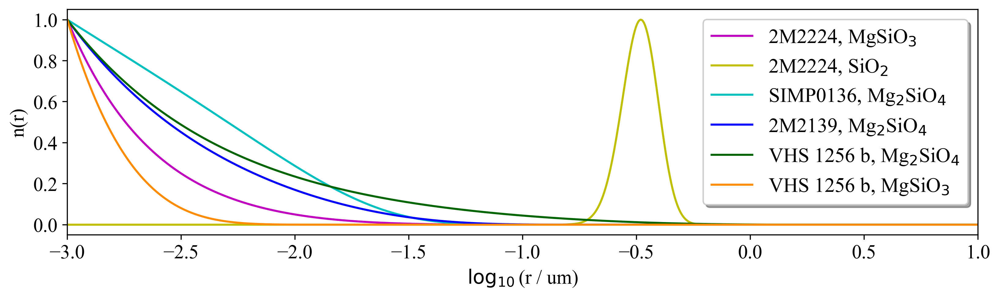
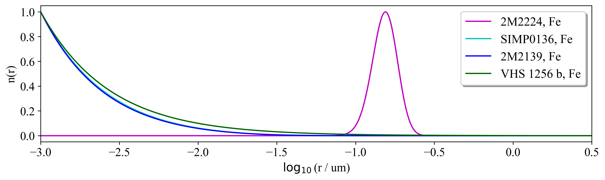

$\newcommand{\ensuremath}{}$
$\newcommand{\xspace}{}$
$\newcommand{\object}[1]{\texttt{#1}}$
$\newcommand{\farcs}{{.}''}$
$\newcommand{\farcm}{{.}'}$
$\newcommand{\arcsec}{''}$
$\newcommand{\arcmin}{'}$
$\newcommand{\ion}[2]{#1#2}$
$\newcommand{\textsc}[1]{\textrm{#1}}$
$\newcommand{\hl}[1]{\textrm{#1}}$
$\newcommand{\footnote}[1]{}$
$\newcommand{\vdag}{(v)^\dagger}$
$\newcommand\aastex{AAS\TeX}$
$\newcommand\latex{La\TeX}$

# The JWST Early Release Science Program for Direct Observations of Exoplanetary Systems VIII: patchy forsterite and enstatite clouds in the atmosphere of VHS 1256 b, retrieval lessons learned and outlook to the future

<mark>Appeared on: 2026-08-10</mark> -  _Accepted for publication in ApJL. 28 Pages. 12 Figures_

N. Whiteford, et al. -- incl., <mark>G. Chauvin</mark>, <mark>T. Henning</mark>, <mark>P. Mollière</mark>

**Abstract:** JWST defines a new era for the data-driven approach of retrieval modelling, which has become a cornerstone tool for the statistical inference of exoplanetary and brown dwarf properties. The Early Release Science program \# 1386 observations of VHS 1256 b represent a huge jump in data quality, data quantity and spectral coverage for such objects.  VHS  1256  b is a young, planetary mass and extremely variable companion that populates the enigmatic L/T cohort of substellar atmospheres.  In this first retrieval analysis of the full 1 -- 18 $\mu$ m dataset, we apply the $Brewster$ retrieval framework to the NIRSpec and MIRI spectroscopic observations of VHS 1256 b, exploring a variety of cloud species and structures. Using $\Delta$ BIC we find that the data is best described by a forsterite ($Mg_2$ $SiO_4$ ) and enstatite ($MgSiO_3$ ) cloud combination. Our analysis shows a strong preference for patchy silicate cloud coverage, which aligns with VHS 1256 b's extensive and well documented spectral variability. Our retrieval is able to place constraints on the abundances of $H_2$ O, CO, $CO_2$ , $CH_4$ as well as $NH_3$ .We also show that the retrieved parameters are sensitive to the data used and the relative signal-to-noise ratios between data from different instruments.We conclude with the next steps for the wider retrieval community to better understand young and cloudy exoplanetary atmospheres.

**Figure 11. -** Bottom left: Comparison corner plot of retrieved modelled parameters which are well constrained using 3 different data inputs. Top Right: Comparison of the retrieval spectral fit to the NIRSpec data when employing both NIRSpec and MIRI data vs only NIRSpec data. Middle right: Comparison of the retrieval temperature-pressure profile when when employing both NIRSpec and MIRI data vs. only NIRSpec data. (*fig:posterior_comparison*)

**Figure 12. -** Bottom left: Comparison corner plot of retrieved modelled parameters which are well constrained using 3 different data inputs. Top Right: Comparison of the retrieval spectral fit to the NIRSpec data when employing both NIRSpec and MIRI data vs only NIRSpec data. Middle right: Comparison of the retrieval temperature-pressure profile when when employing both NIRSpec and MIRI data vs. only NIRSpec data. (*fig:posterior_comparison*)

**Figure 8. -** Top: Comparison of retrieved cloud position for VHS 1256 b and objects from [Burningham, Faherty and Gonzales (2021)]() and [Vos, Burningham and Faherty (2023)](). Middle and Bottom: Comparison of retrieved particle size distributions for silicate and iron clouds for VHS 1256 b and objects from [Burningham, Faherty and Gonzales (2021)]() and [Vos, Burningham and Faherty (2023)](). (*fig:cloud_property_illusration*)

