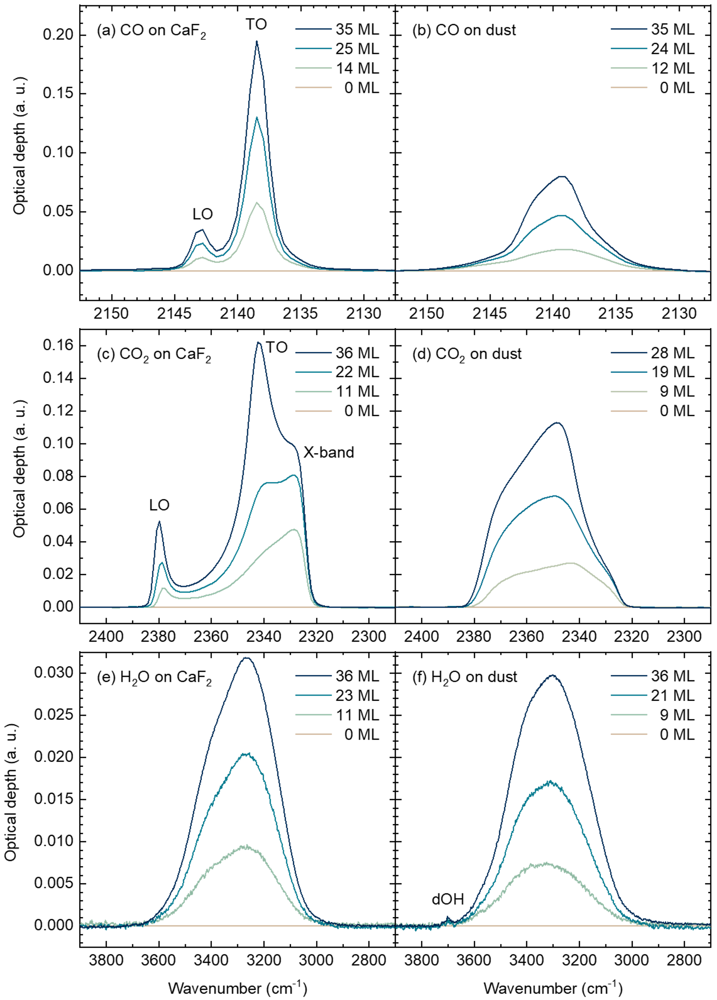
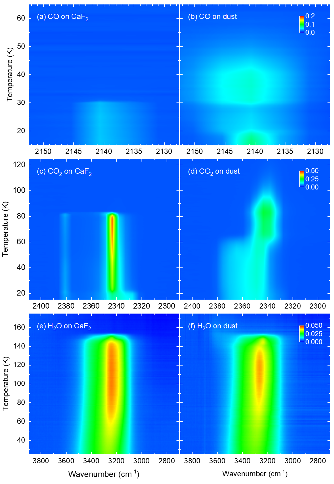
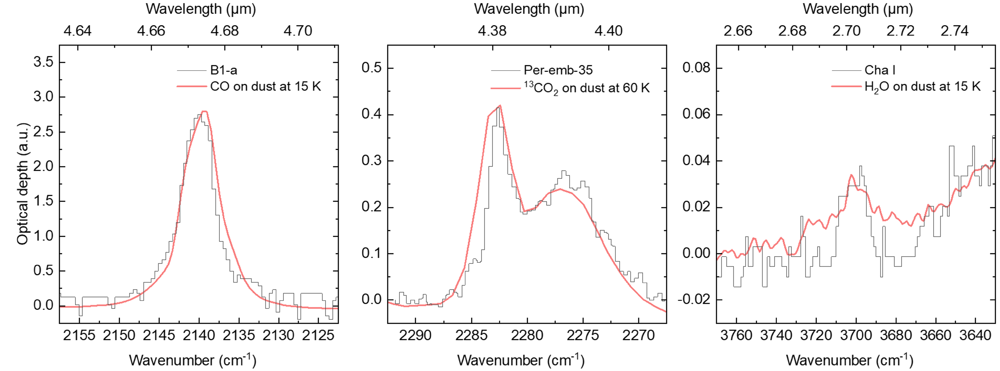

$\newcommand{\ensuremath}{}$
$\newcommand{\xspace}{}$
$\newcommand{\object}[1]{\texttt{#1}}$
$\newcommand{\farcs}{{.}''}$
$\newcommand{\farcm}{{.}'}$
$\newcommand{\arcsec}{''}$
$\newcommand{\arcmin}{'}$
$\newcommand{\ion}[2]{#1#2}$
$\newcommand{\textsc}[1]{\textrm{#1}}$
$\newcommand{\hl}[1]{\textrm{#1}}$
$\newcommand{\footnote}[1]{}$

# Molecule-specific diffusion and desorption of interstellar ices on carbonaceous dust

<mark>Appeared on: 2026-08-13</mark> - 

Y.-H. Chiu, et al. -- incl., <mark>T. Suhasaria</mark>, <mark>T. Henning</mark>

**Abstract:** Interstellar ices form on dust grains in the coldest regions of molecular clouds and preserve key volatile reservoirs that could be incorporated into protoplanetary disks during star and planet formation. However, the effect of the dust surface composition on the ice structure and spectroscopic behavior remains poorly constrained. We present a comparative laboratory study of astrophysically relevant ices (CO, $CO_2$ , and $H_2$ O) deposited on inert calcium fluoride ($CaF_2$ ) substrate and carbonaceous dust analogs under interstellar conditions. Infrared spectroscopy and temperature-programmed desorption reveal pronounced molecule-specific infrared spectral responses to the amorphous carbonaceous surface. CO and $CO_2$ both exhibit broadened absorption bands, redshifted band positions, and delayed desorption, arising from thermally activated diffusion into the porous dust matrix and indicating strong molecule–surface interactions. By contrast, $H_2$ O varies only very little spectrally and thermally, indicating weak wetting and limited coupling to the substrate. These results provide direct laboratory evidence that dust-ice interfaces can affect the ice structure and desorption kinetics of interstellar ices even in thick ice layers. These findings offer new constraints for interpreting infrared absorption bands in astronomical observations and highlight the importance of surface effects in models of interstellar ice chemistry.

**Figure 1. -** Infrared absorption spectra of CO (top row: a, $CaF_2$; b, carbonaceous dust), $CO_2$(middle row: c, $CaF_2$; d, carbonaceous dust), and $H_2$O (bottom row: e, $CaF_2$; f, carbonaceous dust) ices at 15 K. (*fig2*)

**Figure 2. -** Thermal evolution of CO (top row: a, $CaF_2$; b, carbonaceous dust), $CO_2$(middle row: c, $CaF_2$; d, carbonaceous dust), and $H_2$O (bottom row: e, $CaF_2$; f, carbonaceous dust) ices. The color scale reflects the relative optical depth of the spectra acquired during thermal processing. (*fig3*)

**Figure 3. -** Observed spectra compared to laboratory data for CO (left), $^{13}$$CO_2$(middle), and $H_2$O (right) ices on carbonaceous dust analogs. (*fig4*)

