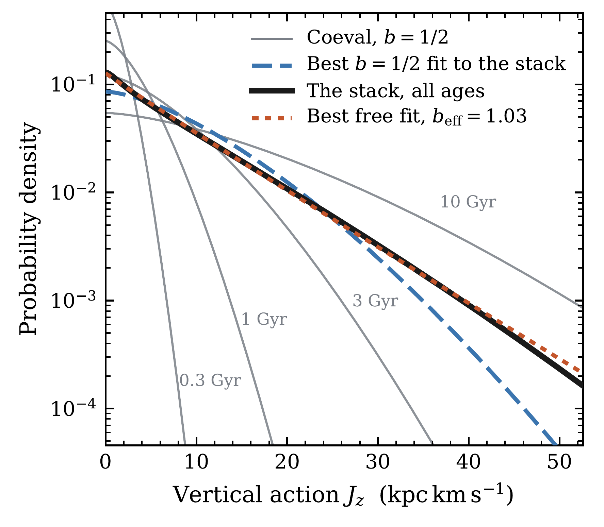
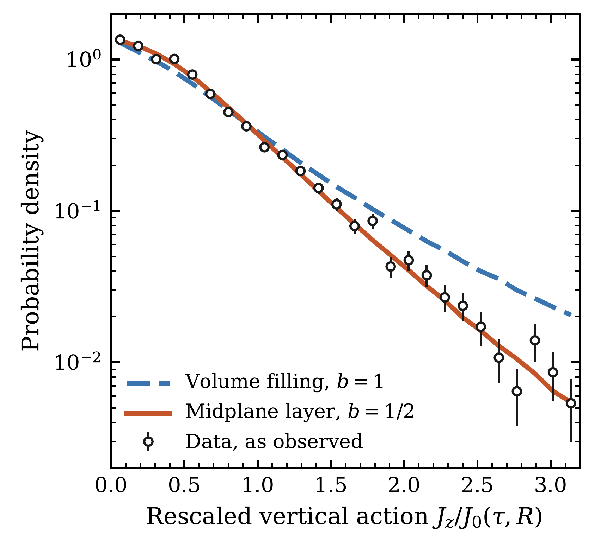
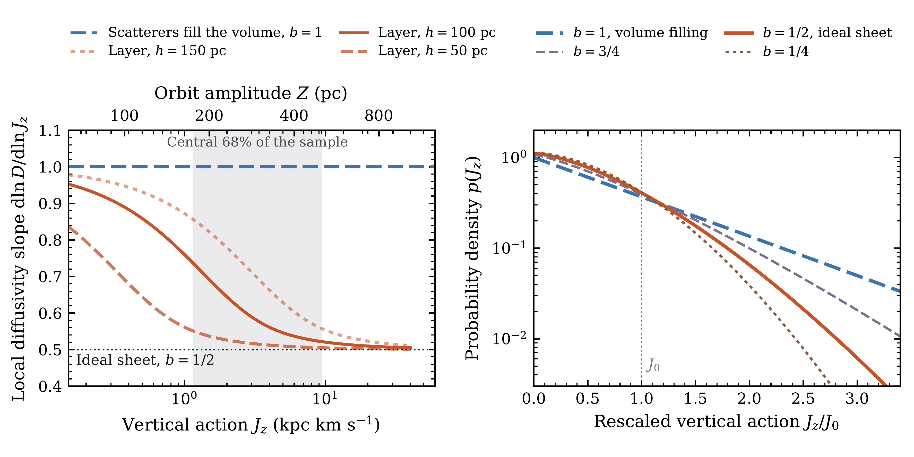

$\newcommand{\ensuremath}{}$
$\newcommand{\xspace}{}$
$\newcommand{\object}[1]{\texttt{#1}}$
$\newcommand{\farcs}{{.}''}$
$\newcommand{\farcm}{{.}'}$
$\newcommand{\arcsec}{''}$
$\newcommand{\arcmin}{'}$
$\newcommand{\ion}[2]{#1#2}$
$\newcommand{\textsc}[1]{\textrm{#1}}$
$\newcommand{\hl}[1]{\textrm{#1}}$
$\newcommand{\footnote}[1]{}$
$\newcommand{\JR}{J_R}$
$\newcommand{\Meff}{M_{\rm eff}}$
$\newcommand{\Msun}{\ensuremath{\mathrm{M_\odot}}}$
$\newcommand{\kms}{\mathrm{km s^{-1}}}$
$\newcommand{\kpckms}{\mathrm{kpc km s^{-1}}}$
$\newcommand{\dd}{\mathrm{d}}$
$\newcommand{\Ssc}{\Sigma_{\rm sc}}$
$\newcommand{\SGMC}{\Sigma_{\rm GMC}}$
$\newcommand{\NKS}{N_{\rm KS}}$
$\newcommand{\tcell}[2]{\parbox[t]{#1}{\raggedright #2}}$
$\newcommand{\topfraction}{0.92}$
$\newcommand{\bottomfraction}{0.85}$
$\newcommand{\textfraction}{0.06}$
$\newcommand{\floatpagefraction}{0.72}$
$\newcommand{\arraystretch}{1.12}$
$\newcommand{\theHequation}{\Alph{section}.\arabic{equation}}$

# The Shape of the Vertical Action Distribution Locates the Scatterers that Heat the Galactic Disc

<mark>Appeared on: 2026-08-13</mark> -  _30 pages, 9 figures, 3 tables. Submitted to the OJAp_

Y.-S. Ting, <mark>H.-W. Rix</mark>

**Abstract:** The Milky Way's stellar disc is thicker than the cold gas layer from which its stars form. What scatters stars onto orbits with greater vertical motion remains unresolved. Scatterers could fill the disc volume, as bending waves or dark substructure would, or could be confined to the midplane, as giant molecular clouds are. Scattering from a midplane layer occurs only during the fast plane-crossing phase and becomes less effective as that speed increases, whereas a volume-filling perturbation remains effective near the slow turning points. We derive the distribution of vertical action this leaves behind, for any height distribution of scatterers. The geometry turns out to enter only through the logarithmic slope of the diffusivity in action, $D\propto J_z^{ b}$ , and solving the Fokker--Planck equation gives $p(J_z)\propto\exp[-(J_z/J_0)^{2-b}]$ . Scatterers that fill the volume give $b=1$ and an exponential, a thin layer at the midplane gives $b=1/2$ and a sharper cutoff: the shape of $p(J_z)$ records where the scatterers sit, the growth of its scale how strongly they scatter. We fit this model to $7589$ low- $\alpha$ red clump stars of [Ting and Rix (2019)]() between $5$ and $10$ kpc and $2$ and $8$ Gyr old, leaving the heating history free. This yields $b=0.51^{+0.06}_{-0.07}$ , consistent with the thin-layer prediction but not the volume-filling one. Comparing the $2$ -- $4$ Gyr heating amplitude with the present molecular surface density gives an effective scatterer mass of $2.7\times10^{6} \Msun$ . Older stars have experienced more of the Galaxy's gas-richer past; correcting for that history brings all four age bins to $1.9$ -- $2.8\times10^{6} \Msun$ , inside the range cloud catalogues and mass functions give. The Milky Way's disc is heated near the plane, by an evolving population of objects of giant-molecular-cloud mass.

**Figure 3. -** The shape an age-blind sample returns, against the populations it is built from. The grey curves are coeval populations with $b=1/2$ at four ages, differing only in the scale the clock assigns them, and each bends downwards on a logarithmic axis as a three-halves stretched exponential must. The clock is normalised through the measured $J_0$ at $5$ Gyr so that the axis carries physical units, a choice the exponent does not depend on. Their stack over $0.1$--$10$ Gyr at a constant formation rate, across which the scale grows twenty-fold, is close to straight, which is what $b=1$ looks like. Both fitted curves maximise equation \eqref{eq:crossentropy} against the stack, one with the exponent free and one with it held at the true $3/2$. The free fit returns $b_{\rm eff}=1.03$ and holds the stack to within a per cent at its $99$th percentile in $J_z$, where holding the true $b=1/2$ instead falls short by a factor of two. (*fig:ageblind*)

**Figure 1. -** The measured shape, from the same $7589$ stars. Each star's action is divided by the scale $J_0$ that the fit assigns to its age and radius, which by equation \eqref{eq:solution} puts every age on one curve. The vertical axis is probability density, logarithmic, against that rescaled action. The points are the observed stars, and the two curves are the idealised geometries $b=1/2$ and $b=1$, each drawn as a synthetic population passed through the same selection function, errors and rescaling as the data. The midplane shape follows the data over the full range, whereas the exponential departs from it beyond $J_z\simeq J_0$. (*fig:universal*)

**Figure 5. -** From the scattering profile to the observable shape. The left panel shows the local diffusivity slope $b=$\dd$\ln D/$\dd$\ln J_z$ that a Gaussian scattering profile of scale height $h$ produces. The curves are drawn at $50$, $100$ and $150$ pc, bracketing the $80$--$145$ pc computed from the cloud catalogue, and Table \ref{tab:geometry} gives the catalogue-derived thicknesses and the exponents they predict. The upper axis converts the action into the height the orbit reaches, $Z=\sqrt{2J_z/\nu}$, with the $\nu=75 $\kms${\rm kpc}^{-1}$ used throughout. The shaded band spans the central $68$ per cent of the observed actions, whose orbits reach several times the thickness of the layer. The right panel shows the coeval distribution each geometry produces, with the scale $J_0$ marked. The exponent of the tail is $2-b$, and the geometries are indistinguishable near the peak and separate only beyond $J_0$. (*fig:profiles*)

