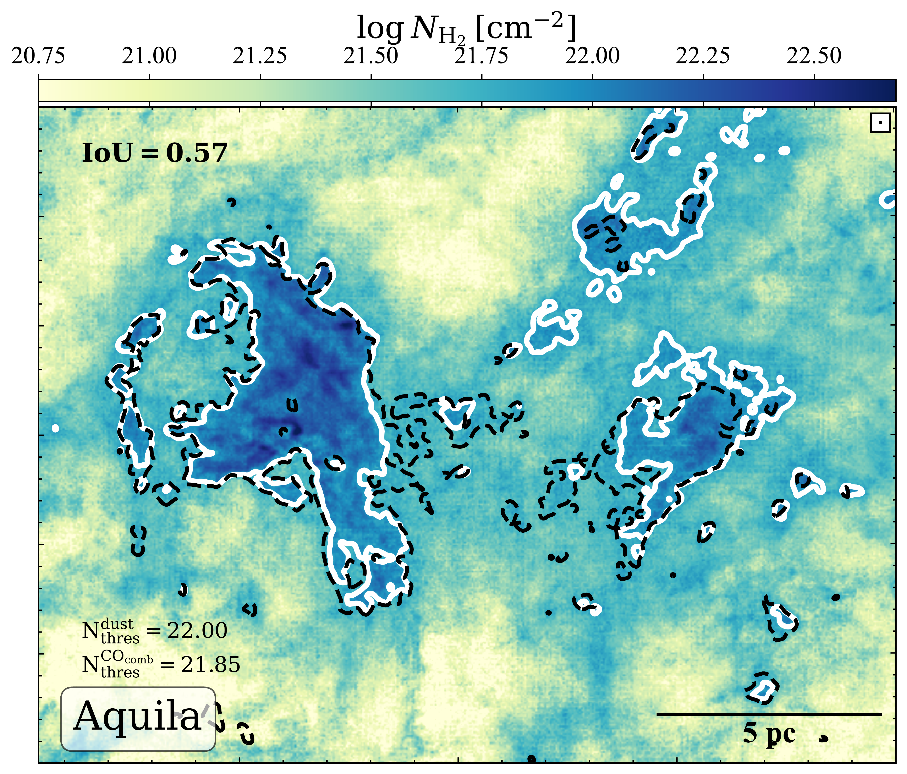
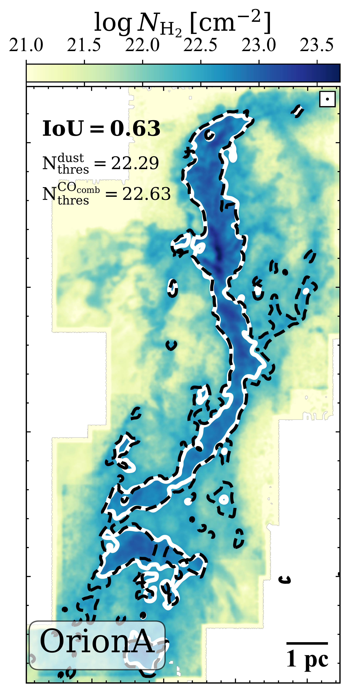
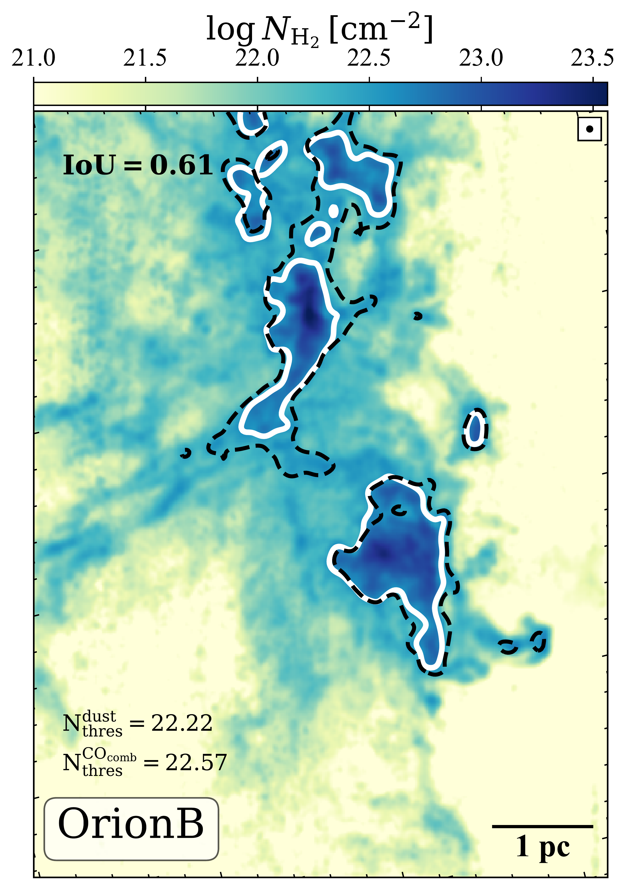
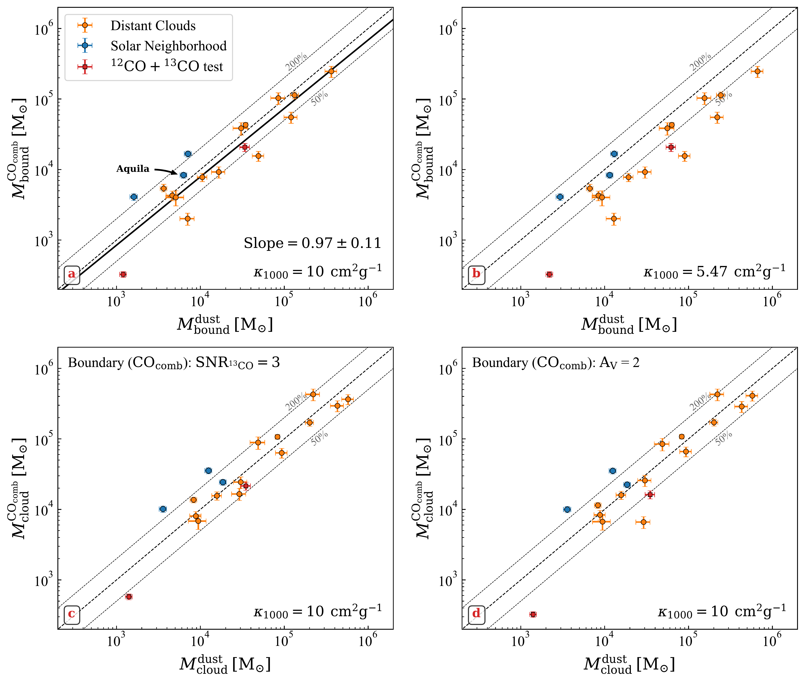
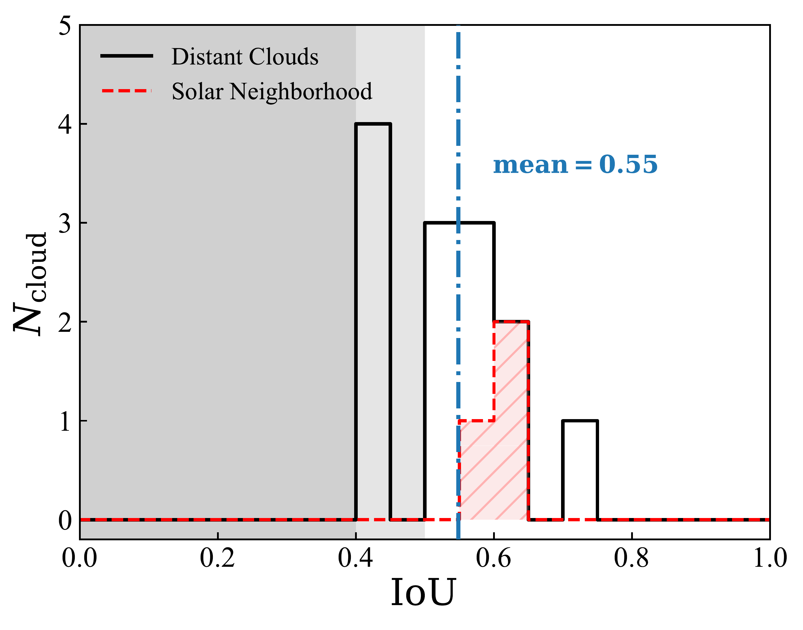

$\newcommand{\ensuremath}{}$
$\newcommand{\xspace}{}$
$\newcommand{\object}[1]{\texttt{#1}}$
$\newcommand{\farcs}{{.}''}$
$\newcommand{\farcm}{{.}'}$
$\newcommand{\arcsec}{''}$
$\newcommand{\arcmin}{'}$
$\newcommand{\ion}[2]{#1#2}$
$\newcommand{\textsc}[1]{\textrm{#1}}$
$\newcommand{\hl}[1]{\textrm{#1}}$
$\newcommand{\footnote}[1]{}$
$\newcommand{\fnote}[1]{{\bf\footnotesize \color{orange}[Feng: #1]}}$
$\newcommand{\jnote}[1]{{\bf\footnotesize \color{red}[Sihan: #1]}}$
$\newcommand{\Revise}[1]{{ #1}}$
$\newcommand{\YSnote}[1]{\textcolor{orange}{#1}}$
$\newcommand\green{#1 }$

# Trace the Self-Gravitating Gas Using CO Isotopologues

<mark>Appeared on: 2026-08-14</mark> -  _23 pages, 14 figures, accepted by ApJ_

L. Feng, et al. -- incl., <mark>S. Jiao</mark>

**Abstract:** Recent studies have shown that the star formation rate (SFR) correlates tightly and linearly with the mass of gravitationally bound gas, which can be delineated from the power-law tail of the column-density probability distribution function ( $N$ -PDF) derived from dust emission observations.This relationship holds across four orders of magnitude within the Milky Way—spanning low-mass to high-mass star-forming regions and encompassing the extreme environment of the Central Molecular Zone.Building on this framework, we present a new approach for estimating the mass of gravitationally bound gas in molecular clouds using multi-line CO isotopologue observations.Our sample includes 16 molecular clouds with robust detections in $^{12}$ CO, $^{13}$ CO, and C $^{18}$ O $J$ = 1-0, spanning both massive inner Galaxy clouds and nearby star-forming regions. We find that the $N$ -PDFs derived from combined CO isotopologue data recover the characteristic log-normal plus power-law profiles seen in dust-based studies.The mass and spatial distribution of the self-gravitating structures estimated from both dust-based and CO-based methods agree well throughout the sample. This indicates that the CO isotopologue combination can robustly trace the self-gravitating component via the $N$ -PDF method and provides a reliable, scalable, and velocity-resolved alternative to dust emission for identifying the star-forming gas in molecular clouds.

**Figure 9. -** 
    Maps of gas column density derived from the combined CO isotopologue lines for Aquila, OrionA, and OrionB. The black and white contours represent the self-gravitationally-bound structures identified using the dust-based and CO-based methods, respectively. The labeled IoU values quantify the degree of spatial overlap between the two contour sets in each region, indicating their morphological agreement in tracing gravitationally bound gas. (*fg_NH2map_nearby*)

**Figure 11. -** 
    Comparison of gas masses derived from our combined CO isotopologue method and from dust continuum emission.
    _ (a)_: Comparison of the gravitationally bound gas masses, $M_{\rm bound}^{\rm CO_{comb}}$ and $M_{\rm bound}^{\rm dust}$, adopting $\kappa_{1000}=10$ cm$^2$ g$^{-1}$ for the dust-based measurements.
    _ (b)_: Same comparison as panel _ (a)_, but adopting the lower dust opacity of $\kappa_{1000}=5.47$ cm$^2$ g$^{-1}$\citep[][]{Pontoppidan2024RNAAS...8...68P}.
    _ (c)_: Comparison of the total cloud masses, $M_{\rm cloud}^{\rm CO_{comb}}$ and $M_{\rm cloud}^{\rm dust}$, adopting $\kappa_{1000}=10$ cm$^2$g$^{-1}$. The cloud boundary in the $N_{\rm H_2}^{\rm CO_{\rm comb}}$ maps is defined by the 3$\sigma$ contour of $^{13}$CO.
    _ (d)_: Same as panel _(c)_, but adopting an $A_V=2$ cloud boundary for the $M_{\rm cloud}^{\rm CO_{comb}}$ calculation.
    Orange circles represent distant Galactic-plane clouds, blue hexagons denote solar-neighborhood clouds, and red squares indicate test cases adopting the $^{12}$CO+$^{13}$CO tracer pair (Appendix \ref{appendix_test12+13}). The dashed line marks the one-to-one relation, while the dotted lines indicate deviations of 50\% and 200\%.
    In panel _ (a)_, the black solid line shows the fit to the data, with its slope indicated in the lower-right corner.
     (*fg_result_distant*)

**Figure 3. -** 
    Distribution of the IoU values between the bound structures identified by the two methods. The black histogram shows the results for distant clouds, while the red histogram corresponds to solar neighborhood sources. The vertical dot-dashed blue line indicates the mean IoU value of 0.52, suggesting a generally good spatial correspondence between the two methods. The shaded gray areas mark typical IoU thresholds ($\geq$0.4 and $\geq$0.5) that are often used to judge whether two structures are considered a good match.
     (*fg_result_IOU*)

