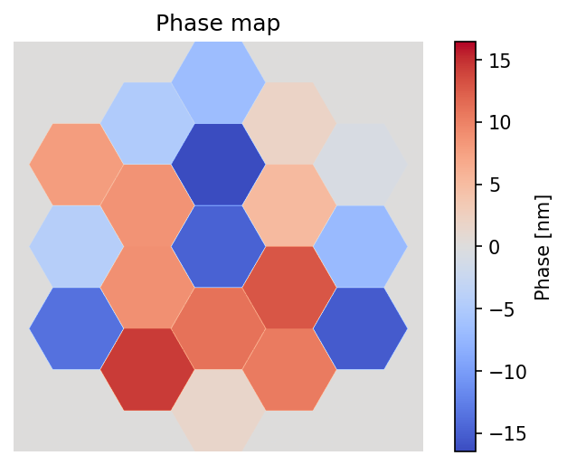
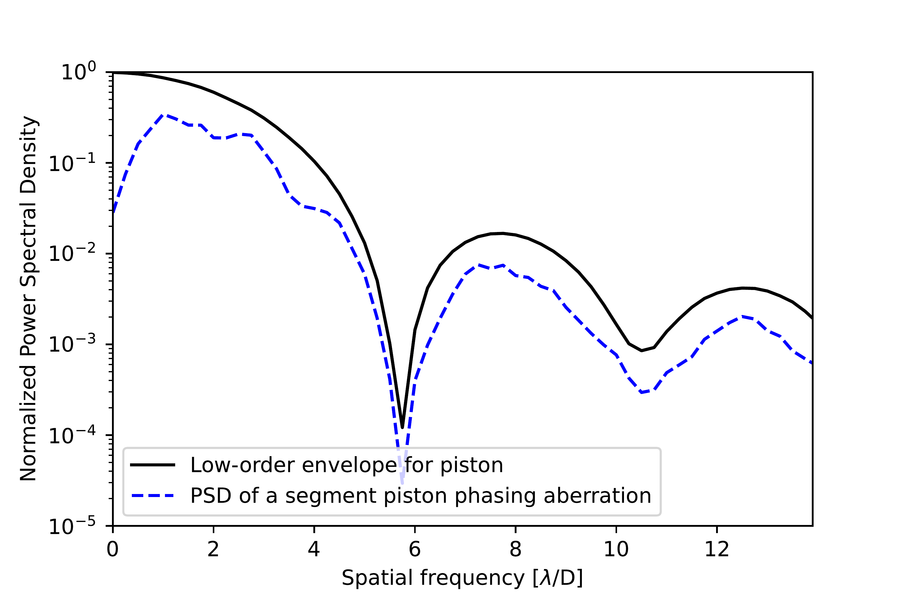
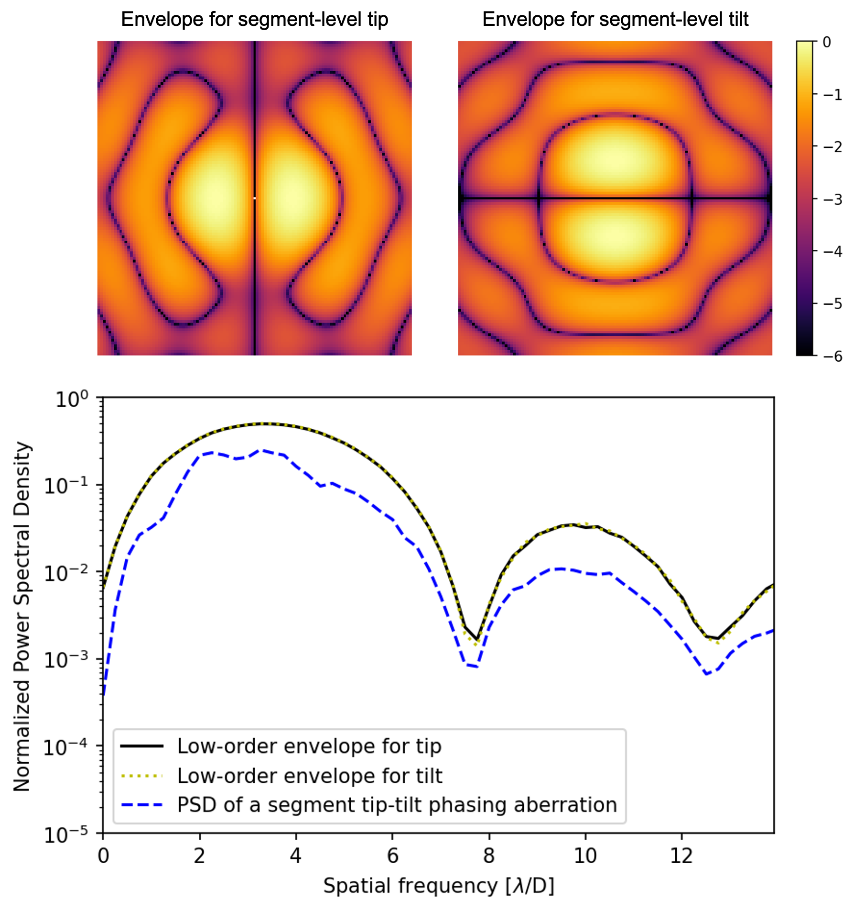
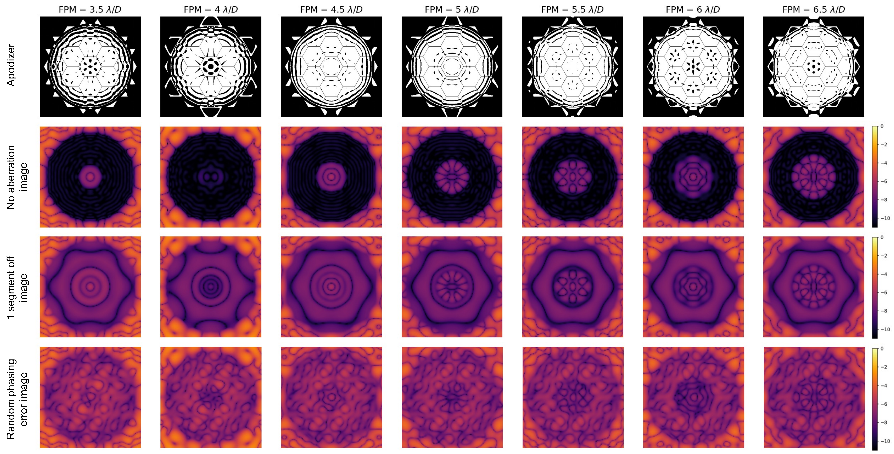

$\newcommand{\ensuremath}{}$
$\newcommand{\xspace}{}$
$\newcommand{\object}[1]{\texttt{#1}}$
$\newcommand{\farcs}{{.}''}$
$\newcommand{\farcm}{{.}'}$
$\newcommand{\arcsec}{''}$
$\newcommand{\arcmin}{'}$
$\newcommand{\ion}[2]{#1#2}$
$\newcommand{\textsc}[1]{\textrm{#1}}$
$\newcommand{\hl}[1]{\textrm{#1}}$
$\newcommand{\footnote}[1]{}$
$\newcommand{\todo}[1]{\textcolor{red}{[#1]}}$
$\newcommand{\todooliv}[1]{\textcolor{cyan}{#1}}$
$\newcommand\reallywidehat[1]{$
$\savestack{\tmpbox}{\stretchto{$
$  \scaleto{$
$    \scalerel*[\widthof{\ensuremath{#1}}]{\kern-.6pt\bigwedge\kern-.6pt}{\rule[-\textheight/2]{1ex}{\textheight}}$
$  }{\textheight}$
$}{0.5ex}}$
$\stackon[1pt]{#1}{\tmpbox}$
$}$

# Trade off between segment density and IWA for high-contrast imaging of exoplanets with a large segmented space mission

<mark>Appeared on: 2026-08-18</mark> -  _14 pages, 19 figures_

L. Leboulleux, <mark>R. Pourcelot</mark>, L. Pueyo, B. Nickson

**Abstract:** To image Earth-like exoplanets, the coronagraphs set up on future large space segmented telescopes such as the Habitable Worlds Observatory will need to access contrasts down to $10^{-10}$ at angular separations smaller than $100$ mas. This extreme requirement imposes an unprecedented constraint on segment phasing control, down to a few picometers. In this paper, we evaluate how this constraint can be released by optimizing several components of the telescope and instrument and quantifying their impact on the performance stability in the presence of segment phasing aberrations. We propose a system-level approach, with several parameters to adjust: the segmentation type of the primary mirror and the focal-plane mask size (or inner working angle). We compare the passive robustness to segment phasing errors of different systems, and the ability of a Zernike low-order wavefront sensor to reconstruct the aberrations and recover the target performance. Increasing the focal-plane mask radius or decreasing the number of segments across the pupil improves 1) the passive high-contrast performance robustness to segment-level errors: increasing the focal-plane mask radius from $3.5$ to $6.5\lambda/D$ relaxes phasing constraints by a factor of up to $4$ to maintain contrast near the IWA, and reducing the segment count from 85 (5 rings of segments) to 7 (1 ring of segments) relaxes them by a factor of up to $2$ ; and 2) the capability of the Zernike low-order wavefront sensor to reconstruct and correct for the errors, doubling its sensitivity to photon noise across the segment piston, tip and tilt modes (in our application case, increasing the focal-plane mask radius from $3.5$ to $6.5\lambda/D$ increases in average the segment mode coefficients by a factor $\sim 2$ ). The coronagraph focal-plane mask acts as a spatial high-pass filter whose cutoff frequency, set by its radius, determines which spatial frequencies of the segment phasing error power spectral density leak into the dark zone and which are detectable by the low-order wavefront sensor. Jointly optimizing the segmentation scheme and the focal-plane mask size, so that the low-order envelope of the power spectral density is blocked by the mask, can significantly relax segment phasing requirements, complementing active wavefront correction, with direct implications for the Habitable Worlds Observatory.

**Figure 2. -** Fig Power spectral density (PSD) of segment-level piston aberrations: (top) example of a segment phasing error map; (bottom) PSD of this phase map along with the PSF of a single segment. The low-order envelope of the PSD corresponds to the segment PSF. (*fig:Figure1_DSP*)

**Figure 3. -** Fig PSD of segment-level tip-tilt aberrations: (top) 2D low-order envelopes for tip and tilt, (bottom) 1D azimuthally averaged low-order envelopes for tip and tilt, together with the PSD of a random segment-level tip-tilt aberration, contained within these envelopes. (*fig:Figure2_TipTilt*)

**Figure 16. -** Fig The seven APLC designs and images, with FPM radii ranging from (left) $3.5$ to (right) $6.5 \lambda/D$: (row 1) apodizer mask solutions, (row 2) coronagraphic PSFs without aberrations, (row 3) coronagraphic PSFs with the central segment displaced by 1 nm, (row 4) coronagraphic PSFs with a 1 nm rms random phasing error. (*fig:Figure4_Coronos*)

