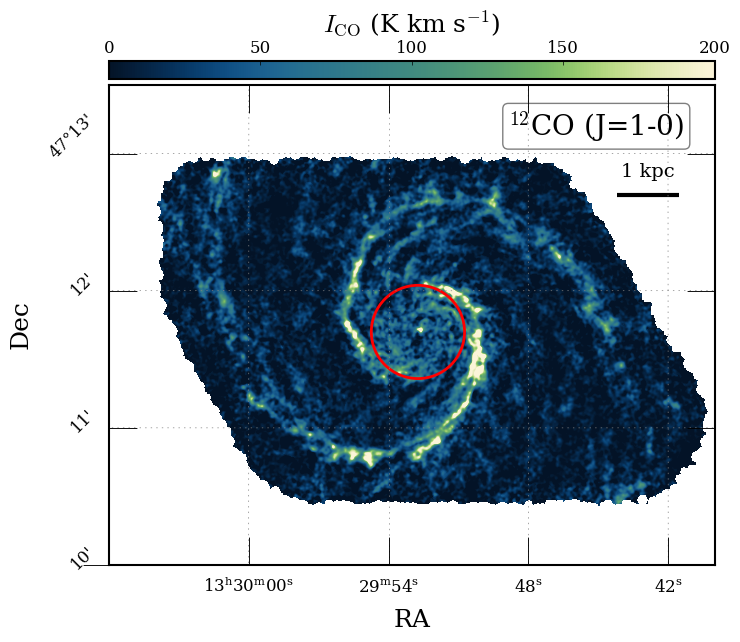
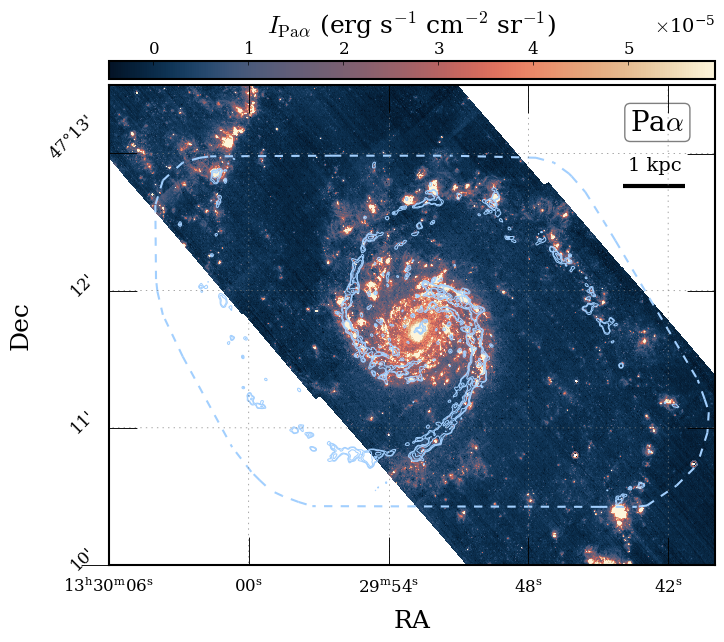
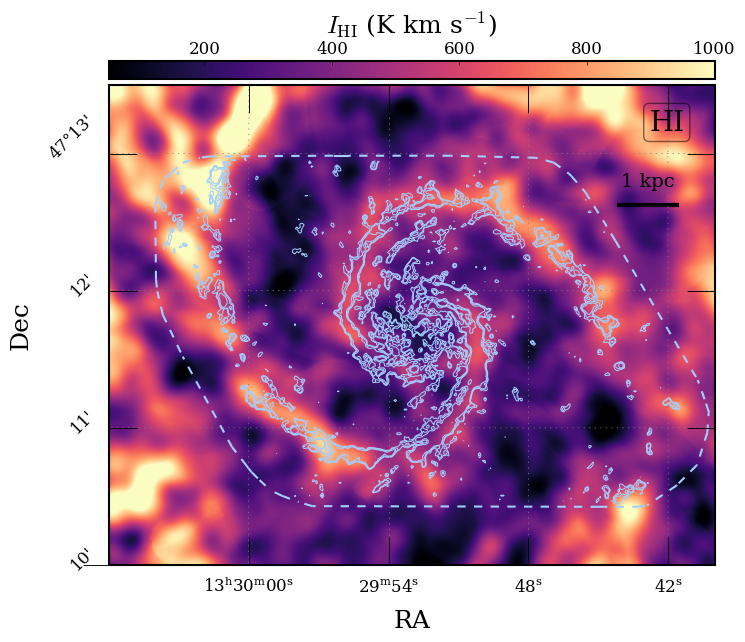
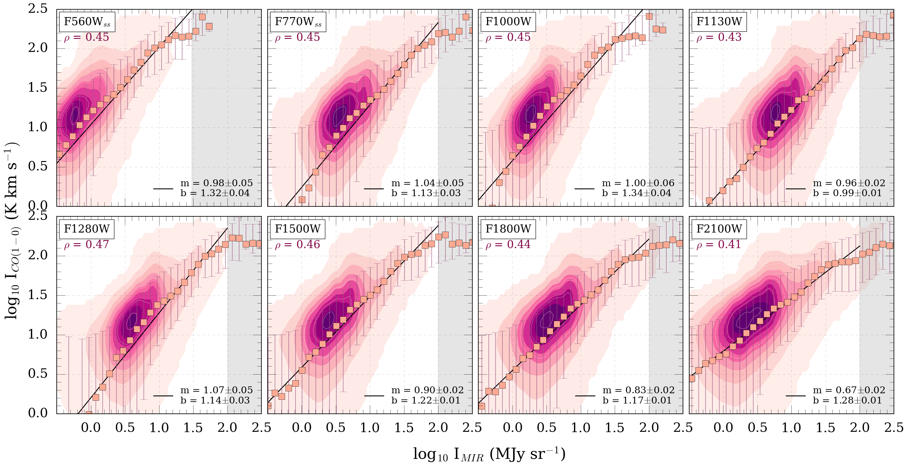
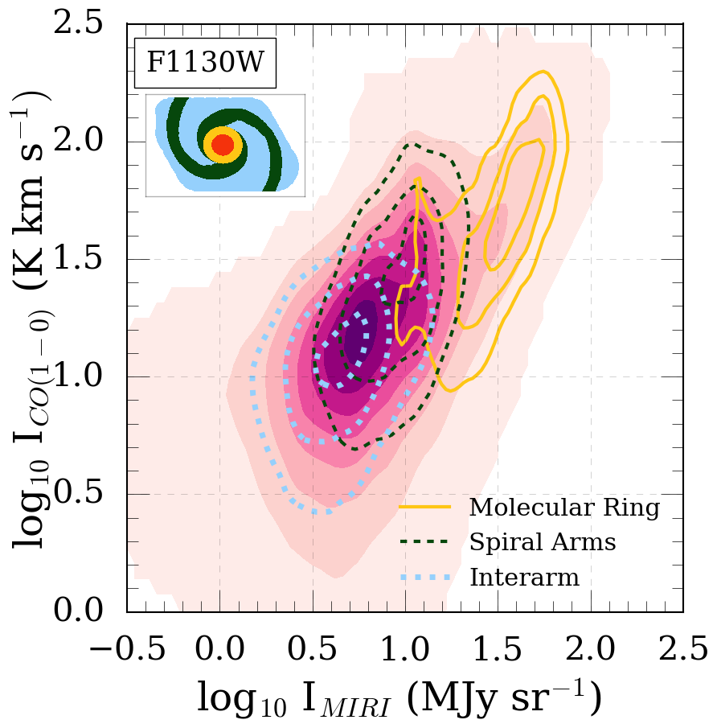
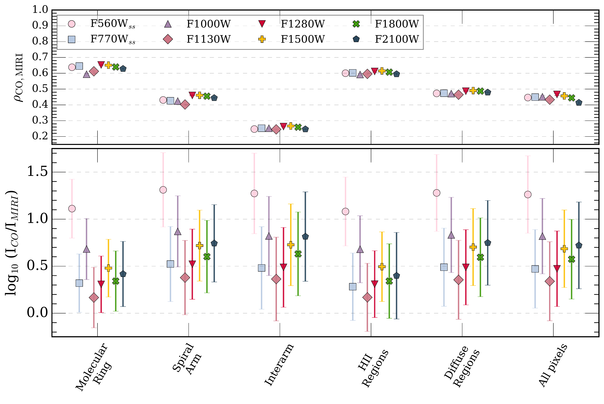

$\newcommand{\ensuremath}{}$
$\newcommand{\xspace}{}$
$\newcommand{\object}[1]{\texttt{#1}}$
$\newcommand{\farcs}{{.}''}$
$\newcommand{\farcm}{{.}'}$
$\newcommand{\arcsec}{''}$
$\newcommand{\arcmin}{'}$
$\newcommand{\ion}[2]{#1#2}$
$\newcommand{\textsc}[1]{\textrm{#1}}$
$\newcommand{\hl}[1]{\textrm{#1}}$
$\newcommand{\footnote}[1]{}$
$\newcommand{\vdag}{(v)^\dagger}$
$\newcommand\aastex{AAS\TeX}$
$\newcommand\latex{La\TeX}$
$\newcommand{\hi}{H {\small I}}$
$\newcommand{\hii}{H {\small II}}$
$\newcommand{\ha}{H\alpha}$
$\newcommand{\paa}{Pa\alpha}$
$\newcommand{\spr}{\rho}$
$\newcommand{\sighi}{\Sigma_{HI}}$
$\newcommand{\coone}{^{12}CO(1-0)}$
$\newcommand{\cotwo}{CO(2-1)}$
$\newcommand{\mjysr}{MJy~sr^{-1}}$
$\newcommand{\iffive}{I_{\rm F560W}}$
$\newcommand{\ifseven}{I_{\rm F770W}}$
$\newcommand{\ifthousand}{I_{\rm F1000W}}$
$\newcommand{\ifeleven}{I_{\rm F1130W}}$
$\newcommand{\iftwelve}{I_{\rm F1280W}}$
$\newcommand{\iffifteen}{I_{F1500W}}$
$\newcommand{\ifeighteen}{I_{\rm F1800W}}$
$\newcommand{\iftwoone}{I_{\rm F2100W}}$

# JWST Whirlpool Galaxy Treasury: Mid-Infrared Emission in M51 and its Relation to Gas Column and Star Formation

<mark>Appeared on: 2026-08-18</mark> -  _(Accepted for publication in ApJ)_

M. Padave, et al. -- incl., <mark>E. Schinnerer</mark>, <mark>F. Walter</mark>

**Abstract:** Using JWST/MIRI imaging of M51 in eight broadband filters, we investigate correlations of mid-infrared emission from polycyclic aromatic hydrocarbons (PAHs) and dust continuum with molecular, atomic, and ionized gas traced by $\coone$ , $\hi$ , and $\paa$ , respectively. In molecular gas-dominated regions, PAH-dominated filters (F560W, F770W, F1130W, F1280W) exhibit near-linear correlations with $\coone$ at $\sim40$ pc scale, indicating that PAHs are well-mixed with gas and experience relatively constant radiation field intensities.The F1500W, F1800W, and F2100W dust continuum-dominated filters show shallower slopes with $\coone$ reflecting contributions from star-forming regions with high radiation field intensities. This is reinforced by the near-linear scaling between F2100W and $\paa$ . PAH-dominated bands do not show this linear trend with $\paa$ , likely due to their destruction in ionized regions.F1000W behaves similarly to PAH bands in its correlations with $\coone$ and $\paa$ . Modeling mid-infrared emission with an empirical decomposition into gas- and star-formation–associated components shows that PAH-dominated filters receive comparable contributions from both, while the relative contribution associated with the $\paa$ template increases toward longer wavelengths, reaching $\sim$ 75 \% in F2100W. These results demonstrate that mid-infrared simultaneously traces the gas column and star formation, but with a systematic wavelength-dependent shift in what drives the correlations: PAHs being more gas-tracing and dust-continuum reflecting star formation. Lastly, considering both $\hi$ and $\ce{H2}$ at $\sim440$ pc resolution, we find a tight, $\sim$ linear relation between $\Sigma_{HI+H_2}$ and PAH-dominated filters. Although most of our coverage is in $\ce{H2}$ -dominated regions, we note similar observations with $\hi$ , suggesting that PAHs are also well-mixed with atomic gas.

**Figure 4. -** $\coone$, $\paa$, and $\hi$ maps of M51. The footprint of the $\coone$ map is marked on the $\paa$ and $\hi$ maps with contours at 20$\sigma$ overlaid in blue. The red circle in the $\coone$ map corresponds to the central region that is masked in our study.  (*fig:tracers*)

**Figure 5. -** $\coone$ intensity, I$_{\rm CO}$ as a function of I$_{\rm MIR}$ at 1.25$\arcsec$ resolution for a given MIRI band. The shaded contours represent data density contours enclosing the densest 15, 25, 50, 75, and 95\% of the data points. The MIRI filter and Spearman rank correlation coefficient, $\spr$ are noted on the top left corner of each panel. Pink squares and error bars represent the median and the 16-84\% range of $\coone$ intensity after binning the mid-IR intensity. The black line shows the line of best-fit for the binned data with the slope $m$, and intercept $b$ noted in the bottom right corner. The shaded region in each panel is excluded from any statistical analysis.  (*fig:co10-miri*)

**Figure 6. -** _ Left:_$I_{\rm CO}$ as a function of $\ifeleven$, with contours highlighting the distribution of pixels associated with distinct environments in M51: the molecular ring, spiral arms, and interarm regions. These environments are defined by the mask from [Colombo, Hughes and Schinnerer (2014)](), shown in the inset. _ Right:_ Variation in $\spr$(top) and CO-to-mid-IR median ratios (bottom) for each CO–mid-IR filter pair across environments. Each mid-IR filter is represented by a unique symbol within each environment. Error bars denote the uncertainties associated with each quantity. The filters are arbitrarily spaced along the horizontal axis in order of increasing wavelength.  (*fig:env*)

