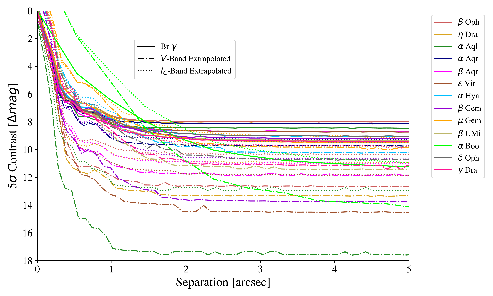
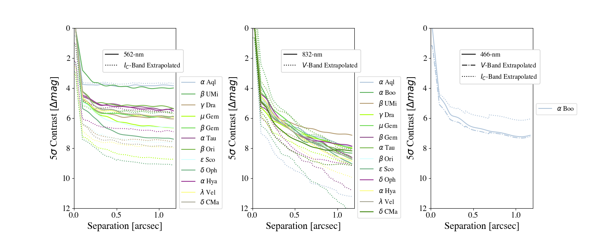
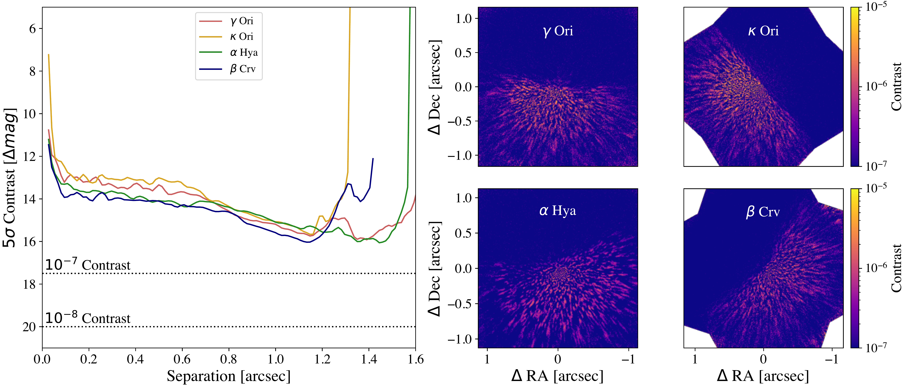

$\newcommand{\ensuremath}{}$
$\newcommand{\xspace}{}$
$\newcommand{\object}[1]{\texttt{#1}}$
$\newcommand{\farcs}{{.}''}$
$\newcommand{\farcm}{{.}'}$
$\newcommand{\arcsec}{''}$
$\newcommand{\arcmin}{'}$
$\newcommand{\ion}[2]{#1#2}$
$\newcommand{\textsc}[1]{\textrm{#1}}$
$\newcommand{\hl}[1]{\textrm{#1}}$
$\newcommand{\footnote}[1]{}$
$\newcommand{\baselinestretch}{1.0}$

# The Roman Coronagraph Community Participation Program: pre-launch reference star list and impact of reference star properties on post-processing performance$\footnote{This paper includes data gathered with the 6.5 meter Magellan Telescopes located at Las Campanas Observatory, Chile.}$

<mark>Appeared on: 2026-08-19</mark> -  _Submitted to SPIE Astronomical Telescopes and Instrumentation 2026, Space Telescopes and Instrumentation 2026: Optical, Infrared, and Millimeter Wave, Paper 14145-32, 20 pages, 10 figures_

J. Hom, et al. -- incl., <mark>W. Brandner</mark>, <mark>G. Chauvin</mark>, <mark>J. Li</mark>

**Abstract:** The upcoming Roman Coronagraph will be the first high-contrast instrument in space capable of high-order wavefront sensing and control technologies, a critical technology demonstration for the proposed Habitable Worlds Observatory (HWO) that aims to directly image and characterize habitable exoEarths. The nominal Roman Coronagraph observing plan involves alternating observations of a science target and a bright, nearby reference star for both wavefront calibration and reference differential imaging post-processing. Reference star criteria for the most demanding coronagraph mode are restrictive, limiting the sample to only 40 candidates for which thorough observational vetting is needed to assess their suitability. Reference star properties such as resolved diameters, presence of circumstellar dust, and close point sources may also have more subtle impacts on post-processing efficacy that may inhibit final contrast performance. In this work, we describe the current progress of the CoronaGraph Instrument Reference stars for Exoplanets (CorGI-REx) observing campaign, a $300+$ -hour observing campaign that utilizes instruments from around the world to vet reference stars for high-order wavefront control suitability. We will present the pre-launch list of reference star candidates being utilized for the Roman Coronagraph Observation Phase constructed from a thorough analysis of high contrast and interferometric observations. We will also present the results of simulations investigating the impact of reference star resolved diameters and companions on post-processing performance. We conclude by discussing the importance of reference star selection for scheduling observations and optimizing contrast performance for the Roman Coronagraph along with implications for HWO coronagraph operations.

**Figure 1. -** $5\sigma$ detection limit curves from PHARO observations of five reserve reference stars. The observations prioritized larger diameter stars that could be used for the CGI WFOV and SPEC modes. The dashed lines are extrapolations determined from the observed detection limits and the stellar distances assuming sensitivity to main sequence companions using colors from Pecaut \& Mamajek [Pecaut and Mamajek (2013)](https://ui.adsabs.harvard.edu/abs/2013ApJS..208....9P). (*fig:PHARO_curves*)

**Figure 2. -** $5\sigma$ detection limit curves from speckle observations of Band 3 and 4 reference stars. The dashed lines are extrapolations determined from the observed detection limits and the stellar distances assuming sensitivity to main sequence companions using colors from Pecaut \& Mamajek [Pecaut and Mamajek (2013)](https://ui.adsabs.harvard.edu/abs/2013ApJS..208....9P). (*fig:speckle_curves*)

**Figure 3. -** $5\sigma$ detection limits (left) and \texttt{pyklip}-reduced images (right) for the four MagAO-X targets observed. The reductions used 350 KL modes. These observations reach the deepest contrast limits possible (albeit only over a partial FOV) at wavelengths similar to Roman Coronagraph observing modes. (*fig:magaox*)

