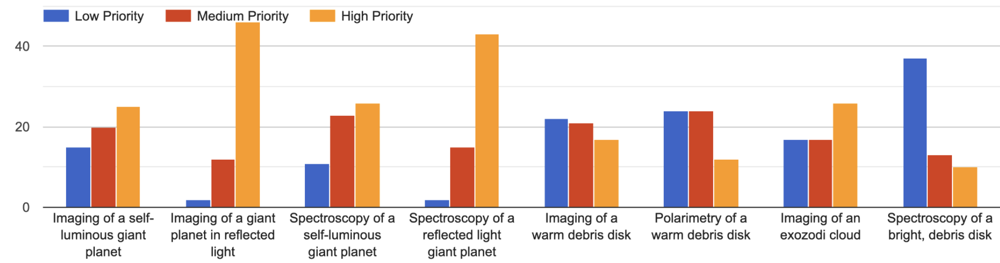
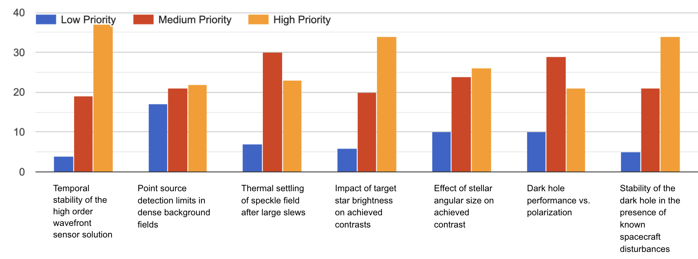

$\newcommand{\ensuremath}{}$
$\newcommand{\xspace}{}$
$\newcommand{\object}[1]{\texttt{#1}}$
$\newcommand{\farcs}{{.}''}$
$\newcommand{\farcm}{{.}'}$
$\newcommand{\arcsec}{''}$
$\newcommand{\arcmin}{'}$
$\newcommand{\ion}[2]{#1#2}$
$\newcommand{\textsc}[1]{\textrm{#1}}$
$\newcommand{\hl}[1]{\textrm{#1}}$
$\newcommand{\footnote}[1]{}$
$\newcommand{\baselinestretch}{1.0}$
$\newcommand{\arraystretch}{1.2}$
$\newcommand{\arraystretch}{1.5}$

# The Roman Coronagraph Community Participation Program: trials and triumphs of designing an observing program for a technology demonstration instrument

<mark>Appeared on: 2026-08-19</mark> -  _Submitted to SPIE Astronomical Telescopes + Instrumentation 2026 proceedings_

S. G. Wolff, et al. -- incl., <mark>G. Chauvin</mark>, <mark>M. Ravet</mark>

**Abstract:** The Coronagraph Instrument onboard the Nancy Grace Roman Space Telescope serves as a crucial technology pathfinder for the Habitable Worlds Observatory, with on-sky verification of high-contrast imaging techniques and the potential to image a Jupiter analog in reflected light for the first time. Together with the Roman Project Team, the Community Participation Program (CPP) is responsible for target selection, preparatory observations, developing an exposure time calculator, target database, data reduction pipeline, simulation tools, and engagement with the broader community. Here we present an overview of the CPP activities over the past two years with an emphasis on observation planning activities for the initial in-orbit checkout and the first six months of the observation phase. Finally, we present future opportunities for the astronomical community to interact with the data as it becomes public early in the mission.

**Figure 1. -** 2025 Community Interest Survey results showing the highest priority science (top) and technology demonstration (bottom) activities for the Roman Coronagraph from the 60 survey participants. Dark hole stability and imageing/spectroscopy of a reflected light planet were heavily favored.  (*fig:survey*)

