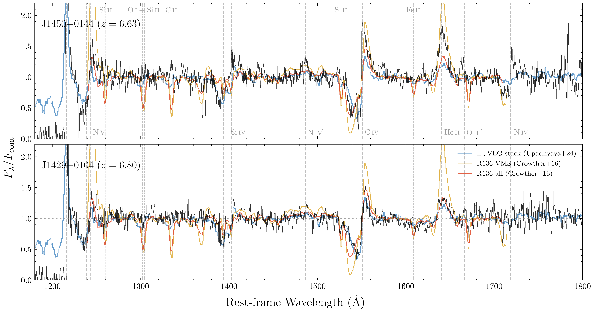
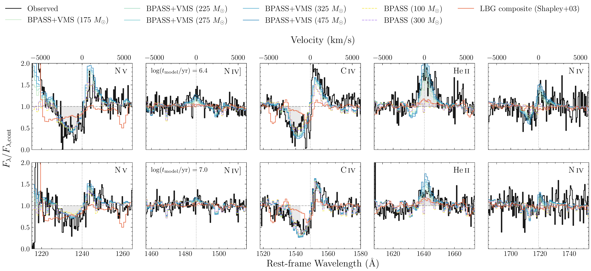
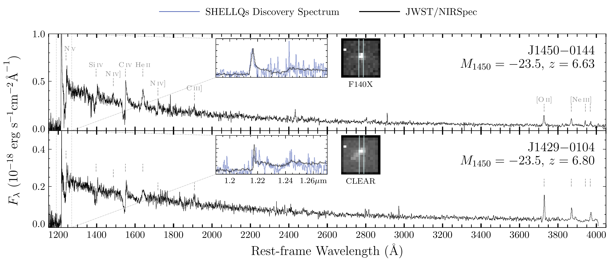

$\newcommand{\ensuremath}{}$
$\newcommand{\xspace}{}$
$\newcommand{\object}[1]{\texttt{#1}}$
$\newcommand{\farcs}{{.}''}$
$\newcommand{\farcm}{{.}'}$
$\newcommand{\arcsec}{''}$
$\newcommand{\arcmin}{'}$
$\newcommand{\ion}[2]{#1#2}$
$\newcommand{\textsc}[1]{\textrm{#1}}$
$\newcommand{\hl}[1]{\textrm{#1}}$
$\newcommand{\footnote}[1]{}$
$\newcommand{\todo}[1]{{\color{red} \tt[#1]}}$
$\newcommand{\arraystretch}{1.4}$
$\newcommand{\thebibliography}{\DeclareRobustCommand{\VAN}[3]{##3}\VANthebibliography}$
$\newcommand{\Oi}{O {\sc i}}$
$\newcommand{\Oiii}{O {\sc iii}}$
$\newcommand{\Hi}{H {\sc i}}$
$\newcommand{\Mgii}{Mg {\sc ii}}$
$\newcommand{\Civ}{C {\sc iv}}$
$\newcommand{\Siiv}{Si {\sc iv}}$
$\newcommand{\Nv}{N {\sc v}}$
$\newcommand{\Niv}{N {\sc iv}}$
$\newcommand{\Niii}{N {\sc iii}}$
$\newcommand{\Heii}{He {\sc ii}}$
$\newcommand{\Hii}{H {\sc ii}}$
$\newcommand{\Cii}{C {\sc ii}}$
$\newcommand{\Oiv}{C {\sc iv}}$
$\newcommand{\Sv}{S {\sc v}}$
$\newcommand{\Feii}{Fe {\sc ii}}$
$\newcommand{\Oii}{[O {\sc ii}]}$
$\newcommand{\Neiii}{[Ne {\sc iii}]}$
$\newcommand{\Ciii}{C {\sc iii}}$
$\newcommand\xhiz{\langle x_{\rm HI}(z)\rangle}$
$\newcommand\xhi{\langle x_{\rm HI}\rangle}$
$\newcommand{\ergs}{{\rm erg} {\rm s}^{-1}}$
$\newcommand{\msun}{{\rm M}_{\odot}}$
$\newcommand{\ysej}{J1429-0104}$
$\newcommand{\yswl}{J1450-0144}$
$\newcommand{\aa}{\text{Å}}$

# Quasar Impostors: Two Extremely UV-Bright ($M_{\rm UV}\approx-23.5$) Reionisation-Epoch Galaxies Powered by Very Massive Stars

<mark>Appeared on: 2026-08-20</mark> -  _18 figures, 4 tables. Submitted_

D. Yang, et al. -- incl., <mark>E. Bañados</mark>, <mark>S. Belladitta</mark>

**Abstract:** The extreme bright end of the galaxy UV luminosity function during reionisation remains poorly constrained, particularly where the galaxy and quasar luminosity functions overlap and source classification becomes ambiguous. We present _JWST_ /NIRSpec and ALMA Band-6 observations of J1450 $-$ 0144 ( $z=6.627$ ) and J1429 $-$ 0104 ( $z=6.796$ ), two $M_{\rm UV}\simeq-23.5$ sources originally classified as faint quasars by SHELLQs. NIRSpec reveals blue UV continua, strong P Cygni profiles in $\ion{N}{v}$ , $\ion{Si}{iv}$ , and $\ion{C}{iv}$ , broad $\ion{He}{ii}$ $\lambda1640$ emission with rest-frame equivalent widths of $8.8\pm1.2$ and $3.7\pm1.1$ Å, respectively, and narrow nebular lines, reclassifying both as extremely UV-luminous galaxies. Standard population-synthesis models cannot simultaneously reproduce the strong $\ion{He}{ii}$ and wind features, whereas models incorporating very massive stars (VMS; $M\gtrsim100 M_\odot$ ) with dedicated wind prescriptions can. These models favor a star-formation duration of $2$ -- $4$ Myr for J1450 $-$ 0144, with a broader allowed range for J1429 $-$ 0104, stellar masses of $\log(M_\star/M_\odot)\approx9.2$ -- $9.9$ , and star-formation rates of $\simeq300$ -- $540 M_\odot{\rm yr}^{-1}$ . Under the same VMS wind models, equivalent-width diagnostics imply $M_{\rm up}\gtrsim225 M_\odot$ for J1429 $-$ 0104, while J1450 $-$ 0144 lies beyond even the $M_{\rm up}=475 M_\odot$ grid. ALMA detects luminous [ $\ion{C}{ii}$ ] $158 \mu$ m emission in both systems, with $L_{\rm[CII]}\approx0.8$ and $4.1\times10^{9} L_\odot$ , respectively. J1429 $-$ 0104 additionally shows bright dust continuum, with both [ $\ion{C}{ii}$ ] and dust offset by $\sim5.4$ kpc from its UV emission. These sources demonstrate that VMS can power some of the most UV-luminous galaxies at cosmic dawn and show that source classifications, and hence the inferred demographics of both galaxies and quasars in the crossover regime, need revisiting.

**Figure 7. -** Rest-frame UV spectra of $\yswl$(top; $z=6.63$) and $\ysej$(bottom; $z=6.80$), each overlaid with the cosmic-noon EUVLG composite of [Upadhyaya, et. al (2024)](https://ui.adsabs.harvard.edu/abs/2024A&A...686A.185U)(blue), the stacked spectrum of the seven most massive stars ($M_{\rm init}\sim100$--$300 M_\odot$) in the R136 cluster (yellow) and the entire R136 (red) from [Crowther, et. al (2016)](https://ui.adsabs.harvard.edu/abs/2016MNRAS.458..624C). Black curves show the JWST/NIRSpec spectra for the two galaxies, smoothed with an inverse-variance-weighted 3-pixel window. All spectra are normalised by the local UV continuum. Key high-ionisation wind and nebular features are labelled. Both reionisation-epoch galaxies closely resemble the cosmic-noon EUVLG composite and the R136 VMS spectrum across the high-ionisation P Cygni lines. See Sect. \ref{sec:euvlg} for further discussion. (*fig:spec_compare_euvlg_r136*)

**Figure 14. -** 
    Comparison of the rest-frame UV spectra of $\yswl$(top row) and $\ysej$(bottom row) with BPASS population synthesis models including very massive stars, around the five key wind-line and emission diagnostics (left to right): $\Nv$$\lambda 1240$, N {\sc iv}]$\lambda 1486$, $\Civ$$\lambda 1550$, $\Heii$$\lambda 1640$, and N {\sc iv}$\lambda 1719$. Black curves show the observed spectra normalised by the local continuum. Coloured curves show BPASS+VMS models from [Upadhyaya, et. al (2024)](https://ui.adsabs.harvard.edu/abs/2024A&A...686A.185U), which incorporate the VMS stellar evolution and atmosphere models of [Martins and Palacios (2022)](https://ui.adsabs.harvard.edu/abs/2022A&A...659A.163M), with IMF upper-mass limits $M_{\rm up} = 175$, $225$, $275$, $325$, and $475 M_\odot$(light to dark blue), evaluated at the inferred ages of $\log(t/{\rm yr}) = 6.4$ for $\yswl$ and $7.0$ for $\ysej$ based on the right panel of Fig. \ref{fig:vms}. Dashed curves show standard BPASS models without VMS treatment for $M_{\rm up} = 100$(yellow) and $300 M_\odot$(violet). The orange curve is the composite LBG spectrum from [Shapley, et. al (2003)](https://ui.adsabs.harvard.edu/abs/2003ApJ...588...65S), shown for reference. Vertical dotted lines mark the systemic wavelengths of each transition. The BPASS+VMS models reproduce the P Cygni profiles in $\Nv$ and $\Civ$ and the broad $\Heii$$\lambda 1640$ emission, while standard BPASS and the LBG composite fall well short. $\yswl$ also shows clear broad N {\sc iv}]$\lambda 1486$ and N {\sc iv}$\lambda 1719$ emission predicted by the VMS models; in $\ysej$, these features are weaker.
     (*fig:vms_lines*)

**Figure 6. -** JWST/NIRSpec of $\yswl$(top, $z = 6.63$) and $\ysej$(bottom, $z = 6.80$), covering $\sim$1200--4000 Å in rest-frame. Black curves show the JWST/NIRSpec G140H$+$G235H spectra, blue curves in the inset show the original SHELLQs discovery spectra from GTC/OSIRIS and Subaru/FOCAS, respectively  ([Matsuoka, et. al 2018](https://ui.adsabs.harvard.edu/abs/2018PASJ...70S..35M), [Matsuoka, et. al 2022](https://ui.adsabs.harvard.edu/abs/2022ApJS..259...18M)) . Both sources exhibit the characteristic features of extreme UV-luminous star-forming galaxies: blue UV continua, prominent P Cygni profiles in the high-ionisation wind lines $\Nv$$\lambda1240$, $\Siiv$$\lambda1400$, and $\Civ$$\lambda1550$, broad $\Heii$$\lambda1640$ emission, absence of broad Ly$\alpha$ and $\Mgii$, and narrow nebular lines including $\Oi$i$\lambda\lambda3727,3730$ and $\Neiii$$\lambda\lambda3870,3969$. The inset images on the right show the NIRSpec WATA stamps ($1.6" \times 1.6"$) obtained with the F140X filter ($\yswl$) and CLEAR filter ($\ysej$). $\ysej$ shows extended morphology.  (*fig:spec_compare*)

