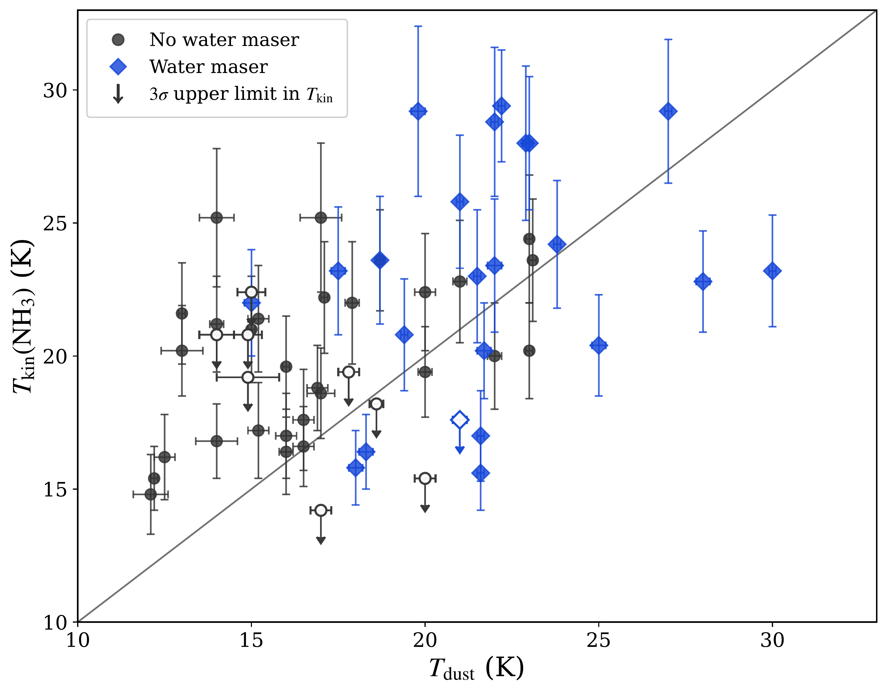
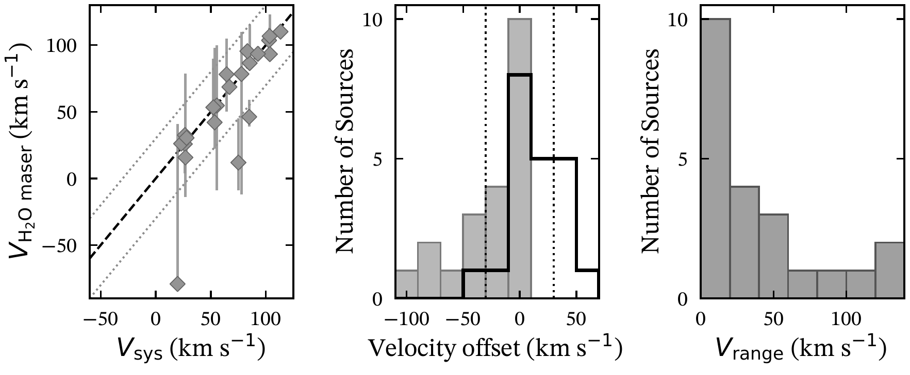
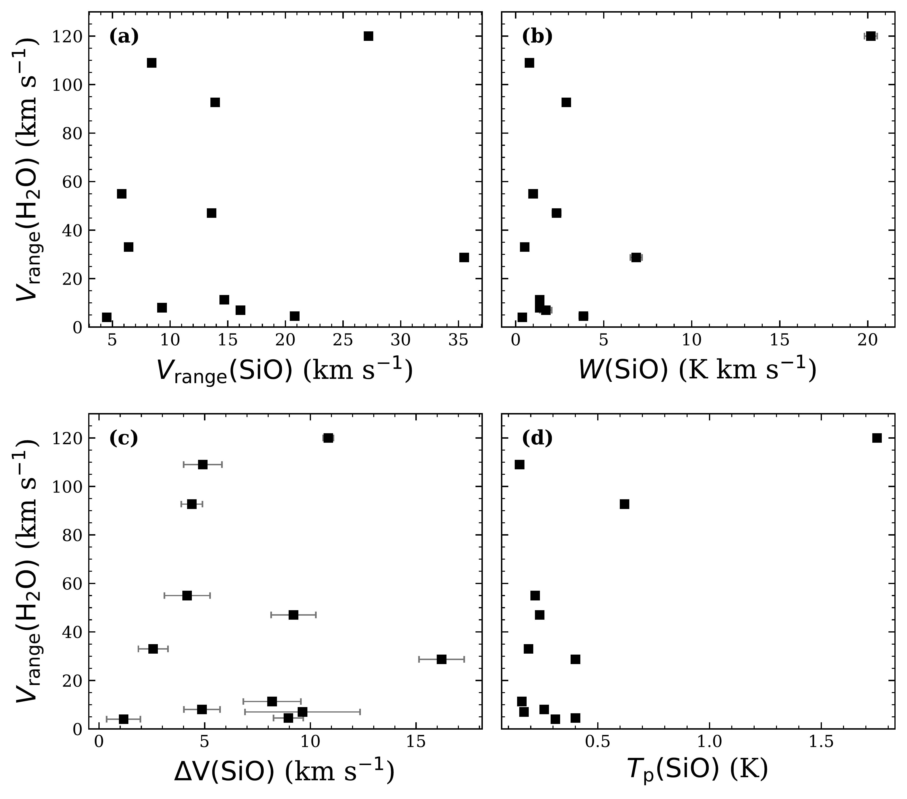

$\newcommand{\ensuremath}{}$
$\newcommand{\xspace}{}$
$\newcommand{\object}[1]{\texttt{#1}}$
$\newcommand{\farcs}{{.}''}$
$\newcommand{\farcm}{{.}'}$
$\newcommand{\arcsec}{''}$
$\newcommand{\arcmin}{'}$
$\newcommand{\ion}[2]{#1#2}$
$\newcommand{\textsc}[1]{\textrm{#1}}$
$\newcommand{\hl}[1]{\textrm{#1}}$
$\newcommand{\footnote}[1]{}$
$\newcommand{\arraystretch}{0.92}$
$\newcommand{\arraystretch}{0.58}$

# ALOHA IRDCs Molecular Line Follow-up: I. Gas properties and kinematics

<mark>Appeared on: 2026-08-21</mark> -  _11 pages, 3 figures, accepted for publication on A&A_

J. Xie, et al. -- incl., <mark>Y. Wang</mark>, <mark>F. Xu</mark>, <mark>S. Jiao</mark>, <mark>J. Li</mark>

**Abstract:** Infrared Dark Clouds (IRDCs) are ideal sites for investigating the initial conditions of massive star and cluster formation. The $_ A Lei Of the Habitat and Assembly of Infrared Dark Clouds_$ (ALOHA IRDCs), a James Clerk Maxwell Telescope (JCMT) Large Program, has mapped nearby IRDCs utilising the SCUBA-2 continuum camera at the highest achievable sensitivity. Complementary molecular line observations are needed to characterise the physical, kinematic, and chemical properties of the dense gas. We aim to determine the thermal, kinematic, and chemical properties of clumps identified in the ALOHA IRDCs, and to assess their evolutionary status and level of star-forming activity. We performed single-pointing K-band and W-band observations towards 56 ALOHA IRDCs clumps using the Effelsberg 100-m and Yebes 40-m telescopes, respectively. We derived NH $_{3}$ kinetic temperatures using the hyperfine group ratio (HFGR) method and identified infall and shock signatures from HCO $^+$ , H $^{13}$ CO $^+$ , SiO, and HNCO profiles. Water masers and NH $_{2}$ D emission were used as complementary tracers of chemical evolution and star formation. The clumps exhibit kinetic temperatures of 15--29 K. We detect $NH_2$ D emission towards 18 sources, with NH $_{2}$ D centroid velocities consistent with NH $_{3}$ , indicating both species trace the same dense gas component. More than half of the clumps display blue-asymmetric HCO $^+$ profiles, identifying them as infall candidates. Water masers are detected in 22 sources, showing prominent velocity ranges and variability. Broad SiO emission ( $\gtrsim20 \mathrm{km s^{-1}}$ ) indicates strong shocks, while narrower extents ( $\lesssim6 \mathrm{km s^{-1}}$ ) likely trace large-scale interactions or low-velocity shocks. The widespread infall signatures, shock tracers, masers, and NH $_{2}$ D emission suggest that relatively quiescent, chemically young material can coexist with dynamically active gas affected by early protostellar feedback, providing insight into the coupled physical and chemical evolution of massive IRDC clumps.

**Figure 1. -** Comparison between $NH_3$ kinetic temperatures and dust temperatures for the 56 ALOHA IRDCs clumps. For sources with multiple $NH_3$ velocity components, each component is plotted separately. Blue diamonds indicate sources associated with $H_2$O maser emission, while grey circles denote sources without maser detections. Open symbols with downward arrows represent the $3\sigma$ upper limits on $T_{\rm kin}(\mathrm{NH}_3)$. Error bars indicate the uncertainties in $T_{\rm dust}$ and $T_{\rm kin}(\mathrm{NH}_3)$. The dotted line marks equality between the gas and dust temperatures. (*fig:temperature*)

**Figure 2. -** Left panel: Comparison between $H_2$O maser velocities and systemic velocities inferred from NH$_{3}$(1,1). Grey diamonds show the peak velocity of the strongest maser component, and vertical grey segments show the full detected interval $[V_{\min},V_{\max}]$. The black dashed line marks $V(\mathrm{H_2O})=V_{\rm sys}$, and the grey dotted lines mark offsets of $\pm30 \mathrm{km s^{-1}}$. Middle panel: Distribution of the most blue- and red-shifted detected H$_{2}$O maser velocities relative to the systemic velocity. The filled grey histogram represents $V_{\min}-V_{\rm sys}$, and the black outlined histogram represents $V_{\max}-V_{\rm sys}$. The vertical dotted lines mark the high-velocity thresholds. Right panel: Distribution of the full maser velocity ranges ($V_{\rm range}=\left|V_{\max}-V_{\min}\right|$). (*fig:maservelocity*)

**Figure 3. -** Relationship between the $H_2$O maser velocity range and SiO shock properties for sources detected in both tracers, with $V_{\rm range}=|V_{\max}-V_{\min}|$. The panels show $V_{\rm range}({\rm H_2O})$ compared with (a) $V_{\rm range}({\rm SiO})$, (b) $W({\rm SiO})$, (c) $\Delta{\rm V}({\rm SiO})$, and (d) $T_{\rm p}({\rm SiO})$. Error bars indicate uncertainties in $W({\rm SiO})$ and $\Delta{\rm V}({\rm SiO})$. No statistically significant correlations are found.
 (*fig:H2OSiO*)

