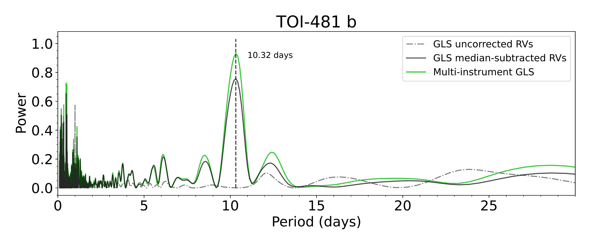

$\newcommand{\ensuremath}{}$
$\newcommand{\xspace}{}$
$\newcommand{\object}[1]{\texttt{#1}}$
$\newcommand{\farcs}{{.}''}$
$\newcommand{\farcm}{{.}'}$
$\newcommand{\arcsec}{''}$
$\newcommand{\arcmin}{'}$
$\newcommand{\ion}[2]{#1#2}$
$\newcommand{\textsc}[1]{\textrm{#1}}$
$\newcommand{\hl}[1]{\textrm{#1}}$
$\newcommand{\footnote}[1]{}$
$\newcommand{\vdag}{(v)^\dagger}$
$\newcommand\aastex{AAS\TeX}$
$\newcommand\latex{La\TeX}$

# A Multi-instrument Generalized Lomb-Scargle Periodogram Implementation

<mark>Appeared on: 2026-08-24</mark> -  _Accepted by the Research Notes of the American Astronominal Society_

<mark>G. Martos</mark>, N. Espinoza, J. Meléndez

**Abstract:** We present an implementation of the well-known and broadly used Generalized Lomb-Scargle Periodogram (GLS) which simultaneously takes into account individual offsets introduced in the data by different instruments: a "multi-instrument" GLS periodogram. While the algorithm itself is not new, the simple closed form implementation we provide, to our knowledge, is. We showcase an application of our multi-instrument GLS on radial-velocity data of the hot Jupiter TOI-481 b, whose period is recovered with a higher significance compared to the standard GLS approach. The code is available on GitHub.

**Figure 1. -** Comparison of the standard Lomb-Scargle periodogram (GLS) computed using the uncorrected and instrument-by-instrument median-subtracted data with the multi-instrument periodogram. (*fig:comparison*)

