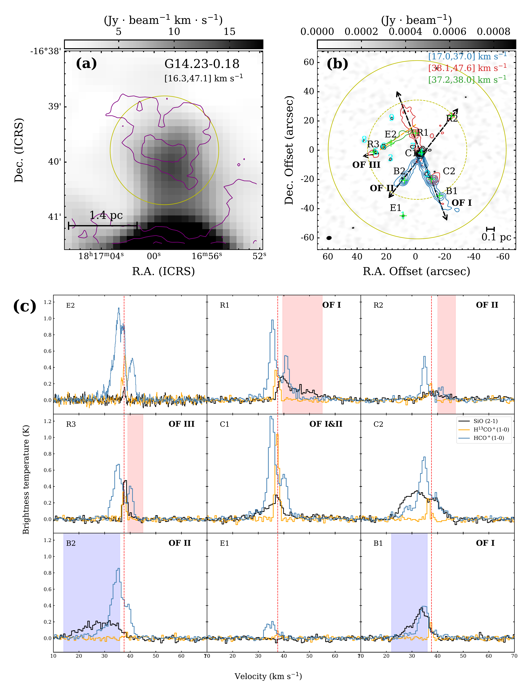
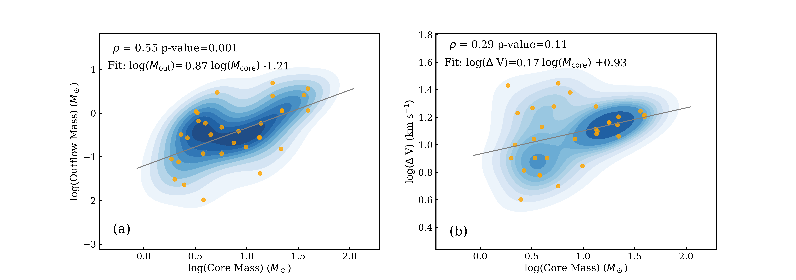
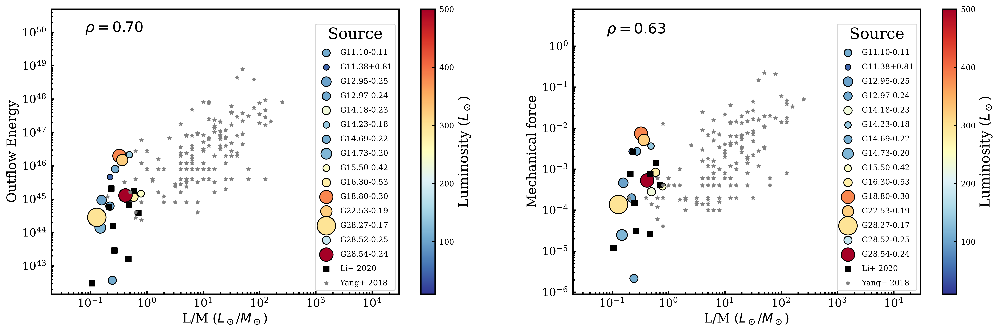

$\newcommand{\ensuremath}{}$
$\newcommand{\xspace}{}$
$\newcommand{\object}[1]{\texttt{#1}}$
$\newcommand{\farcs}{{.}''}$
$\newcommand{\farcm}{{.}'}$
$\newcommand{\arcsec}{''}$
$\newcommand{\arcmin}{'}$
$\newcommand{\ion}[2]{#1#2}$
$\newcommand{\textsc}[1]{\textrm{#1}}$
$\newcommand{\hl}[1]{\textrm{#1}}$
$\newcommand{\footnote}[1]{}$
$\newcommand{\vdag}{(v)^\dagger}$
$\newcommand\aastex{AAS\TeX}$
$\newcommand\latex{La\TeX}$
$\newcommand{\thetable}{A\arabic{section}}$
$\newcommand{\thetable}{A\arabic{table}}$
$\newcommand{\thefigure}{A\arabic{figure}}$

# MIAO-ALMA: Shocks and Protostellar Outflows in 70 $\mu$m-dark clumps with $L/M$ $<$ 1 $L_{\odot}$/$M_{\odot}$

<mark>Appeared on: 2026-08-25</mark> -  _21 pages, 6 figures. Accepted for publication in AJ_

Shuting~Lin, et al. -- incl., <mark>F. Xu</mark>, <mark>H. Beuther</mark>

**Abstract:** To investigate the initial conditions of high-mass star-forming regions, we use SiO (2–1) emission to trace early shock-related kinematics toward sixteen 70 $\mu$ m-dark and massive clumps with luminosity-to-mass ratios ( $L/M$ ) $< 1 L_{\odot}/M_{\odot}$ , as part of the Multiwavelength Line-Imaging Survey of the 70 $\mu$ m-dark and bright clouds (MIAO) project. Using ALMA observations at a spatial resolution of $\sim$ 0.06 pc and a velocity resolution of 0.21 km s $^{-1}$ , we identify a total of thirty-seven outflows with a variety of morphologies.Outflow parameters were derived by integrating the HCO $^+$ (1–0) line wings, excluding the quiescent dense core component traced by H $^{13}$ CO $^+$ (1–0).We find that outflow masses and velocities show moderate positive correlations with the masses of their driving cores.Owing to the high sensitivity of our observations, which yield longer projected outflow lengths compared to previous studies, the derived outflow dynamical ages span $\sim10^{3}$ – $10^{5}$ yr.We detect six narrow-linewidth (0.6–1.4 km s $^{-1}$ ) and three broad ( $>$ 2 km s $^{-1}$ ) SiO (2-1) features not associated with outflows driven by clearly identified protostars. Lacking coincident 3 mm dust continuum cores, their origins may be young  outflows from undetected low-mass protostars, dissipating shocks, cloud–cloud collisions, or projection effects when the outflows lie close to the plane of the sky.The detection of these shocks and outflows in such extremely young environments demonstrates that protostellar activity has already begun.

**Figure 15. -** Integrated intensity maps and line profiles of G14.23-0.18. (a) The greyscale map shows the SiO (2–1) emission observed with the ALMA TP at an angular resolution of 74.5$^{\prime\prime}$($\sim$ 1 pc). Purple contours indicate the 870 $\mu$m continuum emission from APEX \citep{Schuller2009A&A...504..415S}, starting from 6$\sigma$ and increasing by 6$\sigma$ steps, with an angular resolution of 18.2$^{\prime\prime}$. The yellow circle represents the 0.1 primary-beam response of the ALMA 12 m observations, corresponding to 122$^{\prime\prime}$. (b): SiO (2–1) emission (12m+7m+TP) overlaid on the 3.4 mm continuum grayscale map from the ALMA observation without primary-beam correction. The black contours trace the continuum emission, starting at 4$\sigma$ and increasing in steps of 2$\sigma$(1$\sigma = 4.3 \times 10^{-5}$ Jy beam$^{-1}$). Blue and red contours represent the integrated intensities of the blue- and redshifted SiO (2–1) emission, respectively, while the green contour marks the narrow-linewidth SiO component, with the velocity range labeled in the panel. The black dashed arrows indicate the outflow direction, while the orange dashed arrow marks the extended narrow-linewidth SiO component. Contours start at $4\sigma$ and increase in steps of $6\sigma$($1\sigma = 0.014$ Jy beam$^{-1}$ km s$^{-1}$ for the blue-shifted component, $1\sigma = 0.009$ Jy beam$^{-1}$ km s$^{-1}$ for the red-shifted component, and $1\sigma = 0.009$ Jy beam$^{-1}$ km s$^{-1}$ for the narrow component). The yellow solid circle is the same as that shown in panel (a), while the yellow dashed circle indicates the 0.5 primary-beam response of the ALMA 12 m observations (68$^{\prime\prime}$). The beam of the TP and the synthesized beam of the combined image are shown in panels (a) and (b), respectively. (c): Line profiles of SiO (2–1), HCO$^+$(1–0), and H$^{13}$CO$^+$(1–0), shown in black, blue, and orange, respectively, are extracted from a single synthesized beam-averaged region at different positions labeled in panel (b). "R" and "B" label the redshifted and blueshifted components, "C" represents the core, and "E" indicates emission with no coincident core ($<$ 0.1 pc). "OF I", "OF II", and "OF III" indicate the outflows we identified. All lines have a native velocity resolution of $\sim$ 0.21 km s$^{-1}$, which is used for panels (E2) showing narrow linewidth components ($<1.5$ km s$^{-1}$). For the other panels, the line profiles are smoothed to a velocity resolution of 0.63 km s$^{-1}$. The vertical red dashed line indicates the systemic velocity of clump (37.6 km s$^{-1}$, Table \ref{tab:clumps}). The blue and red windows indicate the velocity range integrated to estimate outflow parameters in Section \ref{subsec:Outflow_parameters}, excluding the velocity range associated with the central core. The complete figure set (15 images) is available in the online journal. (*fig:mom0_and_spectra_1*)

**Figure 18. -** (a) Core mass versus outflow mass, with the bivariate Gaussian kernel density estimate (KDE) shown as blue contour lines. (b) Core mass versus outflow velocity, with a bivariate KDE. The core mass is adopted from Feng (in preparation).
    In both panels, each orange dot represents an individual outflow, while the grey lines show the linear fits. The Spearman's rank correlation coefficient ($\rho$), the corresponding p-value, and the best-fit parameters are indicated in each panel. (*fig:outflow_corr1*)

**Figure 19. -** Outflow energy ($E_{\rm out}$) and outflow force ($F_{\rm out}$) are plotted against the $L/M$ ratio for each clump. Clump luminosities (color-coded) and masses (size-coded) for the sources in this work are adopted from \citet{Yuan2017ApJS..231...11Y}. The black squares indicate the sources from \cite{Li2020ApJ...903..119L}, and the gray stars indicate the sources from \cite{Yang2018ApJS..235....3Y}. The Spearman's rank correlation coefficients $\rho$ are provided in each panel. (*fig:corr_LM*)

