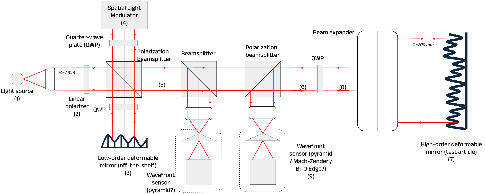

$\newcommand{\ensuremath}{}$
$\newcommand{\xspace}{}$
$\newcommand{\object}[1]{\texttt{#1}}$
$\newcommand{\farcs}{{.}''}$
$\newcommand{\farcm}{{.}'}$
$\newcommand{\arcsec}{''}$
$\newcommand{\arcmin}{'}$
$\newcommand{\ion}[2]{#1#2}$
$\newcommand{\textsc}[1]{\textrm{#1}}$
$\newcommand{\hl}[1]{\textrm{#1}}$
$\newcommand{\footnote}[1]{}$
$\newcommand{\baselinestretch}{1.0}$

# Development of an adaptive optics testbed at MPIA for the ELT/Planetary Camera and Spectrograph (PCS)

<mark>Appeared on: 2026-08-25</mark> -  _6 pages, 1 figure, SPIE Astronomical Telescopes + Instrumentation 2026_

<mark>R. Pourcelot</mark>, et al. -- incl., <mark>T. Bertram</mark>, <mark>P. Bizenberger</mark>, <mark>M. Feldt</mark>, <mark>S. Scheithauer</mark>, <mark>H. Steuer</mark>

**Abstract:** The Planetary Camera and Spectrograph (PCS) is a proposed second-generation instrument for the Extremely Large Telescope (ELT), dedicated to the direct imaging and characterization of exoplanets. To meet its demanding science requirements, PCS will incorporate an extreme adaptive optics (AO) system, building upon the heritage of existing ELT AO instruments such as ELT/METIS, as well as high-contrast AO systems at the ELT and the VLT, including SPHERE and its upcoming upgrade, SAXO+. PCS development requires extensive research and development to advance critical AO technologies. In this work, we present the Max Planck Institute for Astronomy (MPIA) plan for a modular testbed to validate key components and control strategies. This testbed will integrate two deformable mirrors, including a DM prototype developed by Bertin-ALPAO in collaboration with ESO, with an estimated delivery in 2029. The facility will enable testing of different Fourier filtering wavefront sensors, including novel mask designs, while exploring different control architectures, such as woofer-tweeter configurations with a single wavefront sensor for both deformable mirrors or fully independent AO stages. Additionally, the testbed will leverage MPIA’s expertise in real-time computer development to experiment with advanced control strategies, including predictive control and machine learning-enhanced AO techniques. This contribution presents the current status of PCS development at MPIA, highlighting the ongoing R \& D efforts to mature its AO system for high-contrast imaging with the ELT.

**Figure 1. -** Early draft of a possible layout for the MPIA to test the Bertin-Alpao 13k DM. Key components are numbered and described in the text. This version makes use of polarization components to simplify the number of optical elements. (*fig:testbed*)

