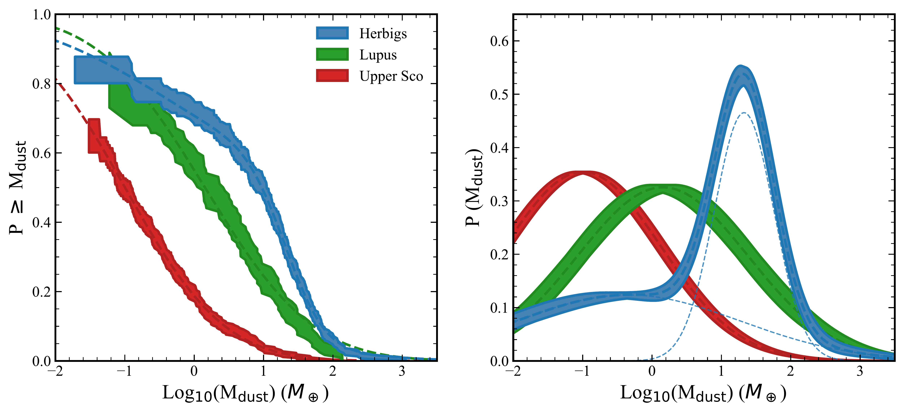
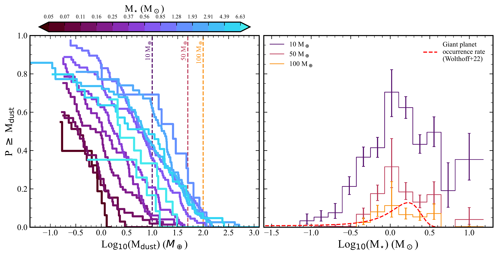

$\newcommand{\ensuremath}{}$
$\newcommand{\xspace}{}$
$\newcommand{\object}[1]{\texttt{#1}}$
$\newcommand{\farcs}{{.}''}$
$\newcommand{\farcm}{{.}'}$
$\newcommand{\arcsec}{''}$
$\newcommand{\arcmin}{'}$
$\newcommand{\ion}[2]{#1#2}$
$\newcommand{\textsc}[1]{\textrm{#1}}$
$\newcommand{\hl}[1]{\textrm{#1}}$
$\newcommand{\footnote}[1]{}$
$\newcommand{\Msun}{M_\odot}$
$\newcommand{\Mearth}{M_\oplus}$
$\newcommand{\thetable}{B.1}$
$\newcommand{\thetable}{B.2}$
$\newcommand{\thetable}{B.3}$
$\newcommand{\thefigure}{C.1}$
$\newcommand{\thefigure}{D.1}$
$\newcommand{\thefigure}{D.2}$

# An analysis of the Herbig star population and their protoplanetary disks within 1 kpc

<mark>Appeared on: 2026-08-26</mark> -  _Accepted for publication in Astronomy and Astrophysics. 19 pages, 11 figures, plus appendices_

L. M. Stapper, et al. -- incl., <mark>M. Benisty</mark>

**Abstract:** Herbig stars are intermediate mass pre-main sequence stars of 1.5 to $\sim15$  $\Msun$ and are in between low and high-mass star formation. Despite the giant exoplanet occurrence rate peaking at intermediate mass stars, a systematic analysis of the complete known Herbig star and protoplanetary disk population is lacking. This work provides a catalog of all 243 known bona-fide Herbig stars with clear infrared excess and in many cases accretion signatures within 1 kpc. It contains archival, recalibrated, and newly derived stellar parameters, accretion rate properties, and disk dust mass measurements. With these, we aim to examine the Herbig star relationship of the accretion rate against stellar and disk dust mass, get an estimate for the completeness of our catalog, and obtain an estimate for the Herbig star lifetime. These relationships and disk dust masses are put into the context of the T Tauri stars and the giant exoplanet population. We revise the stellar masses, radii, and ages using a Hertzsprung-Russell diagram, and compute new accretion rates for part of our sample. We derive dust masses for all targets using a combination of newly obtained millimeter photometry (60 \% of the targets) and literature values, from a combination of ALMA, ACA, SMA, and NOEMA data. We find that 50 \% of Herbig dust disks are more massive than 10 $\Mearth$ , while this is only true for 20 \% and 5 \% of the T Tauri disks in Lupus and Upper Scorpius respectively. Furthermore, the Herbig disk dust mass distribution is bimodal, it consists of a high and low disk mass population with a mean dust mass of 21 $\Mearth$ and 0.45 $\Mearth$ respectively.We find that the catalog is near complete for within 300 pc, however, this decreases to 24 \% out to 1 kpc. Hence, a large fraction of stars which meet our selection criteria are still missing. We also find a decreasing Herbig disk lifetime with increasing stellar mass of the form $t=12 \times M_\star^{-1.4}$ Myr.The bulk of the Herbig disks are above the T Tauri accretion rate -- disk mass relationship. We observe a flat relation for Herbig disks due to objects with short disk lifetimes, caused by a combination of low disk masses and high accretion rates.Lastly, we find the peak of the occurrence rate of massive (>10 $\Mearth$ ) disks to occur at $\sim$ 1-2 $\Msun$ stars, coinciding with the peak in occurrence rate of giant exoplanets. Furthermore, we find an increase of disk dust mass with stellar mass up to 1-2 $\Msun$ , and then a decrease with stellar mass, likely related to an increase in UV irradiation, multiplicity, and/or radial drift efficiency. Our catalog provides stellar parameters, accretion properties, and disk masses for 243 Herbig stars within 1 kpc. This catalog describes the properties of intermediate mass star formation. We find a direct link to the occurrence rate of massive disks with that of giant exoplanets. The small number of Herbig stars with low accretion rates ( $<10^{-8}$  $\Msun$ yr $^{-1}$ ) or low disk dust masses ( $\lesssim1$  $\Mearth$ ), combined with the lack of an age dependence in the disk dust mass distribution, suggests that the observed Herbig star population represents the surviving disk-hosting phase in the optically visible late stages of intermediate-mass star formation. We argue that this is either due to the formation of deep dust traps in these disks or replenishment by late-infall, or a combination of the two.

**Figure 11. -** The cumulative and probability dust mass distributions of the Herbig stars within 1 kpc, the Lupus star-forming region \citep{Manara2023} and the Upper Scorpius star-forming region \citep{Carpenter2025}. To obtain the probability distributions in the right panel, a lognormal Gaussian distribution has been fitted through the cumulative distributions in the left panel, as indicated by the dashed lines. For the Herbig sample a bimodal lognormal distribution is needed to fit the cumulative dust mass distribution. The two contributions have been plotted separately. (*fig:cdf_Mdust*)

**Figure 5. -** The images of all ALMA targets ordered by integrated flux (from top left to bottom right). The position of the Herbig star is indicated by the star. The scalebar indicates a size of 200 au. The color scale goes from $-1\times$rms to $100\times$rms. The location of the Herbig is highlighted with the star. The contours indicate 3, 5, and 10 sigma levels. Below the name of the target, the integrated flux and the spectral type are shown. The size of the beam is shown in the bottom left. (*fig:ALMA_gallery*)

**Figure 14. -** Cumulative dust disk mass distributions for different stellar mass bins (left), and the resulting fraction of disks per stellar mass bin larger than the disk mass as indicated in the left figure (right). The giant planet occurrence rate distribution of \citet{Wolthoff2022} is plotted for solar metallicity. The peak of the high disk mass occurrence rate coincides with that of the giant planet occurrence rate. (*fig:Mdisk_probability*)

