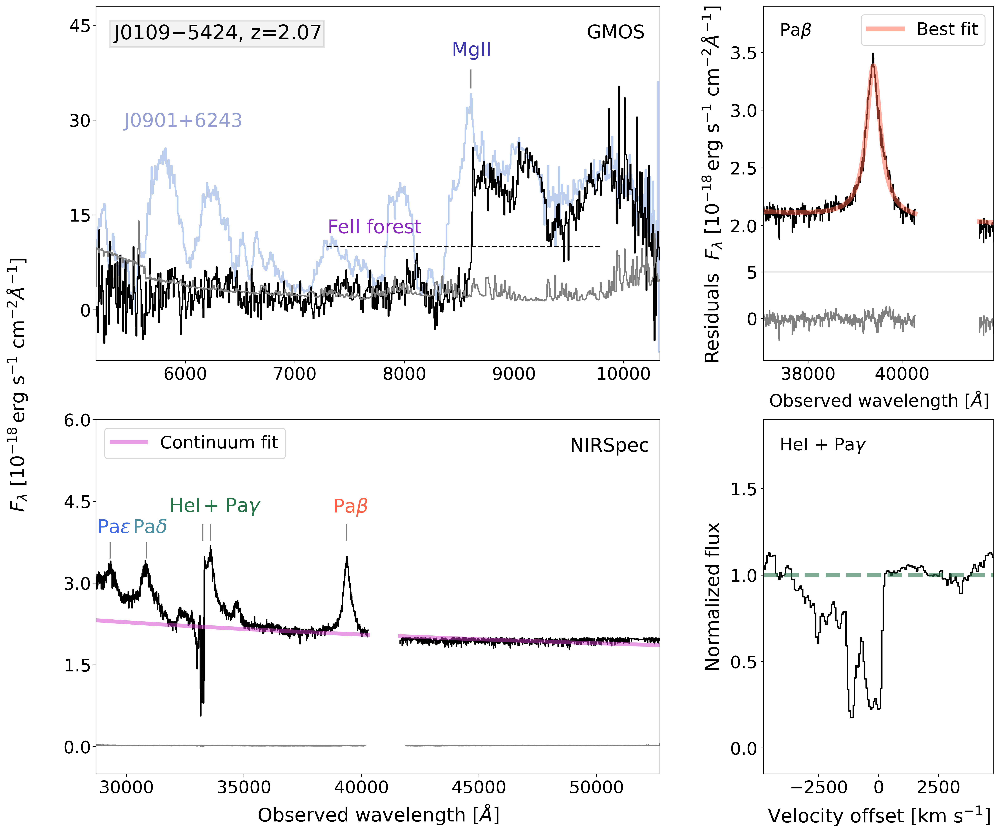
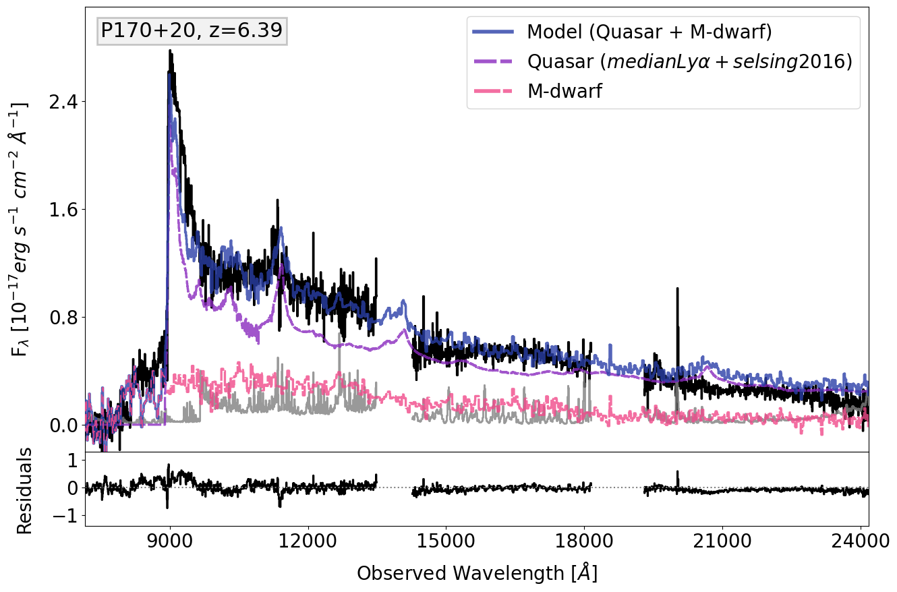
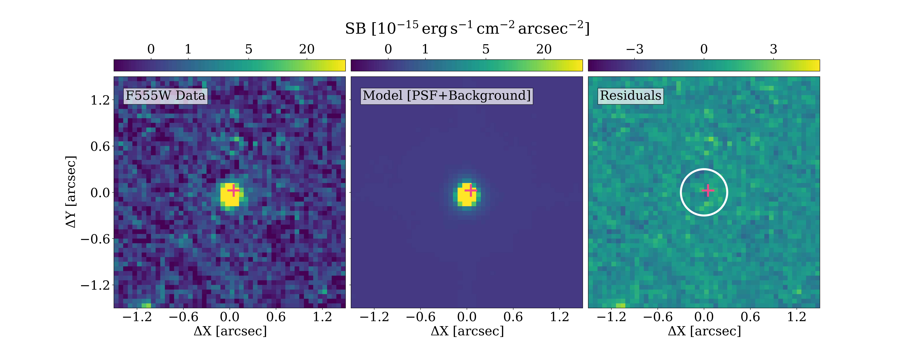

$\newcommand{\ensuremath}{}$
$\newcommand{\xspace}{}$
$\newcommand{\object}[1]{\texttt{#1}}$
$\newcommand{\farcs}{{.}''}$
$\newcommand{\farcm}{{.}'}$
$\newcommand{\arcsec}{''}$
$\newcommand{\arcmin}{'}$
$\newcommand{\ion}[2]{#1#2}$
$\newcommand{\textsc}[1]{\textrm{#1}}$
$\newcommand{\hl}[1]{\textrm{#1}}$
$\newcommand{\footnote}[1]{}$
$\newcommand{\vdag}{(v)^\dagger}$
$\newcommand\aastex{AAS\TeX}$
$\newcommand\latex{La\TeX}$
$\newcommand{\civ}{C\ensuremath{ \textsc{iv}}}$
$\newcommand{\mgii}{Mg\ensuremath{ \textsc{ii}}}$
$\newcommand{\hei}{He\ensuremath{ \textsc{i}}}$
$\newcommand{\cii}{C\ensuremath{ \textsc{ii}}}$
$\newcommand{\ciimu}{\lbrack C\ensuremath{ \textsc{ii}}\rbrack 158 \mum}$
$\newcommand{\hi}{H\ensuremath{ \textsc{i}}}$
$\newcommand{\caii}{Ca\ensuremath{ \textsc{ii}}}$
$\newcommand{\ha}{H\ensuremath{\alpha}}$
$\newcommand{\hb}{H\ensuremath{\beta}}$
$\newcommand{\nv}{N\ensuremath{ \textsc{v}}}$
$\newcommand{\lya}{Ly\ensuremath{\alpha}}$
$\newcommand{\lyb}{Ly\ensuremath{\beta}}$
$\newcommand{\paa}{Pa\ensuremath{\alpha}}$
$\newcommand{\pab}{Pa\ensuremath{\beta}}$
$\newcommand{\pag}{Pa\ensuremath{\gamma}}$
$\newcommand{\pad}{Pa\ensuremath{\delta}}$
$\newcommand{\pae}{Pa\ensuremath{\epsilon}}$
$\newcommand{\lsim}{\mathrel{\rlap{\lower 3pt \hbox{\sim}} \raise 2.0pt \hbox{<}}}$
$\newcommand{\gsim}{\mathrel{\rlap{\lower 3pt \hbox{\sim}} \raise 2.0pt \hbox{>}}}$
$\newcommand{\lsun}{{\rm L_\odot}}$
$\newcommand{\msun}{{\rm M}_\odot}$
$\newcommand{\msunyr}{{\rm M}_\odot{\rm yr}^{-1}}$
$\newcommand{\kms}{{\rm km} {\rm s}^{-1}}$
$\newcommand{\ergs}{\mathrm{erg} \mathrm{s}^{-1}}$
$\newcommand{\ergscm}{\mathrm{erg} \mathrm{s}^{-1} \mathrm{cm}^{-2}}$
$\newcommand{\ergscmarcsec}{\mathrm{erg} \mathrm{s}^{-1} \mathrm{cm}^{-2} \mathrm{arcsec}^{-2}}$
$\newcommand{\flya}{{\rm F}({\rm Ly}\alpha)}$
$\newcommand{\lfir}{{\rm L}_{\rm FIR}}$
$\newcommand{\llya}{{\rm L}({\rm Ly}\alpha)}$
$\newcommand{\lha}{{\rm L}({\rm H}\alpha)}$
$\newcommand{\mbh}{M_{\mathrm{BH}}}$
$\newcommand{\M1450}{{\rm M}_{\rm 1450}}$
$\newcommand{\Eratio}{\lambda_{\mathrm{Edd}}}$

# _To be lensed or not to be lensed_:\ on the nature of the alleged high-$z$ lensed quasars J0109--5424 and P170$+$20

<mark>Appeared on: 2026-08-27</mark> -  _Accepted for publication in the Astrophysical Journal, 10 pages, 4 figures_

A. Mata-Sanchez, et al. -- incl., <mark>E. Bañados</mark>, <mark>S. Belladitta</mark>, <mark>F. Davies</mark>, <mark>F. Walter</mark>

**Abstract:** We present a detailed multi-wavelength analysis of two gravitationally lensed $z>6$ quasar candidates: J0109--5424 and P170+20. Using JWST/NIRSpec near-infrared data from the _Aether_ survey, we demonstrate that J0109--5424 is in fact a FeLoBAL quasar at $z=2.07$ , exhibiting strong iron broad absorption lines that mimic the Lyman break. From the $\pab$ emission line, we estimate a black hole mass of $3.9\times10^8$ M $_{\odot}$ and a bolometric luminosity of $L_{\text{bol}} = 7.7 \times 10^{45} \text{erg s}^{-1}$ for this quasar.Follow-up HST/ACS WFC imaging of P170+20 with the F555W filter, probing emission below the Lyman limit of the quasar, reveals a compact source located $0.09\pm0.04\arcsec$ from the quasar position. PSF modelling and subtraction yield no evidence for extended emission. This is inconsistent with a foreground galaxy acting as a lens. Furthermore, we obtain $\mbox{Gemini-South/Flamingos 2}$ near-infrared observations to complement the existing optical Gemini-North/GMOS spectrum of P170+20. Our spectral analysis shows that the observed spectral shape of P170+20 is consistent with a composite quasar and M-dwarf spectrum. However, this interpretation remains uncertain, as a chance alignment between an ultracool dwarf and a quasar within $0.1\arcsec$ would be unlikely. Overall, our findings establish J0109--5424 as an intermediate redshift source and do not favor the lensed nature of P170+20, although this possibility cannot be conclusively ruled out, highlighting the challenges of selecting lensed quasars at high redshift.

**Figure 1. -** 
Quasar spectra of J0109--5424 obtained with GMOS and NIRSpec.
_Upper left Panel_: GMOS optical spectrum (black line) and associated error (gray line), with the $\mgii$  and iron absorption features disguised as a $\lya$  break at 8604 Å  labeled. The FeLoBAL J0901+6243 spectrum is over-plotted in light blue for comparison.
_Lower left Panel_: NIRSpec IFU spectrum (black line) and associated error (gray line), with the Paschen-series emission lines redshifted to $z = 2.07$ marked. The best-fit to the continuum is shown as a magenta line.
_Upper right Panel_: Zoom-in of the $\pab$  emission-line region. The best-fit model is shown in light red, and the residuals are displayed in the lower panel in gray.
_Lower right Panel_: Normalized flux of the $\hei$  and $\pag$  complex. The green dotted line indicates the normalized flux level of one as a reference. The velocity offset is computed relative to the redshift derived from the $\pab$  line. The BAL feature extends to velocities $\lesssim -2500  $\kms$$ relative to the quasar.
 (*fig:J0109spec*)

**Figure 3. -** Quasar spectrum of P170$+$20 obtained by combining the GMOS optical data, the LUCI1/LUCI2, and the Flamingos-2 near-infrared data.
_Upper panel_: The observed spectrum is shown in black, with the associated error vector in gray. The best-fit model, as described in \autoref{sec:nolens}, is shown in blue. It consists of an M-dwarf spectrum displayed in pink and the _median-$\lya$ _ + _Selsing2016_ quasar template shown in purple.
_Lower panel_: Residuals of the best-fit model. (*fig:P170+20spec*)

**Figure 2. -** GALFIT modelling of the foreground source of P170$+$20.
_Left Panel_: HST ACS/WFC F555W image. The magnitude of the point source is $m_{F555W} = 24.34$ mag.
_Middle Panel_: Best-fit model image, consisting of a single PSF component with background subtraction.
_Right Panel_: Corresponding residual map. The white circle marks an aperture with diameter of 0.5$\arcsec$  centered on the source. The pink cross marks the DESI quasar position in all panels. Virtually no emission from the quasar is expected at these wavelengths as it is below the Lyman limit of the source.
 (*fig:Galfit*)

