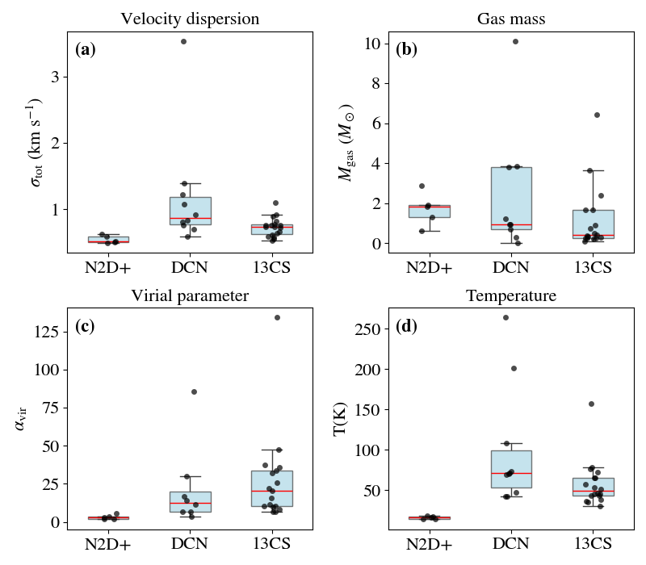
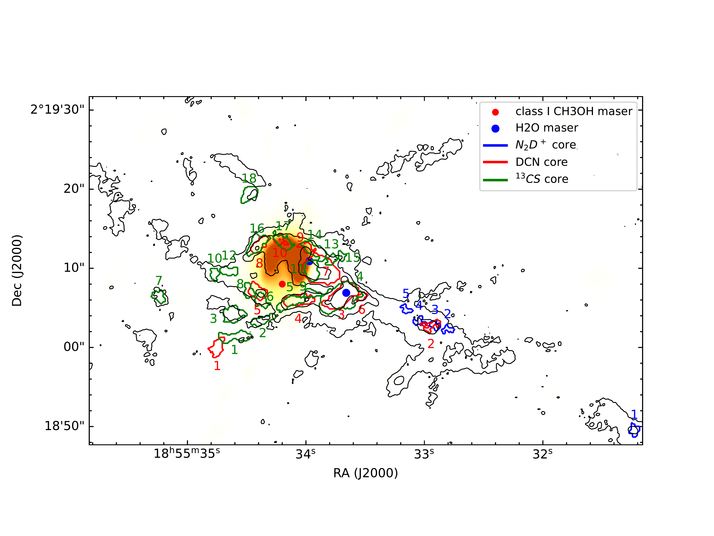
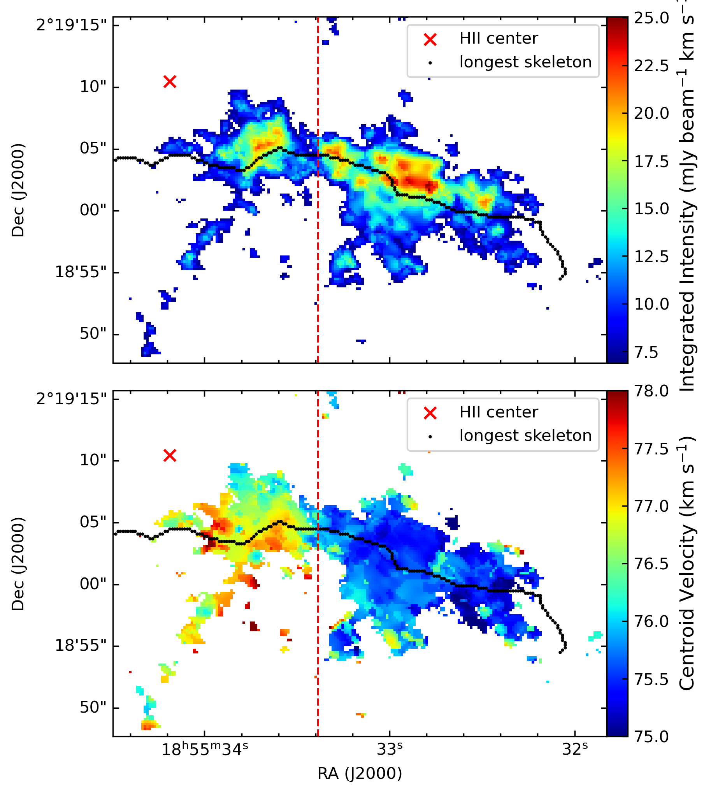

$\newcommand{\ensuremath}{}$
$\newcommand{\xspace}{}$
$\newcommand{\object}[1]{\texttt{#1}}$
$\newcommand{\farcs}{{.}''}$
$\newcommand{\farcm}{{.}'}$
$\newcommand{\arcsec}{''}$
$\newcommand{\arcmin}{'}$
$\newcommand{\ion}[2]{#1#2}$
$\newcommand{\textsc}[1]{\textrm{#1}}$
$\newcommand{\hl}[1]{\textrm{#1}}$
$\newcommand{\footnote}[1]{}$
$\newcommand{\rev}[1]{#1}$
$\newcommand{\rev}[1]{#1}$
$\newcommand{\kms}{\mbox{km s^{-1}}}$
$\newcommand{\hii}{\mbox{H {\sc ii}}}$
$\newcommand{\vlsr}{\mbox{V_\text{lsr}}}$
$\newcommand{\tcsff}{^{13}\mathrm{CS} (5--4)}$
$\newcommand{\tcs}{^{13}\mathrm{CS}}$
$\newcommand{\ntdptt}{\mathrm{N_2D^+} (3--2)}$
$\newcommand{\ntdp}{\mathrm{N_2D^+}}$
$\newcommand{\dcntt}{DCN (3--2)}$
$\newcommand{\@biblabel}[1]\makeatother$
$\newcommand\@makefntext[1]{$
$      \ifaa@longfn\hsize\textwidth\fi$
$      \noindent$
$      \hb@xt@\bibindent{\hss\@makefnmark\enspace}##1}$

# Dense Cores in the Vicinity of an $\hii$  Region

<mark>Appeared on: 2026-08-31</mark> -  _Accepted for publication in Astronomy & Astrophysics_

R. Zhang, et al. -- incl., <mark>S. Jiao</mark>, <mark>F. Xu</mark>

**Abstract:** Massive stars form in the densest part of molecular clouds and strongly influence their surroundings through radiative and mechanical feedback. The effects of such feedback on dense gas structures at sub-pc scales, however, remain to be better constrained by observations. We aim to investigate how feedback from a newly formed massive star affects the physical properties of dense cores embedded in a neighboring filamentary molecular cloud. We analyze ALMA Band 6 observations of the filamentary source IRAS 18530+0215 (I18530), including 1.3 mm dust continuum, molecular line emission from DCN, $\ntdp$ , and $\tcs$ , as well as complementary VLA K-band continuum and $NH_3$ meta-stable line observations. The dynamical state of the ultra-compact (UC) $\hii$ region is investigated through energy and pressure estimates. Dense cores traced by the line emission are identified using the _astrodendro_ algorithm, and their temperatures, masses, velocity dispersions, and virial parameters are derived from molecular line fitting and continuum emission. We further examine how the physical and kinematic properties of the dense cores vary under the influence of feedback from the $\hii$ region. The $\hii$ region has a radius of $\sim$ 0.1 pc and exhibits an expansion velocity of $\sim$ 2.5 $\kms$ , corresponding to a shell dynamical age of $\sim$ 0.06 Myr. DCN and $\tcs$ cores are primarily distributed in the vicinity of the $\hii$ region, whereas $\ntdp$ cores are preferentially found at larger distances. Overall, the temperatures and velocity dispersions of the dense cores show clear decreasing trends with increasing projected distance from the $\hii$ region. The virial parameters increase with projected distance within the inner $\sim0.3$ pc, but decline sharply beyond this scale, while the core masses show no significant variation with distance. Strong star formation signatures are found at projected distances of $\sim$ 0.2 pc from the $\hii$ region, whereas more distant regions still host quiescent, cold dense cores at earlier evolutionary stages. Our results suggest that the compact $\hii$ region is currently trapped or choked within a scale of $\sim0.1$ pc. Its feedback extends to at least $\sim0.3$ pc and is unlikely to significantly disrupt the entire filamentary structure on short timescales. Within the affected region, the feedback enhances the velocity dispersions, gas temperatures, and virial parameters of the dense cores, with no evidence that it promotes the formation of more massive dense cores.

**Figure 5. -** Panels a to d show the distributions of the total velocity dispersion, gas mass, virial parameter, and temperature for gas traced by $\ntdp$ , DCN, and $\tcs$ . In each panel, black points represent individual cores, while the boxplots summarize the corresponding distributions. The red line indicates the median value of each distribution. (*fig:Properties*)

**Figure 13. -** The background image shows the VLA 1.3 cm continuum. The black contours show the 1.3 mm continuum emission with levels of $(3, 15, 45)\times$RMS, where the RMS is 0.11 Jy beam$^{-1}$. The red dots indicate maser detections extracted from the MaserDB database, while the blue dots show the $H_2$O masers detected in our VLA K-band observations. (*fig:identify*)

**Figure 2. -** The integrated intensity (top; integrated from 73 to 81 km s$^{-1}$) and centroid velocity (bottom) map of the $NH_3$(1,1) main hyperfine component. The black curve indicates the filament skeleton identified by _FilFinder_, while the red cross marks the position of the $\hii$  region, derived from a 2D Gaussian fit to the VLA K-band continuum emission. The vertical red dashed line denotes the location corresponding to the velocity discontinuity seen in the PV diagram. (*fig:NH3 moment*)

