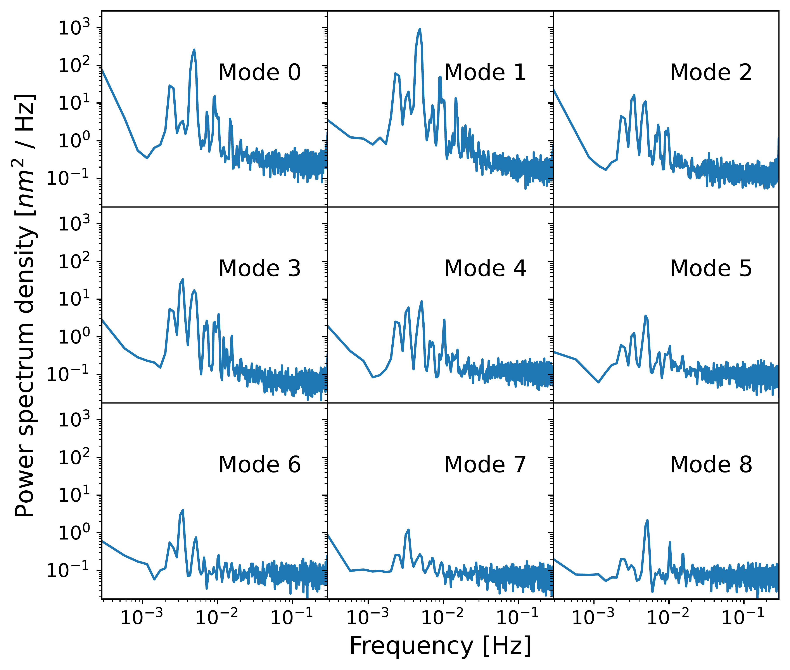
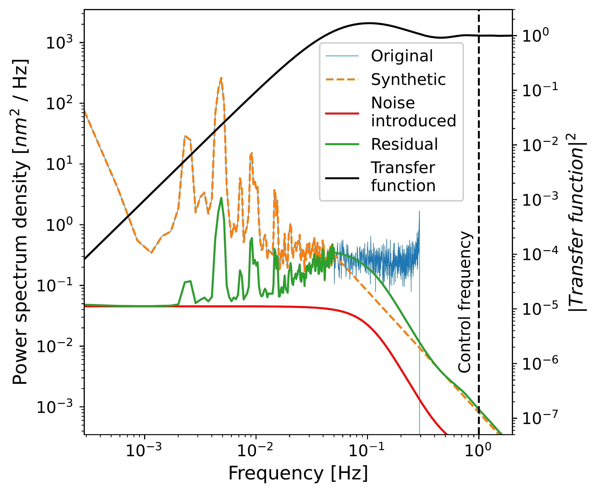
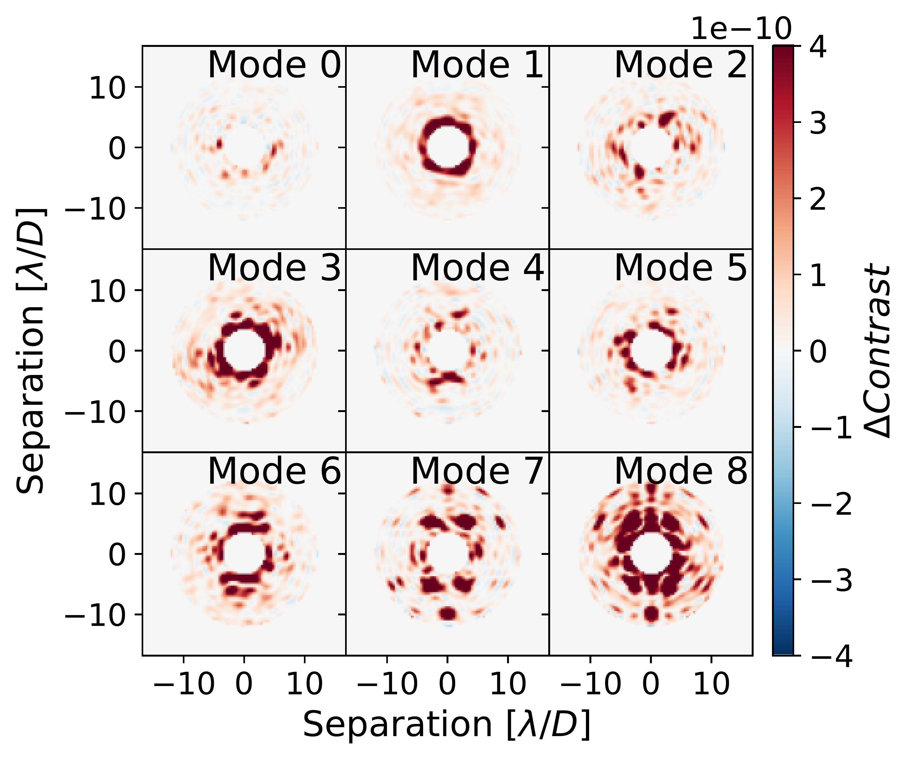
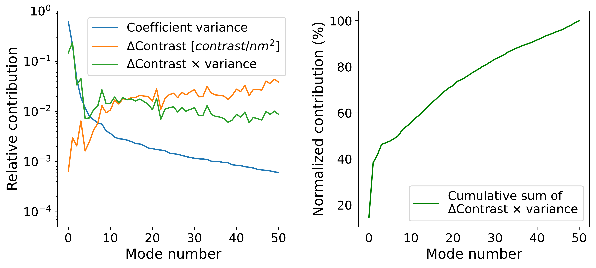
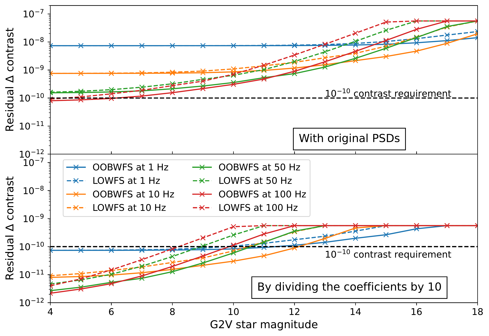

$\newcommand{\ensuremath}{}$
$\newcommand{\xspace}{}$
$\newcommand{\object}[1]{\texttt{#1}}$
$\newcommand{\farcs}{{.}''}$
$\newcommand{\farcm}{{.}'}$
$\newcommand{\arcsec}{''}$
$\newcommand{\arcmin}{'}$
$\newcommand{\ion}[2]{#1#2}$
$\newcommand{\textsc}[1]{\textrm{#1}}$
$\newcommand{\hl}[1]{\textrm{#1}}$
$\newcommand{\footnote}[1]{}$
$\newcommand{\lap}[1]{\textcolor{pink}{#1}}$
$\newcommand{\rev}[1]{\textcolor{magenta}{\textbf{#1}}}$
$\newcommand{\up}[1]{\textsuperscript{#1}}$
$\newcommand{\cftdotsep}{\cftnodots}$

# JWST telemetry combined with active coronagraphy: raw contrast predictions for exoplanet imaging with the Habitable Worlds Observatory

<mark>Appeared on: 2026-08-31</mark> -  _24 pages, 9 figures_

<mark>R. Pourcelot</mark>, et al.

**Abstract:** We provide a quantification of the technological gap between the James Webb Space Telescope (JWST) and the Habitable Worlds Observatory (HWO) for the goal of exo-Earth imaging around Sun-like stars at the $10^{-10}$ raw contrast level. We use JWST's in-flight telemetry of the primary segmented mirror to simulate a JWST-like telescope equipped with a modern coronagraph instrument, inspired by the Roman Space Telescope (RST) Coronagraphic Instrument (CGI), featuring an Apodized Pupil Lyot Coronagraph and active deformable mirror wavefront control on a segmented, unobstructed, off-axis telescope. We show that it can achieve $\sim10^{-10}$ raw contrast for very bright stars (brighter than magnitude 4) for fast control frequencies of 100 Hz, but that this level of control still lacks sufficient signal to correct JWST-amplitude errors for fainter stars. We show that an improvement of a factor of ten in wavefront stability is sufficient to extend this capability to a $10^{-10}$ raw contrast across all considered control frequencies (1 Hz to 100 Hz), assuming no reaction wheel vibrations, for stars up to a magnitude of 11. These results establish a new quantitative benchmark linking JWST's demonstrated thermo-mechanical stability to HWO's requirements, showing that active wavefront control relaxes the structural stability demands on the observatory, and identifying wavefront stability as the critical technological gap that must be closed for HWO to achieve its exo-Earth imaging goals.

**Figure 2. -** Example of PSD and control loop rejection used in the simulations. **Left**: PSD of the first 9 SVD modes as obtained by the projection of the time series onto the SVD modes. **Right**: Example processing of a modal PSD. The blue curve is the PSD of the first SVD mode. The orange curve represents the synthetic approximation and extrapolation with a power law with a -2 power. Assuming a control with a pure integrator with a gain of 0.3 running at 5 Hz and one frame of pure delay, the black curve represents the square modulus of the transfer function. Considering a G2V star of magnitude 12, observed at 575 nm with a 20 nm band, the red curve represents the noise on this mode introduced by the propagation of the photon noise in the loop. Finally, the green curve represents the residual PSD filtered by the control loop, and is obtained by multiplying the synthetic PSD by the transfer function and adding the noise.  (*fig:psd_world*)

**Figure 8. -** Representations of the impacts of the $(\Delta E_i)$ modes on the coronagraphic images. **Left**: Representation of the $\Delta C$ for the first 9 modes of the SVD. To isolate the exact contribution, we plot here the difference between the aberrated dark hole $|\Delta E_{seg, i} + E_0|^2$ with the unaberrated dark hole $|E_0|^2$. The wavefront aberrations are normalized to 40 pm RMS. **Middle**: Variance (blue), delta contrast integrated over the dark zone (orange) and product of both (green) per mode, all normalized by the sum of the corresponding quantity over all the modes. **Right**: Cumulative sum of the product of the variance by the delta contrast, in percentage of the sum over all the modes. (*fig:contrast_contributions*)

**Figure 9. -** Simulation results presented as the spatially averaged contrast in the integrated dark zone as a function of stellar magnitude, for a LOWFS (dashed lines), and an out-of-band WFS (solid lines), running at 1 Hz, 10 Hz, 50 Hz or 100 Hz. **Top**: the PSDs used are unscaled from JWST. **Bottom**: the coefficients divided by 10. (*fig:results*)

