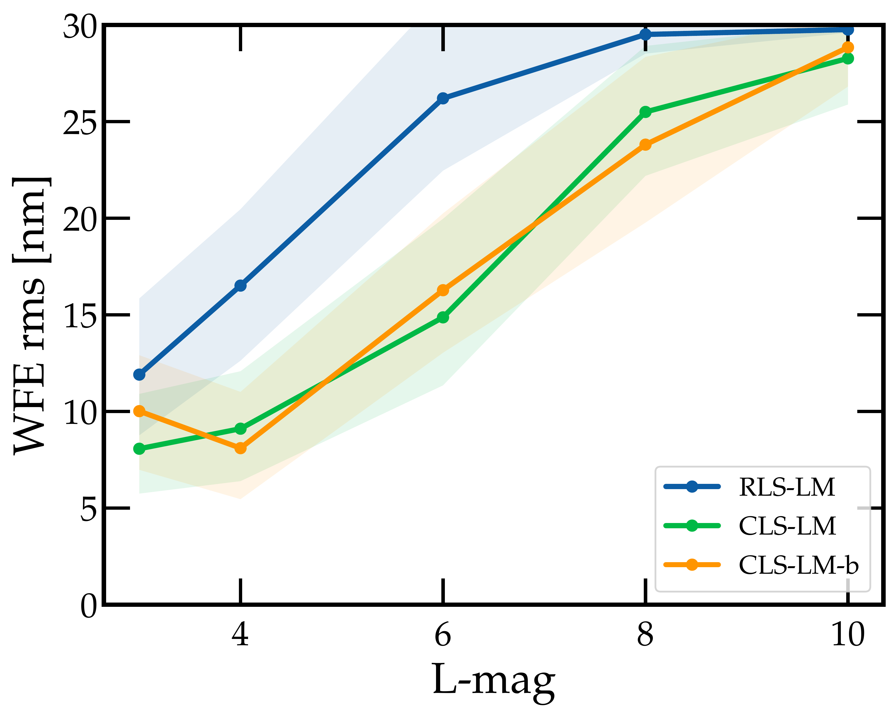
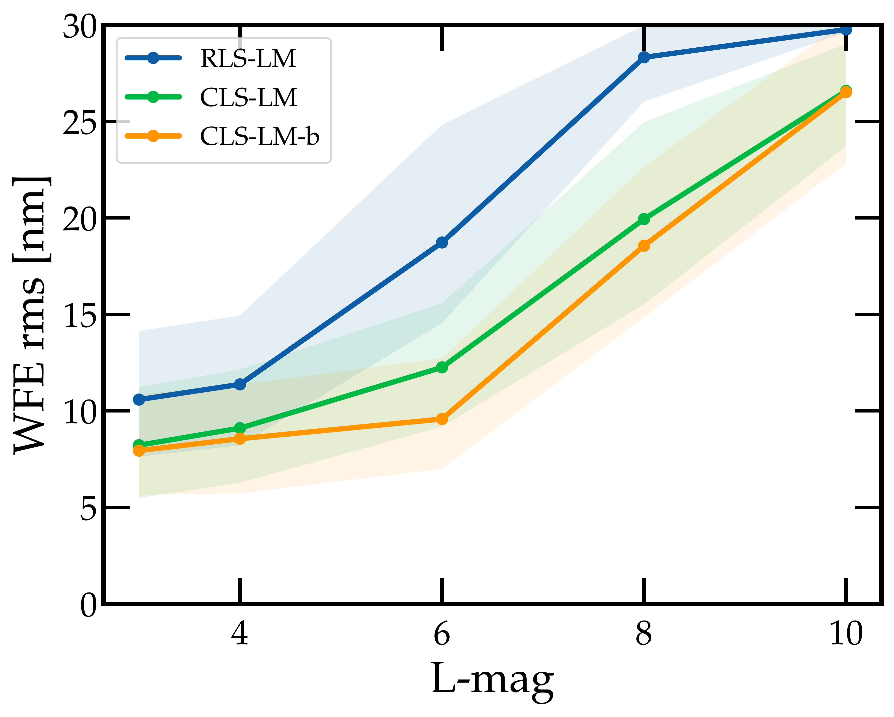
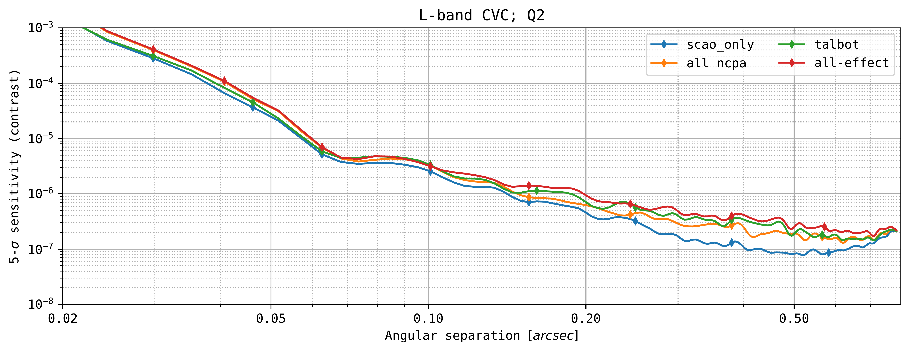
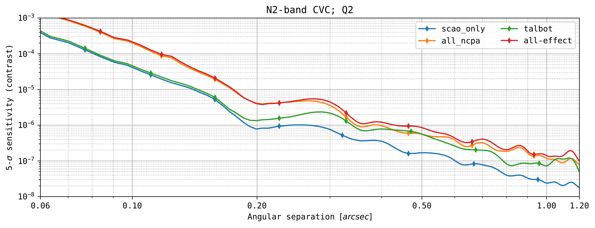
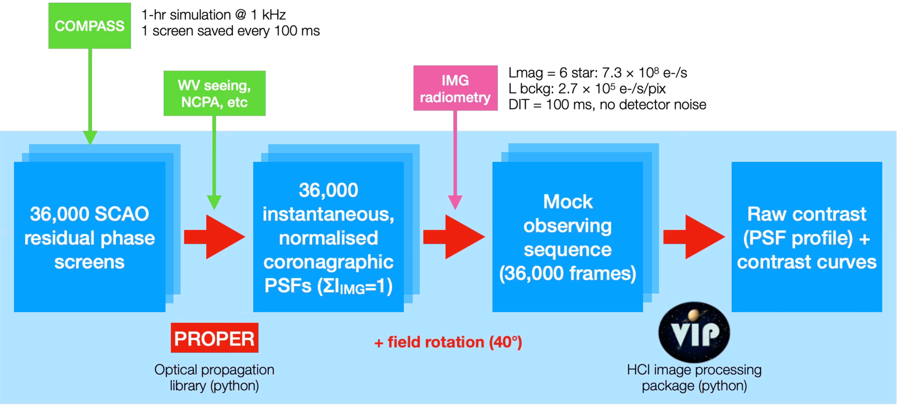

$\newcommand{\ensuremath}{}$
$\newcommand{\xspace}{}$
$\newcommand{\object}[1]{\texttt{#1}}$
$\newcommand{\farcs}{{.}''}$
$\newcommand{\farcm}{{.}'}$
$\newcommand{\arcsec}{''}$
$\newcommand{\arcmin}{'}$
$\newcommand{\ion}[2]{#1#2}$
$\newcommand{\textsc}[1]{\textrm{#1}}$
$\newcommand{\hl}[1]{\textrm{#1}}$
$\newcommand{\footnote}[1]{}$
$\newcommand{\arcsec}{^{\prime\prime}}$
$\newcommand{\ie}{\textit{i.e.}}$
$\newcommand{\baselinestretch}{1.0}$

# METIS high-contrast imaging simulations: \ From instrument modelling to science readiness

<mark>Appeared on: 2026-09-01</mark> -  _17 pages, 11 figures, paper presented at SPIE Astronomical Telescopes + Instrumentation 2026_

G. O. d. Xivry, et al. -- incl., <mark>I. Hammond</mark>, <mark>T. Bertram</mark>, <mark>R. v. Boekel</mark>, <mark>A. Boné</mark>, <mark>G. Chauvin</mark>

**Abstract:** The Mid-infrared Extremely Large Telescope (ELT) Imager and Spectrograph (METIS) instrument, expected to see first light in early 2030, aims to detect and characterise exoplanets and circumstellar disks through high-contrast imaging (HCI) and spectroscopy. The High-contrast End-to-End Performance Simulator (HEEPS), initially developed to support the design of the METIS HCI modes, has evolved into a crucial tool for the METIS science team to prepare and optimize observations.HEEPS is an open-source Python-based software with a modular architecture, integrating the wavefront Fresnel propagation package PROPER, and HCI image processing with the Vortex Image Processing (VIP) package.Though designed for METIS, its modularity has been applied to other HCI instruments as well.This work presents recent updates to HEEPS, including modelling of the final METIS pupil and Lyot stops, revised quasi-static non-common path aberrations (NCPA) and Talbot effect simulations informed by as-built optical surface errors, and updated METIS Single Conjugated Adaptive Optics (SCAO) simulations. We also discuss advancements in NCPA control strategies focusing on framerate, latency and sensing performance optimization, particularly for mitigating water vapor seeing effects using the asymmetric Lyot wavefront sensor (ALF) algorithm.With these refinements, we present a comprehensive grid of HCI performance simulations for METIS, covering a range of magnitudes in the $L$ , $M$ , and $N$ -bands, and several HCI observing modes. These simulations produce updated 5-sigma sensitivity contrast curves and mock HCI observations, providing key insights on HCI performance for instrument optimization and science observation planning. Our results underscore the key role of end-to-end simulations in bridging instrumental design and scientific readiness in the ELT era.

**Figure 4. -** $L$-band ALF sensor noise as a function of magnitude. (Left) for a 10 Hz framerate. (Right) for a 1 Hz framerate. The green and orange curves corresponds to the CVC modes (baseline and backup mask resp.). The blue curve corresponds to the RAVC mode (using the RLS-LM cold stop). (*fig:ALF-L*)

**Figure 7. -** ADI post-processed contrast curves for the CVC $L$-band (top) and CVC $N2$-band (bottom) for various instrumental effects and their combination, but without background noise. The second percentile ($\ie$ 37.5\% of the time conditions are better or equal) is considered for the observing conditions (dry air and water vapor). Individual contrast curves are shown for the dominant error sources: NCPA residuals (CBW and WV) after closed-loop control and Talbot effect for a meridian-centered sequence. The `SCAO only' curve shows the contrast floor set by the adaptive optics residual alone, and the `all-effects' curve combines all three contributions and provides our final performance prediction. (*fig:test_case*)

**Figure 1. -** The HEEPS simulation pipeline. HEEPS takes AO phase screens as input, typically simulated with COMPASS, propagate them through an instrument model using PROPER, produce a mock observing sequence, and post-process the frames using the VIP pacakge to produce contrast curves. (*fig:heeps*)

