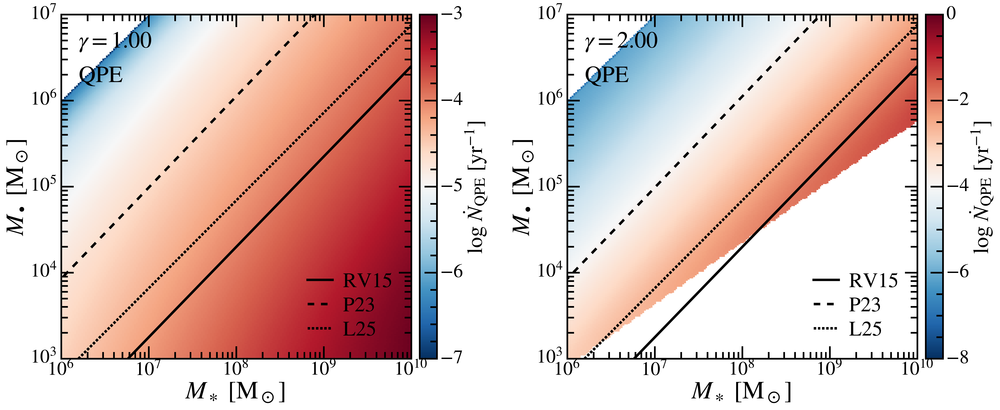
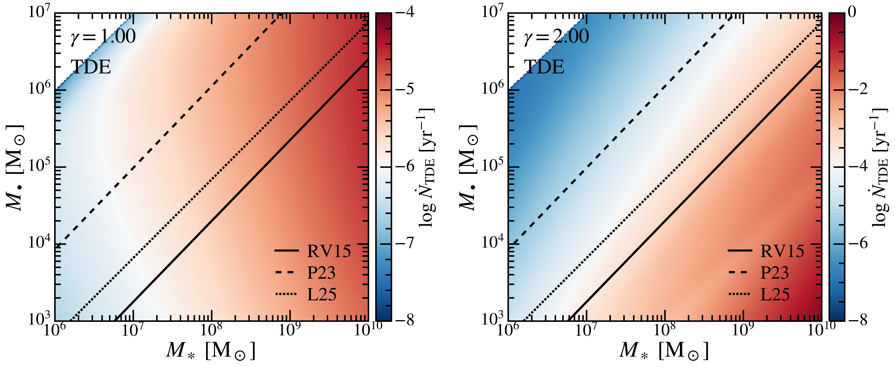
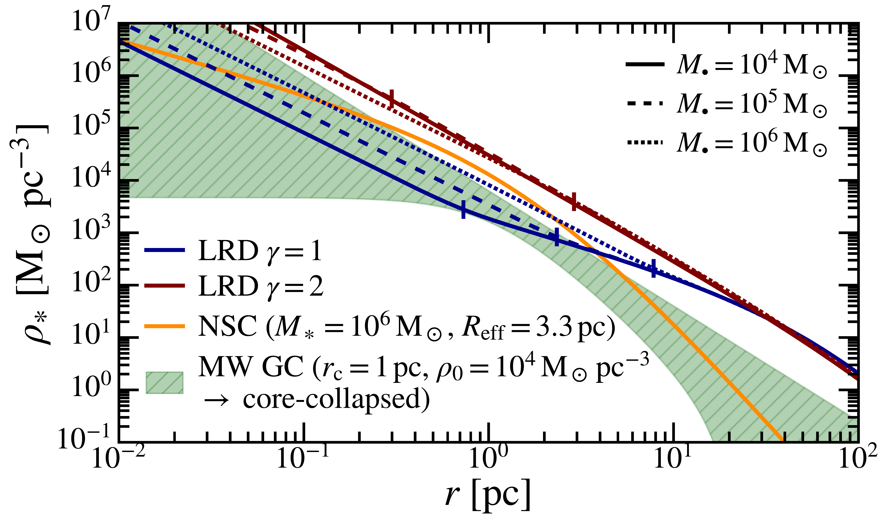

$\newcommand{\ensuremath}{}$
$\newcommand{\xspace}{}$
$\newcommand{\object}[1]{\texttt{#1}}$
$\newcommand{\farcs}{{.}''}$
$\newcommand{\farcm}{{.}'}$
$\newcommand{\arcsec}{''}$
$\newcommand{\arcmin}{'}$
$\newcommand{\ion}[2]{#1#2}$
$\newcommand{\textsc}[1]{\textrm{#1}}$
$\newcommand{\hl}[1]{\textrm{#1}}$
$\newcommand{\footnote}[1]{}$
$\newcommand{\vdag}{(v)^\dagger}$
$\newcommand\aastex{AAS\TeX}$
$\newcommand\latex{La\TeX}$
$\newcommand{\dint}{ {\rm d}}$
$\newcommand{\msun}{{ \rm M_\odot}}$
$\newcommand{\Lsun}{{ \rm L_\odot}}$
$\newcommand{\kms}{ {\rm km} {\rm s}^{-1}}$
$\newcommand{\cm}{ {\rm cm}}$
$\newcommand{\erg}{ {\rm erg}}$
$\newcommand{\s}{ {\rm s}}$
$\newcommand{\yr}{ {\rm yr}}$
$\newcommand{\Gyr}{ {\rm Gyr}}$
$\newcommand{\K}{ {\rm K}}$
$\newcommand{\Myr}{ {\rm Myr}}$
$\newcommand{\AU}{ {\rm AU}}$
$\newcommand{\pc}{ {\rm pc}}$
$\newcommand{\kpc}{ {\rm kpc}}$
$\newcommand{\pkpc}{ {\rm pkpc}}$
$\newcommand{\cMpc}{ {\rm cMpc}}$
$\newcommand{\Mpc}{ {\rm Mpc}}$
$\newcommand{\Gpc}{ {\rm Gpc}}$
$\newcommand{\hkpc}{ h^{-1} {\rm kpc}}$
$\newcommand{\hmpc}{ h^{-1} {\rm Mpc}}$
$\newcommand{\cpm}{ {\rm cm}^2 {\rm g}^{-1}}$
$\newcommand{\gcm}{  {\rm g} {\rm cm}^{-3}}$
$\newcommand{\mum}{ \mu{\rm m}}$
$\newcommand{\mmag}{ {\rm mag}}$
$\newcommand{\kev}{ {\rm keV}}$
$\newcommand{\dex}{ {\rm dex}}$
$\newcommand{\arraystretch}{1.4}$

# Weighing Little Red Dots with Transient Events

<mark>Appeared on: 2026-09-02</mark> -  _11 pages, 6 figures, 1 table, submitted to the Astrophysical Journal (ApJ)_

V. Tran, et al. -- incl., <mark>A. d. Graaff</mark>

**Abstract:** Recent JWST observations have revealed a large population of compact red sources at $z \gtrsim 4$ , known as Little Red Dots (LRDs), many of which show signatures of accreting massive black holes (BHs). The physical nature of these sources and their connection to host galaxies are under debate. We propose an independent avenue for constraining their nature through transient phenomena, such as tidal disruption events (TDEs) and quasi-periodic eruptions (QPEs), arising from interactions between a star and the gas envelope surrounding the BH. These event rates depend sensitively on BH mass and provide a way to "weigh" LRDs. We calculate the expected TDE and QPE rates in LRDs under three distinct scenarios: (1) LRDs are truly overmassive BHs, (2) LRDs have BH masses following the classical local scaling relations (and the reported BH masses in observations are overestimated), and (3) the currently observed LRDs are only the tip of the iceberg of a larger population of low-mass BHs. We find that the predicted TDE and QPE rates differ dramatically across scenarios, especially in the presence of steep stellar cusps. The expected TDE rates per degree-square, assuming a Hernquist stellar distribution with a Bahcall--Wolf cusp embedded, are $2.78 \times 10^{-3}$ , $1.96 \times 10^{-3}$ , and $3.37 \times 10^{-2} \yr^{-1} \deg^{-2}$ for the three scenarios, respectively, while the QPE rates are $1.64 \times 10^{-2}$ , $4.72 \times 10^{-2}$ , and $4.96 \times 10^{-1} \yr^{-1} \deg^{-2}$ . Upcoming wide-field surveys with Euclid, Roman, and LSST may be capable of detecting these high-redshift transient events and obtaining light curves, which encode additional information about the BH mass and the gas structure of LRDs. Stellar transient events will provide valuable insight into the early assembly of massive BHs.

**Figure 6. -** Similar to Figure \ref{fig:tde_rate}, but showing the rest-frame QPE rate of LRDs instead. The QPE rate broadly follows the same behavior as the TDE rate in the $\gamma = 2$ case, with the event rate decreasing with increasing BH mass. As a result of $r_{\rm ph}$ increasing the loss cone size by orders of magnitude, enhancements of $\sim 1 \text{--} 2$\dex$$ in the event rates relative to TDE are observed. However, in the $\gamma = 2$ case, the QPE rate calculation becomes invalid in the high-stellar mass, low-BH mass regime. This is because the more compact stellar distribution causes the influence radius $r_{\rm h}$ to rapidly approach $r_{\rm ph}$ as the BH mass decreases, resulting in large numerical errors, as discussed in Section \ref{ssec:diff}. (*fig:pee_rate*)

**Figure 5. -** The rest-frame TDE rate of LRDs as a function of $M_\bullet$ and $M_\ast$, assuming the Kroupa PDMF with $m_\ast^{\rm max} = 2 $\msun$$ and that the underlying stellar distribution follows modified Dehnen profiles with $\gamma = 1$(left) and $\gamma = 2$(right). The RV15, P23, and L25 $M_\bullet \text{--} M_\ast$ relations are represented by solid, dashed, and dotted lines, respectively. For the $\gamma = 1$ case, the TDE rate increases with increasing BH mass in the lower BH mass regime, where the $\gamma = 1$ slope strongly influences the density profile. Even with the Bahcall--Wolf cusp, the density slope near the influence radius remains below the critical value of $1.42$. At larger BH masses, where the $-4$ outer slope has a stronger influence, as well as in the $\gamma = 2$ case, where the slope is always larger than $1.42$, the TDE rate decreases with increasing BH mass. (*fig:tde_rate*)

**Figure 1. -** The stellar density profiles of LRDs (Equation \ref{eqn:dehnen_cusp}) assuming a stellar mass of $M_\ast = 10^8$\msun$$ and an effective radius of $R_{\rm eff} = 168$\pc$$. A wide range of BH masses, $M_\bullet = 10^4, 10^5, 10^6$, is shown in solid, dashed, and dotted lines, respectively, for two choices of $\gamma = 1$(blue) and $\gamma = 2$(red). For comparison, the density profile of a typical NSC in a galaxy of the same stellar mass (orange) is shown, along with the density range of typical higher-mass MW GCs to core-collapse specimens (green band). The inner regions of LRDs have densities comparable to those of NSCs and MW GCs for $\gamma = 1$, while for $\gamma = 2$, LRDs appear to be $\sim 0.5$\dex$$ denser than the core-collapsed GC. (*fig:density*)

