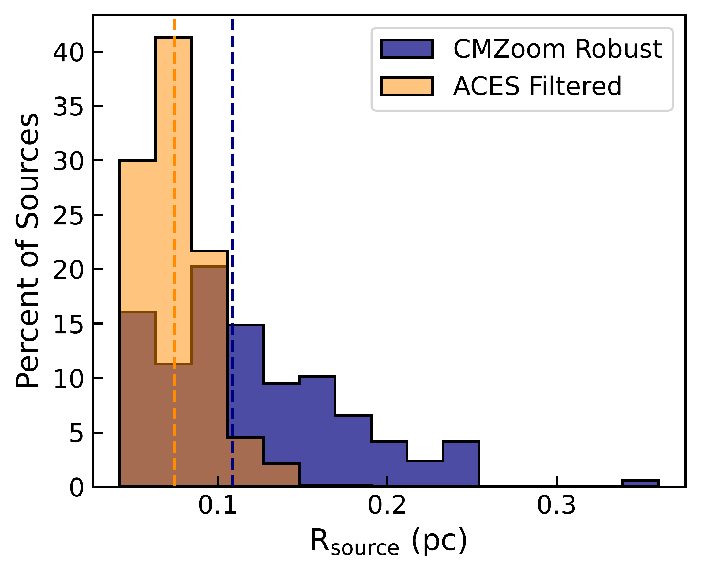
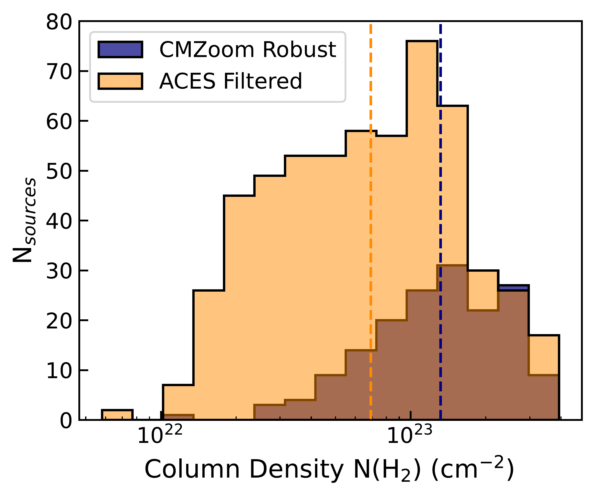
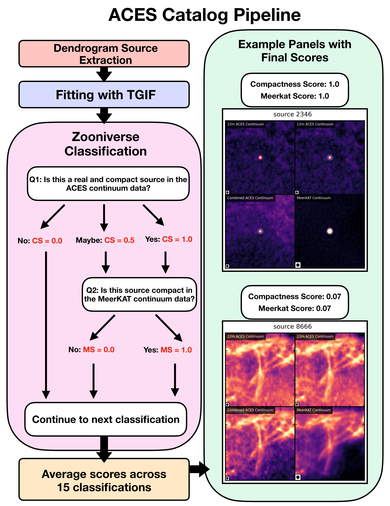

$\newcommand{\ensuremath}{}$
$\newcommand{\xspace}{}$
$\newcommand{\object}[1]{\texttt{#1}}$
$\newcommand{\farcs}{{.}''}$
$\newcommand{\farcm}{{.}'}$
$\newcommand{\arcsec}{''}$
$\newcommand{\arcmin}{'}$
$\newcommand{\ion}[2]{#1#2}$
$\newcommand{\textsc}[1]{\textrm{#1}}$
$\newcommand{\hl}[1]{\textrm{#1}}$
$\newcommand{\footnote}[1]{}$
$\newcommand{\vdag}{(v)^\dagger}$
$\newcommand\aastex{AAS\TeX}$
$\newcommand\latex{La\TeX}$

# ACES VII. Compact Continuum Source Catalog of the Central Molecular Zone

<mark>Appeared on: 2026-09-02</mark> -  _25 pages, 11 figures, accepted for publication in the Astrophysical Journal_

J. Wallace, et al. -- incl., <mark>F. Xu</mark>

**Abstract:** The Central Molecular Zone (CMZ) resides in the inner few hundred parsecs of our Galaxy, and despite being the largest reservoir of dense molecular gas in the Milky Way, it has a relatively low present-day star formation rate (SFR) of $\sim0.08 M_{\odot} \text{yr}^{-1}$ . Continuum and spectral line observations from the Atacama Large Millimeter/submillimeter Array (ALMA) CMZ Exploration Survey (ACES) provide the first full-coverage, high-resolution map of the inner 200 parsecs of the CMZ at 3 mm. In this paper we present the ACES catalog of compact continuum sources, the most complete catalog of potential sites of star formation in the CMZ to date. Using an automated dendrogram-based source extraction procedure in combination with a by-eye morphological classification scheme, we produce a `full' catalog of 1735 detections in total. Additionally, we use spectral index measurements to generate a `filtered' catalog of 567 sources with minimal contamination from non-thermal filaments and extended free-free emission. We find that 359 ( $\sim63\%$ ) of the filtered catalog sources are located at column densities $< 10^{23}$ cm $^{-2}$ , outside of the densest molecular cloud regions, 195 of which have not been identified in previous surveys. After cross-referencing with various catalogs generated from data at different wavelengths, we consider it likely that many of these newly discovered detections are produced by pre/protostellar sources or compact H ii regions.

**Figure 4. -** A visual representation of ACES catalog sources at various steps in the pruning process. The image shown in each panel is a zoom-in of the ACES 3 mm continuum mosaic towards a group of non-thermal filaments collectively known as the the "Galactic Center Radio Arc"  ([Yusef-Zadeh, et. al 1986](https://ui.adsabs.harvard.edu/abs/1986ApJ...310..689Y))  and an extended Hii region known as "the Sickle" \citep[e.g.,][]{Yusef-Zadeh_1987}, which is likely ionized by stars in the nearby Quintuplet cluster. In all three panels, ACES detections are shown with cyan ellipses. The left panel shows the sources before manual source removal, the middle panel shows the "full" catalog sources, and the right panel shows "filtered" catalog sources. We note that there are some known compact sources such as the Pistol Star and some evolved stars from the Quintuplet cluster that are a part of the "full" catalog, but not the "filtered" catalog due to the strict thresholds we set for extended free-free contamination in Section \ref{subsec:ff_contam}. (*fig:before_after*)

**Figure 7. -** Comparing the radius (left) and Herschel column density (right) distributions for detections in the filtered ACES (orange) and robust CMZoom (blue) compact continuum source catalogs. For ACES detections, the effective radius ($R_{\text{source}}$) is calculated from the geometric mean of the FWHM axes of the fitted TGIF ellipses and the CMZoom $R_{\text{leaf}}$ is calculated from the total area of its corresponding dendrogram leaf: $R_{\text{leaf}} = \sqrt{A_{\text{leaf}}/\pi}$. For both the ACES and CMZoom sources, the column density is averaged over the area of the leaf from the Herschel column density map. The dashed lines show the median values of each distribution. (*fig:rad_nh2_hist*)

**Figure 5. -** The ACES catalog pipeline, including a decision tree for the Zooniverse source classification procedure outlining the questions presented to volunteers, the possible responses, and the Compactness Score (CS) and MeerKAT Score (MS) corresponding to each response. In the final section of the flow chart (green box), we present two examples of the 4-panel figures used for classification in the Zooniverse user interface. Each panel is centered on the coordinates of the source being classified. The top panels show the 12m ACES continuum mosaic image, the bottom left panel shows the ACES mosaic combined with single-dish GBT observations, and the bottom right panel shows the MeerKAT 1.28 GHz continuum image. The top right and bottom panels include the dendrogram contour in cyan. The synthesized beam for each map is shown in the bottom left corner of each panel. The unique source ID is given at the top of the figure, corresponding to the "ACES ID" column of the catalog (Table \ref{tab:cat}). (*fig:zoo_flow*)

