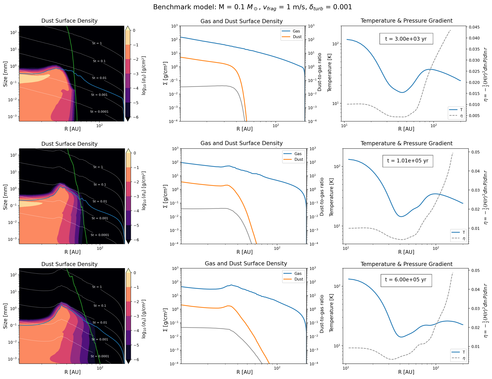
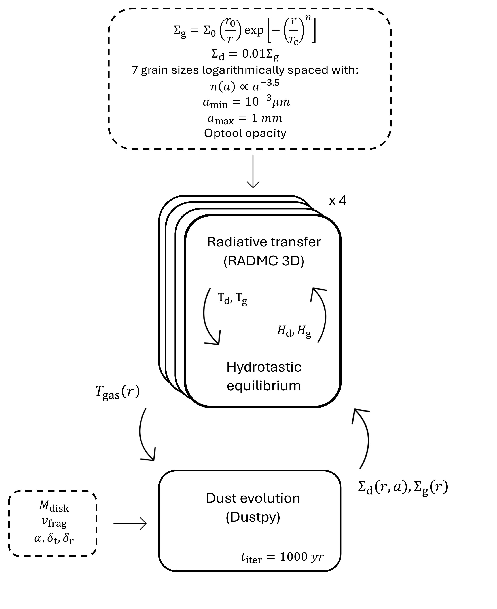
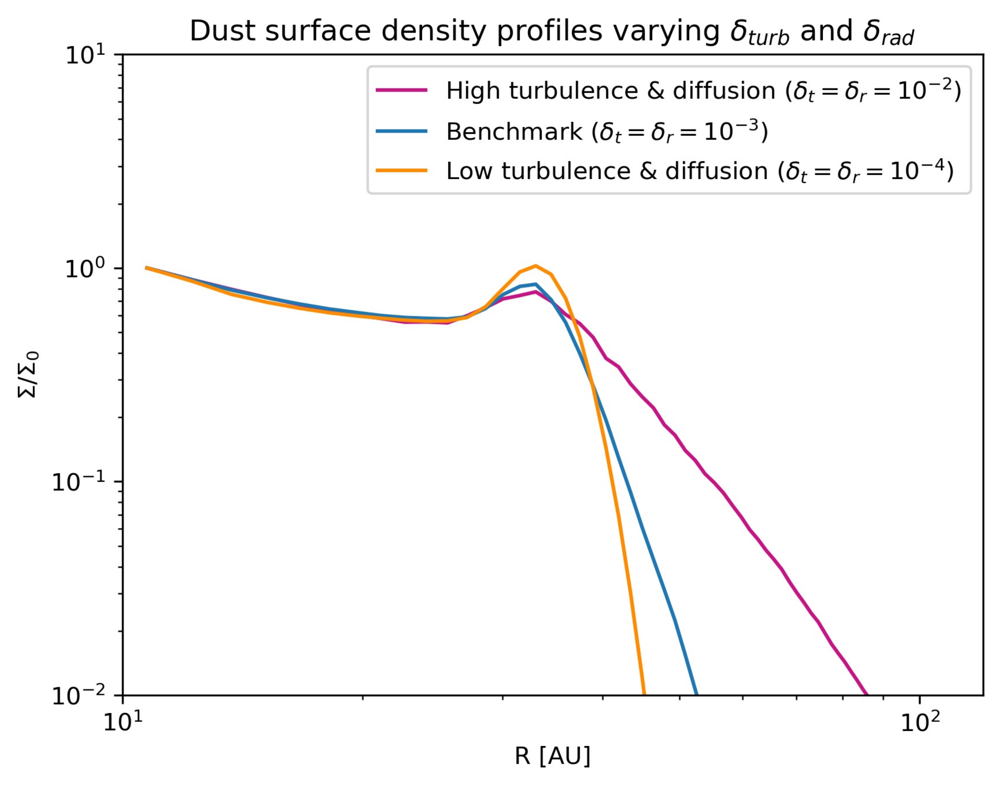

$\newcommand{\ensuremath}{}$
$\newcommand{\xspace}{}$
$\newcommand{\object}[1]{\texttt{#1}}$
$\newcommand{\farcs}{{.}''}$
$\newcommand{\farcm}{{.}'}$
$\newcommand{\arcsec}{''}$
$\newcommand{\arcmin}{'}$
$\newcommand{\ion}[2]{#1#2}$
$\newcommand{\textsc}[1]{\textrm{#1}}$
$\newcommand{\hl}[1]{\textrm{#1}}$
$\newcommand{\footnote}[1]{}$
$\newcommand{\B}[1]{\textbf{\textcolor{red}{#1}}}$

# Self-induced edge rings in protoplanetary disks

<mark>Appeared on: 2026-09-02</mark> -  _12 pages, 12 figures, accepted in A&A_

M. Bolchini, <mark>H. Jiang</mark>, <mark>J. Bi</mark>

**Abstract:** Observations with a high angular resolution by ALMA have revealed that substructures are ubiquitous in protoplanetary disks. Axisymmetric dust rings are the most common morphology. The profiles of some observed disks, including young disks, are smooth overall, with a localized dip or bump near the outer edge of the continuum disk that manifests as an edge ring. While embedded planets might contribute to these structures, their physical origin remains unclear. We investigated the possibility that these edge rings arise purely from radiative transfer effects at the outer edge of a protoplanetary disk. A steep surface density dust gradient at the outer edge of the disk allows stellar irradiation to penetrate more efficiently beyond the disk edge, producing a non-monotonic temperature profile characterized by a dip that is followed by a bump. We tested whether this non-monotonic temperature structure can generate and maintain a localized continuum enhancement. We coupled radiative transfer and dust evolution by iterating between the Monte Carlo radiative transfer code RADMC-3D and the dust evolution code DustPy. This framework self-consistently follows the coupled evolution of temperature, grain growth, and dust dynamics. Thermodynamic feedback at the disk edge can naturally generate and maintain localized dust enhancements resembling the edge rings that are observed in some extremely young disks. Without invoking planets or additional dynamical perturbations, this mechanism offers a plausible explanation for the first-generation ring formation. Our results highlight the importance of coupling thermodynamics and dust evolution when modeling protoplanetary disks, suggesting that thermodynamic feedback probably plays a role in shaping disk substructures.

**Figure 11. -** Snapshots for the benchmark simulation at 3000 yrs, 0.1 Myr and 0.6 Myr from top to bottom. ** Left panels** show the dust surface density as a function of both radius and grain size; the blue line is the fragmentation barrier, and the green line represents the drift barrier. ** Central panels** show the total dust surface density (orange), the gas surface density (blue), and the dust-to-gas ratio (gray) as a function of radius. ** Right panels** show the midplane temperature and the dimensionless pressure gradient $\eta$ as a function of radius.
         (*fig: Benchmark_01_06*)

**Figure 2. -** Workflow of the coupled dust evolution and radiative transfer modeling.
       (*fig: code_workflow*)

**Figure 4. -** Dust surface density at 0.3 Myr varying $\delta_{\rm r}$ and $\delta_{\rm t}$ in the models. (*fig:delta_t_delta_r*)

