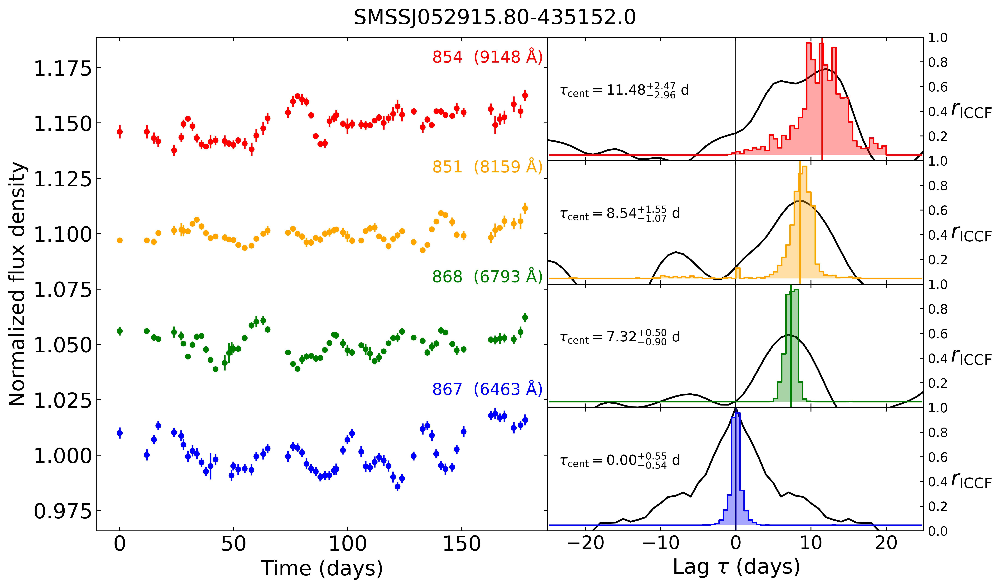
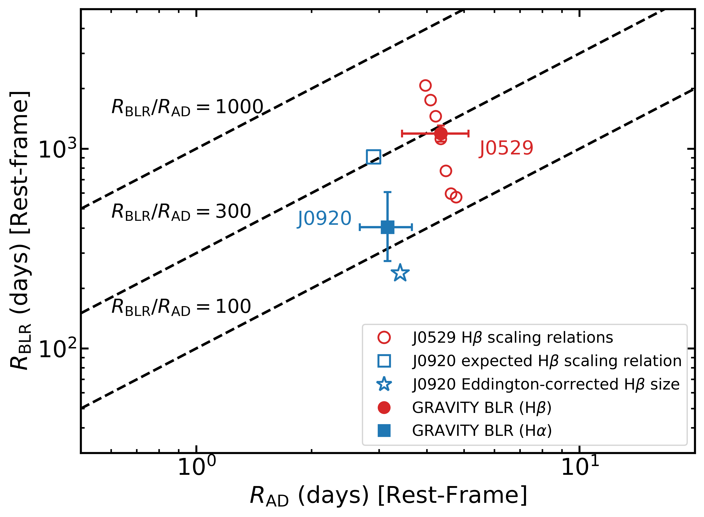
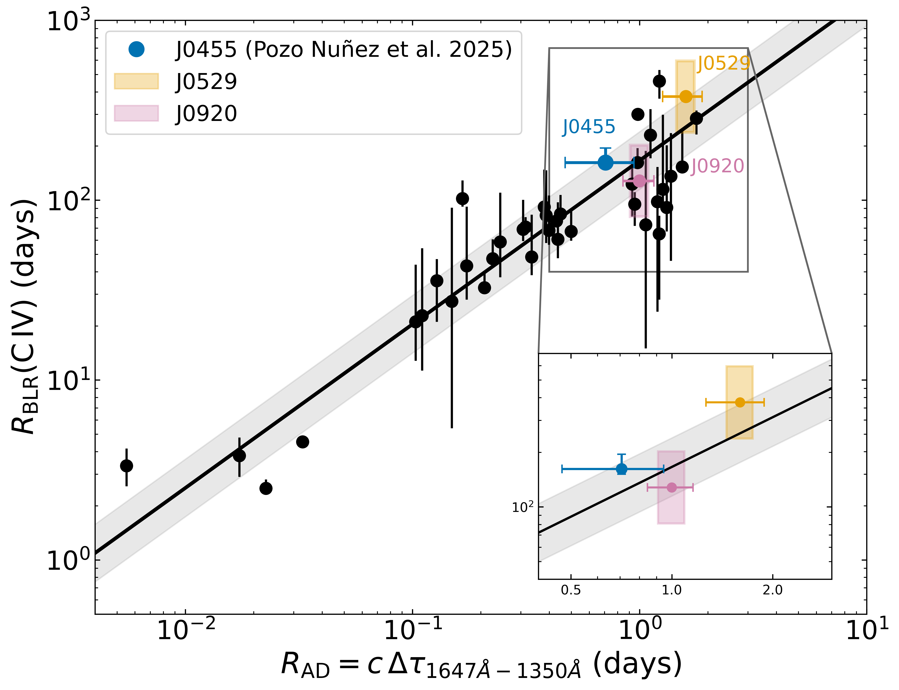

$\newcommand{\ensuremath}{}$
$\newcommand{\xspace}{}$
$\newcommand{\object}[1]{\texttt{#1}}$
$\newcommand{\farcs}{{.}''}$
$\newcommand{\farcm}{{.}'}$
$\newcommand{\arcsec}{''}$
$\newcommand{\arcmin}{'}$
$\newcommand{\ion}[2]{#1#2}$
$\newcommand{\textsc}[1]{\textrm{#1}}$
$\newcommand{\hl}[1]{\textrm{#1}}$
$\newcommand{\footnote}[1]{}$
$\newcommand{\bd}[1]{\mbox{\boldmath #1}}$
$\newcommand{\arraystretch}{1.2}$
$\newcommand{\arraystretch}{1.2}$

# Accretion-disk sizes in two quasars with interferometrically resolved broad-line regions at $z=2.3$ and $z=4.0$

<mark>Appeared on: 2026-09-02</mark> -  _11 pages, 7 figures, accepted for publication in Astronomy & Astrophysics_

F. P. Nuñez, et al. -- incl., <mark>E. Bañados</mark>

**Abstract:** We present the first direct comparison between accretion-disk (AD) andbroad-line region (BLR) sizes in quasars at $z > 2$ , enabled by combiningcontinuum reverberation mapping with interferometric BLR constraints fromGRAVITY and GRAVITY+. Using medium-band photometric monitoring with theMPG/ESO 2.2 m telescope, we measure inter-band continuum lags in two  quasars: SDSS J092034.17+065718.0 at $z = 2.33$ (J0920) andSMSS J052915.80 $-$ 435152.0 at $z = 3.96$ (J0529), among the most luminous quasarsknown ( $L_{\rm bol} \sim 10^{48}$ erg s $^{-1}$ ). These are currently theonly two quasars at $z > 2$ with spatially resolved BLRs and dynamicalblack-hole masses from interferometry, making this comparison uniquelypossible. We detect significant continuum lags in both quasars, increasingmonotonically with wavelength. The inferred UV disk sizes are $R_{\rm AD} = 4.35^{+0.78}_{-0.91}$ light-days for J0529 and $R_{\rm AD} = 3.15^{+0.50}_{-0.48}$ light-days for J0920. For J0920,accreting at $\lambda_{\rm Edd} \sim 7$ --20, the disk size is consistent with standard thin-disk expectations, asurprising result given that the standard thin-disk approximation is notexpected to hold in this super-Eddington regime. For J0529, the disk sizeis consistent with thin-disk predictions under the single-epoch black-holemass, but would imply disk inflation by afactor of a few if the GRAVITY+ dynamical mass is adopted instead --- anorder of magnitude lower. This tension illustrates that UV continuum disksizes provide an independent physical scale that any self-consistent modelof the black-hole mass and accretion rate must satisfy, adding leverage inobjects where BLR kinematics are dominated by outflows rather than virialmotion. A comparison with the interferometric BLR sizes reveals pronouncedradial hierarchies, with $R_{\rm BLR}/R_{\rm AD} \sim 270$ for J0529 (H $\beta$ ) and $\sim\!115$ for J0920 (H $\alpha$ ). The successful detection of lags in both quasars at $L_{\rm bol} \sim10^{48}$ erg s $^{-1}$ demonstrates that continuum reverberation mappingremains feasible even at the low-amplitude variability end expected for themost luminous systems, opening a path toward extending accretion-disk sizemeasurements to larger samples with wide-field surveys such as the VeraC. Rubin Observatory's LSST.

**Figure 5. -** Continuum light curves and cross-correlation analysis for J0529.
_Left panel:_ Normalized light curves obtained with the WFI medium-band filters 867 (reference), 868, 851, and 854.
The labels indicate the observed-frame central wavelength of each filter.
The 867 band ($\lambda_{\rm obs}=6463$ Å) is used as the reference continuum band and is shown at the bottom, while the other light curves are vertically offset for clarity.
_Right panels:_ Interpolated cross-correlation functions (ICCF; black curves) between each band and the reference light curve.
The histograms show the centroid lag distributions obtained from the flux randomization and random subset sampling (FR/RSS) Monte Carlo procedure.
The vertical black line marks the zero-lag reference.
Median centroid lags from FR/RSS distributions are marked in each panel. (*fig:lcs_lags_SMSS*)

**Figure 3. -** Comparison between the characteristic accretion-disk scale and the BLR size for J0529 and J0920. The filled symbols denote the BLR sizes measured with GRAVITY.
For J0529, the open red circles indicate BLR sizes from literature H$\beta$$R$--$L$ relations (see Table 2 in  ([Gravity+ Collaboration, et. al 2026](https://ui.adsabs.harvard.edu/abs/2026A&A...706A..99G))  and references therein).
For J0920, the open blue square marks the H$\beta$ size expected from the local $R$--$L$ relation, while the open blue star shows the Eddington-ratio-corrected H$\beta$ estimate, both taken from [Abuter, et. al (2024)](https://ui.adsabs.harvard.edu/abs/2024Natur.627..281A).
Dashed diagonal lines indicate constant ratios $R_{\rm BLR}/R_{\rm AD}$.
 (*fig:blr_vs_disk*)

**Figure 4. -** C IV BLR size as a function of the continuum size relevant for the CIV emitting region, defined here as $R_{\rm AD}=c \Delta\tau_{1647-1350}$.
The solid black line and gray shaded band show the size--size relation proposed by [Panda, et. al (2024)](https://ui.adsabs.harvard.edu/abs/2024ApJ...968L..16P) and its intrinsic scatter.
The blue point marks QSO J0455$-$4216, for which both the continuum delay and the C IV BLR size are available from reverberation mapping.
The orange and green shaded regions denote the inferred CIV BLR intervals for J0529 and J0920, respectively, obtained by combining the measured continuum sizes with C IV BLR ranges from the GRAVITY Balmer-line BLR sizes under the assumption
that the high-ionization C IV emitting region lies interior to the Balmer-line region (see text). No C IV lags are measured for these two quasars: the shaded regions are inferred from scaling relations and should be regarded as order-of-magnitude estimates rather than measurements. The inset shows an enlarged view of the region occupied by the three high-redshift quasars for clarity. (*fig:civ_blr_ad_three*)

