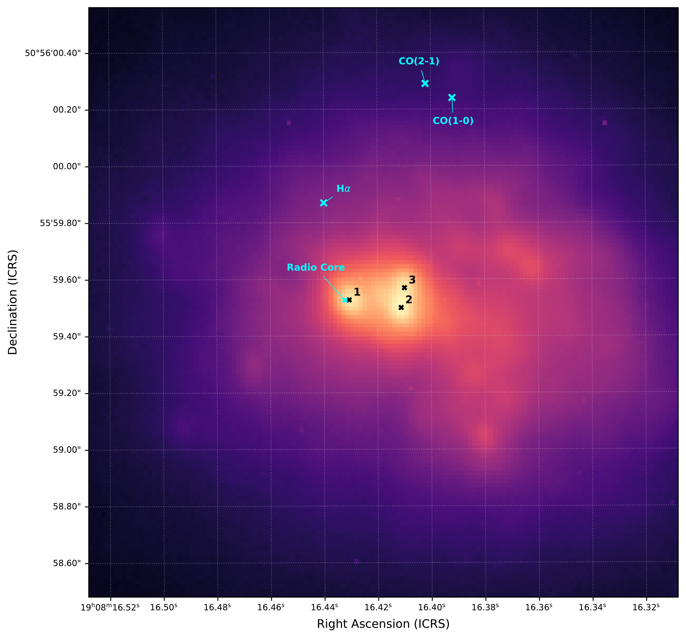

$\newcommand{\ensuremath}{}$
$\newcommand{\xspace}{}$
$\newcommand{\object}[1]{\texttt{#1}}$
$\newcommand{\farcs}{{.}''}$
$\newcommand{\farcm}{{.}'}$
$\newcommand{\arcsec}{''}$
$\newcommand{\arcmin}{'}$
$\newcommand{\ion}[2]{#1#2}$
$\newcommand{\textsc}[1]{\textrm{#1}}$
$\newcommand{\hl}[1]{\textrm{#1}}$
$\newcommand{\footnote}[1]{}$
$\newcommand{\vdag}{(v)^\dagger}$
$\newcommand\aastex{AAS\TeX}$
$\newcommand\latex{La\TeX}$

# Detection of a triple nucleus in the Wolf-Rayet composite Sy 2 galaxy NGC 6764

<mark>Appeared on: 2026-09-02</mark> -  _3 pages, 1 figure, accepted in RNAAS_

J. Heidt, et al. -- incl., <mark>M. Vukojevic</mark>

**Abstract:** We report adaptive-optics $K_{s}$ -band imaging of the composite Seyfert 2 and Wolf-Rayet galaxy NGC 6764 ( $D=32$ Mpc), obtained with LUCI/SOUL at the Large Binocular Telescope.The nucleus resolves into three compact sources with pairwise projected separations of $0.07^{\prime\prime}$ -- $0.2^{\prime\prime}$ , corresponding to $11.0$ -- $30.9 \mathrm{pc}$ .All three have indistinguishable $H$ , $K_{s}$ , H $_{2}$ , and Br $\gamma$ colours, so photometry alone cannot separate accretion from star formation. The system is consistent with a Seyfert nucleus and two star-forming regions, but a dual or triple AGN cannot be excluded.In case of the latter, the separations would be two orders of magnitude smaller than in any confirmed or candidate AGN triplet reported to date. Diffraction-limited near-infrared integral-field spectroscopy is required to establish the nature of each component.

**Figure 1. -** Central $\sim2$\farcs$1\times2$\farcs$1$ region of NGC 6764 observed in the $K_{s}$ band with LUCI 2/SOUL at the LBT. The astrometric solution was tied to the ICRS using three Gaia DR3 stars within the $30^{\prime\prime}$ LUCI 2 field of view. Their catalogue positions, given at the reference epoch J2016.0, were propagated to the epoch of the observations, J2023, using the catalogued proper motions where available \citep{gaia2016,gaiadr3_summary}.
The nucleus resolves into three components (1--3) with pairwise separations of
$0.19^{\prime\prime}$(1--2), $0.20^{\prime\prime}$(1--3), and $0.07^{\prime\prime}$(2--3), corresponding to $28.8$, $30.9$, and $11.0 \mathrm{pc}$ at $D=32 \mathrm{Mpc}$, respectively.
The cyan crosses mark the VLBA core \citep{Kharb_2010} and the H$\alpha$ and CO peaks (\citealt{2007A&A...473..747L}). The astrometric accuracy is approximately $0.005^{\prime\prime}$ for the VLBA core, while the conservative absolute uncertainty of our Gaia-calibrated astrometry is $0.17^{\prime\prime}$. The uncertainties of the CO and H$\alpha$ positions are $0.2^{\prime\prime}$--$0.3^{\prime\prime}$. (*fig1*)

