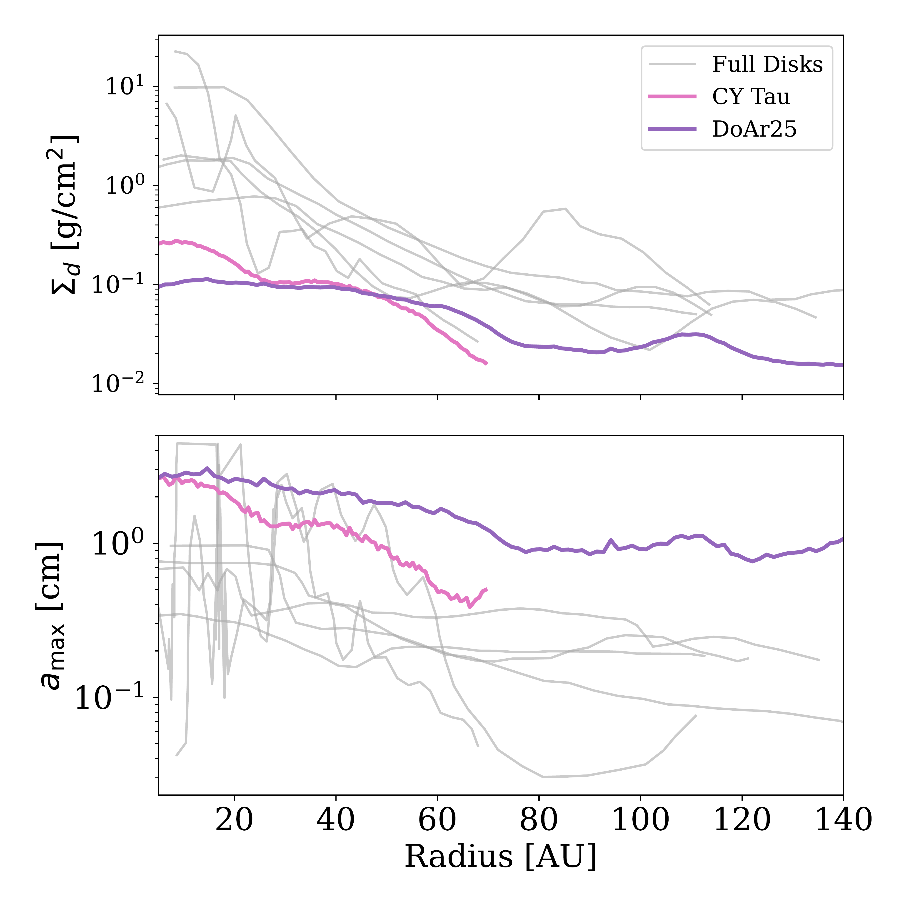
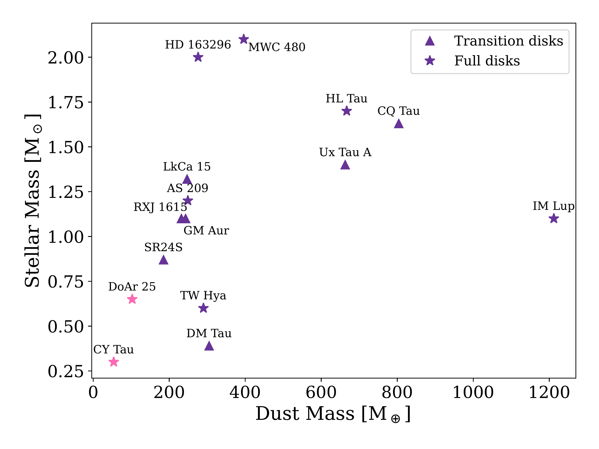
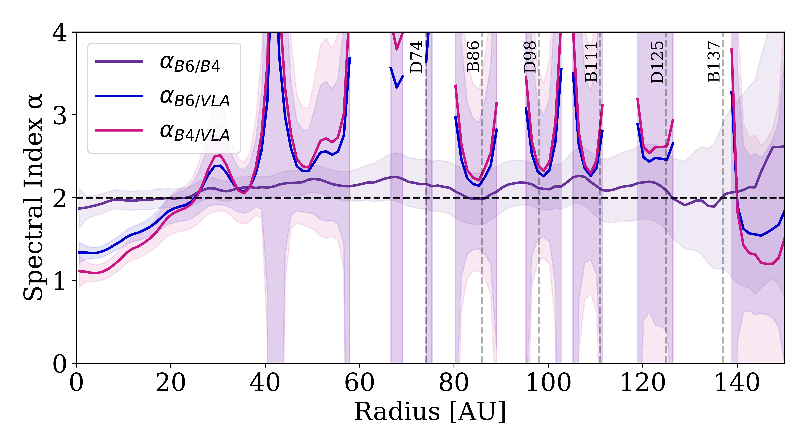

$\newcommand{\ensuremath}{}$
$\newcommand{\xspace}{}$
$\newcommand{\object}[1]{\texttt{#1}}$
$\newcommand{\farcs}{{.}''}$
$\newcommand{\farcm}{{.}'}$
$\newcommand{\arcsec}{''}$
$\newcommand{\arcmin}{'}$
$\newcommand{\ion}[2]{#1#2}$
$\newcommand{\textsc}[1]{\textrm{#1}}$
$\newcommand{\hl}[1]{\textrm{#1}}$
$\newcommand{\footnote}[1]{}$
$\newcommand{\bn}[1]{\textcolor{magenta}{#1}}$
$\newcommand{\arraystretch}{1.2}$

# Drift-dominated dust evolution: A multiwavelength analysis of dust rings in CY Tau and DoAr25

<mark>Appeared on: 2026-09-03</mark> - 

A. Topalidou, et al. -- incl., <mark>H. Jiang</mark>

**Abstract:** Protoplanetary disks are the birthplaces of planets, and understanding the distribution and evolution of dust within them is essential for tracing the early stages of planet formation. Following the DSHARP survey, we aim to constrain the radial distribution of the dust surface density and the maximum emitting grain size in the disks of CY Tau and DoAr 25 and assess the relative importance of dust trapping and radial drift in shaping the dust population in disks. We present multiwavelength continuum observations of CY Tau and DoAr 25 from ALMA at 2.4 and 1.25 mm and archival VLA data at 8.8 mm. Combining the observations with dust continuum forward modeling, we sought to infer a radial profile of the two systems of the dust surface density and maximum emitting grain size. For DoAr 25, the results reveal a prominent dust ring at 111 AU and evidence for large (centimeter-sized) grains extending to the outer disk. In contrast, CY Tau exhibits a more compact and smoother structure, with both the dust surface density and grain size decreasing monotonically with radius. A tentative shoulder feature in the radial profiles, located between 20--40 AU, may point to a marginal substructure, possibly a weak dust trap. DoAr 25 shows evidence for a dust trap capable of halting inward drift, while CY Tau exhibits behavior consistent with evolution dominated by radial drift. Together, these results highlight how dust evolution processes shape the disk morphology and grain-size distributions, even in the low-mass stellar regime.

**Figure 4. -** Comparison between the disks analyzed in this work, DoAr 25 (purple) and CY Tau (pink), and the sample of full disks (gray) from \citet{jiang2024grain}. The top panel shows the dust surface density profiles, highlighting that DoAr 25 and CY Tau exhibit significantly lower values compared to the full disk sample. The bottom panel displays the maximum grain size of the emitting dust, where both disks show notably larger grains than those in the comparison sample. (*fig:full_disks_comparison*)

**Figure 6. -** Dust masses of the disks in the sample
    plotted against the central stellar mass.
    Transition disks are plotted with triangles and full disks with stars. CY Tau and DoAr 25 are highlighted with the pink color. For references see Table \ref{tab:disk_summary} and \citet{2024ApJ...974..306S, guerra2024into}. The values used for the plot can be found in Table \ref{tab:dust_masses}. (*fig:dust_mass_star_mass*)

**Figure 7. -** Spectral index radial profiles of the dust emission of the disk around DoAr 25 between 1.25 and 2.4 mm (purple), 1.25 and 8.8 mm (blue), and 2.4 and 8.8 mm (pink). These radial profiles were obtained following Equation \ref{eq:spectral_index}. A dashed black line has been drown at $\alpha=2$ to indicate the Rayleigh-Jeans limit. (*fig:spectral_index_doar25*)

