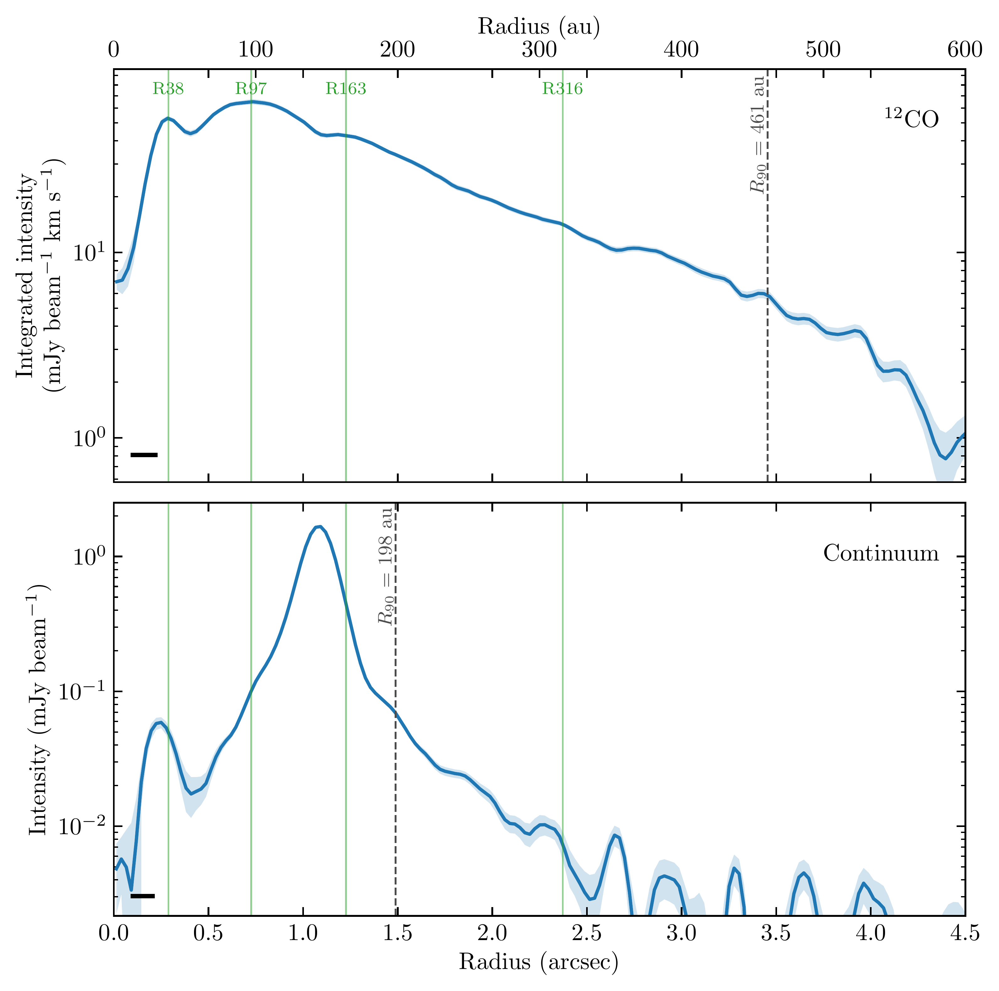
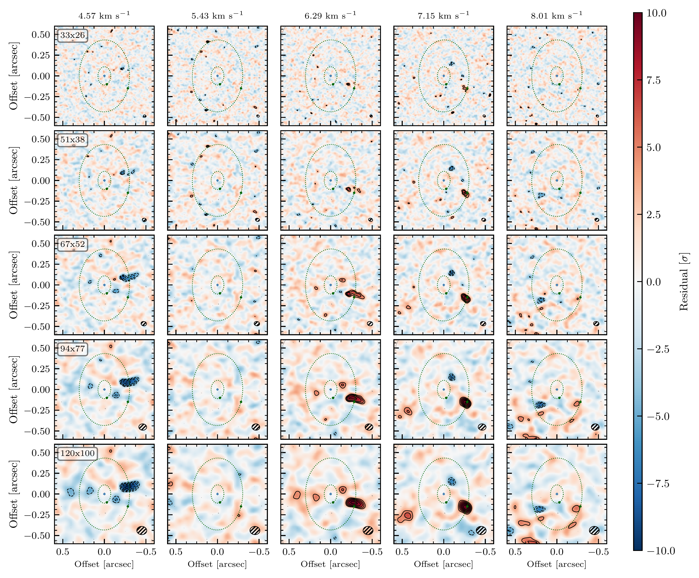
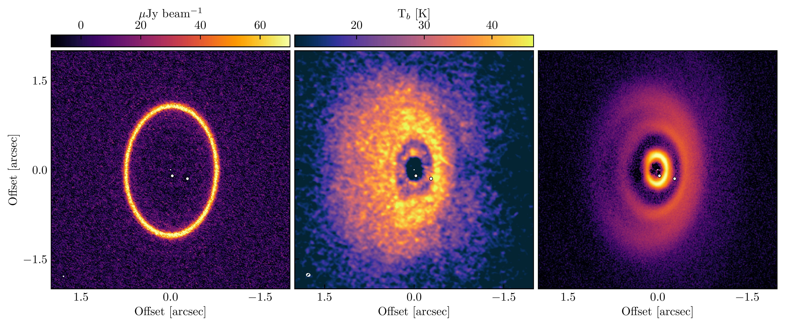

$\newcommand{\ensuremath}{}$
$\newcommand{\xspace}{}$
$\newcommand{\object}[1]{\texttt{#1}}$
$\newcommand{\farcs}{{.}''}$
$\newcommand{\farcm}{{.}'}$
$\newcommand{\arcsec}{''}$
$\newcommand{\arcmin}{'}$
$\newcommand{\ion}[2]{#1#2}$
$\newcommand{\textsc}[1]{\textrm{#1}}$
$\newcommand{\hl}[1]{\textrm{#1}}$
$\newcommand{\footnote}[1]{}$
$\newcommand{\kms}{km~s^{-1} }$
$\newcommand\SF[1]{{\color{blue}sf:#1}}$
$\newcommand{\mb}[1]{\textbf{#1}}$
$\newcommand{\twCO}{^{12}CO}$
$\newcommand{\twCOfull}{^{12}CO J=3-2}$

# Mapping the WISPIT 2 Planet-Hosting Cavity at Sub-Hill-Radius scales

<mark>Appeared on: 2026-09-08</mark> -  _Accepted for publication in ApJ Letters_

<mark>M. Benisty</mark>, et al. -- incl., <mark>F. Zagaria</mark>

**Abstract:** We present new deep, very high angular resolution observations of the sub-mm continuum ( $19\times13 $ ${\rm mas}$ ) and $\twCOfull$ ( $67\times52 $ ${\rm mas}$ ) emission from the disk surrounding the planet host WISPIT 2. Our analysis reveals a clear gas gap carved by WISPIT 2b and an empty cavity within the orbit of WISPIT 2c. We also find a gaseous and optically thin dusty ring located between the orbits of the two planets. Channel maps show a pronounced change in the emission surface height of the disk, which transitions from flat within the cavity to strongly flared beyond the orbit of planet b, producing clear breaks in the velocity channels. A pronounced thunderbolt-shaped feature, identified as a kinematic planetary signature (KPS), is detected at the location of WISPIT 2b, in agreement with predictions from planet-disk interaction simulations. This constitutes the first system with a confirmed kinematic signature associated with a directly imaged planet.By mirroring opposite velocity-channel maps about the systemic velocity, we further investigate the KPS and identify spatially resolved excess emission in the vicinity of WISPIT 2b. We find that this emission is resolved across the full Hill sphere of the planet, significantly exceeding the expected extent of a circumplanetary disk. We therefore suggest that the observed emission arises from a combination of processes, including prominent planet-driven spiral wakes, localized heating induced by the planet and a circumplanetary disk. Although higher spectral resolution is required to disentangle these contributions, our observations demonstrate the potential to directly characterize the birth environment of forming massive planets at scales down to sub-Hill radius.

**Figure 16. -** Radial profiles of $\twCO$ and continuum intensity computed with the $120\times100 ${\rm mas} cube. Note that the $\twCO$ radial profile has been deprojected using the disk inclination and position angle, but does not account for the disk surface height.  (*fig:radprof*)

**Figure 18. -** Gallery of mirrored $\twCO$full channel maps, zoomed in the cavity. Contours are 3 to $10\sigma$. (*fig:mirror_zoom_all*)

**Figure 8. -** Left: $0.88 {\rm mm}$ continuum intensity at a resolution of $19\times13 {\rm mas}$. Middle: $\twCO$full peak intensity map, at a resolution of $67\times52 {\rm mas}$. The beams are shown in the bottom left corner. Right: scattered light $H$ band SPHERE image \citep{van_Capelleveen2025}(resolution $\sim40 {\rm mas}$). The locations of the two planets are marked with white dots. (*fig:overview*)

