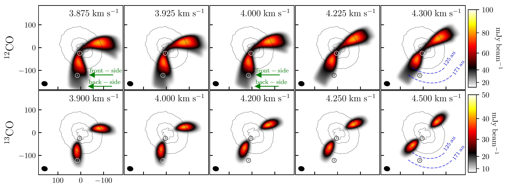
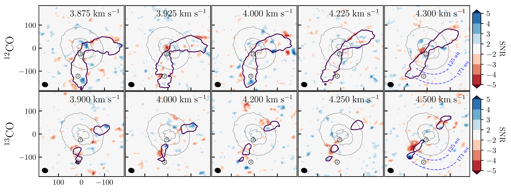
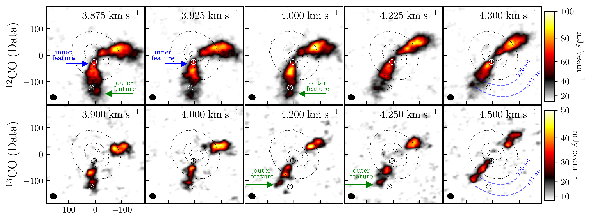
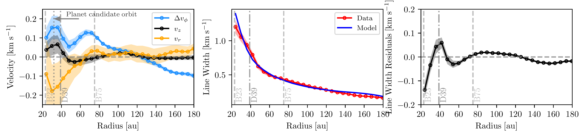

$\newcommand{\ensuremath}{}$
$\newcommand{\xspace}{}$
$\newcommand{\object}[1]{\texttt{#1}}$
$\newcommand{\farcs}{{.}''}$
$\newcommand{\farcm}{{.}'}$
$\newcommand{\arcsec}{''}$
$\newcommand{\arcmin}{'}$
$\newcommand{\ion}[2]{#1#2}$
$\newcommand{\textsc}[1]{\textrm{#1}}$
$\newcommand{\hl}[1]{\textrm{#1}}$
$\newcommand{\footnote}[1]{}$
$\newcommand{\anibal}[1]{{\color{orange}[ASierra: #1]}}$
$\newcommand{\andres}[1]{{\color{magenta}[andizq: #1]}}$
$\newcommand{\thebibliography}{\DeclareRobustCommand{\VAN}[3]{##3}\VANthebibliography}$

# Dust Substructures and Line Perturbations driven by a Forming Planet in J16120

<mark>Appeared on: 2026-09-08</mark> - 

A. Sierra, et al. -- incl., <mark>M. Benisty</mark>, <mark>N. Kurtovic</mark>

**Abstract:** Hints of planet formation have been independently reported within the gap of the disc around 2MASS J16120668–301027 from millimetre continuum, infrared, and H $\alpha$ observations. In this work, we present new evidence for ongoing planet formation based on Atacama Large Millimeter/submillimeter Array (ALMA) Band 7 observations, detecting 0.87 mm dust continuum emission together with $^{12}$ CO (J=3–2) and $^{13}$ CO (J=3–2) line emission. Visibility modelling of the continuum data reveals an inner disc and two dust rings peaking at 23 and 75 au. The continuum morphology is better reproduced by an eccentric disc model ( $e\sim0.1$ ) than by an axisymmetric disc. We further investigate the gas kinematics through modelling of the $^{12}$ CO channel maps. The residual line-width map shows a localised increase in velocity dispersion at the position of a previously reported circumplanetary disc candidate (deprojected radius $\sim$ 32 au, position angle $\sim$ 170 $^\circ$ ) and along its orbit. This signal is spatially coincident with kink-like features and a transition from sub-Keplerian to super-Keplerian velocities. In addition, the velocity residual map exhibits an arc-like structure extending outward from the planet candidate, while the gas kinematics—despite substantial uncertainties—is consistent with inflow towards the candidate's orbital radius. The observed increase in velocity dispersion agrees with predictions from planet–disc interaction simulations, which produce enhanced turbulence both at the planet location and along its orbital path. Taken together, the continuum morphology and gas kinematic signatures provide compelling new evidence for ongoing planet formation within the disc gap.

**Figure 14. -** Model (top rows) and residual maps (bottom rows) after subtracting the best fit discminer model. The green arrows indicate the emission from the frontside and backside of the disc in a few channel maps, which may mimic kink-like features. The position of the inner planet candidate at $r = 32$ au is marked by \protect\textcircled{**1**}, while that of the outer planet candidate at $r = 148$ au is marked by \protect\textcircled{**2**}. The iso-contours show the ALMA Band 7 dust continuum emission at 7-$\sigma$ level. (*fig:CO-channels_Model*)

**Figure 7. -** Continuum-subtracted selected $^{12}$CO (top panels) and $^{13}$CO (bottom panels) channel maps showing gas features in the inner disc (blue arrows) and in the outer disc (green arrows). The latter may arise from projection effects between the front and back sides of the disc, or a gas gap. The position of the inner planet candidate at $r = 32$ au is marked by \protect\textcircled{**1**}, while that of the outer planet candidate at $r = 148$ au is marked by \protect\textcircled{**2**}. The radial range between 125 and 171 au, where the outer feature is observed, is marked in the right panels. Colour bar in all panels starts at $1\sigma$. The iso-contours show the ALMA Band 7 dust continuum emission at 7-$\sigma$ level. (*fig:CO-channels*)

**Figure 10. -** Left panel: Gas velocity along the vertical ($v_z$) and radial ($v_R$) axes, and the azimuthal velocity difference with respect to the azimuthal rotation model ($\Delta v_{\phi}$).
    Middle panel: Azimuthally averaged line width from the data and model.
    Right panel: Azimuthally averaged line width residuals. The dashed/dashed-dotted vertical lines indicate the position of the rings/gaps. The dotted vertical line in the left panel indicate the radial position of the planet candidate at 32 au. The inner region within one beam size is not included. (*fig:Velocities_LineWidth*)

