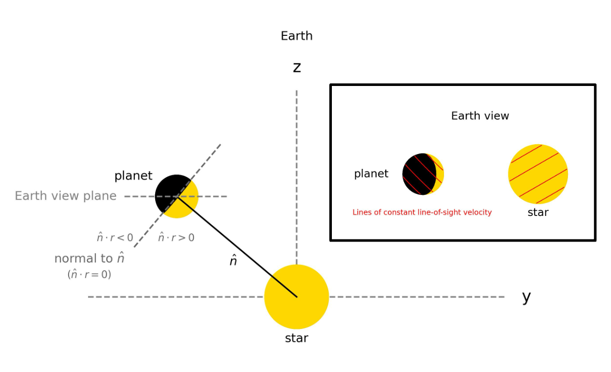
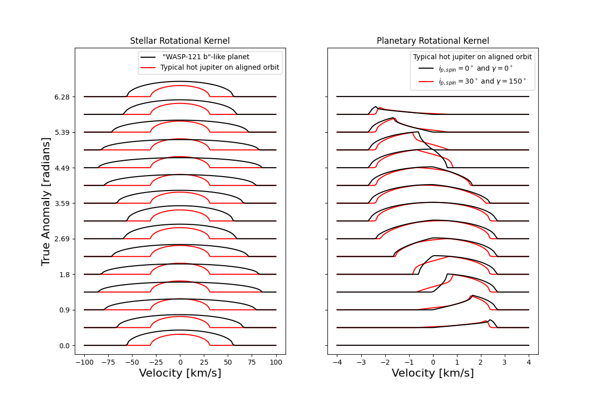
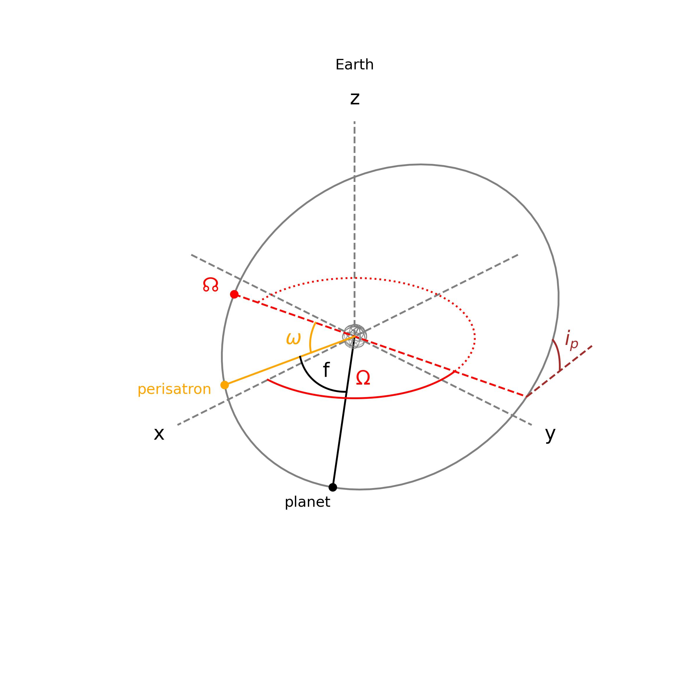

$\newcommand{\ensuremath}{}$
$\newcommand{\xspace}{}$
$\newcommand{\object}[1]{\texttt{#1}}$
$\newcommand{\farcs}{{.}''}$
$\newcommand{\farcm}{{.}'}$
$\newcommand{\arcsec}{''}$
$\newcommand{\arcmin}{'}$
$\newcommand{\ion}[2]{#1#2}$
$\newcommand{\textsc}[1]{\textrm{#1}}$
$\newcommand{\hl}[1]{\textrm{#1}}$
$\newcommand{\footnote}[1]{}$
$\newcommand{\orcit}[1]{\protect\href{https://orcid.org/#1}{\protect\includegraphics[width=8pt]{images/orcid.png}}}$
$\newcommand{\wx}{\omega_x}$
$\newcommand{\wy}{\omega_y}$
$\newcommand{\wz}{\omega_z}$
$\newcommand{\wxp}{\omega_{x'}}$
$\newcommand{\wyp}{\omega_{y'}}$
$\newcommand{\wzp}{\omega_{z'}}$
$\newcommand{\wps}{\omega_{p,\circlearrowright}}$
$\newcommand{\ips}{i_{p,\circlearrowright}}$
$\newcommand{\pdd}[2]{\frac{\partial #1}{\partial #2}}$

# Rotational broadening of exoplanet spectra in arbitrarily oriented systems: Application to reflected light

<mark>Appeared on: 2026-09-09</mark> -  _Accepted to A&A. 13 pages, 11 figures_

S. R. Vaughan, a. L. Kreidberg

**Abstract:** Exoplanet reflection spectra contain a wealth of information, which we are now beginning to access. At a high spectral resolution, the rotation of both the star and the planet affects the shape of the reflected spectral lines. This effect must be accounted for in high-resolution analyses and could be used to measure the orbital alignment of systems. In this work, we derive the rotational broadening kernels for arbitrarily aligned systems, both for the stellar spectrum viewed by the planet and for the reflected component of the planet's spectrum. We then determine the relation between the parameters of the kernels and the standard orbital parameters of an exoplanet system. Finally, we show examples of these kernels, compare them with previous models, and investigate the limitations imposed by our assumptions. We find that the difference in the rotational broadening of a non-aligned system relative to the broadening expected from a prograde aligned orbit can be of the order of $\SI{50}{\kilo\meter\per\second}$ . We also highlight how the equations and kernels presented in this work could be modified for other uses, such as thermal emission spectra.

**Figure 1. -** Illustration of a star and a planet showing how to find the day-night terminator. The inset shows the star and planet with example contours of constant line-of-sight velocity. (*fig:illustration*)

**Figure 11. -** Example of the new rotational broadening kernels. Left panel: Stellar rotational broadening kernels for a WASP-121 b-like planetary system and for a more typical hot Jupiter system with the planet on an aligned orbit. Right panel: Planetary rotational broadening kernel for a typical hot Jupiter with an aligned and non-aligned spin. Table \ref{tab:example_parameters} gives the full system parameters for the typical hot Jupiter and WASP-121 b-like planetary system. (*fig:example*)

**Figure 2. -** Angles defining the orientation of a planet's orbit. (*fig:planet_orbit*)

