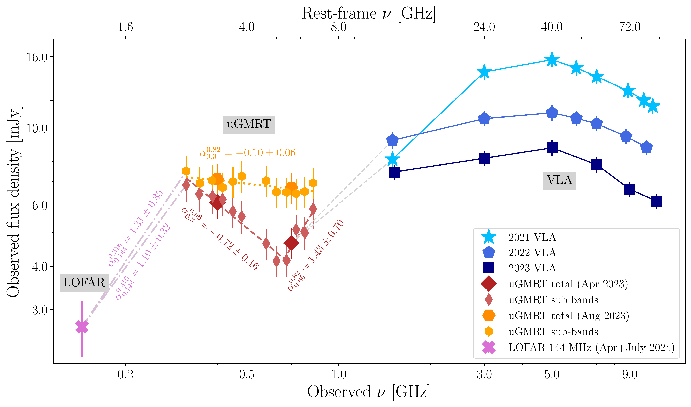
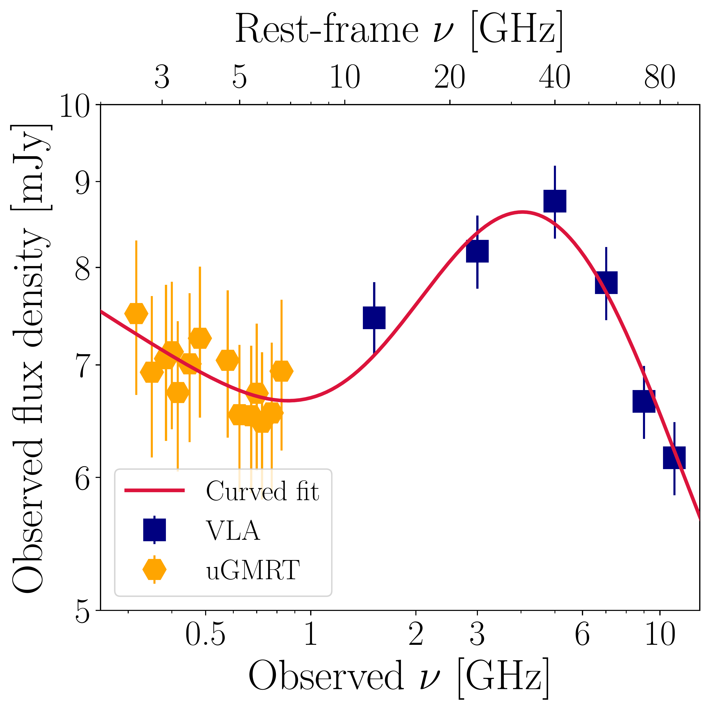
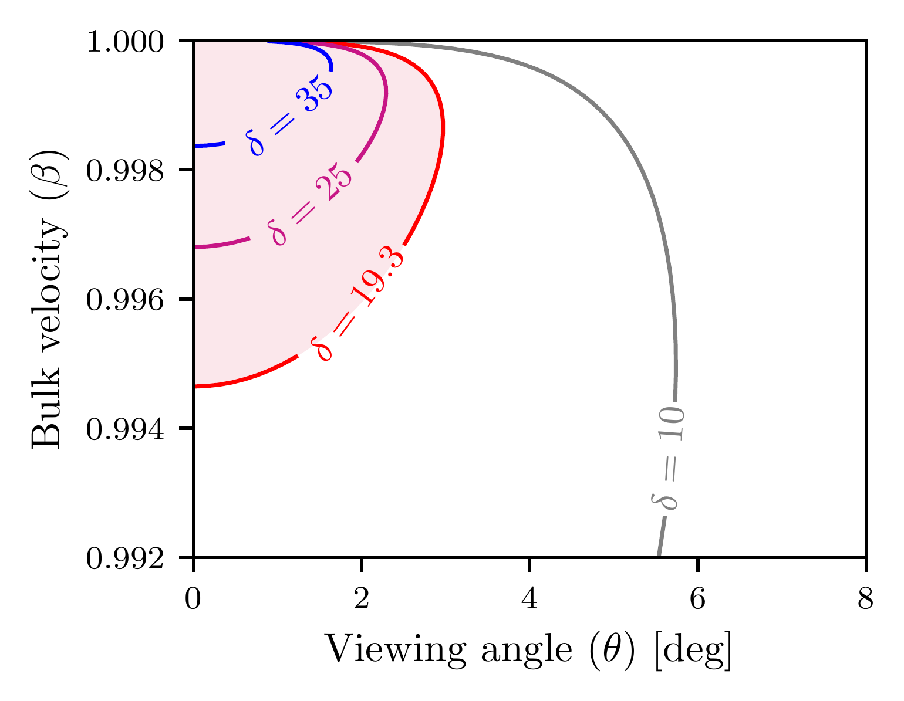
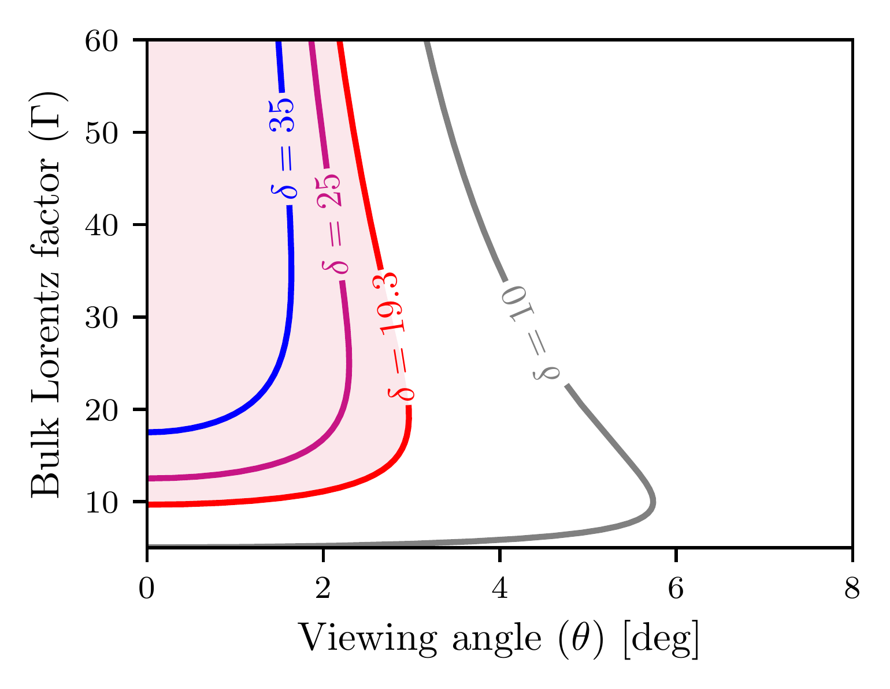

$\newcommand{\ensuremath}{}$
$\newcommand{\xspace}{}$
$\newcommand{\object}[1]{\texttt{#1}}$
$\newcommand{\farcs}{{.}''}$
$\newcommand{\farcm}{{.}'}$
$\newcommand{\arcsec}{''}$
$\newcommand{\arcmin}{'}$
$\newcommand{\ion}[2]{#1#2}$
$\newcommand{\textsc}[1]{\textrm{#1}}$
$\newcommand{\hl}[1]{\textrm{#1}}$
$\newcommand{\footnote}[1]{}$
$\newcommand{\vdag}{(v)^\dagger}$
$\newcommand\aastex{AAS\TeX}$
$\newcommand\latex{La\TeX}$

# Rapid radio variability in the $z\sim7$ blazar VLASS J0410$-$0139: \ Indication of a hidden population of weak radio jets at Cosmic Dawn

<mark>Appeared on: 2026-09-09</mark> -  _16 pages, 3 figures, 3 tables, Accepted for publication in ApJ_

<mark>S. Belladitta</mark>, et al. -- incl., <mark>E. Bañados</mark>, <mark>C. Fendt</mark>, <mark>F. Walter</mark>

**Abstract:** Doppler boosting allows blazars to be detected out to high- $z$ , making them promising probes of the intergalactic medium through the 21 cm forest.We report 0.144 $-$ 11 GHz observations of the most distant known blazar, VLASS J041009.05 $-$ 013919.88 at z $\sim$ 7, obtained with the upgraded Giant Metrewave Radio Telescope (uGMRT), the LOw Frequency ARray (LOFAR) and the Very Large Array (VLA).The first uGMRT epoch (300 $-$ 820 MHz, April 2023) revealed an inverted radio spectrum which, combinedwith earlier (2021--2022) VLA data (1.5--11 GHz), unveiled a double-peaked spectrum potentiallyindicative of multi-epoch jet activity.A second uGMRT campaign (August 2023), simultaneous with new VLA observations (1.5--11 GHz), instead revealed a flat low-frequency and a peaked high-frequency spectrum, ruling out this interpretation.While limited by the two uGMRT epochs, variability analysis favors intrinsic jet processes, indicating a highly relativistic, closely aligned jet ( $\theta<3$ deg, $\delta>19.3$ , $\Gamma>9.7$ ).The equipartition magnetic field ( $> 1$ mG) exceeds the equivalent Cosmic Microwave Background field at $z\sim7$ (0.2 mG), indicating synchrotron losses dominate.The inferred Doppler boosting ( $\delta>19.3$ ) implies that J0410 $-$ 0139 is intrinsically radio-weak. As a blazar, it traces a much larger parent population of radio quasars at $z\sim7$ , detectable only with deep ( $\leq \mu$ Jy) next-generation radio observations.LOFAR 144 MHz observations (April and July 2024) yielded $\sim$ 2 mJy, well below the $\sim$ 8 mJy predicted from uGMRT epochs, confirmingstrong variability at rest-frame $\sim$ 1 GHz.Low-frequency monitoring will be crucial for identifying high radio intensity states suitable for future 21 cm forest studies.

**Figure 2. -** Radio spectral energy distribution for J0410$-$0139 from observed MHz (LOFAR and uGMRT, reported in this paper) to GHz regime (VLA from \cite{banados2025} and VLA from 2023 reported in this work). The LOFAR data point is from the combination of the observations carried out in April and July 2024; considering the large uncertainties, no flux density variability has been observed between the two observations. _uGMRT_: The large diamond (hexagons) represents the overall radio flux density at 400 and 700 MHz from April 2023 (August 2023), while thin diamonds (hexagons) show the flux density in each spectral window of the two broad bands. Spectral indices computed in this paper are also shown close to the corresponding dataset. The dashed grey lines that concatenate uGMRT (April 2023) and VLA from 2021/2022 are drawn only for visual comparison.  (*fig:radio_spectra*)

**Figure 1. -** Quasi-simultaneous radio spectrum from the uGMRT + the VLA (2023). The radio SED shows two components: a flat power-law at lower frequencies, followed by a peaked spectrum at higher frequencies. The magenta curve represents the best fit to the data (see text and Eq. \ref{eq:curvedspec} for details). (*fig:ugmrtvla*)

**Figure 3. -** Allowed values of the jet viewing angle ($\theta$) and _left panel_: bulk velocity in units of the speed of light ($\beta=v/c$), _right  panel_: the bulk Lorentz factor ($\Gamma$). The red shaded area corresponds to the allowed parameter space in the $\beta-\theta$ and $\Gamma-\theta$ plane for the inferred $\delta>19.3$. Curves for other values of $\delta$ are shown for comparison. (*fig:jetparam*)

