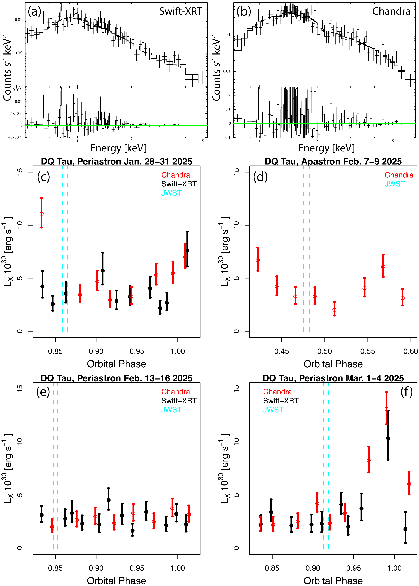
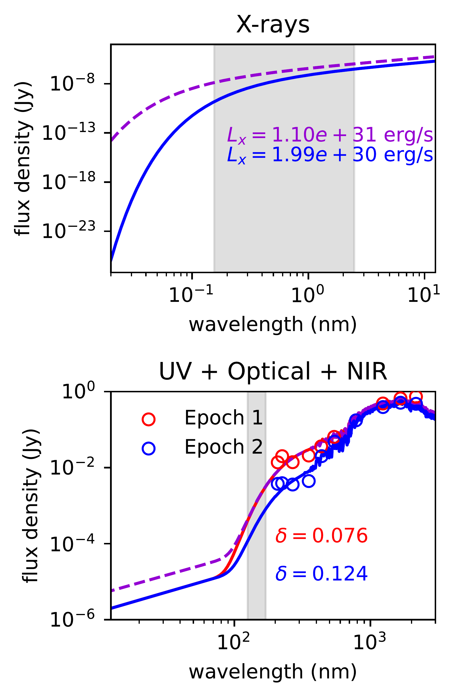
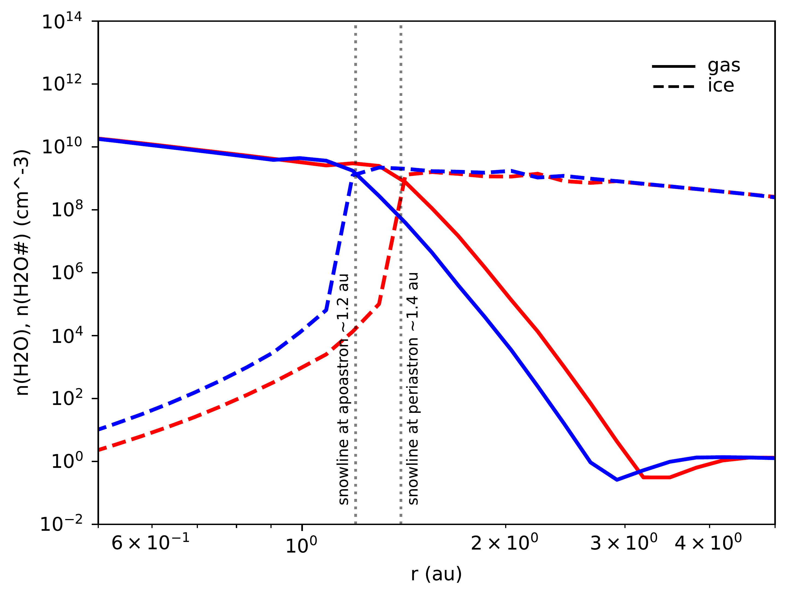

$\newcommand{\ensuremath}{}$
$\newcommand{\xspace}{}$
$\newcommand{\object}[1]{\texttt{#1}}$
$\newcommand{\farcs}{{.}''}$
$\newcommand{\farcm}{{.}'}$
$\newcommand{\arcsec}{''}$
$\newcommand{\arcmin}{'}$
$\newcommand{\ion}[2]{#1#2}$
$\newcommand{\textsc}[1]{\textrm{#1}}$
$\newcommand{\hl}[1]{\textrm{#1}}$
$\newcommand{\footnote}[1]{}$
$\newcommand{\Lxp}{L_X^\textit{f}}$
$\newcommand{\Lxa}{L_X^\textit{nf}}$
$\newcommand{\Txp}{T_X^\textit{f}}$
$\newcommand{\Txa}{T_X^\textit{nf}}$
$\newcommand{\Lsun}{L_{\odot}}$
$\newcommand{\Lfuv}{L_\mathrm{FUV}}$
$\newcommand{\Laccp}{L_{\mathrm{acc}}^{\mathrm{p}}}$
$\newcommand{\Lacca}{L_{\mathrm{acc}}^{\mathrm{a}}}$
$\newcommand{\Rsun}{R_{\odot}}$
$\newcommand{\Msun}{M_{\odot}}$
$\newcommand{\puv}{p_\mathrm{UV}}$
$\newcommand{\micron}{\mu \mathrm{m}}$
$\newcommand\prodimo{\texttt{ProDiMo}}$
$\newcommand{\flits}{\texttt{FLiTs}}$
$\newcommand{\taurel}{\tau_{\rm{rel}}}$
$\newcommand{\spitzer}{\textit{Spitzer}}$
$\newcommand{\kb}{k_\text{B}}$
$\newcommand{\rev}[1]{{#1}}$
$\newcommand{\revv}[1]{\textcolor{red}{#1}}$

# The Effect of X-Ray and Accretion Variability on Mid-Infrared Lines in the Young Disk-Bearing Binary DQ Tau

<mark>Appeared on: 2026-09-09</mark> -  _16 pages, 11 figures, 2 Tables. Accepted for publication in Astronomy and Astrophysics, September 2, 2026_

B. Portilla-Revelo, et al. -- incl., <mark>D. Semenov</mark>

**Abstract:** A star's radiation field is the main energy source of a planet-forming disk. Stellar photons---from X-rays to optical---are reprocessed in the inner protoplanetary disk enabling mid-infrared (mid-IR) diagnostics of the disk's physical conditions. Most pre-main-sequence stars accrete at moderate rates and emit X-rays efficiently. Such activity is expected to drive stochastic variability in the stellar spectrum. It is not clear to what extent such variability affects the thermochemical structure of protoplanetary disks. We aim to examine the effect of routine accretion variability and X-ray flares on the thermochemical structure and mid-IR line emission spectra of protoplanetary disks. We combine multiepoch, contemporaneous X-ray and NUV/optical observations of the DQ Tau binary with JWST/MIRI spectra of its circumbinary disk. We interpret the data and assess the effect of a varying stellar spectrum on the disk using a forward thermochemical model illustrative of the system. Synthetic mid-IR fluxes of $\ce{CO}$ , $\ce{CO2}$ , $\ce{HCN}$ , and $\ce{H2O}$ are systematically stronger at periastron than at apastron due to a fourfold increase in accretion luminosity. Variations in the integrated fluxes lie within a factor of two between epochs, in reasonable agreement with the JWST/MIRI spectra of DQ Tau. Routine stellar variability induces only modest changes in the disk's thermochemical structure, yet it can still shift the snowline outwards by $17$ \% relative to its apastron position. Because the JWST observations did not coincide with X-ray flares, our flare results rely on simulations: moderate-intensity flares leave most mid-IR molecular emission unchanged; in contrast, X-ray flares strongly enhance the abundances and mid-IR luminosities of $\ce{H I}$ , $\ce{Ar II}$ , and $\ce{Ne II}$ in the disk surface. Our results imply that the $\spitzer$ /JWST line variability observed in non-outbursting systems is consistent with moderately variable stellar spectra driven by accretion and magnetospheric activity.

**Figure 8. -** X-ray spectra and light curves of DQ Tau obtained during our January--March 2025 campaign with _Chandra_ and _Swift_. Panels (a-b): Time-averaged spectra combined across all _Swift_-XRT (a) and _Chandra_(b) observations. Data points with error bars represent the observed spectra; the best-fit models are shown as solid curves. The lower subpanels display the data-model residuals. Panels (c-f): X-ray light curves from _Swift_-XRT (black points) and _Chandra_(red points), with the timing of JWST/MIRI observations indicated by cyan dashed lines. (*fig:chandra_swift_dqtau_2025*)

**Figure 1. -** Stellar flux densities at periastron and apastron. _Top:_ X-ray components in the interval between $62$ keV and $100$ eV. The blue curve indicates the X-ray baseline spectrum and dashed violet curve indicates the flaring X-ray spectrum. The shaded area covers the $0.5$ and $8$ keV interval where X-ray luminosities are calculated from the synthetic spectra and compared to the _Chandra_ observations. _Bottom:_ UV, optical and near-infrared components. The blue curve is the spectrum at apastron, the solid red curve indicates the spectrum at periastron for the X-ray non-flaring case, and the dashed violet curve represents the X-ray flaring case. $\rev${The quantity $\delta$ represents the deviation of the FUV luminosity within the interval $125-170$ nm, indicated by the grey area, relative to the empirical relation by [Yang, et. al (2012)](https://ui.adsabs.harvard.edu/abs/2012ApJ...744..121Y). Open circles indicate the photometry at both epochs.} (*fig:starSpec*)

**Figure 2. -** $\rev${Gas- and solid-phase water abundances in the disk midplane at periastron (red) and apastron (blue)}. Results are shown for two disk models: periastron (including the accretion burst; red) and apastron (without the accretion burst; blue). Both models employ the "nf" X-ray configuration, accounting only for baseline X-ray emission. The water snowlines indicate where the gas- and solid-phase abundances are equal; these locations are marked by the vertical dotted lines. (*fig:snowline*)

