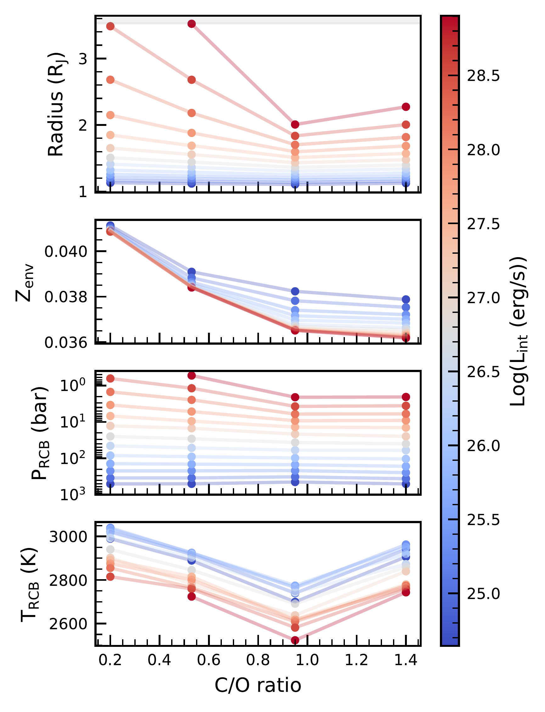
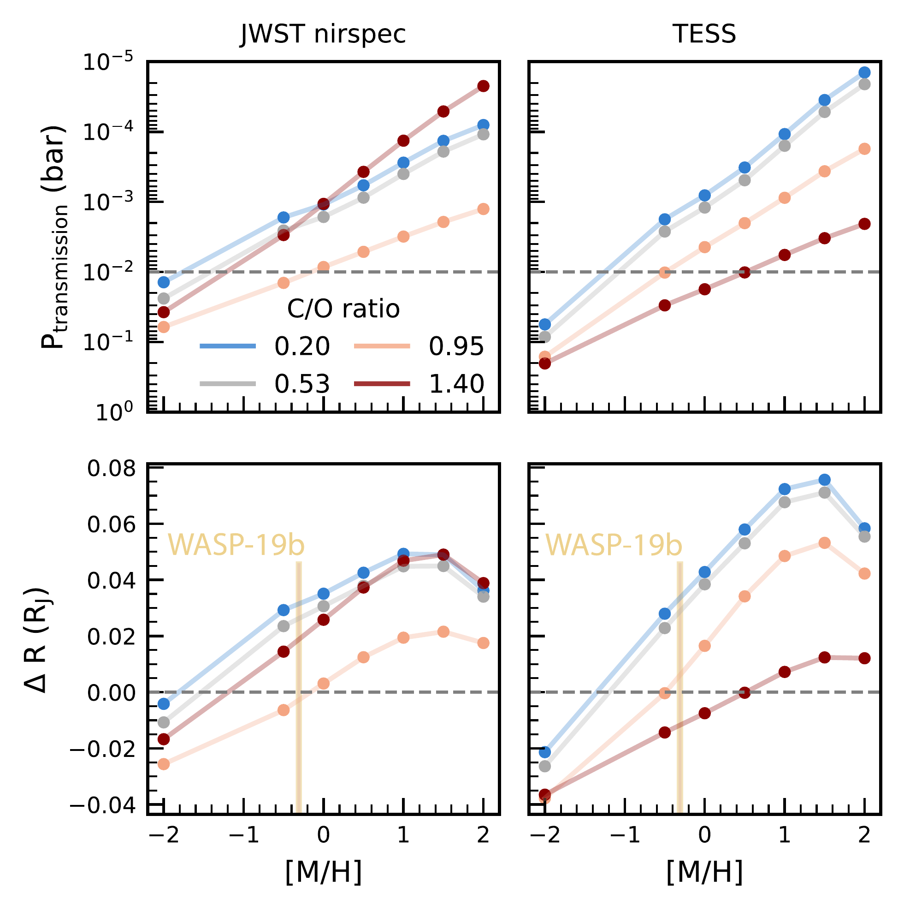
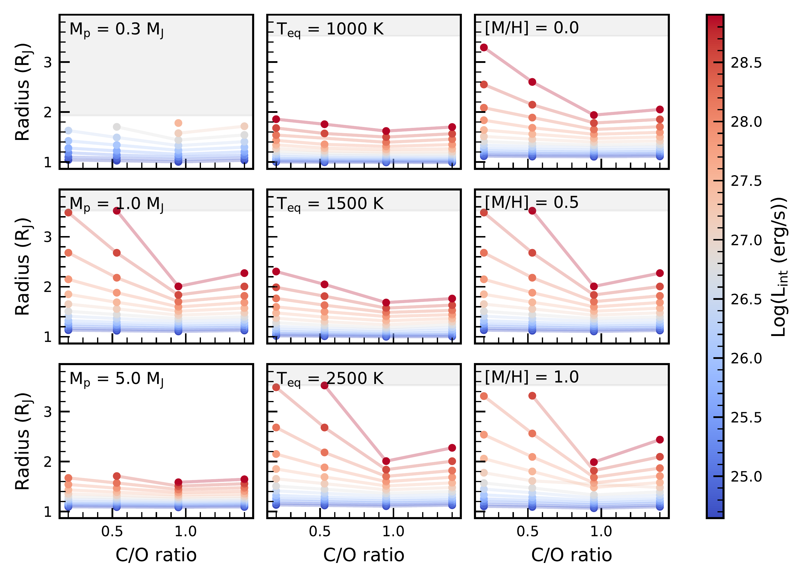

$\newcommand{\ensuremath}{}$
$\newcommand{\xspace}{}$
$\newcommand{\object}[1]{\texttt{#1}}$
$\newcommand{\farcs}{{.}''}$
$\newcommand{\farcm}{{.}'}$
$\newcommand{\arcsec}{''}$
$\newcommand{\arcmin}{'}$
$\newcommand{\ion}[2]{#1#2}$
$\newcommand{\textsc}[1]{\textrm{#1}}$
$\newcommand{\hl}[1]{\textrm{#1}}$
$\newcommand{\footnote}[1]{}$
$\newcommand{\thebibliography}{\DeclareRobustCommand{\VAN}[3]{##3}\VANthebibliography}$

# The effect of the atmospheric C/O ratio on interiors of hot Jupiters

<mark>Appeared on: 2026-09-09</mark> -  _16 pages, 9 figures, accepted for publication in MNRAS_

E. v. Dijk, Y. Miguel, <mark>P. Mollière</mark>

**Abstract:** The atmosphere is the outer boundary of a gas giant exoplanet's interior. Therefore, compositional changes in the atmosphere can affect interior inferences. Typically, only metallicity is considered in atmospheric boundary conditions, while other elemental ratios, in particular the C/O ratio, are assumed to be solar. In light of the observational constraints now achievable with JWST, this assumption might no longer be justified.In this work, we investigate the effect of the C/O ratio on atmospheric boundary conditions, interiors and radii of hot Jupiters.We construct an atmospheric boundary grid, consisting of one-dimensional atmospheric models in radiative-convective and thermochemical equilibrium. This grid is coupled to a static interior structure model at the radiative-convective boundary (RCB).Because in the temperature regime of hot Jupiters, the C/O ratio determines the dominant species in the atmosphere, it can significantly alter the opacity and, consequently, the pressure and temperature at the RCB. This temperature change propagates into the convective interior, thus affecting the calculated radius. The radius difference relative to a solar C/O-atmosphere significantly exceeds observed radius uncertainties of 3 per cent for planets with equilibrium temperatures $\gtrsim$ 1500 K and super-solar atmospheric metallicities. As an example, we demonstrate that, for WASP-19 b, higher C/O ratios result in higher inferred intrinsic temperatures.These results highlight the importance of treating atmospheric composition and interior structure as a coupled system. As atmospheric constraints improve, incorporating measured C/O ratios into atmospheric boundary conditions is necessary to obtain robust inferences of hot Jupiter interiors.

**Figure 3. -** Variation of radius, envelope metal mass fraction, RCB pressure and RCB temperature as a function of atmospheric C/O ratio for different intrinsic luminosities. We use a 1 M$_\mathrm{J}$ planet with an equilibrium temperature of 2500 K, a core mass fraction of 0.1 and an atmospheric metallicity of 3 $\times$ solar. (*fig:effect_of_co_oneplanet*)

**Figure 5. -** The transmission pressure (top) and the corresponding difference in radius compared to the assumed transmission pressure (bottom) for different instrumental throughput functions and different atmospheric compositions. Different colours correspond to different C/O ratios. WASP-19b's observational uncertainties on the radius and atmospheric metallicity are shown for reference.  (*fig:transmission_radius*)

**Figure 8. -** Variation in radius with C/O ratio for different planetary masses, equilibrium temperatures and atmospheric metallicities. In the first column, the planetary mass is varied for a planet with an equilibrium temperature of 2500 K and an atmospheric metallicity of 3 $\times$ solar. In the second column, the equilibrium temperature is varied for a 1 M$_\mathrm{J}$ planet with an atmospheric metallicity of 3 $\times$ solar. In the third column, the atmospheric metallicity is varied for a 1 M$_\mathrm{J}$ planet with an equilibrium temperature of 2500 K. The grey shaded areas indicate radii outside the atmospheric grid with log $g$ > 5.0 or log $g$ < 2.3. (*fig:effect_of_co_differentvariations*)

