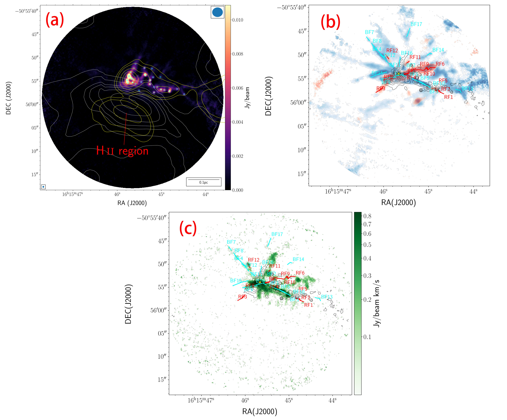
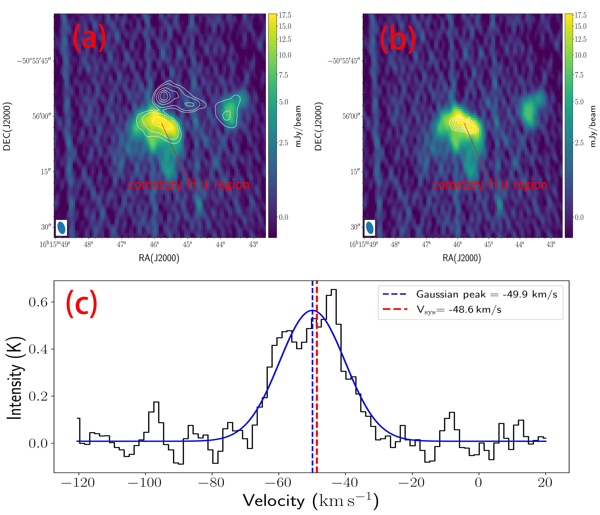
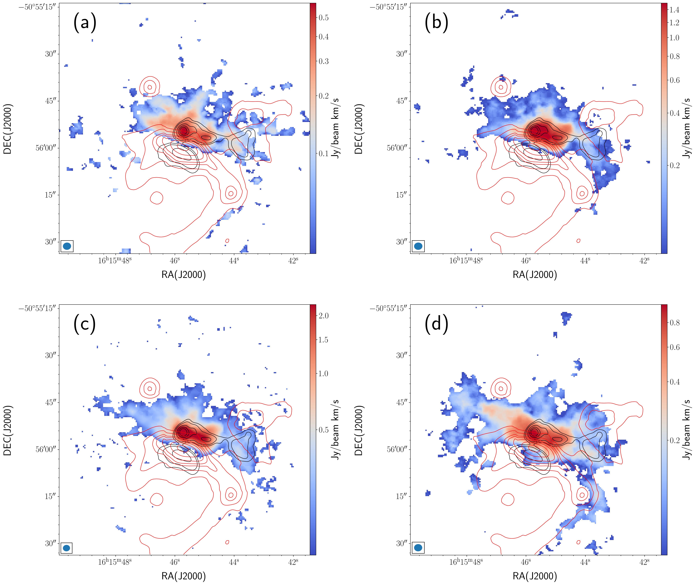

$\newcommand{\ensuremath}{}$
$\newcommand{\xspace}{}$
$\newcommand{\object}[1]{\texttt{#1}}$
$\newcommand{\farcs}{{.}''}$
$\newcommand{\farcm}{{.}'}$
$\newcommand{\arcsec}{''}$
$\newcommand{\arcmin}{'}$
$\newcommand{\ion}[2]{#1#2}$
$\newcommand{\textsc}[1]{\textrm{#1}}$
$\newcommand{\hl}[1]{\textrm{#1}}$
$\newcommand{\footnote}[1]{}$
$\newcommand{\hi}{\mbox{H \textsc{i}}\xspace}$
$\newcommand{\hii}{\mbox{H \textsc{ii}}\xspace}$
$\newcommand{\msun}{\mbox{M_\odot}\xspace}$
$\newcommand{\Lsun}{\mbox{L_\odot}\xspace}$
$\newcommand{\kms}{\mbox{km s^{-1}}\xspace}$
$\newcommand{\hco}{\mbox{HCO^+}\xspace}$
$\newcommand{\hsco}{\mbox{H^{13}CO^+}\xspace}$
$\newcommand{\hcn}{\mbox{HCN}\xspace}$
$\newcommand{\hscn}{\mbox{H^{13}CN}\xspace}$
$\newcommand{\hcsn}{\mbox{HC_{3}N}\xspace}$
$\newcommand{\numred}{6\xspace}$
$\newcommand{\numblue}{10\xspace}$
$\newcommand{\numtot}{16\xspace}$
$\newcommand{\bluevrange}{[-92, -54] km s^{-1}\xspace}$
$\newcommand{\redvrange}{[-37, 13] km s^{-1}\xspace}$
$\newcommand{\MassMsun}{2.0}$
$\newcommand{\MomentumMsunkms}{62.3}$
$\newcommand{\EnergyErg}{2.5\times10^{46}}$
$\newcommand{\tdyn}{5900}$
$\newcommand\theadfont{\small\bfseries}$
$\newcommand{\arraystretch}{1.5}$
$\newcommand{\thebibliography}{\DeclareRobustCommand{\VAN}[3]{##3}\VANthebibliography}$

# ALMA Reveals an Explosive Outflow Candidate in IRAS 16119--5048

<mark>Appeared on: 2026-09-09</mark> -  _accepted for publication in Monthly Notices of the Royal Astronomical Society_

Y. Luo, et al. -- incl., <mark>F. Xu</mark>, <mark>J. Li</mark>

**Abstract:** We present a multiwavelength study of the massive star formation region IRAS 16119--5048 (I16119) using ALMA ATOMS Band 3 and QUARKS Band 6 observations, complemented by archival ATCA radio continuum and _Spitzer_ mid-infrared data.The CO (2--1) emission reveals a system of high-velocity streamer-like structures around the central region.Using a dendrogram analysis of velocity-channel maps followed by linking in position--position--velocity space, we identify $\numtot$ streamers that are approximately radially distributed and whose projected trajectories converge toward a common central region.We found that the kinetic energy of the outflows is at least an order of magnitude lower than those of most known explosive outflows, but the mass entrainment rate and momentum rate are high compared with typical protostellar outflows, suggesting that I16119 may represent a low-energy explosive outflow candidate.Dense-gas and photodissociation-region tracers reveal shell-like structures associated with the 8 $\mu$ m emission, indicating that feedback from the $\hii$ region may influence the streamer morphology.The 1.3 mm continuum emission resolves 27 dense cores along a fragmented filamentary structure.Their separations are consistent with thermal Jeans or thermal cylindrical fragmentation, while the collect and collapse scenario is unsupported.The dense cores also show evidence of mass segregation, with the most massive cores concentrated near the inferred explosive center.We therefore suggest that I16119 is a plausible low-energy explosive outflow candidate, possibly triggered by dynamical interactions among centrally concentrated massive cores.However, the complex velocity structure and possible contamination from individual core-driven outflows prevent a definitive classification. More sensitive, higher-angular-resolution, and dedicated observations are required to confirm the nature of the outflow in this region.

**Figure 6. -** 
    Panel (a): 1.3 mm continuum emission map (color scale), overlaid with 3 mm continuum emission contours (yellow) and _ Spitzer_ 8 $\mu$m emission contours (white).
    The 3 mm contours are plotted at [0.1, 0.15, 0.3, 0.5, 0.7]$\times$ the peak intensity ($0.024 \mathrm{Jy beam^{-1}}$), while the 8 $\mu$m contours correspond to [3, 5, 8, 10, 13, 18, 25]$\times\sigma$($\sigma=107 \mathrm{MJy sr^{-1}}$).
    The synthesized beams of the 1.3 mm and 3 mm continuum are shown in the bottom-left and top-right corners, respectively.
    The small cyan circles denote the positions of dense cores identified in Section \ref{sect:cores_iden}.
    Panel (b): Integrated intensity maps of CO (2--1), with the blueshifted ($-92$ to $-57$ km s$^{-1}$) and redshifted ($-37$ to $+13$ km s$^{-1}$) components shown in blue and red, respectively.
    The identified streamer-like structures are marked with cyan and red lines for the blueshifted and redshifted components, respectively.
    Panel (c): Integrated intensity map of SiO (5--4) emission integrated over $-100$ to $-20$\kms, shown in green color scale, with the same streamer-like structure overlays as in panel (b).
    In both panels (b) and (c), black contours show the 1.3 mm continuum emission at [5, 9, 15, 27, 50, 70]$\times\sigma$($\sigma=0.29 \mathrm{mJy beam^{-1}}$), and the yellow star marks the inferred explosion center.
     (*fig:cont_EO*)

**Figure 5. -** 
    Panel (a): ATCA 6 cm continuum emission toward I16119 shown in color scale.
    White contours show the ALMA 3 mm continuum emission at
    $[0.1, 0.15, 0.3, 0.5, 0.7, 1]\times$ the peak intensity
    (0.024 mJy beam$^{-1}$).
    Panel (b): Same 6 cm continuum map with white contours showing the integrated
    intensity of the ALMA H40$\alpha$ recombination line integrated from
    $-80$ to $-20$ km s$^{-1}$.
    Contour levels are $[4,5,6,7,8]\sigma$ with
    $\sigma = 0.046$ Jy beam$^{-1}$ km s$^{-1}$.
    Panel (c): H40$\alpha$ spectrum extracted at the peak of the integrated emission.
    The blue curve shows the Gaussian fit.
    The blue dashed line marks the fitted velocity ($-49.9$ km s$^{-1}$),
    and the red dashed line indicates the systemic velocity of I16119
    ($V_{\rm sys}=-48.6$ km s$^{-1}$).
    The synthesized beam of the ATCA 6 cm continuum is shown in the lower left
    corner of panels (a) and (b).
     (*fig:H40_alpha*)

**Figure 7. -** 
    Panels (a)–(d) show the integrated intensity maps of $\hsco$(1--0), $\hscn$(1--0), $\hcsn$(11--10), and CCH (1--0), respectively.
    Red contours show the _Spitzer_ 8 $\mu$m emission at [3, 5, 8, 10, 13, 18, 25]$\times\sigma$($\sigma=107 \mathrm{MJy sr^{-1}}$).
    Black contours indicate the ALMA 3 mm emission at [0.1, 0.15, 0.3, 0.5, 0.7]$\times$ the peak intensity ($0.024 \mathrm{Jy beam^{-1}}$).
    The synthesized beam for each molecular line is shown in the bottom-left corner of the corresponding panel.
     (*fig:mol*)

