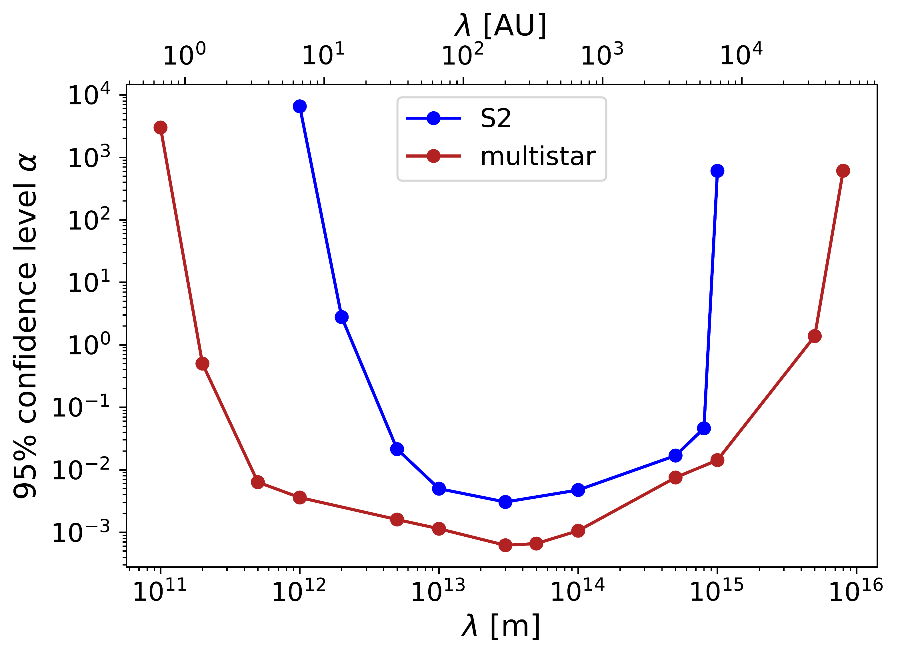
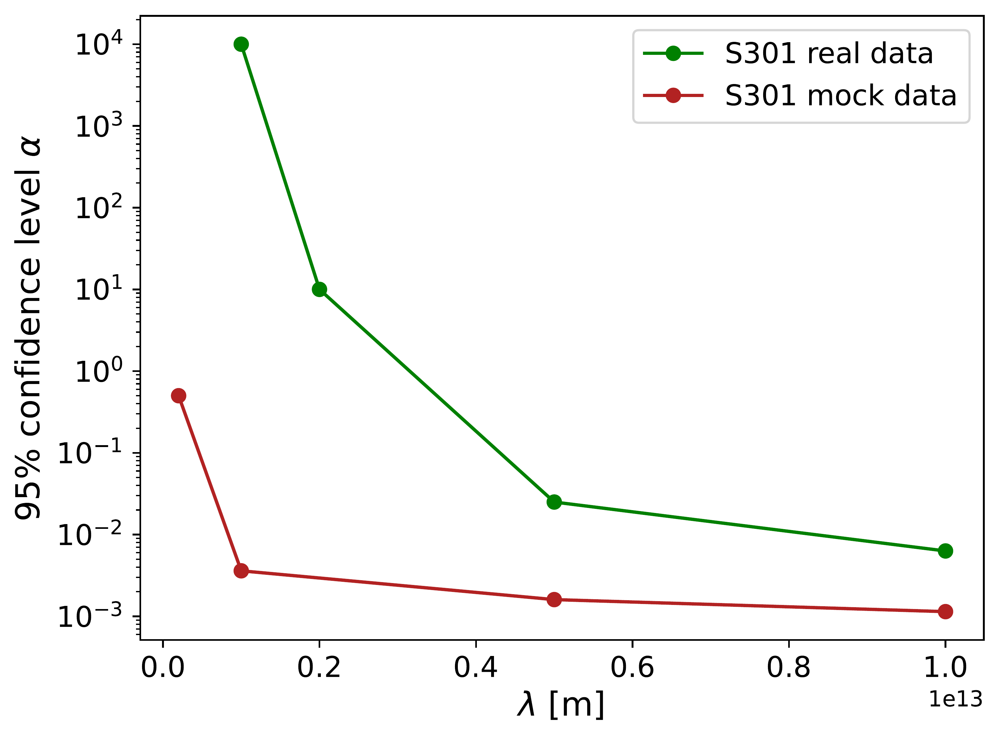
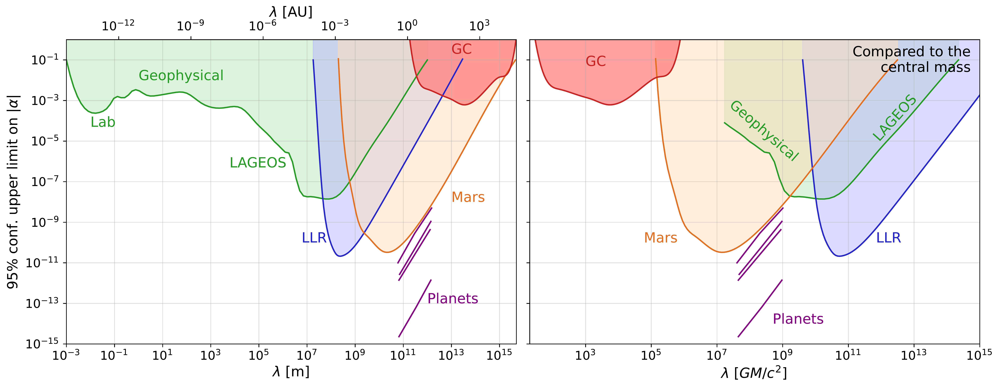

$\newcommand{\ensuremath}{}$
$\newcommand{\xspace}{}$
$\newcommand{\object}[1]{\texttt{#1}}$
$\newcommand{\farcs}{{.}''}$
$\newcommand{\farcm}{{.}'}$
$\newcommand{\arcsec}{''}$
$\newcommand{\arcmin}{'}$
$\newcommand{\ion}[2]{#1#2}$
$\newcommand{\textsc}[1]{\textrm{#1}}$
$\newcommand{\hl}[1]{\textrm{#1}}$
$\newcommand{\footnote}[1]{}$
$\newcommand{\af}[1]{{\textcolor{red}{\sf{[Arianna: #1]}} }}$
$\newcommand{\LIRA}{1}$
$\newcommand{\CotedAzur}{2}$
$\newcommand{\MPE}{3}$
$\newcommand{\IPAG}{4}$
$\newcommand{\MPIA}{5}$
$\newcommand{\UCologne}{6}$
$\newcommand{\ESOGarching}{7}$
$\newcommand{\USouthampton}{8}$
$\newcommand{\KUL}{9}$
$\newcommand{\FEUP}{10}$
$\newcommand{\UBerkley}{11}$
$\newcommand{\TUM}{12}$
$\newcommand{\CENTRA}{13}$
$\newcommand{\UCD}{14}$
$\newcommand{\UNAM}{15}$
$\newcommand{\CRAL}{16}$
$\newcommand{\KAVLI}{17}$
$\newcommand{\ESOSantiago}{18}$
$\newcommand{\CNRSChile}{19}$
$\newcommand{\beq}{\begin{equation}}$
$\newcommand{\eeq}{\end{equation}}$
$\newcommand{\iorb}{i_{\rm obs}}$
$\newcommand{\oorb}{\omega_{\rm obs}}$
$\newcommand{\Oorb}{\Omega_{\rm obs}}$
$\newcommand{\sgra}{SgrA^* }$
$\newcommand{\af}[1]{{\textcolor{red}{\sf{[Arianna: #1]}} }}$
$\newcommandcitealias{GRAVITY:2025ahf}{Paper I}$
$\newcommand{\LIRA}{1}$
$\newcommand{\CotedAzur}{2}$
$\newcommand{\MPE}{3}$
$\newcommand{\IPAG}{4}$
$\newcommand{\MPIA}{5}$
$\newcommand{\UCologne}{6}$
$\newcommand{\ESOGarching}{7}$
$\newcommand{\USouthampton}{8}$
$\newcommand{\KUL}{9}$
$\newcommand{\FEUP}{10}$
$\newcommand{\UBerkley}{11}$
$\newcommand{\TUM}{12}$
$\newcommand{\CENTRA}{13}$
$\newcommand{\UCD}{14}$
$\newcommand{\UNAM}{15}$
$\newcommand{\CRAL}{16}$
$\newcommand{\KAVLI}{17}$
$\newcommand{\ESOSantiago}{18}$
$\newcommand{\CNRSChile}{19}$
$\begin{document}$
$\title{Improving constraints on the Yukawa correction at the Galactic Center with multiple stellar orbits}$
$\author{$
$    The GRAVITY^+ Collaboration\fnmsep\thanks{$
$    GRAVITY is developed in collaboration by MPE / LIRA of Paris Observatory / CNRS / Sorbonne Université / Univ. Paris Diderot / IPAG of Université Grenoble Alpes / MPIA / Univ. of Cologne / CENTRA - Centro de Astrofisica e Gravitação / ESO. },$
$    A.~Foschi\inst{\LIRA}\fnmsep\thanks{Corresponding author: arianna.foschi@obspm.fr},$
$    K.~Abd~El~Dayem\inst{\LIRA},$
$    N.~Aimar\inst{\FEUP,\CENTRA},$
$    A.~Berdeu\inst{\ESOGarching,\LIRA},$
$    J.-P.~Berger\inst{\IPAG},$
$    G.~Bourdarot\inst{\MPE},$
$    W.~Brandner\inst{\MPIA},$
$    Y.~Cao\inst{\MPE},$
$    C.~Correia\inst{\FEUP,\CENTRA},$
$    S.~Cueves~Cardona\inst{\UNAM},$
$    R.~Davies\inst{\MPE},$
$    D.~Defr{è}re\inst{\KUL},$
$    F.~Delplancke-Str{ö}bele \inst{\ESOGarching},$
$    A.~Drescher\inst{\IPAG},$
$    F.~Eisenhauer\inst{\MPE,\TUM},$
$    L.~Esteras~Otal\inst{\ESOGarching},$
$    M.~Fabricius\inst{\MPE},$
$    H.~Feuchtgruber\inst{\MPE},$
$    S.~Flesch\inst{\MPE},$
$    N.M.~F{ö}rster~Schreiber\inst{\MPE},$
$    Q.~Fournier\inst{\MPE},$
$    P.~Garcia\inst{\FEUP,\CENTRA},$
$    R.~Garcia~Lopez\inst{\UCD},$
$    R.~Genzel\inst{\MPE,\UBerkley},$
$    S.~Gillessen\inst{\MPE},$
$    F.~Gont{é}\inst{\ESOGarching},$
$    X.~Haubois\inst{\ESOSantiago},$
$    S.F.~H{ö}nig\inst{\USouthampton},$
$    M.~Houll{é}\inst{\IPAG},$
$    S.~Joharle\inst{\MPE},$
$    J.~Kammerer\inst{\ESOGarching},$
$    A.~Kaufer\inst{\ESOSantiago},$
$    P.~Kervella\inst{\LIRA, \CNRSChile},$
$    L.~Kreidberg\inst{\MPIA},$
$    L.~Labadie\inst{\UCologne},$
$    S.~Lacour\inst{\LIRA,\ESOGarching},$
$    O.~Lai\inst{\CotedAzur},$
$    R.~Laugier\inst{\KUL},$
$    J.-B.~Le~Bouquin\inst{\IPAG},$
$    J.~Leftley\inst{\USouthampton},$
$    R.~Li\inst{\MPE},$
$    B.~Lopez\inst{\CotedAzur},$
$    D.~Lutz\inst{\MPE},$
$    F.~Mang\inst{\MPE},$
$    A.~M{é}rand\inst{\ESOGarching},$
$    F.~Millour\inst{\CotedAzur},$
$    M.~Montarg{è}s\inst{\LIRA},$
$    N.~Moruj{ã}o\inst{\FEUP,\CENTRA},$
$    H.~Nowacki\inst{\CotedAzur},$
$    M.~Nowak\inst{\LIRA},$
$    J.~Osorno\inst{\LIRA},$
$    T.~Ott\inst{\MPE},$
$    S.~Pappert\inst{\MPE},$
$    C.~Paladini\inst{\ESOSantiago},$
$    T.~Paumard\inst{\LIRA},$
$    K.~Perraut\inst{\IPAG},$
$    G.~Perrin\inst{\LIRA},$
$    R.~Petrov\inst{\CotedAzur},$
$    N.~Pourr{é}\inst{\IPAG},$
$    S.~Rabien\inst{\MPE},$
$    D.C.~Ribeiro\inst{\MPE},$
$    S.~Robbe-Dubois\inst{\CotedAzur},$
$    M.~Sadun~Bordoni\inst{\MPE},$
$    J.~Sanchez-Bermudez\inst{\UNAM},$
$    J.~Sauter\inst{\MPIA},$
$    J.~Scigliuto\inst{\CotedAzur},$
$    J.~Shangguan\inst{\MPE,\KAVLI},$
$    T.T.~Shimizu\inst{\MPE},$
$    F.~Soulez\inst{\CRAL},$
$    S.~Spezzano\inst{\MPE},$
$    C.~Straubmeier\inst{\UCologne},$
$    E.~Sturm\inst{\MPE},$
$    M.~Subroweit\inst{\UCologne},$
$    C.~Sykes\inst{\USouthampton},$
$    L.J.~Tacconi\inst{\MPE},$
$    P.~Th{é}venet\inst{\LIRA},$
$    I.~Urso\inst{\LIRA},$
$    F.H.~Vincent\inst{\LIRA},$
$    J.~Woillez\inst{\ESOGarching},$
$    G.~Zins\inst{\ESOSantiago}$
$}$
$\institute{$
$    LIRA, Observatoire de Paris, Universit{é} PSL, CNRS, Sorbonne Universit{é}, Universit{é} de Paris, 5 place Jules Janssen, 92190 Meudon, France$
$    \and$
$    Universit{é} C{\^o}te d'Azur, Observatoire de la C{\^o}te d'Azur, CNRS, Laboratoire Lagrange, France$
$    \and$
$    Max Planck Institute for Extraterrestrial Physics, Giessenbachstra{\ss}e 1, 85748 Garching, Germany$
$    \and$
$    Univ. Grenoble Alpes, CNRS, IPAG, 38000 Grenoble, France$
$    \and$
$    Max Planck Institute for Astronomy, K{ö}nigstuhl 17, 69117 Heidelberg, Germany$
$    \and$
$    1st Institute of Physics, University of Cologne, Z{ü}lpicher Stra{\ss}e 77, 50937 Cologne, Germany$
$    \and$
$    European Southern Observatory, Karl-Schwarzschild-Stra{\ss}e 2, 85748 Garching, Germany$
$    \and$
$    School of Physics \& Astronomy, University of Southampton, Southampton, SO17 1BJ, United Kingdom$
$    \and$
$    Institute of Astronomy, KU Leuven, Celestijnenlaan 200D, 3001 Leuven, Belgium$
$    \and$
$    Faculdade de Engenharia, Universidade do Porto, rua Dr. Roberto Frias, 4200-465 Porto, Portugal$
$    \and$
$    Departments of Physics \& Astronomy, Le Conte Hall, University of California, Berkeley, CA 94720, USA$
$    \and$
$    Technical University of Munich, TUM School of Natural Sciences, Physics Department, 85747 Garching, Germany$
$    \and$
$    CENTRA -- Centro de Astrof{í}sica e Gravitaç{ã}o, IST, Universidade de Lisboa, 1049-001 Lisboa, Portugal$
$    \and$
$    School of Physics, University College Dublin, Belfield, Dublin 4, Ireland$
$    \and$
$    Universidad Nacional Autónoma de México. Instituto de Astronomía. A.P. 70-264, 04510, Ciudad de México, México$
$    \and$
$    Univ. Lyon, Univ. Lyon 1, ENS de Lyon, CNRS, Centre de Recherche Astrophysique de Lyon UMR5574, F-69230 Saint-Genis-Laval, France$
$    \and$
$    Kavli Institute for Astronomy and Astrophysics, Peking University, Beijing, China$
$    \and$
$    European Southern Observatory, Casilla 19001, Santiago 19, Chile$
$    \and$
$    French-Chilean Laboratory for Astronomy, IRL 3386, CNRS and U. de Chile, Casilla 36-D, Santiago, Chile.$
$}$
$   \date{$
$   }$
$  \abstract$
$    $
$   {We investigate the presence of a Yukawa-like correction (\propto   \alpha e^{- r/\lambda})  to Newtonian gravity at the Galactic Center, using a multi-star fitting code, including the newly discovered star S301, to improve the constraints obtained using S2 orbit alone.}$
$   {We perform a Markov Chain Monte Carlo analysis using the astrometric and spectroscopic data of stars S2, S55, S29, S38 and S301 collected by GRAVITY, GRAVITY^+, NACO and SINFONI instruments, covering the period from 1992 to 2025.}$
$   {Compared to GRAVITY Collaboration 2025 (Paper I), in which only S2 was fitted, the tightest bound on the Yukawa coupling is again reached at \lambda = 3\cdot10^{13} \rm m (\sim 200 AU), where we find |\alpha| < 6 \cdot10^{-4}, an improvement of roughly a factor five. The addition of S301 extends the constraint to short ranges that were inaccessible to S2, yielding |\alpha| < 0.004 at \lambda =10^{12} \rm m and |\alpha| < 0.006 at \lambda =5\cdot 10^{11} \rm m, while S29, with its larger apoapsis, gives |\alpha| < 0.1$
$at \lambda \sim 2\cdot10^{15} \rm m. The latter two represent the tightest limits at these scale lengths on a Yukawa correction obtained to date around a supermassive black hole.}$
$    $
$   \keywords{black holes physics --$
$                Galaxy:centre --$
$                gravitation$
$               }$
$   \titlerunning{Yukawa correction at the Galactic Center with multiple stellar orbits}$
$   \authorrunning{GRAVITY^+ Collaboration: A. Foschi et al.}$
$   \maketitle$
$\n\end{document}\end{equation}}$
$\newcommand{\eeq}{\end{equation}}$
$\newcommand{\iorb}{i_{\rm obs}}$
$\newcommand{\oorb}{\omega_{\rm obs}}$
$\newcommand{\Oorb}{\Omega_{\rm obs}}$
$\newcommand{\sgra}{SgrA^* }$

# Improving constraints on the Yukawa correction at the Galactic Center with multiple stellar orbits

<mark>Appeared on: 2026-09-09</mark> -  _9 pages, 4 figures. Submitted to A&A_

G. Collaboration, et al. -- incl., <mark>W. Brandner</mark>, <mark>P. Garcia</mark>, <mark>L. Kreidberg</mark>, <mark>J. Sauter</mark>

**Abstract:**            We investigate the presence of a Yukawa-like correction ($\propto \, \alpha e^{- r/\lambda}$) to Newtonian gravity at the Galactic Center, using a multi-star fitting code, including the newly discovered star S$301$, to improve the constraints obtained using S$2$ orbit alone. We perform a Markov Chain Monte Carlo analysis using the astrometric and spectroscopic data of stars S$2$, S$55$, S$29$, S$38$ and S$301$ collected by GRAVITY, GRAVITY$^+$, NACO and SINFONI instruments, covering the period from $1992$ to $2025$. Compared to GRAVITY Collaboration 2025 (Paper I), in which only S$2$ was fitted, the tightest bound on the Yukawa coupling is again reached at $\lambda = 3\cdot10^{13}\,\rm m\ (\sim 200\,AU)$, where we find $|\alpha| < 6 \cdot10^{-4}$, an improvement of roughly a factor five. The addition of S$301$ extends the constraint to short ranges that were inaccessible to S$2$, yielding $|\alpha| < 0.004$ at $\lambda =10^{12}\,\rm m$ and $|\alpha| < 0.006$ at $\lambda =5\cdot 10^{11}\,\rm m$, while S$29$, with its larger apoapsis, gives $|\alpha| < 0.1$ at $\lambda \sim 2\cdot10^{15}\,\rm m$. The latter two represent the tightest limits at these scale lengths on a Yukawa correction obtained to date around a supermassive black hole.         

**Figure 1. -** $95\%$ confidence level on $|\alpha|$ as function of the scale length $\lambda$. The red curve represents the upper limits when S$2$, S$55$, S$29$, S$38$ and S$301$ are included in the fit, while the blue curve is obtained using S$2$ only (from \citetalias{GRAVITY:2025ahf}). (*fig:conf_int*)

**Figure 2. -** Comparison between $95\%$ confidence level on $|\alpha|$ obtained with mock data (red line, this work) and with only real data for S301 (green line). Other stars are also included. Since we only have post pericenter passage observations, the constraints quickly degradate already at around $\lambda \sim 2 \cdot 10^{12}  \rm m$, compared with when the pericenter region is covered by mock observations.  (*fig:conf_int_mockvsreal*)

**Figure 3. -** $95\%$ confidence level on $|\alpha|$ as function of the scale length $\lambda$, update of Figure 2 of Hees:2017aal. The coloured regions are excluded by different experiments (see [Konopliv, Asmar and Folkner (2011)](), Fienga:2023ocw and references therein), including the results reported in this work (red region). In the right panel the same constraints are reported in terms of the distance from the central mass generating the potential, showing the importance of the GC. (*fig:conf_int_region*)

