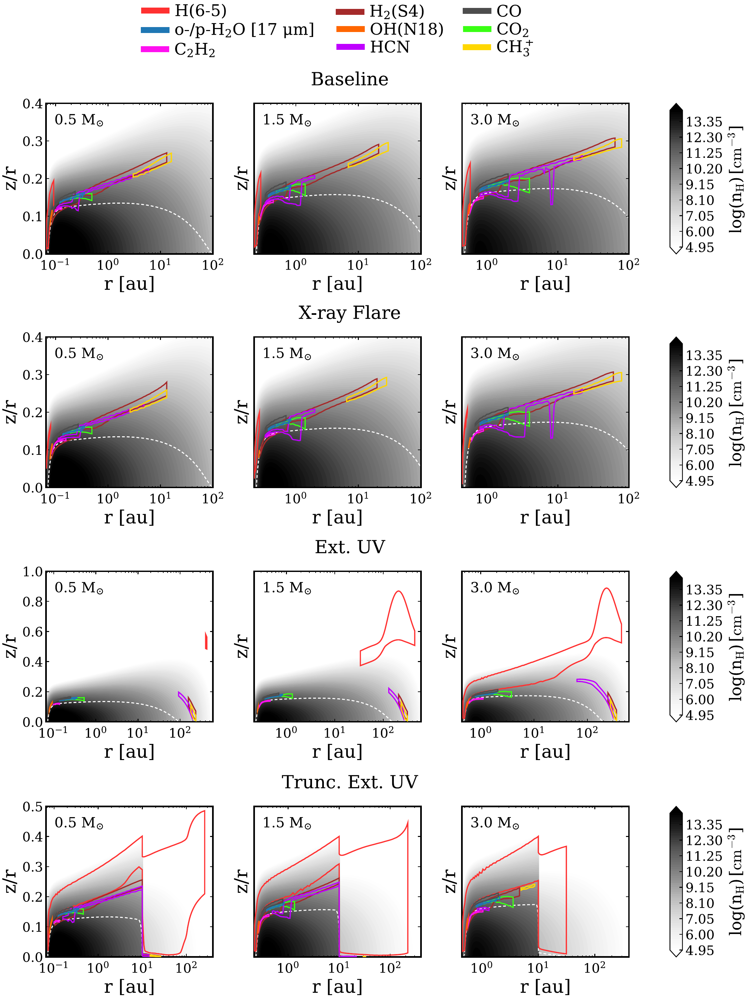
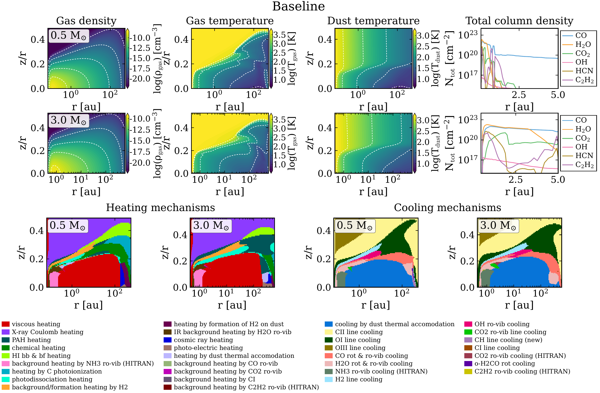
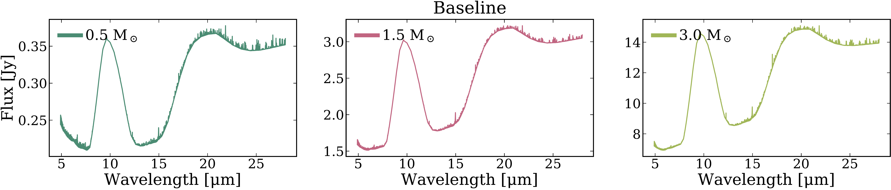

$\newcommand{\ensuremath}{}$
$\newcommand{\xspace}{}$
$\newcommand{\object}[1]{\texttt{#1}}$
$\newcommand{\farcs}{{.}''}$
$\newcommand{\farcm}{{.}'}$
$\newcommand{\arcsec}{''}$
$\newcommand{\arcmin}{'}$
$\newcommand{\ion}[2]{#1#2}$
$\newcommand{\textsc}[1]{\textrm{#1}}$
$\newcommand{\hl}[1]{\textrm{#1}}$
$\newcommand{\footnote}[1]{}$
$\newcommand{\cmark}{\ding{51}}$
$\newcommand{\xmark}{\ding{55}}$

# XUE. ProDiMo models of internally and externally irradiated planet-forming disks around 0.3 -- 4.0 M$_{\odot}$ stars: The IRIS project I

<mark>Appeared on: 2026-09-09</mark> -  _23 pages, 16 figures, 4 tables_

J. Frediani, et al. -- incl., <mark>T. Henning</mark>

**Abstract:** Most stars and planets form in massive star-forming regions, where protoplanetary disks are exposed to external far-ultraviolet (FUV) radiation from nearby O- and B-type stars. It remains largely unknown, however, what is the combined effect of internal stellar irradiation and external FUV fields on the terrestrial planet-forming disk region ( $\lesssim$ 10 au) across stellar masses. We model the effect of internal UV and X-ray and external FUV irradiation on mid-infrared (mid-IR) gas-phase emission, and the fraction of carbon-to-oxygen (C/O) ratio measurable in the warm disk atmosphere of T Tauri and Herbig Ae/Be disks. We simulate disk structures with the thermochemical code ProDiMo and process their mid-IR spectra with the FLiTs ray tracing code, convolved to the typical resolution of the James Webb Space Telescope (JWST) Mid-Infrared Instrument in Medium Resolution Spectroscopy mode ( $R$ $\sim$ 2680). (1) We build the Internal and external irRadIation of diSks (IRIS) grid, comprising four sets of models spanning stellar masses of 0.3--4.0 $M_\odot$ , including stellar X-ray flares and an external FUV field of $10^4$ $G_0$ (in Habing units). (2) We systematically predict increasing flux densities with stellar mass for key atomic and molecular mid-IR diagnostic species. (3) External FUV irradiation enhances $CH_3^+$ and $H_2$ emission, while FUV-induced disk truncation retrieves internal-only irradiated inner disk chemistry. (4) Mid-IR $H_2$ O, $CO_2$ , and $C_2$ $H_2$ line ratios imply carbon-rich compositions (C/O $\sim$ 1--10) of the warm emitting atmospheric layers of T Tauri and Herbig Ae/Be disks, primarily reflecting stellar irradiation, with little sensitivity to external FUV irradiation. The IRIS grid provides a flexible framework for interpreting JWST and potentially future Extremely Large Telescope (ELT) infrared disk observations in a large parameter space, combining central stellar and external radiation fields. Future modeling should include the impact of FUV-driven photoevaporative winds and X-ray radiative transfer, and the effects of time-dependent X-ray irradiation on inner disk chemistry.

**Figure 7. -** Emitting areas (colored boxes) tracing the origin in the disk along the radial (_x_-axis in log$_{\rm 10}$ scale) and vertical direction (_y_-axis, dimensionless) of the rovibrational mid-IR emission of selected volatile gas-phase species (see legend) included in the IRIS grid. Models are plotted with increasing stellar host mass from left to right. The mid-IR transitions shown are the brightest emitting lines identified in ProDiMo within each species flux integration region listed in Table \ref{table: lines and rms}. The plotted 17 $\mu$m water component refers to ortho (o-) and para (p-) molecules. The grayscale background shows the gas density structure of each model in units of hydrogen nuclei number density. The dashed white curve indicates a visual extinction of unity ($A_{\rm V}$ = 1), where the dust becomes optically thick to the emerging radiation. (*figure:emitting areas*)

**Figure 2. -** Overview of the physical and chemical structure of the \texttt{Baseline} set of IRIS grid models for two representative stellar masses ($M_{\star}$ = 0.5, 3.0 $M_{\odot}$). The _x_-axis is the radial distance from the star in units of au, and the _y_-axis the disk height above the midplane (dimensionless). The top two rows show from left to right the 2D gas density structure ($\rho_{\rm gas}$), gas temperature structure in equilibrium with the dust ($T_{\rm gas}$), and dust temperature structure ($T_{\rm dust}$) versus logarithmic radius, and the total vertical column density as a function of the radial distance in linear scale from the star ($N_{\rm tot}$) for some of the species analyzed in this work (see legend and Table \ref{table: lines and rms}). Panels in the bottom row summarize from left to right the dominant heating and cooling mechanisms (see legends) regulating the 2D structure. Mechanisms are sorted from the most dominant to the least dominant one. (*figure: baseline grid properties*)

**Figure 3. -** Synthetic ProDiMo mid-IR spectra from the \texttt{Baseline} set of models for increasing stellar host mass. The spectra are generated with FLiTs in LTE and non-LTE (see Table \ref{table: lines and rms}), convolved to a JWST/MIRI resolution of 2680 (MRS at $\sim$ 15 $\mu$m), and scaled for convenience to a distance of 140 pc, typical of nearby isolated star-forming regions. (*figure: prodimo spectra baseline*)

