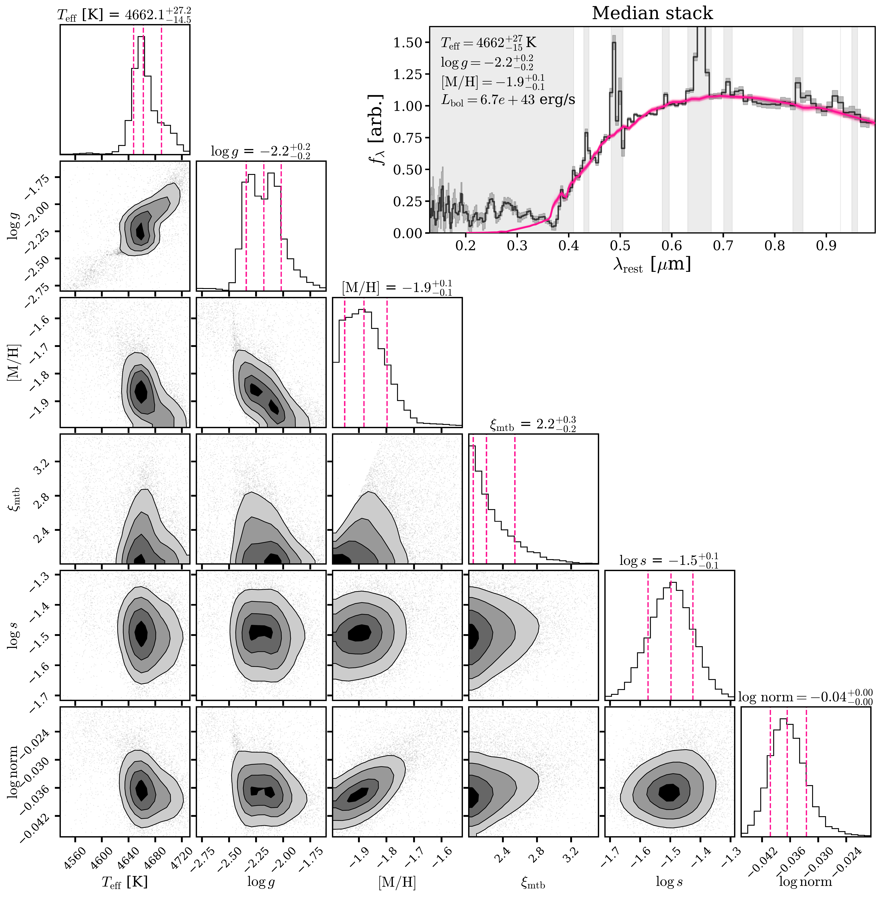
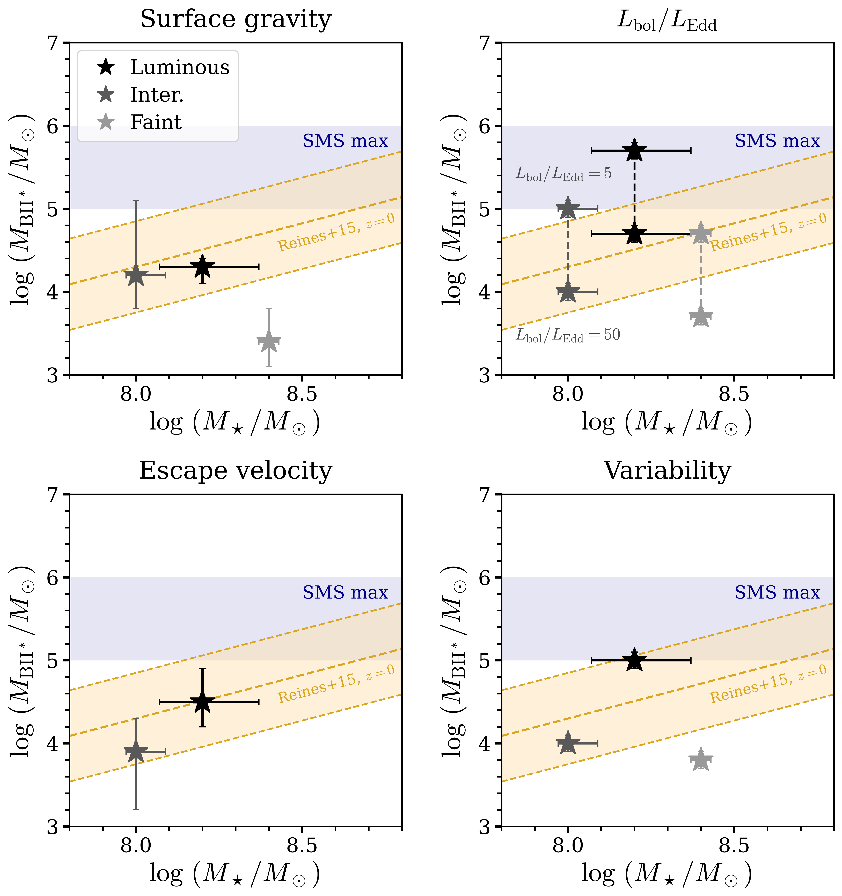
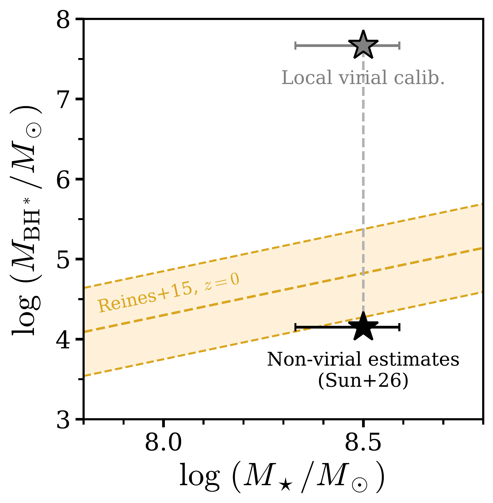

$\newcommand{\ensuremath}{}$
$\newcommand{\xspace}{}$
$\newcommand{\object}[1]{\texttt{#1}}$
$\newcommand{\farcs}{{.}''}$
$\newcommand{\farcm}{{.}'}$
$\newcommand{\arcsec}{''}$
$\newcommand{\arcmin}{'}$
$\newcommand{\ion}[2]{#1#2}$
$\newcommand{\textsc}[1]{\textrm{#1}}$
$\newcommand{\hl}[1]{\textrm{#1}}$
$\newcommand{\footnote}[1]{}$
$\newcommand{\xiion}{\xi_{\rm{ion}}}$
$\newcommand{\halpha}{H\ensuremath{\alpha}}$
$\newcommand{\hbeta}{H\ensuremath{\beta}}$
$\newcommand{\mstar}{\ensuremath{\log(M_{\rm{\star}}/ {\rm M}_\odot)}}$
$\newcommand{\orcidauthor}[3]{\author{\href{http://orcid.org/#1}{#2^{#3}}}}$
$\newcommand{\nion}[2]{#1 \textsc{#2}}$
$\newcommand{\thempfootnote}{\arabic{mpfootnote}}$
$\newcommand\minipagefootnote@here{\par\@ifvoid\@mpfootins{\vskip\skip\@mpfootins\hrule height 0.4pt width 0.3\linewidth\kern 4pt\fullinterlineskip\unvbox\@mpfootins}}$

# $\vspace{-1cm}$ Overmassive No More: The Case for Little Red Dots Hosting Black Hole Seeds\\as Massive as Single Supermassive Stars$\vspace{-1.75cm}$

<mark>Appeared on: 2026-09-10</mark> -  _Submitted to the Open Journal of Astrophysics. Main results in Figs. 6 (HR diagram), 7 (non-virial vs. virial BH* masses), and 8 (non-virial BH* masses below SMS mass ceiling). Comments warmly welcomed!_

W. Q. Sun, et al. -- incl., <mark>A. d. Graaff</mark>

**Abstract:** Little Red Dots (LRDs) display singular properties unlike any known class of AGN or galaxies, motivating novel mass estimators for their central engines. Inspired by their similarities to stellar phenomena, here we interpret the LRD continuum as being produced by a pseudo-photosphere. We fit tailored stellar atmosphere models to host-subtracted LRD central engines ("black hole stars," BH*s) represented by stacks of $117$ objects. Typical BH* continuum spectra are well fit by models in a narrow range of temperatures ( $T_{\rm eff}\approx4200-4800$ K), with bolometric luminosities $\approx10^{43-45}$ erg s $^{-1}$ , implying pseudo-photospheric radii $\approx700-2000$ au. Based on these parameters, we explore four different approaches to deriving BH* masses: 1) using the surface gravity from atmosphere models; 2) appealing to the resemblance to super-Eddington phenomena; 3) approximating the escape velocity from the outflowing material; and 4) exploiting the lack of variability to bound the dynamical time. For the typical BH*, all of these methods yield remarkably consistent masses of $\approx10^{4-5} M_\odot$ , implying a highly super-Eddington luminosity of $L_{\rm{bol}}/L_{\rm{Edd}}\sim5-50$ . These mass estimates place BH*s within the scatter of the local scaling relation between black hole mass and host galaxy stellar mass, providing a self-consistent alternative to "overmassive" black holes that lie $2-3$ dex above it. Crucially, our derived masses are consistent with BH*s arising from single supermassive stars (SMSs), whose masses cannot exceed $\approx10^{5-6} M_\odot$ due to general relativistic instabilities. Furthermore, for our derived $L_{\rm bol}/L_{\rm Edd}$ , the sharp cutoff of the LRD luminosity function matches the maximum theoretical mass of an SMS. With LRDs, we may therefore be directly observing the birth of heavy black hole seeds.

**Figure 5. -** **Well-constrained pseudo-photospheric parameters from \texttt{dynesty** posterior for the median BH* stack.} We adopt uniform priors for all parameters, as listed in Table \ref{tab:model_priors}. Marginal and joint distributions are shown for the six parameters $\left( T_{\rm{eff}},   \log{g},   \text{[M/H]},   \xi_{\rm{mtb}},   s,   \texttt{norm} \right)$; contours and histograms are importance-weighted over the full set of nested samples. Dashed lines and row titles report the median and 16$^{\rm{th}}$/84$^{\rm{th}}$ percentiles of the marginal posterior for each parameter. The [M/H] and $\xi_{\rm{mtb}}$ posteriors are concentrated at the lower prior bounds; they remain meaningfully constrained, though limited by the extent of the model grid. (Top right) **Atmosphere model fits for the median BH* stack**(black), where $1{,}000$ equal-weight posterior draws are plotted (pink), with the per-wavelength median of the draws as the thick curve. Shaded vertical bands mark wavelengths excluded from the fit, including strong emission lines and $\lambda_{\rm{rest}} \leq 4100\rm{Å}$, so that the fit constrains the continuum shape redward of the Balmer break. (*fig:atm_fits_stack*)

**Figure 7. -** **Non-virial BH* masses are consistent with BH*s arising from single supermassive stars (SMSs) -- BH* mass vs. host stellar mass for the three substacks.** Each panel shows the fiducial masses (Table \ref{tab:mass}) derived from one of the four approaches described in \S\ref{sec:results}, plotted against host stellar masses derived from \texttt{Prospector} fits (Fig. \ref{fig:host_substacks_prospector}). The BH* masses all sit below the maximum theoretical mass of an SMS \citep[blue band, $\approx 10^{5-6}   M_\odot$ due to general relativistic instabilities; e.g.,][]{Chandrasekhar64, Fowler66, Woods17, Nandal24gr, Saio24gr}, supporting the picture that BH*s may arise from single SMSs. Note that in our proposed picture, the BH* masses may lie below the $z=0$$M_{\rm{BH}}$ vs. $M_\star$ relation \citep[][]{RV15}, which is plausible as the black hole could grow significantly from high redshift to $z=0$ via BH-BH mergers \citep[e.g.,][]{Tanaka24, Merida25, Yanagisawa26} or secular growth such as accretion. (*fig:m_vs_mstar*)

**Figure 2. -** **The non-virial BH* mass is $\gtrsim 3$ dex lower than that derived from the local virial calibrations  (Reines13** -- BH* mass vs. host stellar mass for the median stack.)  The bottom datapoint shows the median of the non-virial masses derived from the four approaches. We only show the median mass here for visual clarity; Table \ref{tab:mass} shows that the four approaches all yield BH* masses $\sim 3$ dex lower than that derived from the virial calibrations. (*fig:virial_comparison*)

