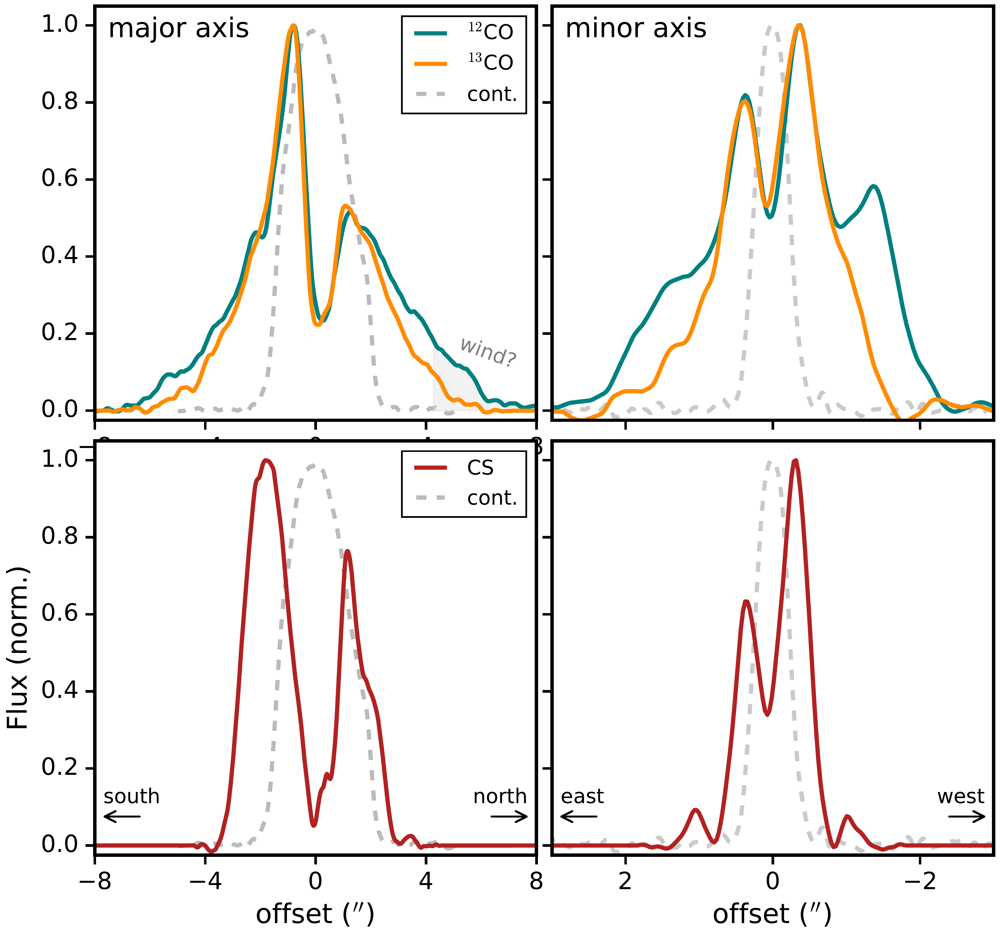
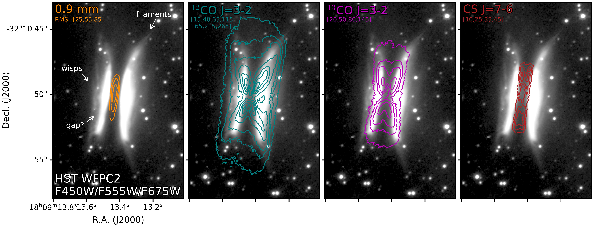
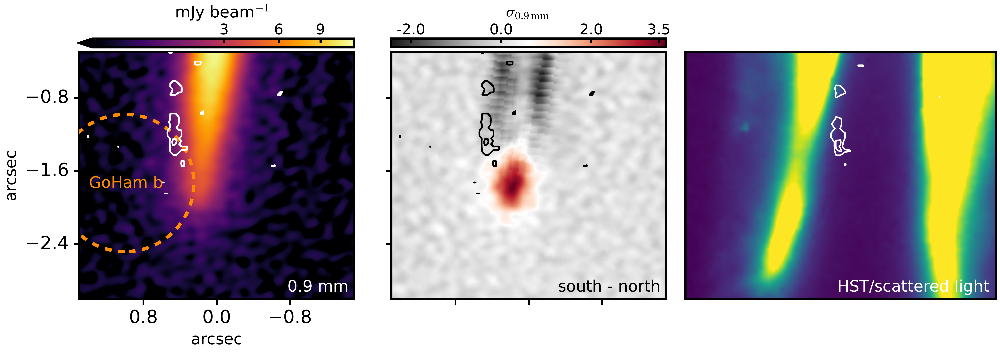

$\newcommand{\ensuremath}{}$
$\newcommand{\xspace}{}$
$\newcommand{\object}[1]{\texttt{#1}}$
$\newcommand{\farcs}{{.}''}$
$\newcommand{\farcm}{{.}'}$
$\newcommand{\arcsec}{''}$
$\newcommand{\arcmin}{'}$
$\newcommand{\ion}[2]{#1#2}$
$\newcommand{\textsc}[1]{\textrm{#1}}$
$\newcommand{\hl}[1]{\textrm{#1}}$
$\newcommand{\footnote}[1]{}$
$\newcommand{\vdag}{(v)^\dagger}$
$\newcommand\aastex{AAS\TeX}$
$\newcommand\latex{La\TeX}$

# The ALMA View of the Edge-on Gomez's Hamburger System: A Highly-Dynamic, Asymmetric Protoplanetary Disk Reveals the Earliest Phases of Giant Planet Formation

<mark>Appeared on: 2026-09-10</mark> -  _30 pages, 14 figures, accepted for publication in ApJ_

C. J. Law, et al. -- incl., <mark>H. Baehr</mark>, <mark>T. Henning</mark>, <mark>D. Semenov</mark>

**Abstract:** Chemical tracers provide some of the strongest observational signatures of ongoing planet formation and localized dynamical perturbations in protoplanetary disks. In particular, sulfur-bearing molecules are predicted to be enhanced in regions of shock heating, ice sublimation, and gravitational instability. Here, we present high-angular-resolution ( $\approx$ 0 $\farcs$ 2) Atacama Large Millimeter/submillimeter Array observations of $^{12}$ CO J=3--2, $^{13}$ CO J=3--2, CS J=7--6, and SO J $_{\rm N}$ =$8_8$ --$7_7$ toward the large, edge-on Gomez's Hamburger (`GoHam'; IRAS 18059-3211) disk. We detect a narrow, one-sided arc of SO emission that peaks near a previously-identified gas over-density, suggesting localized heating around an early-stage giant protoplanet or disk fragment. The edge-on geometry of GoHam enables us to place this chemical signature in the broader context of the disk gas and dust structure. To do so, we map the vertical distribution of molecular gas relative to millimeter- and (sub)-micron-sized dust, identify a pronounced north-south continuum asymmetry, and detect non-Keplerian $^{12}$ CO and $^{13}$ CO emission indicative of a disk wind. We also derive a dynamical stellar mass of 2.2 $\pm$ 0.5 M $_{\odot}$ and a revised dust-extinction-map-based distance of 139 $\pm$ 24 pc, which places GoHam in the outskirts of the Scorpius-Centaurus association. Together, these observations reveal a highly dynamic disk in which localized sulfur chemistry may trace one of the earliest observable stages of wide-separation giant planet formation.

**Figure 9. -** Major (_left column_) and minor (_right column_) axis cuts of the $^{12}$CO (blue), $^{13}$CO (orange), and CS (red) integrated intensity maps versus mm dust continuum (dashed gray). All profiles have been smoothed for ease of comparison. (*fig:line_cuts*)

**Figure 12. -** HST WFPC2 composite image of GoHam sensitive to scattered light from small dust grains in the disk upper layers using the F450W, F555W, and F675W filers. Contours shows emission from the 0.9 mm continuum and $^{12}$CO J=3--2, $^{13}$CO J=3--2, and CS J=7--6 lines (_from left to right_). HST data were retrieved from the Hubble Legacy Archive and are associated with Proposal 9315 (PI K. Noll). Contour levels are marked in each panel. Features in the scattered light/HST image are annotated in the first panel. (*fig:NIR_vs_lines*)

**Figure 13. -** A zoom-in on the sourthern part of the GoHam disk. The 0.9 mm continuum emission (_left_) and associated residuals (in units of SNR) from reflecting and subtracting north from south halves of the disk (_middle_), and HST scattered light image (_right_). A color stretch has been applied to the HST image to highlight faint disk features. The SO peak intensity contours are overlaid on each panel. The approximate location of GoHam b \citep{Bujarrabal09} is overlaid as a dotted orange circle in the 0.9 mm image. (*fig:goham_b_vs_dust*)

