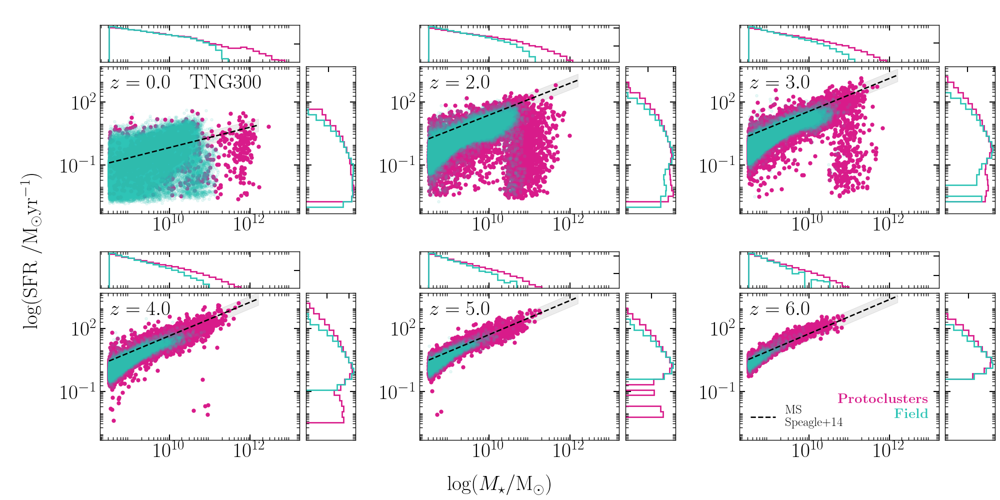
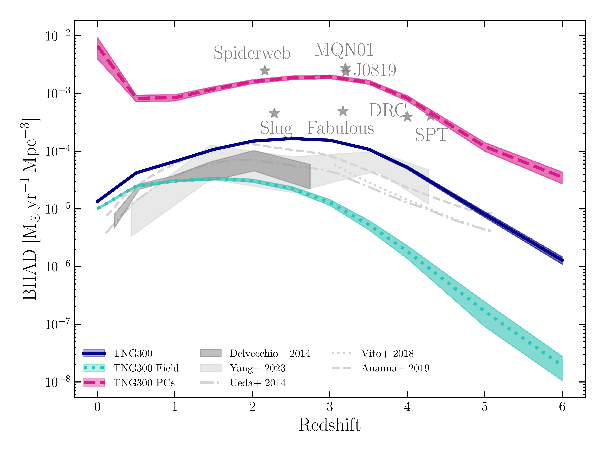
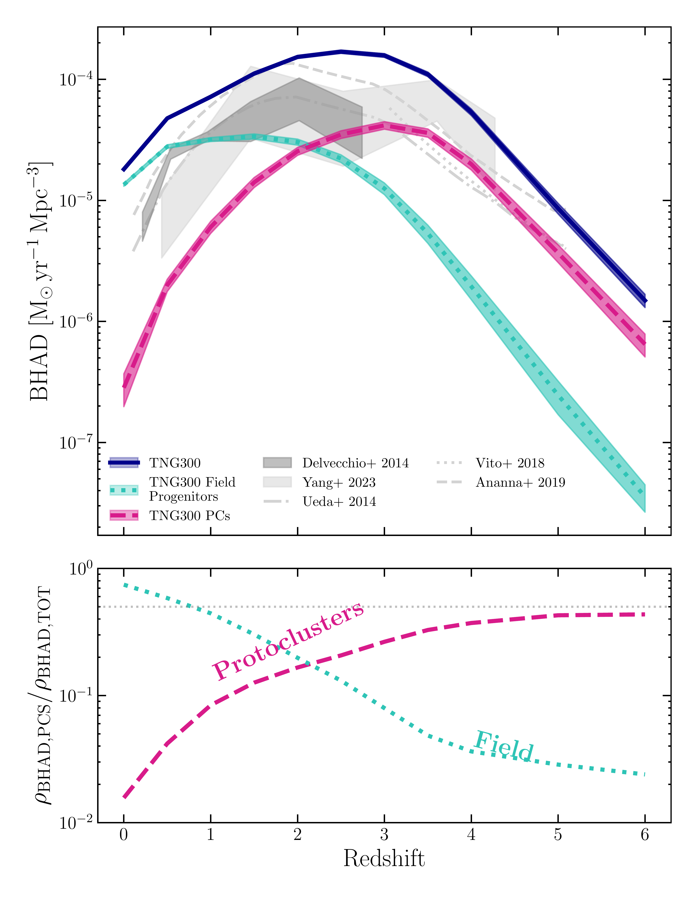

$\newcommand{\ensuremath}{}$
$\newcommand{\xspace}{}$
$\newcommand{\object}[1]{\texttt{#1}}$
$\newcommand{\farcs}{{.}''}$
$\newcommand{\farcm}{{.}'}$
$\newcommand{\arcsec}{''}$
$\newcommand{\arcmin}{'}$
$\newcommand{\ion}[2]{#1#2}$
$\newcommand{\textsc}[1]{\textrm{#1}}$
$\newcommand{\hl}[1]{\textrm{#1}}$
$\newcommand{\footnote}[1]{}$
$\newcommand{\fv}[1]{{\textcolor{red}{\bf[FV: #1]}}}$
$\newcommand{\at}[1]{{\textcolor{magenta}{\bf[AT: #1]}}}$
$\newcommand{\cha}{{\it Chandra} }$

# Exploring the AGN population in protoclusters: results from the TNG300 simulation and comparison with observations

<mark>Appeared on: 2026-09-10</mark> -  _14 pages, 12 Figures, submitted to A&A_

A. Traina, et al. -- incl., <mark>A. Pillepich</mark>, <mark>A. Kapahtia</mark>

**Abstract:** Present-day galaxy clusters evolved from high-redshift overdensities ( $z > 2$ ). Galaxy and supermassive black hole (SMBH) formation and evolution in these environments are expected to be accelerated by environmental effects, such as enhanced merger rates and large gas reservoirs. However, current observational studies aimed at characterizing this enhancement are limited by heterogeneous selection criteria for both protoclusters and AGN, as well as by the difficulty in confirming them spectroscopical. As a consequence, a robust and unbiased characterization of galaxy growth and AGN activity in dense environments is still lacking. In this work, we investigate the physical properties and cosmic evolution of galaxies and AGN in a sample of 280 protoclusters identified in the TNG300 simulation, selected to end up in $z = 0$ clusters with $M_{200, \rm c} > 10^{14}   {\rm M_{\odot}}$ . Our goal is to provide the first statistical view of AGN activity enhancement in a uniformly defined sample of overdense environments, and to identify the physical mechanisms driving it. We identify protoclusters as the progenitors of present-day galaxy clusters through merger-tree reconstruction and compare their galaxy and AGN populations with a control sample of field galaxies across the redshift range $0 \leq z \leq 6$ . We investigate galaxy and SMBH demographics, AGN fractions, bolometric luminosity functions, and the SMBH accretion rate density, consistently applying homogeneous selection criteria in all environments. ${We find that TNG300 protoclusters host systematically more massive galaxies and SMBHs than the field by up to $1   {\rm dex}$ at all redshifts, with signatures of accelerated galaxy evolution already visible at $z \sim 3-4$. The AGN fraction increases with stellar mass in both environments and, at fixed host-galaxy stellar mass, is broadly consistent between protoclusters and field galaxies, indicating no strong environmental triggering of SMBH accretion. However, when analysed as a function of redshift, protoclusters exhibit a significant enhancement of AGN activity (by a factor $> 2$), particularly at high luminosities and early cosmic times. We show that this enhancement primarily arises from differences in the stellar-mass distributions of galaxies in overdense regions, where massive systems assemble earlier than in the field. Consistently, protoclusters dominate the bright end of the AGN bolometric luminosity function and contribute up to $\sim 50\%$ of the total SMBH accretion rate density at $z \sim 6$.}$

**Figure 4. -** SFR - $M_{\star}$ distributions at different redshifts of galaxies in the TNG300 simulation. Green points are field galaxies, while red markers denote galaxies in clusters at $z = 0$ and in their “progenitor” protoclusters at $z > 0$. The $x$-axis and $y$-axis histograms are the normalized distributions of the individual quantities for protoclusters and field. Protoclusters galaxies can reach larger masses and are more affected by AGN quenching in the high masses. Black dashed line is the main sequence of galaxies by \citet{speagle2014MS} for comparison. (*fig:SFR_Mstar*)

**Figure 3. -** Same as Figure \ref{fig:BHAD}, but with the individual BHADs computed using the volume associated to each environment. Grey stars are observed protoclusters shown as a comparison. (*fig:BHAD*)

**Figure 11. -** Redshift evolution of the SMBH accretion rate density in the TNG300 simulation (top panel) and fractional contribution of field and protoclusters (bottom panel). The total, field and protocluster BHAD are shown in blue, green and red, respectively. Errors are computed by integrating the lower and upper curves of the BH accretion rate function. Grey curves and dashed areas are observational results from the literature \citep[][]{delvecchio2014bhard, ueda2014, vito2018, ananna2019, yang2023}. (*fig:BHAD*)

