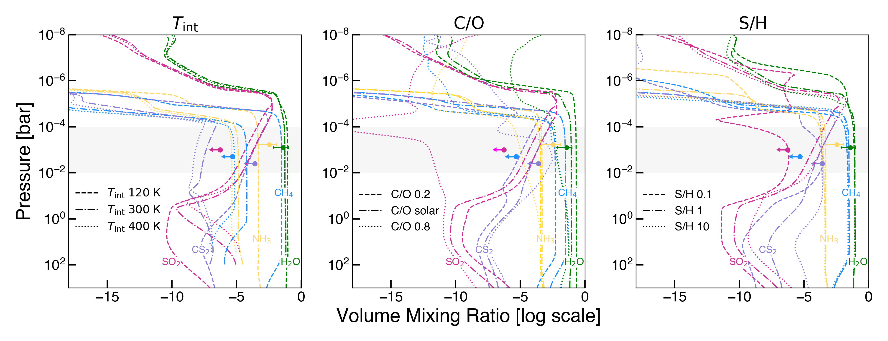
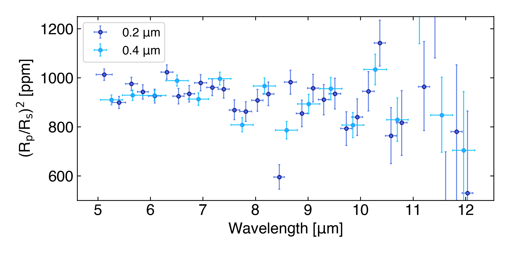
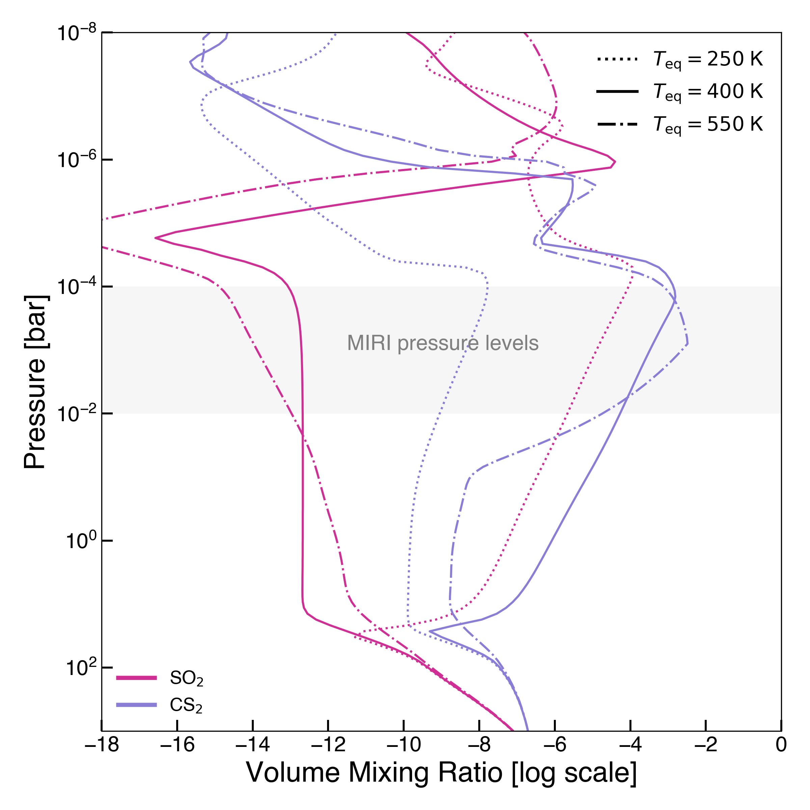
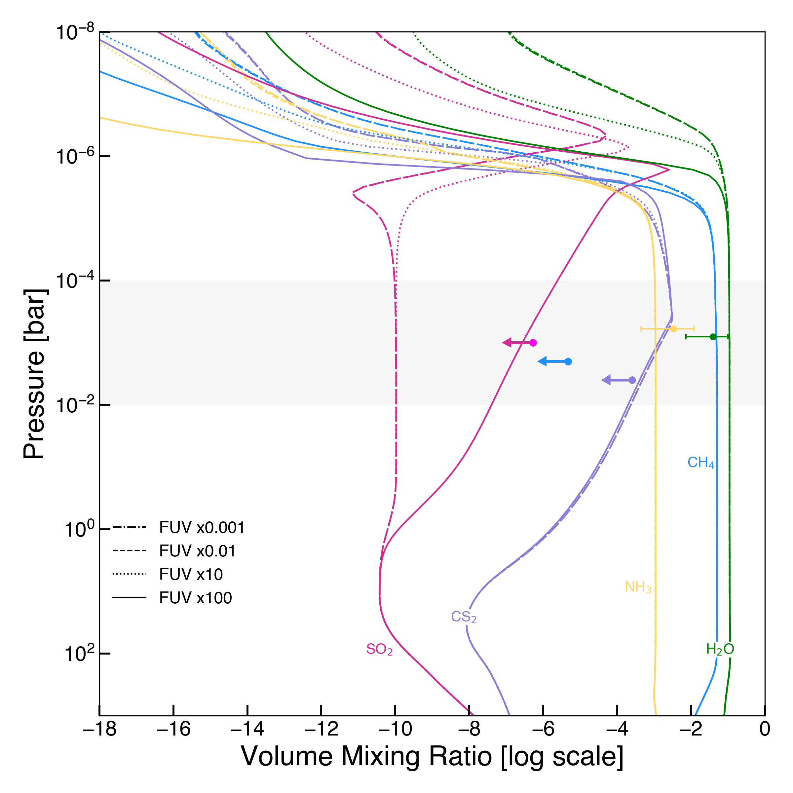

$\newcommand{\ensuremath}{}$
$\newcommand{\xspace}{}$
$\newcommand{\object}[1]{\texttt{#1}}$
$\newcommand{\farcs}{{.}''}$
$\newcommand{\farcm}{{.}'}$
$\newcommand{\arcsec}{''}$
$\newcommand{\arcmin}{'}$
$\newcommand{\ion}[2]{#1#2}$
$\newcommand{\textsc}[1]{\textrm{#1}}$
$\newcommand{\hl}[1]{\textrm{#1}}$
$\newcommand{\footnote}[1]{}$
$\newcommand{\columnwiselinenumbersfalse}\newcommand$
$\newcommand{\linenumbers}\newcommand$
$\newcommand{\rens}[1]{\textcolor{red}{RW:\textsf{#1}}}$
$\newcommand{\achrene}[1]{\textcolor{Magenta}{\textsf{[#1]}}}$
$\newcommand{\arraystretch}{1.2}$
$\newcommand{\arraystretch}{1.25}$
$\newcommand{\arraystretch}{1.2}$
$\newcommand{\arraystretch}{1.2}$
$\newcommand{\arraystretch}{1.2}$
$\newcommand{\arraystretch}{1.25}$

# JWST-SUPER I: New insights into irradiated warm Neptunes atmospheres from MIRI observations of HD 106315 c

<mark>Appeared on: 2026-09-10</mark> - 

A. Dyrek, et al. -- incl., <mark>T. Henning</mark>

**Abstract:** Sulphur-bearing molecules have recently emerged as powerful tracers of atmospheric photochemistry in exoplanets observed with the James Webb Space Telescope (JWST). In several warm giant planets, $SO_2$ has been detected as a product of UV-driven chemical processing, suggesting a close connection between stellar irradiation, atmospheric metallicity, and sulphur chemistry. Whether these trends extend to Neptune-mass planets orbiting hotter stars remains largely unexplored. We investigate the atmospheric composition of the warm Neptune HD 106315 c, a Neptune-mass planet orbiting an F-type host star and subjected to a strong ultraviolet (UV) irradiation environment. Here, we report the low-resolution (R $\sim$ 100) transmission spectrum between 5 and 12 $\mu$ m of HD 106315 c obtained with the Mid-Infrared Instrument (MIRI) Low-Resolution Spectrometer on-board JWST. Our work also includes re-analysis of archival data from the Hubble Space Telescope (HST) Wide Field Camera 3 (WFC3) G141 mode of HD 106315 c, as well as contemporaneous XMM and _Swift_ monitoring of the star in the UV and X-ray wavelength ranges. Together with the archival HST WFC3 data, we detect $H_2$ O and find tentative evidence for $NH_3$ , retrieving abundances of $\log_{10}$ ($H_2$ O) $=-1.40^{+0.40}_{-0.74}$ and $\log_{10}$ ($NH_3$ ) $=-2.47^{+0.57}_{-0.89}$ , together with an isothermal terminator temperature of $747^{+150}_{-155}$ K. We place stringent upper limits on $CH_4$ , $SO_2$ , and $CS_2$ , finding no robust evidence for any sulphur-bearing species despite the intense irradiation received by the planet. The inferred water abundance implies a strongly metal-enriched atmosphere. Elevated intrinsic temperatures can reconcile the non-detections of $CH_4$ and $CS_2$ through carbon--sulphur coupling, while the absence of $SO_2$ points toward a reduced atmospheric sulphur inventory or a near-solar to mildly enhanced C/O ratio, and places HD 106315 c near the transition between sulphur-rich and sulphur-poor chemical regimes. Our observations demonstrate the diversity of irradiated Neptunes beyond a simple description of the radiation field. HD 106315 c exhibits an atmospheric composition distinct from previously characterised warm Neptunes that show prominent sulphur photochemistry. The combination of a highly enriched atmosphere, tentative $NH_3$ , and the absence of detectable sulphur-bearing species demonstrates that strong UV irradiation alone is not sufficient to guarantee observable sulphur photochemical products. These observations expand the diversity of atmospheric outcomes known for Neptune-mass exoplanets and provide new constraints on the coupled carbon, nitrogen, and sulphur chemistry operating in irradiated planetary atmospheres.

**Figure 7. -** Comparison between the retrieved molecular abundances and disequilibrium chemistry models computed with \texttt{VULCAN}. Coloured curves show the predicted vertical abundance profiles for the different molecules. The shaded region indicates the approximate pressure range probed by the JWST/MIRI transmission spectrum (10$^{-2}-10^{-4}$ bar). The solid lines are the retrieved median and 1$\sigma$ errors, while the arrows represent retrieved upper limits. _Left:_ Models with varying intrinsic temperature, where [M/H] = 300$\times$ solar, C/O is solar, and S/H is solar. _Middle:_ Models with varying the C/O ratio, assuming $T_{\rm eq}=$700 K, [M/H] = $300\times$ solar, $T_{\rm int}=120$ K, and solar S/H. _Right:_ Models with varying S/H ratio, where $T_{\rm eq}=$700 K, [M/H] = 300$\times$ solar, $T_{\rm int}=$120 K, and C/O is solar. (*fig:model_vs_retrieval_co_sh_tint*)

**Figure 12. -** MIRI transmission spectrum of HD 106315 c using different bin widths. These spectra do not use GPs and errorbars may be underestimated. (*fig:spectrum_binsize*)

**Figure 16. -** Vertical abundance profiles varying the equilibrium temperature and the FUV flux received by the planet. _Left:_ Vertical abundance profiles of $SO_2$ and $CS_2$ for three distinct low equilibirium temperatures. The pressures sounded by our JWST/MIRI transmission spectrum are shown by the grey area. _Right:_ Vertical abundance profiles for four different FUV fluxes received by the planet, scaled from the FUV flux of HD 106315. (*fig:models_low_teq*)

