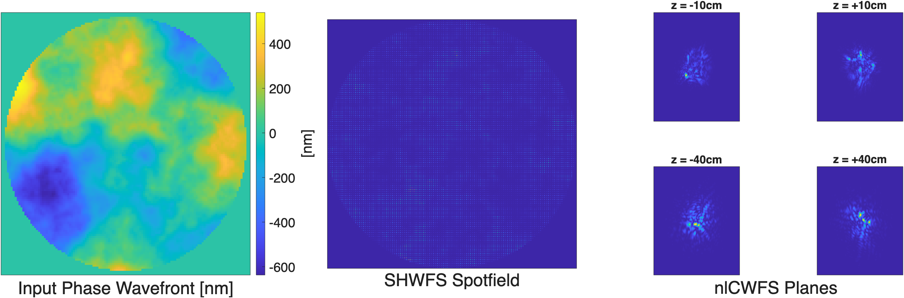
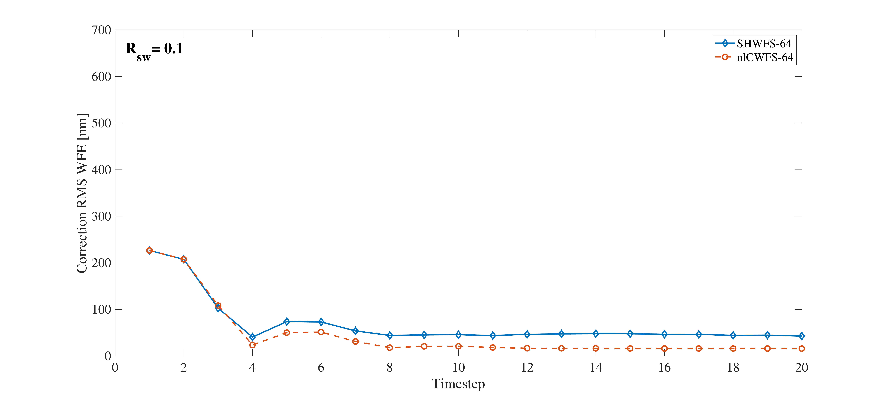
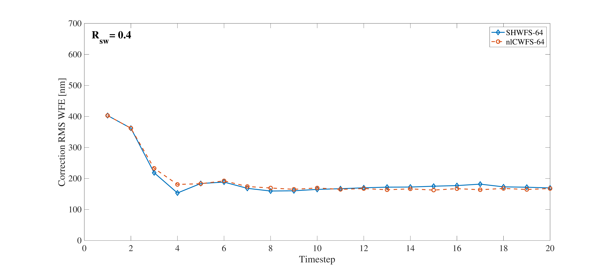

$\newcommand{\ensuremath}{}$
$\newcommand{\xspace}{}$
$\newcommand{\object}[1]{\texttt{#1}}$
$\newcommand{\farcs}{{.}''}$
$\newcommand{\farcm}{{.}'}$
$\newcommand{\arcsec}{''}$
$\newcommand{\arcmin}{'}$
$\newcommand{\ion}[2]{#1#2}$
$\newcommand{\textsc}[1]{\textrm{#1}}$
$\newcommand{\hl}[1]{\textrm{#1}}$
$\newcommand{\footnote}[1]{}$
$\newcommand{\headrulewidth}{0pt}$
$\newcommand{\footrulewidth}{0pt}$
$\newcommand{\baselinestretch}{1.65}$

# Performance Comparison of the Nonlinear Curvature and Shack-Hartmann Wavefront Sensors in Strong Turbulence

<mark>Appeared on: 2026-09-10</mark> -  _22 pages, 18 figures_

S. J. Potier, A. J. Alemán, J. R. Crepp, <mark>S. Letchev</mark>

**Abstract:** Strong turbulence induces spatial variations in beam intensity that hinder the reconstruction process of many commonly deployed adaptive optics (AO) systems that use gradient-based wavefront sensors (WFS), such as the Shack-Hartmann wavefront sensor (SHWFS) and pyramid wavefront sensor. The nonlinear curvature WFS (nlCWFS) uses Fresnel diffraction to extract wavefront phase and amplitude information, suggesting that it may be able to operate under challenging turbulence conditions. In this work, we investigate nlCWFS reconstruction accuracy as a function of turbulence strength and relative flux by modeling high spherical-wave Rytov number ( $R_{sw}$ ) environments where scintillation and branch points impact sensing performance. We present open-loop as well as static and dynamic closed-loop results benchmarked against a comparable Shack-Hartmann WFS (SHWFS). In static and weak-to-moderate scintillation regimes, the nlCWFS consistently outperforms the SHWFS by leveraging amplitude–phase coupling inaccessible to gradient-based sensors. However, dynamic closed-loop simulations reveal a crossover behavior at higher scintillation strengths, where deep intensity nulls and proliferating branch points degrade the performance of Gerchberg–Saxton–based nlCWFS reconstruction, while the SHWFS degrades more gradually due to its insensitivity to such topological phase structure. These results highlight the regime-dependent advantages of the nlCWFS and emphasize the need for branch-point-tolerant reconstruction algorithms to fully realize its potential in strong-turbulence, low-flux conditions.

**Figure 2. -** Example input wavefront (left), SHWFS spot-field (middle), and nlCWFS measurement planes (right) for $R_{sw} = 0.1$. The combination of scintillation, low incident flux, and photon noise produces regions of low SNR in the SHWFS spot-field and nlCWFS measurement planes. (*fig:shwfs_and_fwfs_detectors_scint*)

**Figure 10. -** SHWFS and nlCWFS closed-loop performance for a static aberration at $R_{sw}=0.1$ and $\lambda=532$ nm. (*fig:correction_rms0p1*)

**Figure 12. -** SHWFS and nlCWFS closed-loop performance for a static aberration at $R_{sw}=0.4$ and $\lambda=532$ nm. (*fig:correction_rms0p4*)

